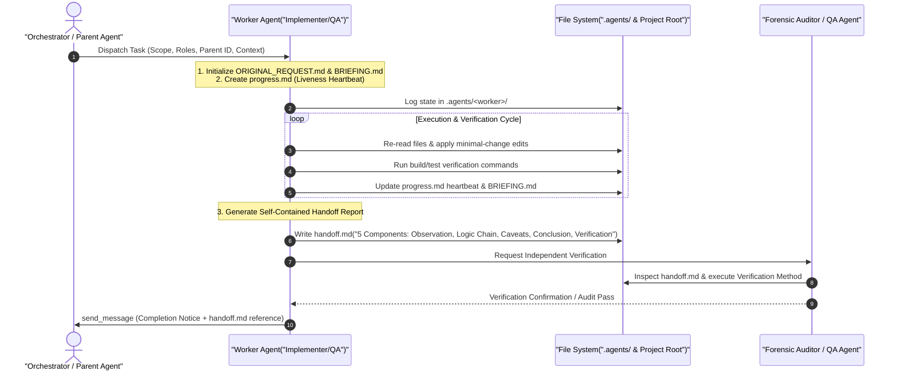

<!-- SPDX-License-Identifier: MIT -->
<!-- Copyright (c) 2026 ScholarForm AI -->

# AI Agents Development Guide

## Overview

ScholarForm AI (AMF) supports AI agent integration through its API, CLI, and SDK. This guide explains how AI coding agents can effectively navigate and work with the ScholarForm AI codebase, communicate across multi-agent workflows, and execute clean handoffs.

---

## Agent Communication & Handoff Protocol

ScholarForm AI uses a multi-agent orchestration architecture. Agents communicate via structured messages and file-based state artifacts located in `.agents/<worker_id>/`.

### Sequence Flow: Agent Communication & Delegation



### 5-Component Handoff Protocol

Every task transfer or completion handoff report (`handoff.md`) MUST contain these 5 required sections:

| Component | Purpose & Contents | Verification Criteria |
|-----------|--------------------|-----------------------|
| **1. Observation** | Direct findings: file paths, line numbers, verbatim errors, tool outputs. | Quotes exact paths and lines from current codebase. |
| **2. Logic Chain** | Step-by-step reasoning from observations to conclusions. | Each step explicitly links back to an observation. |
| **3. Caveats** | Uninvestigated areas, assumptions, or risk factors. | Must state caveats or explicitly "No caveats." |
| **4. Conclusion** | Actionable final assessment supported by logic chain. | Scoped to original request objectives. |
| **5. Verification Method** | Commands and steps to independently verify the work. | Includes exact test/build commands (e.g. `pytest`, `npm test`). |

---

## Repository Map

### Key Entry Points

```
ScholarFormAI/
├── backend/app/main.py          # FastAPI application entry point & lifecycle
├── backend/app/routers/v1/      # Modular v1 API routes (16 router modules)
├── backend/app/services/        # Core business logic layer (48 service modules)
├── backend/app/schemas/         # Pydantic v2 request/response schemas & api_envelope
├── backend/app/config/          # Sub-config settings (settings.py)
├── cli/amf/main.py              # CLI entry point (Click commands)
├── cli/amf/commands/            # CLI command implementations (issues, update, format, etc.)
├── sdk/amf_sdk/client.py        # Synchronous Python SDK client (AMFClient)
├── sdk/amf_sdk/async_client.py  # Asynchronous Python SDK client (AsyncAMFClient)
├── frontend/app/                # Next.js 16 App Router pages & route groups
├── frontend/src/                # Shared UI components, hooks, lib, contexts & services
└── docs/                        # Documentation framework
```

### Service Architecture & Dependencies

```
routers/v1/ ──→ document_pipeline_service ──→ parser.py / grobid / local_ocr / vision_api
routers/v1/ ──→ formatter.py ──→ python-docx / preview_renderer
routers/v1/ ──→ generator_session_service ──→ llm_fallback_service ──→ session_vector_store (ChromaDB)
routers/v1/ ──→ citation_assembly_service ──→ csl_service ──→ crossref_client
routers/v1/ ──→ quality_score_service / audit_log_service / issue_service / update_service
```

### Backend Service Layer (48 Modules)

The service layer contains 48 dedicated modules in `backend/app/services/`:
- **Document & Formatting**: `document_pipeline_service`, `document_crud_service`, `document_service`, `document_export_service`, `document_share_service`, `formatter`, `parser`, `validator`, `style_registry`, `preview_renderer`, `export_service`, `local_ocr`.
- **AI Generator & RAG**: `generator_session_service`, `generation_service`, `synthesis_service`, `session_vector_store`, `llm_fallback_service`, `llm_provider_service`, `llm_service`, `llm_key_service`, `classification_gate`, `provider_registry`, `nvidia_client`, `vllm_adoption`, `model_store`, `model_metrics`.
- **Citation & Enhancements**: `citation_assembly_service`, `csl_service`, `crossref_client`, `enhancement_manager`, `suggestion_service`, `quality_score_service`.
- **Platform & Infrastructure**: `auth_service`, `user_service`, `api_key_service`, `api_key_rate_limiter`, `audit_log_service`, `issue_service`, `update_service`, `feedback_service`, `activity_service`, `analytics_service`, `ab_testing`, `feature_flags`, `webhook_service`, `health_checks`, `encryption_service`.

---

## Common Agent Tasks

### Adding a New Citation Style

1. Add style config in `backend/app/services/style_registry.py`
2. Add any special formatting in `backend/app/services/formatter.py`
3. Register style in validator if special rules needed
4. Add frontend display in `frontend/src/lib/constants.ts`
5. Write tests in `backend/tests/test_formatter.py`

### Adding a New API Endpoint

1. Define request/response Pydantic models in `backend/app/schemas/` (ensure `api_envelope` standard is respected)
2. Add route handler under `backend/app/routers/v1/<module>.py`
3. Register new router in `backend/app/routers/v1/__init__.py`
4. Implement service logic in `backend/app/services/`
5. Add tests in `backend/tests/`
6. Update API docs in `API_REFERENCE.md` and `docs/docs/api/reference.md`

### Adding a New CLI Command

1. Create command file in `cli/amf/commands/`
2. Register command group/subcommand in `cli/amf/main.py`
3. Add tests in `cli/tests/test_cli.py`
4. Update CLI docs in `CLI_REFERENCE.md` and `docs/docs/cli/reference.md`

---

## Important Conventions

- Python type hints required on all public functions
- Pydantic v2 for all data validation and API response envelopes (`api_envelope`)
- Use pathlib for file paths (cross-platform)
- Rich library for CLI terminal output
- Conventional Commits for commit messages
- Ruff for Python formatting
- Canonical documentation stored strictly in `docs/docs/` (no loose markdown files in `docs/` root)
- Verify documentation edits with `python -m mkdocs build --strict --config-file docs/mkdocs.yml`

---

## Agent-Optimized Documentation

All comprehensive documentation is consolidated within the MkDocs hierarchy in `docs/docs/`:
- **Canonical Source**: `docs/docs/` contains 13 modular categories (`architecture/`, `api/`, `cli/`, `sdk/`, `guides/`, `operations/`, `reference/`, `reports/`, `tutorials/`, etc.).
- **Root Reference Pointers**: Root files such as `ARCHITECTURE.md`, `API_REFERENCE.md`, `CLI_REFERENCE.md`, and `SDK_GUIDE.md` serve as thin reference pointers redirecting to their canonical `docs/docs/` equivalents.
- **Strict Build Validation**: All docs modifications must pass `python -m mkdocs build --strict --config-file docs/mkdocs.yml` with zero broken link errors.

