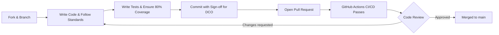

# Contributing to ScholarForm AI

First off, thank you for considering contributing to ScholarForm AI! It's people like you that make ScholarForm AI an enterprise-grade, open-source tool for researchers worldwide.

By participating in this project, you agree to abide by our [Code of Conduct](CODE_OF_CONDUCT.md).

## 1. Where to Start

- **Issues:** Check the issue tracker for `good first issue` or `help wanted` labels.
- **Discussions:** If you have an idea for a massive architectural change, please open a Discussion first to ensure alignment with the roadmap.
- **Documentation:** We highly value contributions to our docs. See `docs/developer-guide/` to understand our architecture.

## 2. Setting Up Your Environment

To ensure a seamless development experience across our microservices, please see the [Developer Onboarding Guide](docs/developer-guide/DEVELOPER_ONBOARDING.md).

### Quick Setup

```bash
git clone https://github.com/rohitkumarnaidu/ScholarFormAI.git
cd ScholarFormAI

# Set up pre-commit hooks
pre-commit install

# Spin up the stack
docker compose -f deploy/services/docker-compose.yml up -d
```

## 3. Pull Request Process

We maintain a high bar for enterprise code quality. Please ensure your PR meets the following criteria:



### 3.1. Developer Certificate of Origin (DCO)

We enforce the Developer Certificate of Origin (DCO) on all pull requests. All commit messages must contain the `Signed-off-by` line with an email address that matches the commit author.

```bash
git commit -s -m "feat(parser): add support for LaTeX tables"
```

### 3.2. Code Standards

- **Backend (Python):** We use `ruff` for linting/formatting and `mypy` for strict type checking.
- **Frontend (Node/Next.js):** We use `eslint` and `prettier`.
- **Commit Messages:** We follow [Conventional Commits](https://www.conventionalcommits.org/en/v1.0.0/).

### 3.3. Testing Requirements

- **Unit Tests:** New features require corresponding unit tests. We mandate a minimum 80% branch coverage.
- **E2E Tests:** For frontend workflows, write tests using Playwright.
- Run `make test` before opening a PR.

## 4. Reporting Bugs

Bugs are tracked as GitHub issues. When creating an issue, please provide:

* **Environment specifics:** OS, Node/Python versions, Docker version.
* **Steps to reproduce:** Be as detailed as possible. Provide a sample document if it relates to formatting.
* **Expected vs Actual behavior.**

## 5. Security Vulnerabilities

Please **DO NOT** report security vulnerabilities via public GitHub issues. Read our [Security Policy](SECURITY.md) for instructions on responsible disclosure.

Thank you for contributing to the future of academic publishing!
