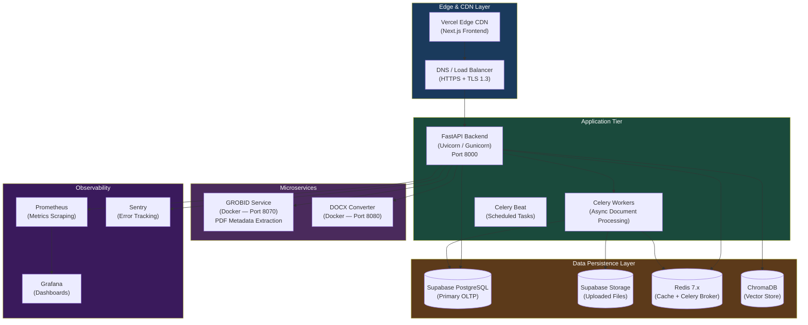
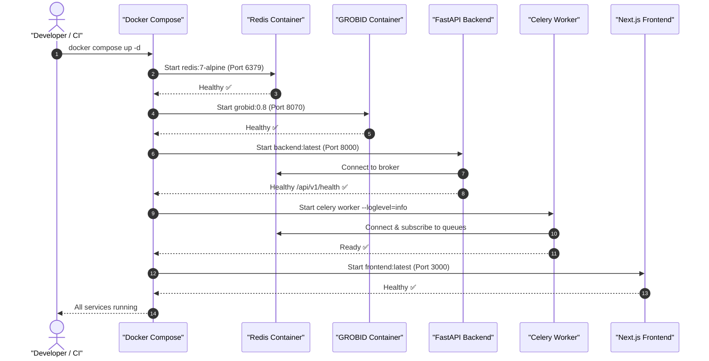
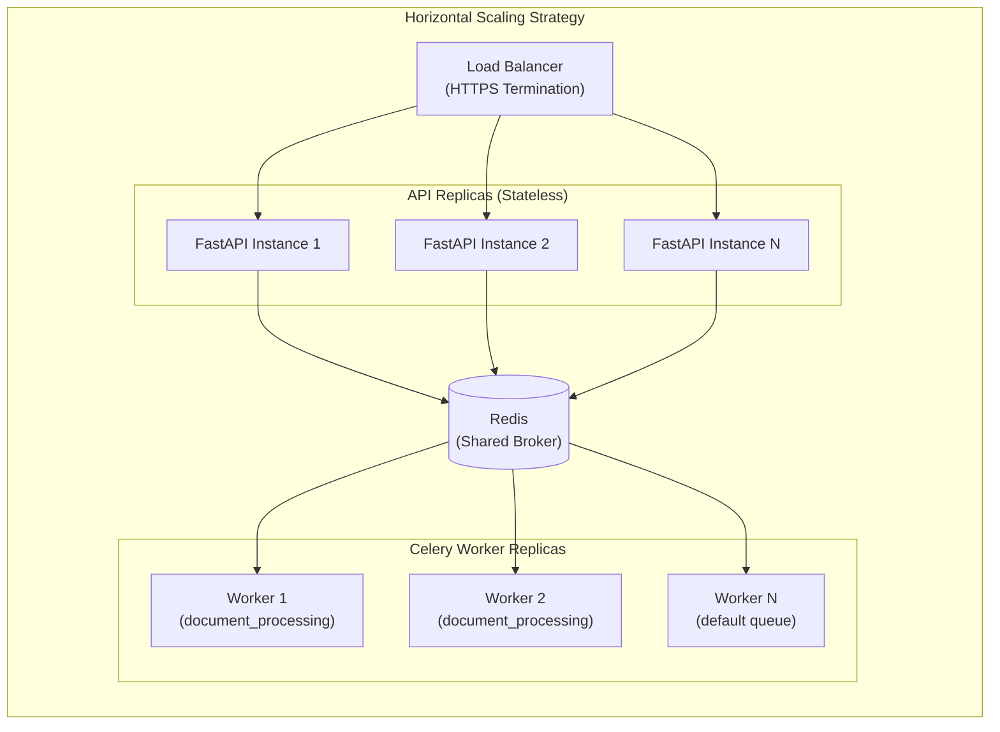

<!-- SPDX-License-Identifier: MIT -->
<!-- Copyright (c) 2026 ScholarForm AI -->

# ScholarForm AI — Deployment Guide

## Table of Contents

- [Overview](#overview)
- [Deployment Architecture](#deployment-architecture)
- [Prerequisites](#prerequisites)
- [Docker Compose Deployment](#docker-compose-deployment)
- [Manual Bare-Metal Deployment](#manual-bare-metal-deployment)
- [Kubernetes Deployment](#kubernetes-deployment)
- [Cloud Platform Deployments](#cloud-platform-deployments)
- [Nginx Reverse Proxy](#nginx-reverse-proxy)
- [Environment Configuration](#environment-configuration)
- [Scaling Strategy](#scaling-strategy)
- [Health Checks & Monitoring](#health-checks--monitoring)
- [Backup & Recovery](#backup--recovery)
- [Troubleshooting](#troubleshooting)

---

## Overview

ScholarForm AI (AMF) is a distributed, multi-service platform deployable across local Docker environments, cloud container platforms (Render, AWS ECS, GCP Cloud Run, Azure Container Apps), and Kubernetes clusters. This guide covers every deployment path with step-by-step instructions.

> [!IMPORTANT]
> Always deploy with `AMF_ENVIRONMENT=production` and `AMF_DEBUG=false` in production. Enabling debug mode exposes `/docs` and detailed stack traces.

---

## Deployment Architecture

The diagram below shows the complete production deployment topology, from CDN edge through application tier to data persistence layer.



---

## Prerequisites

| Requirement | Minimum Version | Purpose |
|-------------|----------------|---------|
| **Docker** | 24.x | Container runtime |
| **Docker Compose** | v2.x | Multi-service orchestration |
| **Python** | 3.12.x | Backend runtime |
| **Node.js** | 20 LTS | Frontend build |
| **Redis** | 7.x | Task broker + cache |
| **Supabase** | Cloud or Self-hosted | Primary database |

> [!NOTE]
> Redis is required for Celery background task processing and real-time SSE event streaming. Without it, async document processing and live preview features will not function.

---

## Docker Compose Deployment

### Quick Start

```bash
# Clone the repository
git clone https://github.com/rohitkumarnaidu/ScholarFormAI.git
cd ScholarFormAI

# Configure environment
cp backend/.env.example backend/.env
# Edit backend/.env with your credentials

# Start microservices (GROBID + DOCX Converter)
docker compose -f deploy/services/docker-compose.yml up -d

# Verify services are healthy
docker compose -f deploy/services/docker-compose.yml ps
```

Services will be available at:
- **GROBID**: `http://localhost:8070`
- **DOCX Converter**: `http://localhost:8080`

### Full Stack Deployment Sequence



### Production Docker Compose Override

```yaml
# docker-compose.override.yml
services:
  backend:
    environment:
      - AMF_ENVIRONMENT=production
      - AMF_DEBUG=false
      - AMF_LOG_LEVEL=warning
    restart: always
    deploy:
      resources:
        limits:
          memory: 1G
          cpus: '1.0'

  celery-worker:
    restart: always
    deploy:
      replicas: 2

  frontend:
    restart: always
```

---

## Manual Bare-Metal Deployment

### Backend (FastAPI + Uvicorn/Gunicorn)

```bash
cd backend
python -m venv .venv
source .venv/bin/activate  # Linux/macOS
# .venv\Scripts\activate   # Windows

pip install -r requirements.txt

# Development (single process, hot-reload)
uvicorn app.main:app --reload --port 8000

# Production (multi-worker Gunicorn)
gunicorn app.main:app \
  --workers 4 \
  --worker-class uvicorn.workers.UvicornWorker \
  --bind 0.0.0.0:8000 \
  --timeout 120 \
  --keep-alive 5
```

### Celery Worker

```bash
cd backend
source .venv/bin/activate

# Start primary document processing worker
celery -A app.tasks.celery_app worker \
  --loglevel=info \
  --concurrency=4 \
  --queues=document_processing,default

# Start Celery Beat (scheduled tasks — e.g., vector session purge)
celery -A app.tasks.celery_app beat --loglevel=info
```

### Frontend (Next.js)

```bash
cd frontend
npm ci
npm run build
npm start  # Production server on port 3000
```

> [!TIP]
> For frontend, prefer deploying to Vercel Edge for automatic CDN, edge rendering, and zero-config SSL. Connect via the Vercel GitHub integration for automatic deployments on every push to `main`.

---

## Kubernetes Deployment

> [!WARNING]
> Kubernetes deployment is recommended for teams requiring horizontal pod autoscaling, rolling updates, and multi-region high availability. Ensure your cluster has a managed Redis instance (e.g., AWS ElastiCache, GCP Memorystore) before deploying.

### Backend Deployment

```yaml
# k8s/backend-deployment.yaml
apiVersion: apps/v1
kind: Deployment
metadata:
  name: scholarform-backend
  namespace: scholarform
spec:
  replicas: 3
  selector:
    matchLabels:
      app: scholarform-backend
  template:
    metadata:
      labels:
        app: scholarform-backend
    spec:
      containers:
      - name: backend
        image: ghcr.io/rohitkumarnaidu/scholarformAI-backend:latest
        ports:
        - containerPort: 8000
        envFrom:
        - secretRef:
            name: scholarform-secrets
        resources:
          requests:
            memory: "512Mi"
            cpu: "250m"
          limits:
            memory: "1Gi"
            cpu: "1000m"
        livenessProbe:
          httpGet:
            path: /api/v1/health
            port: 8000
          initialDelaySeconds: 30
          periodSeconds: 15
        readinessProbe:
          httpGet:
            path: /api/v1/health
            port: 8000
          initialDelaySeconds: 10
          periodSeconds: 5
```

### Horizontal Pod Autoscaler

```yaml
apiVersion: autoscaling/v2
kind: HorizontalPodAutoscaler
metadata:
  name: scholarform-backend-hpa
spec:
  scaleTargetRef:
    apiVersion: apps/v1
    kind: Deployment
    name: scholarform-backend
  minReplicas: 2
  maxReplicas: 10
  metrics:
  - type: Resource
    resource:
      name: cpu
      target:
        type: Utilization
        averageUtilization: 70
```

---

## Cloud Platform Deployments

### Render (Recommended — Current Production)

ScholarForm AI is currently deployed on Render. Configuration is defined in `render.yaml`:

```bash
# Deploy backend web service
render deploy --service scholarform-backend

# Deploy Celery worker as a background worker service
render deploy --service scholarform-celery-worker
```

### Google Cloud Run

```bash
# Build and push image
docker build -t gcr.io/PROJECT_ID/scholarform-backend:latest ./backend
docker push gcr.io/PROJECT_ID/scholarform-backend:latest

# Deploy to Cloud Run
gcloud run deploy scholarform-backend \
  --image gcr.io/PROJECT_ID/scholarform-backend:latest \
  --set-env-vars AMF_ENVIRONMENT=production \
  --memory 1Gi \
  --cpu 2 \
  --port 8000 \
  --min-instances 1 \
  --max-instances 20 \
  --region us-central1
```

### AWS ECS (Fargate)

```bash
# Push to ECR
aws ecr get-login-password --region us-east-1 | docker login --username AWS --password-stdin ACCOUNT.dkr.ecr.us-east-1.amazonaws.com
docker tag scholarform-backend:latest ACCOUNT.dkr.ecr.us-east-1.amazonaws.com/scholarform-backend:latest
docker push ACCOUNT.dkr.ecr.us-east-1.amazonaws.com/scholarform-backend:latest

# Update ECS service
aws ecs update-service \
  --cluster scholarform-prod \
  --service scholarform-backend \
  --force-new-deployment
```

### Azure Container Apps

```bash
az containerapp create \
  --name scholarform-backend \
  --resource-group scholarform-rg \
  --image ghcr.io/rohitkumarnaidu/scholarformAI-backend:latest \
  --environment scholarform-env \
  --ingress external \
  --target-port 8000 \
  --min-replicas 1 \
  --max-replicas 10
```

---

## Nginx Reverse Proxy

```nginx
# /etc/nginx/sites-available/scholarform
server {
    listen 443 ssl http2;
    server_name app.scholarform.ai;

    ssl_certificate     /etc/letsencrypt/live/app.scholarform.ai/fullchain.pem;
    ssl_certificate_key /etc/letsencrypt/live/app.scholarform.ai/privkey.pem;
    ssl_protocols       TLSv1.2 TLSv1.3;
    ssl_ciphers         HIGH:!aNULL:!MD5;

    # Frontend
    location / {
        proxy_pass http://localhost:3000;
        proxy_http_version 1.1;
        proxy_set_header Upgrade $http_upgrade;
        proxy_set_header Connection 'upgrade';
        proxy_set_header Host $host;
        proxy_set_header X-Real-IP $remote_addr;
        proxy_set_header X-Forwarded-For $proxy_add_x_forwarded_for;
        proxy_set_header X-Forwarded-Proto $scheme;
    }

    # Backend API
    location /api/ {
        proxy_pass http://localhost:8000;
        proxy_http_version 1.1;
        proxy_set_header Host $host;
        proxy_set_header X-Real-IP $remote_addr;
        proxy_set_header X-Forwarded-For $proxy_add_x_forwarded_for;
        proxy_set_header X-Forwarded-Proto $scheme;
        client_max_body_size 50M;
        proxy_read_timeout 120s;
    }

    # SSE Events (long-lived connections)
    location /api/v1/documents/stream {
        proxy_pass http://localhost:8000;
        proxy_buffering off;
        proxy_cache off;
        proxy_set_header Connection '';
        proxy_http_version 1.1;
        chunked_transfer_encoding on;
        proxy_read_timeout 600s;
    }

    # Prometheus Metrics
    location /metrics {
        proxy_pass http://localhost:8000;
        allow 10.0.0.0/8;  # Internal monitoring only
        deny all;
    }
}

# Redirect HTTP → HTTPS
server {
    listen 80;
    server_name app.scholarform.ai;
    return 301 https://$host$request_uri;
}
```

---

## Environment Configuration

### Backend `.env` Reference

```env
# === Core ===
AMF_ENVIRONMENT=production
AMF_DEBUG=false
AMF_LOG_LEVEL=warning
AMF_SECRET_KEY=<generate-with-openssl-rand-hex-32>
AMF_ALLOWED_ORIGINS=https://app.scholarform.ai

# === Supabase ===
SUPABASE_URL=https://xxx.supabase.co
SUPABASE_ANON_KEY=eyJhbG...
SUPABASE_SERVICE_ROLE_KEY=eyJhbG...
SUPABASE_JWT_SECRET=your-jwt-secret

# === Redis ===
REDIS_URL=redis://localhost:6379/0
CELERY_BROKER_URL=redis://localhost:6379/1
CELERY_RESULT_BACKEND=redis://localhost:6379/2

# === AI Providers ===
NVIDIA_API_KEY=nvapi-...
GROQ_API_KEY=gsk_...
OPENROUTER_API_KEY=sk-or-...
OLLAMA_BASE_URL=http://localhost:11434

# === External Services ===
GROBID_URL=http://localhost:8070
CLAMAV_HOST=localhost
CLAMAV_PORT=3310

# === Observability ===
SENTRY_DSN=https://xxx@sentry.io/xxx
```

> [!CAUTION]
> Never commit `.env` files to version control. Use a secrets manager (e.g., AWS Secrets Manager, GCP Secret Manager, Vault) in production environments.

---

## Scaling Strategy



| Component | Scaling Method | State |
|-----------|---------------|-------|
| **FastAPI Backend** | Horizontal (add replicas) | Stateless |
| **Celery Workers** | Horizontal (add replicas per queue) | Stateless |
| **Frontend (Next.js)** | CDN / Vercel Edge | Stateless |
| **Redis** | Vertical + Sentinel/Cluster | Stateful |
| **Supabase PostgreSQL** | Read replicas + connection pool | Stateful |
| **ChromaDB** | Vertical (single node) | Stateful |

---

## Health Checks & Monitoring

| Endpoint | Expected Response | Description |
|----------|-------------------|-------------|
| `GET /api/v1/health` | `{"status": "ok"}` | Liveness probe |
| `GET /api/v1/health/ready` | `{"status": "ready"}` | Readiness probe (checks DB + Redis) |
| `GET /metrics` | Prometheus text format | Metrics scrape target |

```bash
# Verify backend health
curl http://localhost:8000/api/v1/health

# Check Celery workers are running
celery -A app.tasks.celery_app inspect active

# Verify GROBID is healthy
curl http://localhost:8070/api/isalive
```

---

## Backup & Recovery

> [!IMPORTANT]
> Supabase automatically takes daily backups (Point-in-Time Recovery available on Pro plan). For self-hosted deployments, configure `pg_dump` via cron.

```bash
# Manual Supabase PostgreSQL backup
pg_dump "$DATABASE_URL" \
  --format=custom \
  --compress=9 \
  --file="backup-$(date +%Y%m%d-%H%M%S).dump"

# Restore from backup
pg_restore \
  --dbname="$DATABASE_URL" \
  --clean \
  --if-exists \
  backup-20260729-120000.dump

# ChromaDB volume backup
docker cp scholarform-backend:/app/db/chroma ./chroma-backup-$(date +%Y%m%d)
```

---

## Troubleshooting

| Symptom | Likely Cause | Resolution |
|---------|-------------|------------|
| `Connection refused :8000` | Backend not running | `uvicorn app.main:app --reload` |
| `Celery worker not processing` | Redis unreachable | Check `REDIS_URL` and Redis service health |
| `GROBID timeout on PDF parse` | GROBID container unhealthy | `docker restart grobid` |
| `422 Unprocessable Entity on upload` | ClamAV not reachable or file flagged | Check `CLAMAV_HOST`/`CLAMAV_PORT` |
| `ChromaDB collection not found` | First run — collections not seeded | Run `python scripts/seed_vector_store.py` |
| `JWT verification failed` | Supabase JWKS endpoint unreachable | Verify `SUPABASE_URL` and network access |

---

## Related Documentation

- [CONFIGURATION.md](CONFIGURATION.md) — Full settings reference
- [ARCHITECTURE.md](ARCHITECTURE.md) — System topology
- [docs/CI_CD_ARCHITECTURE.md](docs/CI_CD_ARCHITECTURE.md) — CI/CD pipeline
- [docs/DEPLOYMENT_GUIDE.md](docs/DEPLOYMENT_GUIDE.md) — Detailed deployment runbook

---

*Last updated: July 2026*
