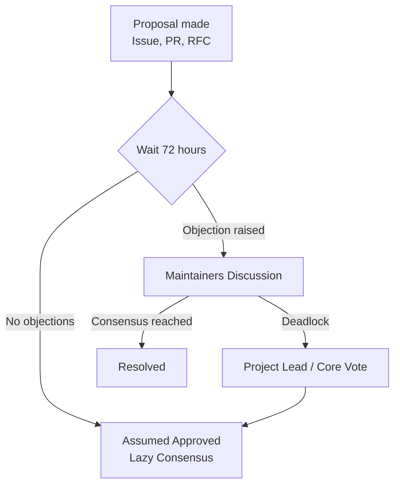

# Governance Model

This document describes the governance model for the **ScholarForm AI** open-source project. Our goal is to ensure the project remains sustainable, transparent, and community-driven while maintaining enterprise-grade standards.

## 1. Project Structure

ScholarForm AI operates under a **Benevolent Dictator for Life (BDFL) with Meritocratic Overlay** governance model.

```
Project Lead (BDFL)
    └── Core Maintainers (3-5)
            └── Maintainers (10-20)
                    └── Contributors
                            └── Community Members
```

### 1.1 Project Lead (BDFL)
The Project Lead (Rohit Kumar Naidu) holds final authority on strategic project direction, appoints core maintainers, and resolves technical deadlocks.

### 1.2 Core Maintainers
Core Maintainers manage strategic decisions, architecture RFC approvals, Working Group oversight, and release management.

### 1.3 Maintainers
Maintainers manage day-to-day operations: reviewing pull requests, triaging issues, leading Working Groups, and mentoring contributors. Maintainers have commit access to core repositories.

### 1.4 Contributors
Anyone who interacts with the project—whether by submitting code, writing documentation, reporting bugs, or reviewing PRs—is a contributor.

---

## 2. Decision-Making Process

We operate primarily on a model of **Lazy Consensus**:

| Decision Type | Process | Who Decides |
| :--- | :--- | :--- |
| **Bug fix / minor change** | Lazy consensus (72-hour window) | Assigned Maintainer |
| **New feature** | RFC + lazy consensus | Core Maintainers |
| **Breaking change** | RFC + vote | Core Maintainers + Project Lead |
| **Governance change** | RFC + supermajority vote (>66%) | All Maintainers |
| **BDFL succession** | RFC + unanimous vote | Core Maintainers |



---

## 3. RFC (Request for Comments)

For major architectural changes—such as introducing new AI agent capabilities, altering pipeline stages, or changing database schemas—an RFC must be submitted as a Pull Request to the project repository.

For full governance specifications and Working Group definitions, please see [Detailed Governance Model](docs/governance/governance-model.md) and our [Contributing Guidelines](CONTRIBUTING.md).
