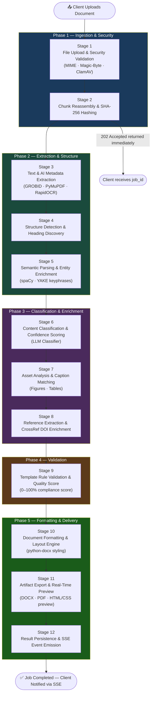
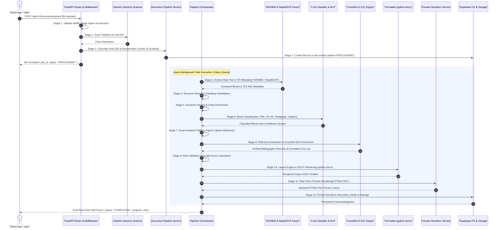

# ScholarForm AI — Document Ingestion & Formatting Pipeline

## Table of Contents

- [Overview](#overview)
- [Pipeline Stage Overview](#pipeline-stage-overview)
- [12-Stage Pipeline Sequence Diagram](#12-stage-pipeline-sequence-diagram)
- [Detailed 12-Stage Breakdown](#detailed-12-stage-breakdown)
- [Related Documentation](#related-documentation)

---

## Overview

The ScholarForm AI Document Ingestion and Formatting Pipeline is an end-to-end, asynchronous 12-stage processing engine. Managed by the `DocumentPipelineService` and `PipelineOrchestrator` (`app/pipeline/orchestrator/`), the pipeline processes incoming raw documents (.docx, .pdf, .tex, .md, .txt), extracts content blocks and metadata, validates compliance against publisher guidelines, applies professional styling via `python-docx`, generates real-time HTML previews, and persists structured outputs.

---

## Pipeline Stage Overview

The flowchart below gives a high-level view of all 12 pipeline stages, organized into their logical phase groups: **Ingestion**, **Analysis**, **Enrichment**, **Formatting**, and **Delivery**.

> [!NOTE]
> The 202 Accepted response is returned to the client **after Stage 2** — Stages 3–12 all run asynchronously in a Celery background worker, giving sub-400ms API response times regardless of document complexity.

---

## 12-Stage Pipeline Sequence Diagram

The Mermaid sequence diagram below illustrates the chronological progression of a document job through all 12 stages, detailing interaction between client apps, API gateway, microservices, background workers, and persistence stores:

---

## Detailed 12-Stage Breakdown

### Stage 1: File Upload & Input Security Validation
- **MIME & Extension Validation**: Verifies uploaded extensions against accepted types (`.docx`, `.pdf`, `.tex`, `.odt`, `.rtf`, `.md`, `.txt`).
- **Magic-Byte Inspection**: Inspects the binary header bytes (e.g., `PK\x03\x04` for DOCX/ODT, `%PDF` for PDF, `{\rtf` for RTF) to block spoofed extensions.
- **Antivirus Scanning**: Uploaded files pass through `virus_scanner.py` using ClamAV (`CLAMAV_HOST` / `CLAMAV_PORT`). Infected files are immediately deleted and rejected with HTTP 422.

### Stage 2: Chunk Reassembly & Hash Verification
- **Chunked Upload Handling**: Large files (>5MB) uploaded via `upload_document_chunked` are accepted as temporary sequential parts (`.part0`, `.part1`). Upon arrival of the final chunk, parts are reassembled into a single payload.
- **Integrity Hashing**: Computes the SHA-256 checksum of the completed payload (`file_hash`) for duplicate detection.
- **Initial Job Record**: Inserts an initial record into the Supabase `documents` table with `status="PROCESSING"` and returns an HTTP 202 acknowledgment with `{ job_id }` in under 400ms.

### Stage 3: Text & AI Metadata Extraction
- **GROBID TEI XML Parsing**: Transmits PDF documents to the GROBID Docker service to extract structured TEI XML metadata (title, author list, affiliations, abstract, and inline reference anchors).
- **PyMuPDF Extraction**: Extracts raw text lines and bounding box coordinates from digital PDFs.
- **Local OCR Fallback**: If a PDF page contains scanned images or non-extractable text, `local_ocr.py` runs local ONNX OCR using `rapidocr_onnxruntime` directly in the backend process.

### Stage 4: Structure Detection & Heading Discovery
- **Heading Candidate Discovery**: `StructureDetector` scans text blocks for structural patterns (numbered section headers like `1. Introduction`, all-caps text, font size deltas).
- **Section Ordering**: Maps discovered sections against expected publisher template contracts (e.g., Abstract -> Introduction -> Methods -> Results -> Discussion -> References).

### Stage 5: Semantic Parsing & Entity Enrichment
- **NLP Processing**: Optional NLP enhancement using spaCy and YAKE keyphrase extraction.
- **Semantic Relationship Analysis**: Identifies inline references to tables (`Table 1`), figures (`Figure 2`), and equations (`Eq. 3`).
- **Fast Mode Bypass**: In `fast_mode=True`, semantic parsing is bypassed to reduce processing duration.

### Stage 6: Content Classification & Confidence Scoring
- **Block Classification**: Classifies every document line/block into discrete `BlockType` categories: `TITLE`, `ABSTRACT`, `HEADING_1`, `HEADING_2`, `HEADING_3`, `PARAGRAPH`, `CAPTION`, `LIST_ITEM`, `REFERENCE`.
- **Classification Gate**: Uses prompt-based LLM classification (`LLMClassifier`) for ambiguous blocks, recording a confidence score (0.0–1.0) per block.

### Stage 7: Content Analysis & Asset Matching
- **Caption Matching**: Associates figure image blocks and table grid blocks with their corresponding caption blocks based on proximity and label matching.
- **Figure Quality Analysis**: Inspects image resolution, aspect ratio, and contrast to warn of low-quality figures.

### Stage 8: Reference Extraction & CrossRef Enrichment
- **Citation Extraction**: Scans text using regex patterns (`_AUTHOR_YEAR_PARENS`, `_NUMERIC_BRACKETS`) to identify all citations.
- **CrossRef DOI Lookup**: Queries CrossRef REST API to resolve raw citation keys to formal metadata (authors, journal, volume, issue, year, DOI).
- **CSL Formatting**: Passes resolved metadata to `CSLEngine` to format citations and construct the final bibliography list according to the chosen style.

### Stage 9: Template Rule & AI Reasoning Validation
- **Contract Rule Checking**: Evaluates document metrics against the publisher's template contract (font sizes, margins, line spacing, required sections).
- **Quality Score Calculation**: Computes an overall Quality Score (0–100%) based on template compliance, block classification confidence, missing mandatory sections, and validation warnings.
- **AI Explainer**: Generates human-readable explanations (`AIExplainer`) for any rule violations.

### Stage 10: Document Formatting & Layout Engine
- **python-docx Styling**: Applies paragraph styles, font families, font sizes, indents, line spacing, margins, header/footer page numbers, and borders using `python-docx`.
- **Reference List Rendering**: Appends the formatted CSL reference list to the end of the manuscript.

### Stage 11: Artifact Export & Real-Time Preview Rendering
- **Artifact Export**: Writes the styled document to disk as a final `.docx` artifact (and optionally `.pdf` / `.tex`).
- **Real-Time Preview Generation**: `PreviewRenderer` parses manuscript blocks, applies template-specific CSS stylesheets (`preview.css`), and generates a sanitized HTML string cached in Redis (`preview:html:<sha256>`).

### Stage 12: Result Persistence & Event Emission
- **Supabase Insertion**: Persists structured data, quality summary metrics, and validation results into `document_results`.
- **Status Update**: Updates the `documents` table status to `COMPLETED` and sets `progress=100`.
- **SSE Event Emission**: Emits a Server-Sent Event (`status_update`) over HTTP SSE to notify the connected frontend or client SDK.

---

## Related Documentation

- [ARCHITECTURE.md](ARCHITECTURE.md) — System topology and component diagram.
- [SYSTEM_DESIGN.md](SYSTEM_DESIGN.md) — Subsystem detailed design and RAG flowcharts.
- [DATABASE_SCHEMA.md](DATABASE_SCHEMA.md) — Database tables, ERD, and RLS policies.

---

*Last updated: July 2026*
