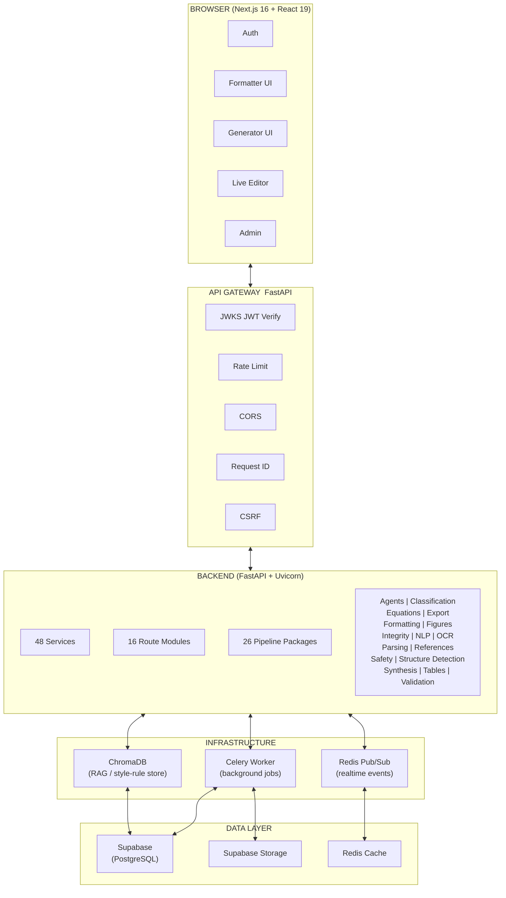

<!-- SPDX-License-Identifier: MIT -->
<!-- Copyright (c) 2026 ScholarForm AI -->


<div align="center">
  <br/>
  <h1>ScholarForm AI</h1>
  <h3>Automated Academic Manuscript Formatting — Powered by AI</h3>
  <p>Upload a manuscript → get a publisher-ready DOCX/PDF. Or generate a full research document from scratch.</p>
  <br/>

[](LICENSE)
[](https://www.python.org/downloads/)
[](https://nextjs.org/)
[](https://fastapi.tiangolo.com/)
[](https://github.com/rohitkumarnaidu/ScholarFormAI/actions/workflows/backend-ci.yml)
[](https://github.com/rohitkumarnaidu/ScholarFormAI/actions/workflows/frontend-ci.yml)
[](backend/.coverage)
[](https://github.com/astral-sh/ruff)
[](https://api.scorecard.dev/projects/github.com/rohitkumarnaidu/ScholarFormAI)
[](sbom/backend-sbom.json)
[](.github/workflows/codeql.yml)
[](.github/workflows/slsa-provenance.yml)
[](CONTRIBUTING.md)
[](commitlint.config.js)
[](docs/BRANCH_PROTECTION.md)
[](https://github.com/rohitkumarnaidu/ScholarFormAI/releases)
[](https://github.com/rohitkumarnaidu/ScholarFormAI/stargazers)

</div>

---

## Table of Contents

- [Features](#features)
- [Architecture](#architecture)
- [Quick Start](#quick-start)
- [Docker](#docker)
- [Configuration](#configuration)
- [API Overview](#api-overview)
- [Testing](#testing)
- [Project Structure](#project-structure)
- [Technology Stack](#technology-stack)
- [Compliance & Security](#compliance--security)
- [Contributing](#contributing)
- [Governance](#governance)
- [Support](#support)
- [FAQ](#faq)
- [License](#license)

---

## Features

- **Formatter Mode** — Upload DOCX, PDF, LaTeX, Markdown, HTML, or plain text; outputs a publisher-ready manuscript in IEEE, APA, Springer, Nature, Elsevier, ACM, MLA, Chicago, Harvard, Vancouver, Numeric, and more (17 templates)
- **Generator Mode** — AI agent generates a complete research document from a prompt, with outline approval and section-by-section streaming
- **Multi-Doc Synthesis** — Merges and synthesizes content from multiple source documents into a single coherent manuscript
- **Real-Time Preview** — Live editor with split-pane before/after diff via WebSocket/SSE
- **AI-Powered Analysis** — Quality scoring, citation validation, reference assembly, and LLM-based semantic classification
- **3-Tier PDF Parsing** — Vision API → PyMuPDF+LLM enrichment → Raw PyMuPDF extraction for maximum extraction reliability
- **Batch Processing** — Upload and process multiple manuscripts in parallel
- **17 Templates** — IEEE, APA, Springer, Nature, Elsevier, ACM, MLA, Chicago, Harvard, Vancouver, Numeric, plus custom/blank
- **Export** — Download formatted manuscripts as DOCX or PDF

---

## Architecture



- **LLM Tier 1:** NVIDIA NIM — Llama 3.3 70B Instruct (primary)
- **LLM Tier 2:** Groq — llama-3.3-70b-versatile (fallback)
- **LLM Tier 3:** DeepSeek R1 via Ollama (local/offline)
- **PDF Parsing:** Vision API → PyMuPDF+LLM enrichment → Raw PyMuPDF (3-tier fallback)
- **Realtime:** Redis pub/sub → WebSocket / SSE

---

## Quick Start

### Prerequisites

- Python **3.12.x**
- Node.js **20+ (LTS)**
- Redis (optional — required for Celery + realtime features)

### Backend

```bash
cd backend
python -m venv .venv
source .venv/bin/activate  # Linux/macOS
# .venv\Scripts\activate   # Windows
pip install -r requirements.txt
```

Copy `backend/.env.example` to `backend/.env`, configure your credentials, then:

```bash
uvicorn app.main:app --reload --port 8000
```

API docs at `http://localhost:8000/docs` (requires `DEBUG=true`).

### Frontend

```bash
cd frontend
npm install
npm run dev
```

Open `http://localhost:3000`.

### Environment Variables

**Backend** (`backend/.env`):
```env
SUPABASE_URL=https://xxx.supabase.co
SUPABASE_ANON_KEY=eyJhbG...
SUPABASE_SERVICE_ROLE_KEY=eyJhbG...
NVIDIA_API_KEY=nvapi-...
GROQ_API_KEY=gsk_...
REDIS_URL=redis://localhost:6379
```

**Frontend** (`frontend/.env.local`):
```env
NEXT_PUBLIC_API_URL=http://localhost:8000
NEXT_PUBLIC_SUPABASE_URL=https://xxx.supabase.co
NEXT_PUBLIC_SUPABASE_ANON_KEY=eyJhbG...
```

> All frontend environment variables require the `NEXT_PUBLIC_` prefix.

---

## Docker

Docker Compose configuration for GROBID and DOCX Converter services:

```bash
docker compose -f deploy/services/docker-compose.yml up -d
```

This starts:
- **GROBID** (port 8070) — metadata extraction from PDFs
- **DOCX Converter** (port 8080) — document format conversion

See [`deploy/services/`](deploy/services/) for service definitions and health check endpoints.

---

## API Overview

| Method | Endpoint | Purpose |
|--------|----------|---------|
| `POST` | `/api/v1/documents/upload` | Upload and format a document |
| `GET` | `/api/v1/documents/{job_id}/status` | Poll processing status |
| `GET` | `/api/v1/documents/{job_id}/preview` | Rendered HTML preview |
| `GET` | `/api/v1/documents/{job_id}/compare` | Before/after diff |
| `GET` | `/api/v1/documents/{job_id}/download` | Download formatted output (DOCX/PDF) |
| `POST` | `/api/v1/documents/{job_id}/edit` | Submit incremental edits |
| `GET` | `/api/v1/templates` | List all available templates |
| `GET` | `/api/v1/health` | Health check endpoint |
| `GET` | `/metrics` | Prometheus metrics |

Full API reference: [`docs/API.md`](docs/API.md) (34 routes).

---

## Testing

**Backend** (unit tests, no external services required):
```bash
cd backend
pytest tests -m "not integration and not llm and not contract" -x -q
```

**Frontend:**
```bash
cd frontend
npm test                    # Vitest unit tests
npm run test:e2e            # Playwright E2E (headless)
npm run test:e2e:headed     # Playwright E2E (headed)
```

See [`docs/Testing.md`](docs/Testing.md) for the complete test strategy.

---

## Project Structure

```
├── backend/
│   ├── app/
│   │   ├── main.py               # FastAPI application entry point
│   │   ├── config/               # Pydantic settings, logging configuration
│   │   ├── db/                   # Repositories, models, Supabase client
│   │   ├── middleware/           # Rate limiting, CSRF, RBAC, security headers
│   │   ├── pipeline/            # 26 pipeline packages (agents, formatting, export, etc.)
│   │   ├── routers/             # 16 route modules under /api/v1/
│   │   ├── schemas/             # Pydantic request/response schemas & api_envelope
│   │   ├── security/            # JWKS JWT verification
│   │   ├── services/            # 48 business logic services
│   │   ├── tasks/               # Celery background task definitions
│   │   └── utils/               # Shared utilities
│   ├── tests/                   # 95+ test files (unit, integration, contract)
│   └── requirements.txt         # Python dependencies
│
├── frontend/
│   ├── app/                     # Next.js 16 App Router — pages & route groups
│   ├── src/
│   │   ├── components/          # Shared React UI components
│   │   ├── context/             # Auth, theme, toast context providers
│   │   ├── hooks/               # Custom React hooks
│   │   ├── lib/                 # Supabase client, constants, helpers
│   │   └── services/            # API client service wrappers
│   └── e2e/                     # Playwright E2E tests
│
├── deploy/services/             # GROBID and DOCX Converter Docker services
├── docs/                        # Architecture, API, roadmap, audit reports
└── .github/workflows/           # CI/CD pipelines
```

---

## Technology Stack

| Layer | Technology |
|-------|-----------|
| **Frontend** | Next.js 16, React 19, Tailwind CSS 3, TanStack Query 5 |
| **Backend** | FastAPI, Python 3.12, Celery, Redis |
| **Database** | Supabase (PostgreSQL), ChromaDB (vector store) |
| **AI/ML** | NVIDIA NIM, Groq, Ollama (bring-your-own-key) |
| **PDF Processing** | PyMuPDF, GROBID, DOCX Converter |
| **Monitoring** | Prometheus, Grafana |
| **Deployment** | Docker, Render |

---

## Compliance & Security

### Supply Chain Security

| Capability | Tool | Frequency |
|-----------|------|-----------|
| SBOM (CycloneDX) | `sbom/backend-sbom.json`, `sbom/frontend-sbom.json` | Weekly + on dependency change |
| CVE scanning (Python) | pip-audit + Safety | Every PR |
| CVE scanning (npm) | npm audit | Every PR |
| SAST (Python) | Bandit | Every PR |
| License compliance | FOSSA | Continuous |
| License policy enforcement | dependency-review.yml | Every PR |
| Automated dependency PRs | Renovate | Weekly |
| OpenSSF Scorecard | Scorecard API | Continuous |
| CodeQL analysis | GitHub CodeQL | Every PR |
| SLSA 3 provenance | slsa-provenance.yml | Every release |

### Application Security

- CSRF protection on all state-changing requests
- Rate limiting (global + per-tier)
- Security headers (CSP, HSTS, X-Frame-Options, X-Content-Type-Options)
- HTTPS enforcement in production
- ClamAV virus scanning on uploaded files
- Abuse detection middleware
- Signed commits required (`git commit -S`)
- Dependency review on all pull requests

See [`docs/compliance.md`](docs/compliance.md) and [`SECURITY.md`](SECURITY.md) for full documentation.

---

## Pre-commit Hooks

Configured in `.pre-commit-config.yaml`:

- `ruff` + `ruff-format` on Python files
- `eslint` on JavaScript/TypeScript files
- `detect-secrets` with `.secrets.baseline`

```bash
pip install pre-commit
pre-commit install
pre-commit run --all-files
```

---

## Contributing

We welcome contributions from the community. All contributors must agree to the [Developer Certificate of Origin](DEVELOPER_CERTIFICATE_OF_ORIGIN.md) and sign commits with `git commit -s`.

1. Fork the repository and create a branch from `main`
2. See [`BUILDING.md`](BUILDING.md) for environment setup
3. Make your changes (keep commits small and focused)
4. Run linting and tests locally (`ruff` → `pytest` → `npm test`)
5. Open a pull request using the [template](PULL_REQUEST_TEMPLATE.md)

All pull requests must pass CI checks and include DCO sign-off before merging.

Detailed guidelines: [`CONTRIBUTING.md`](CONTRIBUTING.md)

---

## Governance

ScholarForm AI follows a **BDFL + Core Team** governance model:

- [`GOVERNANCE.md`](GOVERNANCE.md) — decision-making process, RFC workflow, roles and responsibilities
- [`MAINTAINERS.md`](MAINTAINERS.md) — core team and committer roster

---

## Support

- **Community:** [GitHub Discussions](https://github.com/rohitkumarnaidu/ScholarFormAI/discussions)
- **Bug reports:** [GitHub Issues](https://github.com/rohitkumarnaidu/ScholarFormAI/issues)
- **FAQ:** [`FAQ.md`](FAQ.md)
- **Security disclosures:** [`SECURITY.md`](SECURITY.md)
- **Enterprise inquiries:** enterprise@scholarform.ai

See [`SUPPORT.md`](SUPPORT.md) for full details, including response SLAs and commercial support options.

---

## FAQ

**Does this require a GPU?**  
No. All AI inference uses cloud APIs (NVIDIA NIM, Groq) or runs CPU-friendly via Ollama for local fallback.

**Can I run it fully offline?**  
Yes, with local Redis for realtime features and Supabase credentials for persistence. PDF parsing works offline via PyMuPDF fallback.

**What file formats are supported?**  
Input: DOCX, PDF, LaTeX, Markdown, HTML, TXT. Output: DOCX, PDF (LaTeX export in development).

**How do I add a new template?**  
See the [Template Creation Guide](docs/template_creation.md) and [`examples/custom-template/`](examples/custom-template/).

**Where can I get help?**  
[`SUPPORT.md`](SUPPORT.md) — community channels, enterprise support, and response SLAs.

---

## License

Distributed under the **MIT License**. See [`LICENSE`](LICENSE) for more information.

This project includes third-party components under various open-source licenses. See [`THIRD_PARTY_NOTICES.md`](THIRD_PARTY_NOTICES.md) for details.

---

## Adopters

See [`ADOPTERS.md`](ADOPTERS.md) for organizations using ScholarForm AI in production.
