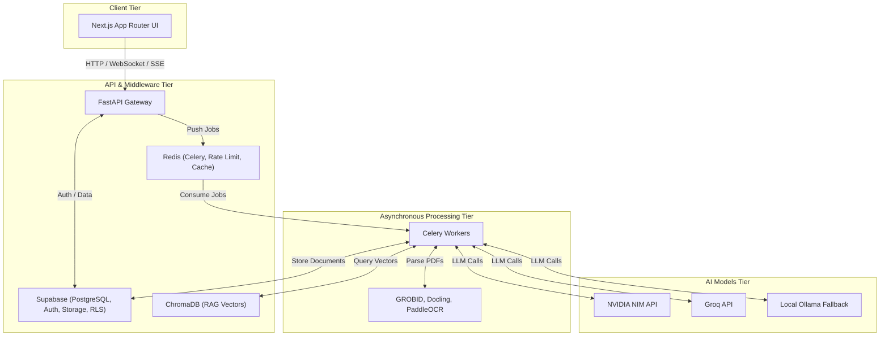

# ScholarForm AI

<div align="center">
  <p>
    <a href="LICENSE"></a>
    <a href="CONTRIBUTING.md"></a>
    <a href="CODE_OF_CONDUCT.md"></a>
    <a href="SECURITY.md"></a>
  </p>
  <h3>Automated Academic Manuscript Formatting & Generation — Powered by Agentic AI</h3>
  <p>Upload a raw manuscript and instantly receive a publisher-ready document. Or use the AI Generator to author complete, rigorously cited research papers from scratch.</p>
</div>

## 🌟 Project Vision

To eliminate formatting friction and repetitive manual labor in academic publishing, allowing researchers to focus entirely on scientific discovery. We aim to provide a robust, enterprise-grade open-source platform that leverages multi-agent AI architectures to automate manuscript formatting, reference resolution, and document synthesis.

## ✨ Features

- **One-Click Formatter:** Upload DOCX, PDF, LaTeX, Markdown, or HTML. Receive publisher-ready outputs in 17+ templates (IEEE, APA, Springer, Nature, etc.).
- **Autonomous AI Generator:** Agentic AI workflow constructs research documents from a prompt, supporting iterative outline approval and real-time streaming.
- **Multi-Doc RAG Synthesis:** Merge, synthesize, and cross-reference content from multiple source documents into a cohesive manuscript.
- **Real-Time Split-Pane Editor:** Live before/after diff editor powered by WebSockets/SSE.
- **3-Tier PDF Extraction:** Bulletproof parsing via Vision API fallback → PyMuPDF+LLM enrichment → raw PyMuPDF.
- **Enterprise Security:** Built to SLSA Level 3 standards. Comprehensive rate limiting, RBAC, CSRF protection, and supply chain security.

## 🏗 Architecture



ScholarForm AI employs a decoupled, highly scalable architecture combining a Next.js App Router frontend with an asynchronous FastAPI backend, orchestrated via Celery and Redis.

## 🚀 Quick Start & Installation

**Prerequisites:** Docker, Node.js 20+, Python 3.12+

```bash
git clone https://github.com/rohitkumarnaidu/ScholarFormAI.git
cd ScholarFormAI
cp backend/.env.example backend/.env
cp frontend/.env.local.example frontend/.env.local
docker compose -f deploy/services/docker-compose.yml up -d
```

## 💻 CLI

```bash
amf format input.docx --template IEEE --output output.pdf
amf analyze paper.pdf
```

## 🔌 API & AI Features

- **Forensic Auditor Agent:** Verifies citations and checks equations.
- **Synthesis Agent:** Merges structured data into fluid paragraphs.
- **Layout Agent:** Maps structures into template directives.

## ⚙️ Configuration & Docker

Use the `.env` files to configure NVIDIA, Groq, Supabase keys. Docker Compose is provided for local and production deployment.

## 🛠 Development & Examples

Run the backend with `uvicorn` and frontend with `npm run dev`. See the `examples/` directory for manuscript conversions.

## ❓ FAQ & Troubleshooting

- **How do I fix Docker issues?** Ensure port 8000 (backend) and 3000 (frontend) are available.
- **API limits?** Configurable via Redis rate limiter in `.env`.

## 🛣 Roadmap

Version 2.0 plans include peer review simulations and CRDTs for collaborative editing.

## 💬 Community, Contributing & Security

We welcome contributions from the community to help make ScholarForm AI the premier open-source tool for academic publishing.

- **[Contributing Guidelines](CONTRIBUTING.md):** Learn how to set up your environment, follow our standards, and submit pull requests.
- **[Code of Conduct](CODE_OF_CONDUCT.md):** We are committed to fostering a welcoming and inclusive environment.
- **[Security Policy](SECURITY.md):** Information on supported versions and how to responsibly disclose security vulnerabilities.

Join our community on Discord to discuss features, get help, and collaborate!

## ⚖️ License

ScholarForm AI is released under the **[MIT License](LICENSE)**. See the `LICENSE` file for more details.
