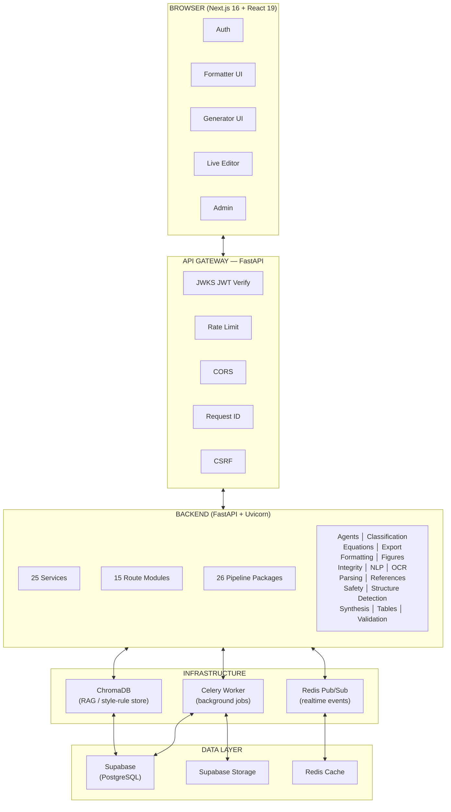

<!-- SPDX-License-Identifier: MIT -->
<!-- Copyright (c) 2026 ScholarForm AI -->


<div align="center">
  <br/>
  <h1>📄 ScholarForm AI</h1>
  <h3>Automated Academic Manuscript Formatting — Powered by AI</h3>
  <p>Upload a manuscript → get a publisher-ready DOCX/PDF. Or generate a full research document from scratch.</p>
  <br/>

[](LICENSE)
[](https://www.python.org/downloads/)
[](https://nextjs.org/)
[](https://fastapi.tiangolo.com/)
[](https://github.com/rohitkumarnaidu/ScholarFormAI/actions/workflows/backend-ci.yml)
[](https://github.com/rohitkumarnaidu/ScholarFormAI/actions/workflows/frontend-ci.yml)
[](backend/.coverage)
[](https://github.com/astral-sh/ruff)
[](https://github.com/rohitkumarnaidu/ScholarFormAI/stargazers)
[](https://github.com/rohitkumarnaidu/ScholarFormAI/commits/main)
[](CONTRIBUTING.md)
[](sbom/backend-sbom.json)
[](.github/workflows/dependency-review.yml)
[](https://api.scorecard.dev/projects/github.com/rohitkumarnaidu/ScholarFormAI)
[](renovate.json)
[](.fossa.yml)
[](https://securityscorecards.dev/viewer/?uri=github.com/rohitkumarnaidu/ScholarFormAI)
[](.github/workflows/codeql.yml)
[](.github/workflows/slsa-provenance.yml)
[](https://github.com/rohitkumarnaidu/ScholarFormAI/pkgs/container/scholarform)
[](https://github.com/rohitkumarnaidu/ScholarFormAI/releases)
[](commitlint.config.js)
[](docs/BRANCH_PROTECTION.md)

</div>

---

## Table of Contents

- [Features](#features)
- [Built With](#built-with)
- [Architecture](#architecture)
- [Quick Start](#quick-start)
- [Docker](#docker)
- [Configuration](#configuration)
- [API Overview](#api-overview)
- [Testing](#testing)
- [Project Structure](#project-structure)
- [Pre-commit Hooks](#pre-commit-hooks)
- [Quickstart](docs/quickstart.md)
- [Examples](#examples)
- [Building](BUILDING.md)
- [Contributing](CONTRIBUTING.md)
- [Governance](#governance)
- [Roadmap](docs/Roadmap.md)
- [Support](SUPPORT.md)
- [Security](SECURITY.md)
- [FAQ](FAQ.md)
- [License](#license)

---

## Features

- **Formatter Mode** — Upload DOCX, PDF, LaTeX, Markdown, HTML, or plain text; get a publisher-ready manuscript in IEEE, APA, Springer, Nature, Elsevier, ACM, MLA, Chicago, Harvard, Vancouver, Numeric, and more (17 templates)
- **Generator Mode** — AI Agent generates a complete research document from a prompt, with outline approval and section-by-section streaming
- **Multi-Doc Synthesis** — Merge and synthesize content from multiple source documents into one coherent manuscript
- **Real-Time Preview** — Live editor with split-pane before/after diff via WebSocket/SSE
- **AI-Powered Analysis** — Quality scoring, citation validation, reference assembly, and semantic classification (SciBERT — optional)
- **3-Tier PDF Fallback** — GROBID → Docling → PyMuPDF → PyPDF2 chain for maximum extraction reliability
- **Batch Processing** — Upload and process multiple manuscripts in parallel
- **17 Templates** — IEEE, APA, Springer, Nature, Elsevier, ACM, MLA, Chicago, Harvard, Vancouver, Numeric, plus custom/blank
- **Export** — Download formatted manuscripts as DOCX or PDF

---

## Built With

| Layer | Technology |
|-------|-----------|
| **Frontend** | [](https://nextjs.org/) [](https://react.dev/) [](https://tailwindcss.com/) [](https://tanstack.com/query) |
| **Backend** | [](https://fastapi.tiangolo.com/) [](https://python.org/) [](https://docs.celeryq.dev/) [](https://redis.io/) |
| **Database** | [](https://supabase.io/) [](https://www.trychroma.com/) |
| **AI/ML** | [](https://build.nvidia.com/) [](https://groq.com/) [](https://ollama.ai/) |
| **PDF** | [](https://grobid.readthedocs.io/) [](https://ds4sd.github.io/docling/) |
| **Monitoring** | [](https://prometheus.io/) [](https://grafana.com/) [](https://sentry.io/) [](https://posthog.com/) |
| **Deploy** | [](https://render.com/) [](https://docker.com/) |

---

## Architecture



- **LLM Tier 1:** NVIDIA NIM — Llama 3.3 70B Instruct (primary)
- **LLM Tier 2:** Groq — llama-3.3-70b-versatile (fallback)
- **LLM Tier 3:** DeepSeek R1 via Ollama (local/offline)
- **PDF Parsing:** GROBID → Docling → PyMuPDF → PyPDF2 (4-tier fallback)
- **Realtime:** Redis pub/sub → WebSocket / SSE

---

## Quick Start

### Prerequisites

- Python **3.12.x** (3.11 causes pytest import collisions)
- Node.js **20+ (LTS)**
- Redis (for Celery + realtime features — optional for basic usage)

### 1. Backend

```bash
cd backend

# Create virtual environment
python -m venv .venv

# Windows
.venv\Scripts\activate
# Mac / Linux
source .venv/bin/activate

pip install -r requirements.txt
```

Copy `backend/.env.example` to `backend/.env` and fill in your credentials, then:

```bash
uvicorn app.main:app --reload --port 8000
```

API docs at `http://localhost:8000/docs` (requires `DEBUG=true` in `.env`).

### 2. Frontend

```bash
cd frontend
npm install
npm run dev
```

Open `http://localhost:3000`.

### 3. Environment Variables

**Backend** — `backend/.env`:
```env
SUPABASE_URL=https://xxx.supabase.co
SUPABASE_ANON_KEY=eyJhbG...
SUPABASE_SERVICE_ROLE_KEY=eyJhbG...
NVIDIA_API_KEY=nvapi-...
GROQ_API_KEY=gsk_...
REDIS_URL=redis://localhost:6379
LOW_MEMORY_MODE=true
DEFAULT_FAST_MODE=true
```

**Frontend** — `frontend/.env.local`:
```env
NEXT_PUBLIC_API_URL=http://localhost:8000
NEXT_PUBLIC_SUPABASE_URL=https://xxx.supabase.co
NEXT_PUBLIC_SUPABASE_ANON_KEY=eyJhbG...
```

> All frontend env vars are prefixed `NEXT_PUBLIC_*`.

---

## Docker

A Docker Compose setup is available at `backend/docker/docker-compose.yml` for running GROBID and other service dependencies:

```bash
cd backend/docker
docker-compose up -d
```

This starts:
- **GROBID** (port 8070) — metadata extraction from PDFs
- Services defined in the Compose file

For full-stack deployment, see [`deploy/`](deploy/) for Prometheus, Grafana, and Hugging Face deployment configs.

---

## API Overview

| Method | Endpoint | Purpose |
|--------|---------|---------|
| `POST` | `/api/v1/documents/upload` | Upload & format document |
| `GET` | `/api/v1/documents/{job_id}/status` | Poll processing status |
| `GET` | `/api/v1/documents/{job_id}/preview` | Rendered HTML preview |
| `GET` | `/api/v1/documents/{job_id}/compare` | Before/after diff |
| `GET` | `/api/v1/documents/{job_id}/download` | Download DOCX/PDF |
| `POST` | `/api/v1/documents/{job_id}/edit` | Save edits |
| `GET` | `/api/v1/templates` | List all 17 templates |
| `GET` | `/api/v1/health` | Health check |
| `GET` | `/metrics` | Prometheus metrics |

See [`docs/API.md`](docs/API.md) for the full reference (34 routes).

---

## Testing

**Backend** (fast, no external services):
```bash
cd backend
pytest tests -m "not integration and not llm and not contract" -x -q
```

**Frontend:**
```bash
cd frontend
npm test                    # Vitest unit tests
npm run test:e2e            # Playwright E2E (headless)
npm run test:e2e:headed     # Playwright E2E (headed)
```

See [`docs/Testing.md`](docs/Testing.md) for the full test strategy.

---

## Compliance & Dependency Management

ScholarForm AI maintains a comprehensive license compliance and dependency audit program.

| Capability | Tool/Framework | Frequency |
|-----------|---------------|-----------|
| License inventory | `THIRD_PARTY_NOTICES.md` (auto-generated) | Every commit |
| SBOM (CycloneDX) | `sbom/backend-sbom.json`, `sbom/frontend-sbom.json` | Weekly + on dep change |
| CVE scanning (Python) | pip-audit + safety | Every PR |
| CVE scanning (npm) | npm audit | Every PR |
| SAST (Python) | bandit | Every PR |
| Dependency PRs | Renovate | Weekly (Monday) |
| License compliance | FOSSA | Continuous |
| License policy enforcement | `dependency-review.yml` | Every PR |

See [`docs/compliance.md`](docs/compliance.md) for full documentation.

---

## Project Structure

<details>
<summary>Click to expand</summary>

```
├── backend/
│   ├── app/
│   │   ├── main.py               # FastAPI application entry
│   │   ├── config/               # Pydantic settings, logging config
│   │   ├── db/                   # SQLAlchemy base, Supabase client
│   │   ├── middleware/           # 11 middleware modules (rate-limit, CSRF, RBAC, etc.)
│   │   ├── models/              # 14 SQLAlchemy models
│   │   ├── pipeline/            # 26 pipeline packages (agents, formatting, export, etc.)
│   │   ├── routers/             # 15 route modules under /api/v1/
│   │   ├── schemas/             # Pydantic request/response schemas
│   │   ├── security/            # JWKS JWT verifier
│   │   ├── services/            # 25 business logic services
│   │   ├── tasks/               # Celery background task definitions
│   │   └── utils/               # Shared utilities
│   ├── tests/                   # 95+ test files (unit, integration, contract)
│   ├── docker/                  # Docker Compose for GROBID + services
│   └── requirements.txt         # 382 Python packages
│
├── frontend/
│   ├── app/                     # Next.js App Router — 36 pages
│   │   ├── (formatter)/         # Formatter route group
│   │   ├── (generator)/         # Generator route group
│   │   └── (shared)/            # Landing, auth, settings, etc.
│   ├── src/
│   │   ├── components/          # 28+ React components
│   │   ├── context/             # 5 context providers (Auth, Theme, Toast, etc.)
│   │   ├── hooks/               # 12 custom hooks
│   │   ├── lib/                 # Supabase client, analytics, schemas
│   │   └── services/            # 13 API service modules
│   └── e2e/                     # Playwright E2E tests
│
├── deploy/                      # Prometheus, Grafana, HF deployment configs
├── docs/                        # Architecture, API, roadmap, audit reports
└── .github/workflows/           # CI/CD pipelines
```
</details>

---

## Pre-commit Hooks

Configured in `.pre-commit-config.yaml`:

- `ruff` + `ruff-format` on backend Python files
- `eslint` on frontend JS/JSX files
- `detect-secrets` with `.secrets.baseline`

```bash
pip install pre-commit
pre-commit install
```

Windows one-liner:
```powershell
powershell -ExecutionPolicy Bypass -File .\scripts\setup_precommit.ps1
```

Run manually:
```bash
pre-commit run --all-files
```

---

## Building

See [`BUILDING.md`](BUILDING.md) for build-from-source instructions.

## Examples

See the [`examples/`](examples/) directory for working code:

- **[quick-format](examples/quick-format/)** — Format a paper from the CLI
- **[custom-template](examples/custom-template/)** — Create and register a new template
- **[api-scripts](examples/api-scripts/)** — Python API client example

## Contributing

We welcome contributions! All contributors must agree to the [Developer Certificate of Origin](DEVELOPER_CERTIFICATE_OF_ORIGIN.md). Use `git commit -s` to sign off your commits.

See [CONTRIBUTING.md](CONTRIBUTING.md) for detailed guidelines and use the [Pull Request Template](PULL_REQUEST_TEMPLATE.md).

**Quick workflow:**
1. Fork the repo and create a branch from `main`
2. See [`BUILDING.md`](BUILDING.md) to set up your environment
3. Make your changes (keep commits small and focused)
4. Run lint + tests locally (`ruff` → `pytest` → `npm test`)
5. Open a pull request using the [template](PULL_REQUEST_TEMPLATE.md)

All PRs must pass CI checks and include DCO sign-off before merging.

---

## Governance

ScholarForm AI uses a **BDFL + Core Team** governance model. See:
- [GOVERNANCE.md](GOVERNANCE.md) — decision-making, RFC process, roles
- [MAINTAINERS.md](MAINTAINERS.md) — core team and committer roster

---

## Roadmap

See [`docs/Roadmap.md`](docs/Roadmap.md) for the full implementation plan.

---

## Support

- **Community help:** [GitHub Discussions](https://github.com/rohitkumarnaidu/ScholarFormAI/discussions)
- **Bug reports:** [GitHub Issues](https://github.com/rohitkumarnaidu/ScholarFormAI/issues)
- **FAQ:** [FAQ.md](FAQ.md)
- **Security:** [SECURITY.md](SECURITY.md)
- **Commercial:** enterprise@scholarform.ai
- See [SUPPORT.md](SUPPORT.md) for full details.

---

## Security

Found a vulnerability? Please see [`SECURITY.md`](SECURITY.md) for our disclosure policy.

This project uses:
- CSRF protection on all state-changing requests
- Rate limiting (global + per-tier)
- Security headers (CSP, HSTS, X-Frame-Options)
- HTTPS enforcement in production
- Virus scanning (ClamAV) on uploaded files
- Abuse detection middleware

---

## FAQ

See the full [FAQ.md](FAQ.md) for 20+ questions. Quick highlights:

**Q: Does this require a GPU?**  
A: No. All AI inference uses cloud APIs (NVIDIA NIM, Groq) or runs CPU-friendly via Ollama for local fallback.

**Q: Can I run it fully locally?**  
A: Yes, but you'll need Redis for realtime features and Supabase credentials for persistence. The PDF parser works offline via PyMuPDF fallback.

**Q: What file formats are supported?**  
A: Input: DOCX, PDF, LaTeX, Markdown, HTML, TXT. Output: DOCX, PDF (LaTeX export in development).

**Q: How do I add a new template?**  
A: See the [Template Creation Guide](docs/template_creation.md) and [examples/custom-template](examples/custom-template/).

**Q: Does it work on Render free tier?**  
A: Yes — the app runs with `LOW_MEMORY_MODE=true` and `PRELOAD_AI_MODELS=false` on a 512MB RAM instance.

**Q: Where can I get help?**  
A: [SUPPORT.md](SUPPORT.md) — community channels, commercial support, and response SLAs.

---

## License

Distributed under the **MIT License**. See [LICENSE](LICENSE) for more information.

This project includes third-party components under various licenses. See [THIRD_PARTY_NOTICES.md](THIRD_PARTY_NOTICES.md) for details.

---

<div align="center">
  <sub>Built with ❤️ for researchers, academics, and open science.</sub>
</div>
