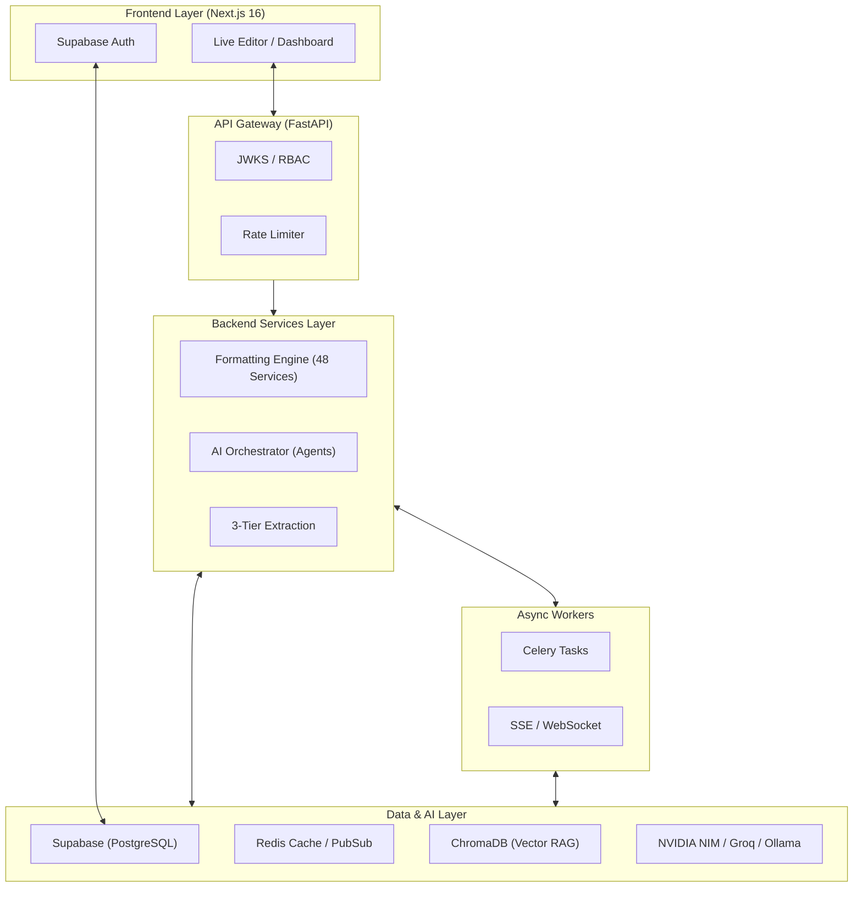

<!-- SPDX-License-Identifier: MIT -->
<!-- Copyright (c) 2026 ScholarForm AI -->

<div align="center">
  <br />
  <picture>
    <source media="(prefers-color-scheme: dark)" srcset="https://via.placeholder.com/200x200/1a202c/ffffff?text=ScholarForm+AI+Logo">
    
  </picture>
  <br />
  <h1>ScholarForm AI</h1>
  <h3>Automated Academic Manuscript Formatting & Generation — Powered by Agentic AI</h3>
  <p>Upload a raw manuscript and instantly receive a publisher-ready document. Or use the AI Generator to author complete, rigorously cited research papers from scratch.</p>
  
  <p>
    <a href="https://scholarform.ai/docs"><strong>Documentation</strong></a> ·
    <a href="https://scholarform.ai/demo"><strong>Live Demo</strong></a> ·
    <a href="https://scholarform.ai/api"><strong>API Reference</strong></a> ·
    <a href="https://github.com/rohitkumarnaidu/ScholarFormAI/issues"><strong>Report Bug</strong></a>
  </p>

[](LICENSE)
[](https://www.python.org/downloads/)
[](https://nextjs.org/)
[](https://fastapi.tiangolo.com/)
[](https://github.com/rohitkumarnaidu/ScholarFormAI/actions/workflows/backend-ci.yml)
[](backend/.coverage)
[](https://api.scorecard.dev/projects/github.com/rohitkumarnaidu/ScholarFormAI)
[](.github/workflows/slsa-provenance.yml)

<br/>

<br/>
</div>

---

## 🌟 Vision & Mission

**Vision:** To eliminate formatting friction and repetitive manual labor in academic publishing, allowing researchers to focus entirely on scientific discovery.

**Mission:** Provide a robust, enterprise-grade open-source platform that leverages multi-agent AI architectures to automate manuscript formatting, reference resolution, and document synthesis.

---

## ✨ Features

- **🪄 One-Click Formatter:** Upload DOCX, PDF, LaTeX, Markdown, or HTML. Receive publisher-ready outputs in IEEE, APA, Springer, Nature, Elsevier, ACM, MLA, Chicago, and more (17+ templates).
- **🤖 Autonomous AI Generator:** An agentic AI workflow that constructs complete research documents from a prompt, supporting iterative outline approval and real-time streaming.
- **📚 Multi-Doc RAG Synthesis:** Merge, synthesize, and cross-reference content from multiple source documents into a single, cohesive manuscript using advanced Retrieval-Augmented Generation.
- **⚡ Real-Time Split-Pane Editor:** Live, real-time before/after diff editor powered by WebSockets/SSE.
- **🧠 3-Tier PDF Extraction:** Bulletproof parsing via Vision API fallback → PyMuPDF+LLM enrichment → raw PyMuPDF.
- **🛡️ Enterprise Security:** Built to SLSA Level 3 standards. Comprehensive rate limiting, RBAC, CSRF protection, and supply chain security (SBOMs, CodeQL, Scorecards).

---

## 🏗 Architecture Overview

ScholarForm AI employs a decoupled, highly scalable architecture combining a Next.js App Router frontend with an asynchronous FastAPI backend, orchestrated via Celery and Redis.



---

## 🛠 Technology Stack

- **Frontend:** Next.js 16 (App Router), React 19, Tailwind CSS v3, TanStack Query v5, Zustand, Playwright
- **Backend:** Python 3.12, FastAPI, Celery, Uvicorn, Pydantic v2
- **Data & Cache:** Supabase (PostgreSQL), Redis 7.x, ChromaDB (Vector Store)
- **AI / LLMs:** NVIDIA NIM (Llama 3.3 70B), Groq (llama-3.3-70b-versatile), Ollama (DeepSeek R1 for offline fallback)
- **Document Processing:** PyMuPDF, GROBID, pandoc, pdf2docx
- **DevOps & CI/CD:** Docker, GitHub Actions, Render, Prometheus/Grafana

---

## 🚀 Quick Start

Get started in under 5 minutes using Docker.

### Prerequisites
- Docker & Docker Compose
- Node.js 20+ (for local frontend dev)
- Python 3.12+ (for local backend dev)

### 1. Clone & Configure

```bash
git clone https://github.com/rohitkumarnaidu/ScholarFormAI.git
cd ScholarFormAI

# Copy environment variables
cp backend/.env.example backend/.env
cp frontend/.env.local.example frontend/.env.local
```

*Edit `.env` files to include your API keys (NVIDIA, Groq, Supabase).*

### 2. Run with Docker Compose

```bash
docker compose -f deploy/services/docker-compose.yml up -d
```

### 3. Local Development (Alternative)

**Backend:**
```bash
cd backend
python -m venv .venv
source .venv/bin/activate  # Windows: .venv\Scripts\activate
pip install -r requirements.txt
uvicorn app.main:app --reload --port 8000
```

**Frontend:**
```bash
cd frontend
npm install
npm run dev
```

Visit `http://localhost:3000` to view the application, and `http://localhost:8000/docs` for the OpenAPI interactive documentation.

---

## 💻 CLI Tools

ScholarForm AI provides a powerful command-line interface (`amf`) for integration into CI/CD pipelines and local workflows.

```bash
# Format a document locally
amf format input.docx --template IEEE --output output.pdf

# Run an AI diagnostic check
amf analyze paper.pdf

# Update the CLI tool
amf update
```

Read the full [CLI Reference](docs/reference/CLI_REFERENCE.md).

---

## 🤖 AI & Multi-Agent Features

We leverage advanced multi-agent workflows defined in [`AGENTS.md`](docs/reference/AGENTS.md):
- **Forensic Auditor Agent:** Independently verifies citations, checks equations, and identifies hallucinated references.
- **Synthesis Agent:** Merges structured data from ChromaDB into fluid, academically rigorous paragraphs.
- **Layout Agent:** Maps abstract document structures into specific template directives (e.g., IEEE two-column margins).

---

## 🗂 Folder Structure

```text
ScholarFormAI/
├── backend/                # FastAPI backend, ML pipelines, and API services
│   ├── app/
│   │   ├── api/            # API v1 routes & middleware
│   │   ├── core/           # Config, logging, exceptions
│   │   ├── models/         # SQLAlchemy/Supabase ORM models
│   │   ├── schemas/        # Pydantic validation (api_envelope)
│   │   ├── services/       # Core business logic (Formatter, AI)
│   └── tests/              # Pytest suite
├── frontend/               # Next.js App Router UI
│   ├── app/                # Pages and API routes
│   ├── src/                # Components, hooks, lib, styles
│   └── e2e/                # Playwright tests
├── cli/                    # AMF command line tool
├── sdk/                    # Python SDK (Sync/Async)
├── docs/                   # Architecture, API, and setup documentation
└── deploy/                 # Docker Compose, Kubernetes manifests
```

---

## 🔐 Security & Compliance

Enterprise readiness is built-in.
- **SLSA Level 3:** Build provenance and signed artifacts.
- **CodeQL & Scorecards:** Automated vulnerability scanning on every PR.
- **Dependency Management:** Renovate + SBOM generation.
- **Zero Trust Architecture:** Strict RBAC, JWKS verification, and rate-limiting.

Review our complete [Security Policy](SECURITY.md) and [Compliance Matrix](docs/reports/ENTERPRISE_CERTIFICATION.md).

---

## 📖 Documentation & Resources

- [Architecture & System Design](docs/architecture/ARCHITECTURE.md)
- [API Reference](docs/api/API_REFERENCE.md)
- [Python SDK Guide](docs/guides/SDK_GUIDE.md)
- [Enterprise Readiness & Deployment](docs/deployment/DEPLOYMENT.md)
- [Database Schema](docs/architecture/DATABASE_SCHEMA.md)

---

## 🛣 Roadmap

- [ ] **v1.1:** LaTeX compiler integration and offline export.
- [ ] **v1.2:** Collaborative editing (Google Docs style CRDTs).
- [ ] **v1.5:** Custom template builder UI.
- [ ] **v2.0:** Agentic peer-review simulation and feedback generation.

See the full [Roadmap](docs/Roadmap.md).

---

## 🤝 Contributing

We welcome contributions! Please review our [Contributing Guidelines](CONTRIBUTING.md) and [Governance Model](GOVERNANCE.md) before submitting pull requests.

1. Fork the repo.
2. Create a feature branch (`git checkout -b feat/amazing-feature`).
3. Commit with Conventional Commits and sign off (`git commit -s -m "feat: amazing feature"`).
4. Push to the branch and open a PR.

*Note: All PRs must pass the CI pipeline and maintain 85%+ test coverage.*

---

## ⚖️ License

ScholarForm AI is distributed under the **MIT License**. See [`LICENSE`](LICENSE) for more information.

---

<div align="center">
  Made with ❤️ by the ScholarForm AI Team and Open Source Contributors.
</div>
