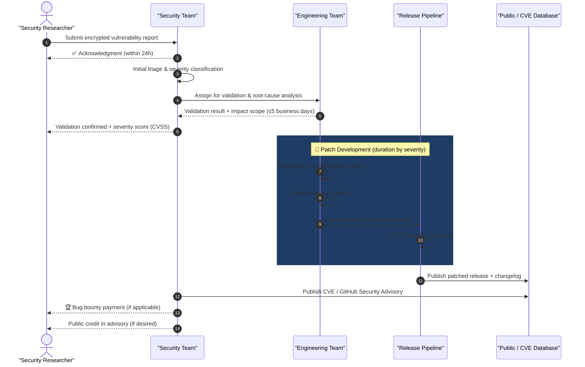
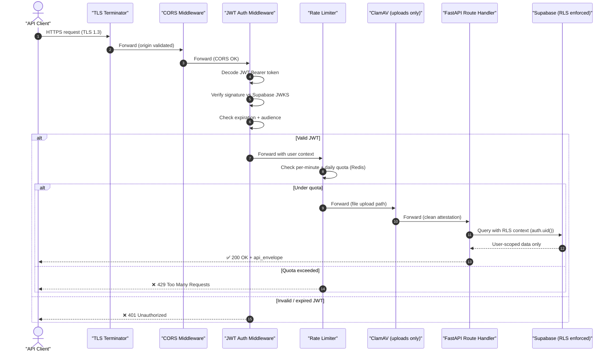
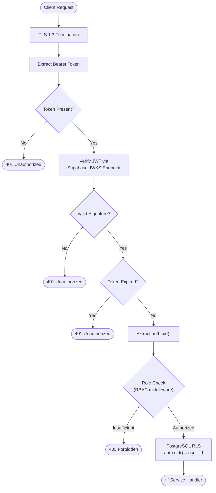
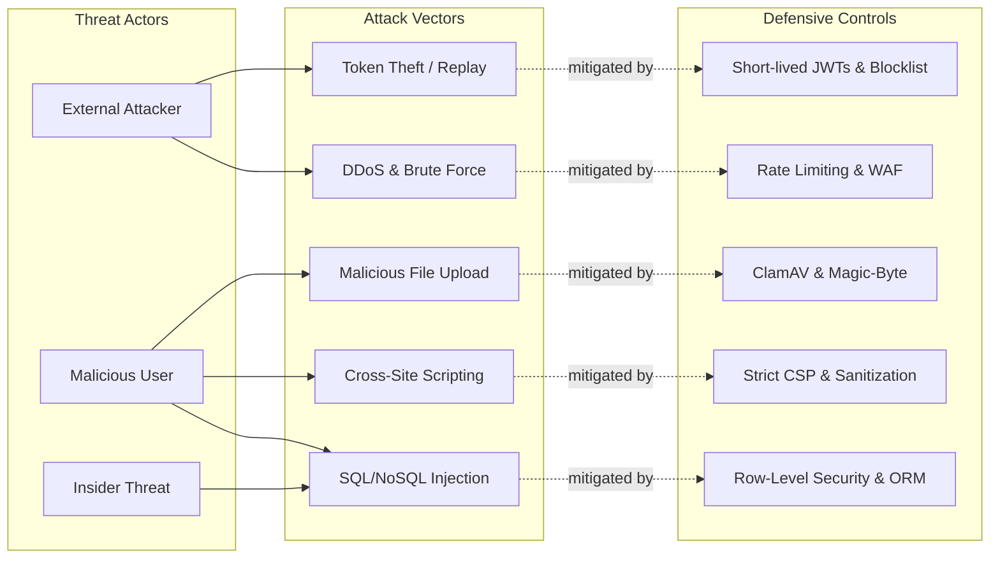
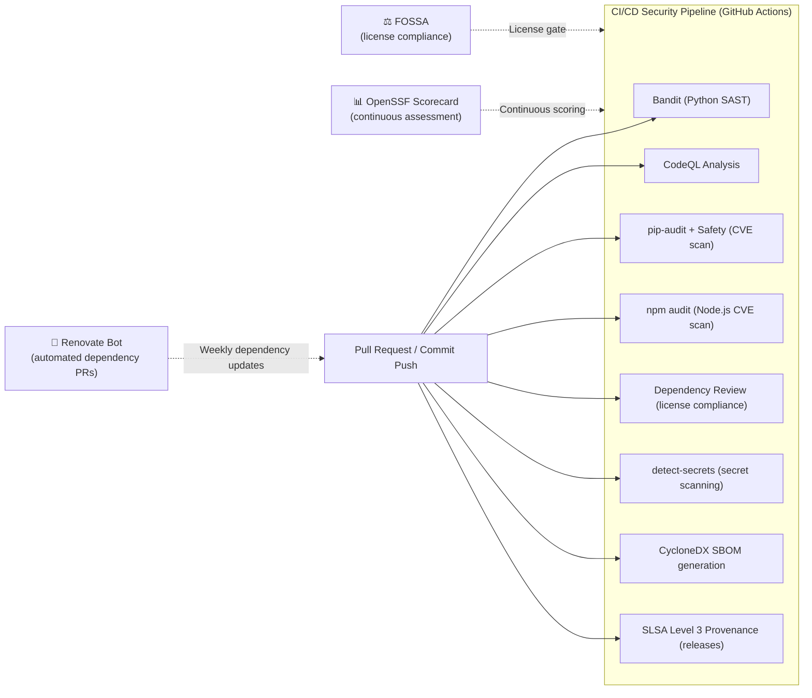

&lt;!-- SPDX-License-Identifier: MIT --&gt;
&lt;!-- Copyright (c) 2026 ScholarForm AI --&gt;

# Security Policy

## Table of Contents

- [Supported Versions](#supported-versions)
- [Reporting a Vulnerability](#reporting-a-vulnerability)
- [Coordinated Disclosure Process](#coordinated-disclosure-process)
- [Bug Bounty Program](#bug-bounty-program)
- [Application Security Architecture](#application-security-architecture)
- [API Security Flow](#api-security-flow)
- [Authentication & Authorization Flow](#authentication--authorization-flow)
- [Security Threat Model](#security-threat-model)
- [Supply Chain Security](#supply-chain-security)
- [Security Best Practices](#security-best-practices)
- [Past Security Advisories](#past-security-advisories)
- [Contact](#contact)

---

## Supported Versions

The following versions of ScholarForm AI currently receive active security support:

| Version | Supported          | End of Support       |
|---------|--------------------|----------------------|
| 1.x     | ✅ Active support  | TBD                  |
| 0.x     | ❌ End of life     | 2025-01-01           |

> [!WARNING]
> Version 0.x is no longer receiving security patches. Upgrade to 1.x immediately.

---

## Reporting a Vulnerability

> [!CAUTION]
> **Do NOT open a public GitHub issue** for security vulnerabilities. Public disclosure before a patch is available puts all users at risk.

We take the security of ScholarForm AI seriously. Use the private reporting channels below.

### Private Reporting Channels

1. **Email**: Send a detailed report to **security@scholarform.ai**
2. **PGP Encryption**: Encrypt sensitive reports using our PGP key:

```text
-----BEGIN PGP PUBLIC KEY BLOCK-----

mQINBGPw....[full PGP key block here].....
-----END PGP PUBLIC KEY BLOCK-----
```

3. **Web Form**: Submit via our private vulnerability reporting form at **https://scholarform.ai/security/report**

### What to Include in Your Report

- **Type of issue** (e.g., XSS, SQL injection, remote code execution, privilege escalation)
- **Full paths** of source files related to the issue
- **Step-by-step reproduction** instructions
- **Proof-of-concept** or exploit code (if available and safe to share)
- **Impact assessment** — what an attacker could achieve
- **Affected versions** and environments

### Response SLA

| Step                         | Expected Timeframe     |
|------------------------------|------------------------|
| Acknowledgment               | Within 24 hours        |
| Initial triage               | Within 48 hours        |
| Validation & risk assessment | Within 5 business days |
| Fix development              | Based on severity      |
| Coordinated disclosure       | Within 90 days of fix  |

---

## Coordinated Disclosure Process

The diagram below maps the full vulnerability lifecycle from initial report through coordinated public disclosure.



> [!TIP]
> We aim to release patches for **Critical** vulnerabilities within **7 days** and **High** severity within **30 days** of validation.

---

## Bug Bounty Program

AMF participates in a private bug bounty program. Rewards are offered for qualifying vulnerabilities based on CVSS severity score:

| Severity | CVSS Score | Reward Range      |
|----------|------------|-------------------|
| Critical | 9.0–10.0   | $5,000 – $15,000 |
| High     | 7.0–8.9    | $1,000 – $5,000  |
| Medium   | 4.0–6.9    | $250 – $1,000    |
| Low      | 0.1–3.9    | $50 – $250       |

**To qualify:**

- Vulnerability must be in the latest supported release
- The report must include a clear reproduction
- Previously reported or known issues are excluded
- Automated tool outputs without manual validation are not accepted

Full bounty policy: **https://scholarform.ai/security/bounty**

---

## Application Security Architecture

ScholarForm AI applies a **five-layer defense-in-depth** security model. Every incoming request must traverse all layers sequentially.

```mermaid
flowchart TD
    Internet(["🌐 Internet / External Client"])

    subgraph Layer1 ["Layer 1 — Network Perimeter"]
        TLS["TLS 1.3 Termination"]
        HSTS["HTTP Strict Transport Security (HSTS)"]
        CSP["Content Security Policy (CSP)"]
        CORS["Strict CORS Origin Validation"]
    end

    subgraph Layer2 ["Layer 2 — Upload & Gateway Security"]
        ClamAV["ClamAV Antivirus Scanner"]
        MagicByte["Magic-Byte Inspection (file type validation)"]
        RateLimit["Rate Limiter (per-minute & daily quotas)"]
        CSRF["CSRF Token Validation"]
    end

    subgraph Layer3 ["Layer 3 — Authentication"]
        JWKS["Supabase JWKS JWT Verification"]
        APIKey["Fernet AES-256 Encrypted API Keys"]
        TokenBL["Redis JWT Token Blocklist"]
    end

    subgraph Layer4 ["Layer 4 — Authorization (RBAC)"]
        FreeT["Free Tier: 5 docs/month, basic templates"]
        ProT["Pro Tier: Unlimited, all templates + AI"]
        AdminT["Admin Tier: Platform management"]
    end

    subgraph Layer5 ["Layer 5 — Data Isolation (RLS)"]
        RLS["PostgreSQL Row Level Security\n(auth.uid() = user_id)"]
        Audit["Audit Log (all sensitive ops)"]
        Encrypt["LLM Key Encryption at Rest"]
    end

    Service(["✅ Authorized Business Logic"])

    Internet --> Layer1
    Layer1 --> Layer2
    Layer2 --> Layer3
    Layer3 --> Layer4
    Layer4 --> Layer5
    Layer5 --> Service
```



---

## API Security Flow

This diagram shows how a standard authenticated API request is validated through the middleware stack before reaching business logic.



---

## Authentication & Authorization Flow

This diagram illustrates the step-by-step token extraction, verification, and Role-Based Access Control (RBAC) validation process.



---

## Security Threat Model

This threat model outlines potential attack vectors and the corresponding mitigations implemented in ScholarForm AI.



> [!NOTE]
> Threat models are reviewed quarterly or whenever significant architectural changes are introduced.

---

## Supply Chain Security

ScholarForm AI applies automated supply chain security checks on every commit and pull request:



| Tool                | Trigger            | Purpose                                 |
|---------------------|--------------------|-----------------------------------------|
| Bandit              | Every PR           | Python SAST — detect insecure patterns  |
| CodeQL              | Every PR           | Semantic code vulnerability analysis    |
| pip-audit + Safety  | Every PR           | Python dependency CVE scanning          |
| npm audit           | Every PR           | Node.js dependency CVE scanning         |
| Dependency Review   | Every PR           | License compliance enforcement          |
| detect-secrets      | Every PR / commit  | Secret / credential leak detection      |
| CycloneDX SBOM      | Every release      | Software Bill of Materials              |
| SLSA 3 Provenance   | Every release      | Build artifact tamper protection        |
| Renovate            | Weekly             | Automated dependency update PRs         |
| OpenSSF Scorecard   | Continuous         | Supply chain posture scoring            |
| FOSSA               | Continuous         | License risk management                 |

---

## Security Best Practices

### For Users

- **Keep ScholarForm AI updated** — always run the latest supported version
- **Use HTTPS** in all production deployments
- **Set `AMF_ENVIRONMENT=production`** in production environments
- **Restrict API access** — use firewalls, VPNs, or scoped API keys
- **Rotate API keys** regularly (every 90 days recommended)
- **Audit access logs** — monitor `AMF_LOG_LEVEL=info` output for anomalies
- **Use a reverse proxy** (nginx, Caddy, Traefik) in front of the API

### For Developers

> [!IMPORTANT]
> All of the following are enforced via pre-commit hooks and CI checks. Violations will block merges.

- **Never commit secrets** or API keys to the repository
- **Use environment variables** for all sensitive configuration
- **Validate all user inputs** server-side — never trust client data
- **Run security checks** locally: `make lint`, `make test`, `make security-scan`
- **Use pre-commit hooks**: `pre-commit install` (configured in `.pre-commit-config.yaml`)
- **Enable 2FA** on your GitHub account
- **Sign commits** with GPG or SSH keys (`git commit -S`)
- **Use branch protection** on `main` requiring review and CI passing
- **Audit dependencies** with `pip-audit` and `npm audit` before PRs

### API Security Configuration

| Feature                | Configuration                                        |
|------------------------|------------------------------------------------------|
| Rate Limiting          | `AMF_RATE_LIMIT_PER_MINUTE` + `AMF_RATE_LIMIT_DAILY` |
| File Upload Size       | Max 50MB; enforced in `document_pipeline_service.py` |
| Allowed CORS Origins   | `AMF_ALLOWED_ORIGINS` (restrict in production)       |
| Request ID Tracking    | Auto-injected `X-Request-ID` on all responses        |
| TLS Minimum Version    | TLS 1.2+ required in production                      |
| Content-Type Sniffing  | `X-Content-Type-Options: nosniff` enforced           |

---

## Past Security Advisories

| ID               | Date       | Severity | Description                           | Affected Versions | Status        |
|------------------|------------|----------|---------------------------------------|-------------------|---------------|
| AMF-SEC-2025-001 | 2025-03-15 | High     | XXE vulnerability in document parser  | < 1.0.2           | Patched 1.0.2 |
| AMF-SEC-2025-002 | 2025-06-01 | Medium   | Path traversal in file output handler | < 1.0.4           | Patched 1.0.4 |

Full advisory list: **https://scholarform.ai/security/advisories**

---

## Contact

| Channel          | Address / URL                                    |
|------------------|--------------------------------------------------|
| Security Team    | security@scholarform.ai (PGP encrypted preferred) |
| Bug Bounty       | https://scholarform.ai/security/bounty           |
| Advisories       | https://scholarform.ai/security/advisories       |
| Security Policy  | https://scholarform.ai/security/policy           |

We appreciate your help in keeping ScholarForm AI and its users safe.

---

*Last updated: July 2026*
