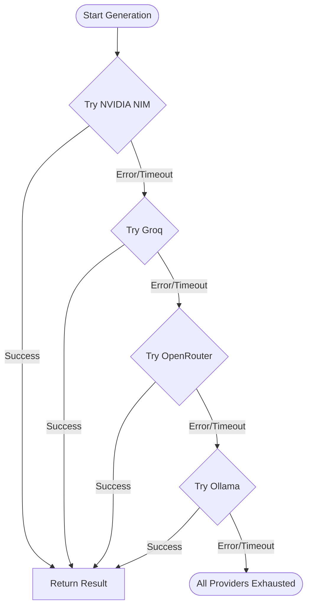

# ADR-003: Multi-Tier LLM Fallback Architecture

- **Status:** Accepted
- **Date:** 2026-02-10
- **Author:** ScholarForm AI Engineering Team

## Context

ScholarForm AI relies on LLMs for formatting decisions, reference parsing, content classification, and quality scoring. The system needs LLM access that is:

- **Available:** No single point of failure — if one provider goes down, another takes over
- **Cost-effective:** Use free/cheap tiers for simple tasks, premium for complex ones
- **Fast:** Formatting jobs should complete in seconds, not minutes
- **Private:** Manuscript content must not be sent to providers without data protection agreements

The team evaluated using a single provider, a dual-provider failover, a multi-tier chain, and a local-only approach.

## Decision

We implemented a **four-tier fallback chain** that resolves providers in order of speed/cost preference:

1. **NVIDIA NIM** (primary) — Fast, free tier, strong academic formatting capability
2. **Groq** (first fallback) — Low latency, generous free tier, good for structured output
3. **OpenRouter** (second fallback) — Aggregates multiple models, pay-as-you-go
4. **Ollama** (local, final fallback) — Zero cost, zero latency, no data leaving the machine

The system attempts each tier in sequence. If a provider returns an error, times out, or exceeds rate limits, the next tier is tried automatically. The entire chain is wrapped in a circuit breaker that prevents repeated calls to a failing provider.

**Single-provider** approaches were rejected because every major LLM provider has experienced outages that would block document processing. **Dual failover** was rejected because it still leaves a single point of failure when both share the same upstream dependency (e.g., both rely on OpenAI-compatible APIs).

## Consequences

**Positive:**

- 99.9%+ effective LLM availability — four independent providers with different infrastructures make simultaneous failure extremely unlikely
- Cost optimization — NVIDIA NIM and Groq handle ~80% of requests on free tiers; Ollama handles simple formatting rules locally at zero cost
- Data locality — sensitive manuscripts processed via Ollama never leave the machine; only anonymized formatting requests go to external providers
- Graceful degradation — users see slower responses during fallback but never a hard failure
- Circuit breaker pattern prevents cascading failures and provider hammering

**Negative:**

- Response time variance — fallback tiers (especially Ollama on CPU) are significantly slower than the primary tier
- Inconsistent output — different models produce different formatting decisions, requiring a normalization layer
- Increased complexity — the provider registry, key resolution, and circuit breaker add ~1500 lines of code
- Testing burden — each provider has unique error modes, rate limits, and output formats that must be covered in tests
- Tier maintenance — provider APIs change, deprecate models, or alter pricing, requiring ongoing updates to provider adapters

## Compliance

This decision has been implemented and is verified by:

- `backend/tests/test_llm_service.py` — `generate_with_fallback()` 4-tier chain
- `backend/tests/test_llm_latency_sla.py` — P95 response time SLA across all tiers
- `backend/tests/test_circuit_breaker.py` — circuit breaker state machine (closed/open/half-open)
- `backend/tests/test_vllm_adoption.py` — provider registry and model selection
- `backend/tests/test_agent.py` — agent pipeline using fallback chain
- `backend/app/services/llm_service.py` — `generate_with_fallback()` implementation
- `backend/app/services/provider_registry.py` — 10 built-in providers

## Cross-References

- [ADR 008: LiteLLM for LLM Routing](008-litellm-llm-routing.md) — tooling layer
- [LLM Fallback Strategy](../explanation/llm-fallback-strategy.md) — detailed design and flow diagrams
- [AI Architecture](../architecture/AI_ARCHITECTURE.md) — AI subsystem overview
- [LLM Provider Guide](../user-guide/LLM_PROVIDER_GUIDE.md) — provider configuration
