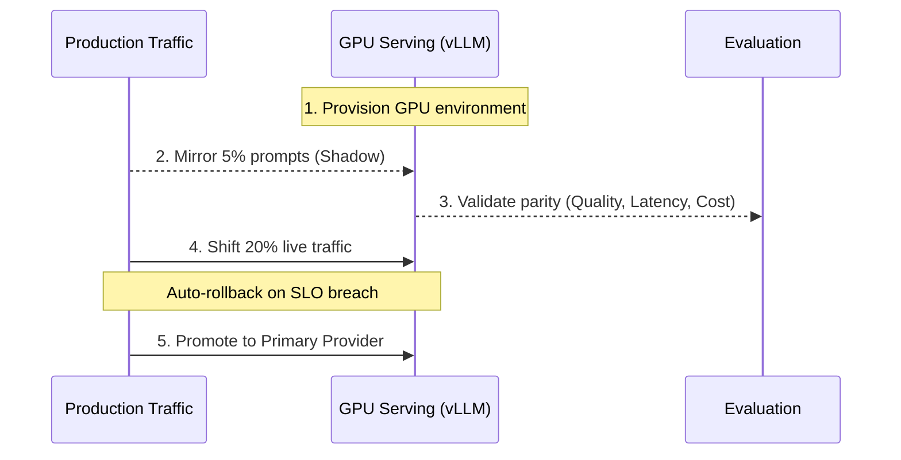

<!-- SPDX-License-Identifier: MIT -->
<!-- Copyright (c) 2026 ScholarForm AI -->

# vLLM Phase 4 Adoption Plan

## Target

- Runtime: `vLLM`
- Model: `meta-llama/Meta-Llama-3.1-8B-Instruct`
- Hardware profile: `L4 24GB` (or equivalent GPU)

## Traffic Gate

- Enable Phase 4 rollout only when one of these is true:
- `LLM requests/hour >= VLLM_REQUESTS_PER_HOUR_THRESHOLD`
- `LLM tokens/day >= VLLM_DAILY_TOKENS_THRESHOLD`

## Rollout Sequence

1. Provision GPU serving environment with autoscaling and health probes.
2. Mirror 5% of production prompts to vLLM (shadow mode).
3. Validate parity: response quality, latency p95, and cost per 1K tokens.
4. Shift 20% live traffic with auto rollback on SLO breach.
5. Promote vLLM to primary provider, keep existing fallback chain active.

## Operational Checks

- Keep OpenRouter and Ollama fallbacks enabled.
- Monitor:
- `llm_request_duration_seconds`
- `llm_requests_total`
- `llm_failures_total`
- `persona_events_total`
