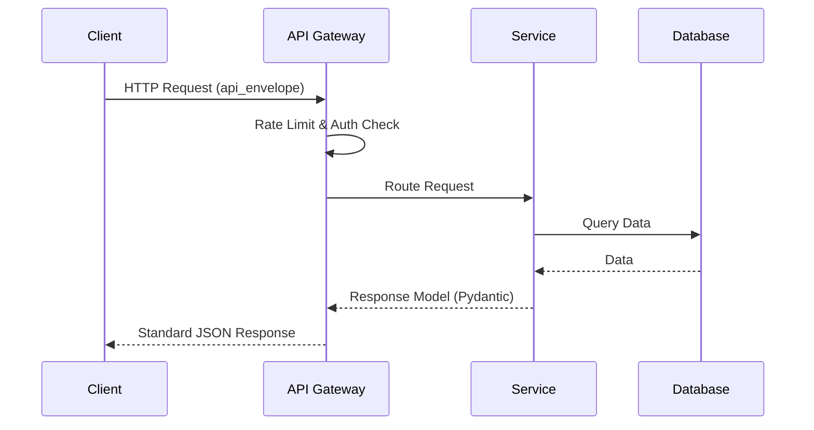

<!-- SPDX-License-Identifier: MIT -->
<!-- Copyright (c) 2026 ScholarForm AI -->

---

title: ScholarForm AI — API Reference
description: Complete v1 API reference with curl examples for all 19 endpoints
sidebar_position: 5
version: "1.0"
status: ✅ Complete
owner: Engineering Team
review_cadence: monthly
last_updated: July 2026
---

# ScholarForm AI — API Reference  

> **Base URL:** `http://localhost:8000` (dev) | `https://api.scholarform.ai` (prod)  
> **Auth:** `Authorization: Bearer <supabase_access_token>` on authenticated routes  
> **Versioning:** `/api/v1/` prefix. Legacy routes (without `/v1/`) carry `Deprecation` response headers.

> **See also:** [API Versioning](archive/API_VERSIONING.md), [Architecture](architecture.md), [ADR 003](adr/003-api-versioning-strategy.md)

---

## Response Envelope (All v1 Endpoints)

All v1 responses follow the standard envelope:

```json
{
  "success": true,
  "data": { ... },
  "request_id": "abc-123"
}
```

Error responses:

```json
{
  "success": false,
  "error": { "code": "VALIDATION_ERROR", "message": "..." },
  "request_id": "abc-123"
}
```

---

## Table of Contents

- [Formatter Endpoints](#formatter-endpoints)
- [Template Endpoints](#template-endpoints)
- [Generator Endpoints](#generator-endpoints)
- [Synthesis Endpoints](#synthesis-endpoints)
- [Live Preview (WebSocket)](#live-preview-websocket)
- [Auth Endpoints](#auth-endpoints)
- [Billing Endpoints](#billing-endpoints)
- [Health & Metrics](#health--metrics)
- [Deprecated Endpoints](#deprecated-endpoints)

---

## Formatter Endpoints

### POST /api/v1/documents/upload

Upload and process a document.

```
Content-Type: multipart/form-data
Body: file (binary), template (string), options (JSON)
Response: { success: true, data: { job_id, status: "processing" } }
```

```bash
curl -X POST http://localhost:8000/api/v1/documents/upload \
  -H "Authorization: Bearer $TOKEN" \
  -F "file=@manuscript.docx" \
  -F "template=ieee" \
  -F 'options={"page_numbers":true,"cover_page":false}'
```

- Virus scanning runs before processing (ClamAV)
- Returns `job_id` in <400ms; processing continues in background

### GET /api/v1/documents/{job_id}/status

Poll processing status.

```bash
curl http://localhost:8000/api/v1/documents/abc-123/status \
  -H "Authorization: Bearer $TOKEN"
```

```json
{ "success": true, "data": { "status": "completed", "progress": 100, "current_stage": "export", "stages": ["upload", "validate", "format", "export"] } }
```

### GET /api/v1/documents/{job_id}/preview

Get rendered HTML preview.

```bash
curl http://localhost:8000/api/v1/documents/abc-123/preview \
  -H "Authorization: Bearer $TOKEN"
```

```json
{ "success": true, "data": { "html": "<div>...</div>", "css": ".article {...}" } }
```

### GET /api/v1/documents/{job_id}/compare

Before/after diff view.

```bash
curl http://localhost:8000/api/v1/documents/abc-123/compare \
  -H "Authorization: Bearer $TOKEN"
```

### GET /api/v1/documents/{job_id}/download

Download processed document.

```bash
curl -o formatted.docx http://localhost:8000/api/v1/documents/abc-123/download?format=docx \
  -H "Authorization: Bearer $TOKEN"
```

Query: `format=docx|pdf|latex`

### POST /api/v1/documents/{job_id}/edit

Save TipTap editor content back to job.

```bash
curl -X POST http://localhost:8000/api/v1/documents/abc-123/edit \
  -H "Authorization: Bearer $TOKEN" \
  -H "Content-Type: application/json" \
  -d '{"content": "<p>Revised text</p>"}'
```

### GET /api/v1/documents

List user's documents (paginated).

```bash
curl "http://localhost:8000/api/v1/documents?page=1&limit=10" \
  -H "Authorization: Bearer $TOKEN"
```

### DELETE /api/v1/documents/{id}

Delete a document and its associated storage files.

```bash
curl -X DELETE http://localhost:8000/api/v1/documents/abc-123 \
  -H "Authorization: Bearer $TOKEN"
```

---

## Template Endpoints

### GET /api/v1/templates

List all 17 templates with metadata and preview CSS.

```bash
curl http://localhost:8000/api/v1/templates
```

```json
{ "success": true, "data": [{ "name": "ieee", "displayName": "IEEE", "description": "IEEE conference format", "preview_css": "..." }] }
```

### GET /api/v1/templates/{name}

Get a specific template's rules and preview CSS.

```bash
curl http://localhost:8000/api/v1/templates/ieee
```

---

## Generator Endpoints

### POST /api/v1/generator/sessions

Create a generator session.

```bash
curl -X POST http://localhost:8000/api/v1/generator/sessions \
  -H "Authorization: Bearer $TOKEN" \
  -H "Content-Type: application/json" \
  -d '{"session_type": "agent", "template": "ieee", "prompt": "Write a paper about ML"}'
```

```json
{ "success": true, "data": { "session_id": "xyz-456", "status": "started" } }
```

### GET /api/v1/generator/sessions/{id}

Get session state and progress.

```bash
curl http://localhost:8000/api/v1/generator/sessions/xyz-456 \
  -H "Authorization: Bearer $TOKEN"
```

### GET /api/v1/generator/sessions/{id}/events

SSE stream for real-time progress events.

```bash
curl -N http://localhost:8000/api/v1/generator/sessions/xyz-456/events \
  -H "Authorization: Bearer $TOKEN"
```

### POST /api/v1/generator/sessions/{id}/messages

Send a message for agent chat or RAG Q&A.

```bash
curl -X POST http://localhost:8000/api/v1/generator/sessions/xyz-456/messages \
  -H "Authorization: Bearer $TOKEN" \
  -H "Content-Type: application/json" \
  -d '{"content": "Expand the methodology section"}'
```

### POST /api/v1/generator/sessions/{id}/outline/approve

Approve generated outline to proceed to section generation.

```bash
curl -X POST http://localhost:8000/api/v1/generator/sessions/xyz-456/outline/approve \
  -H "Authorization: Bearer $TOKEN"
```

Response is an SSE stream that begins writing sections.

---

## Synthesis Endpoints

### POST /api/v1/synthesis/sessions

Create a multi-doc synthesis session (2-6 PDFs).

```bash
curl -X POST http://localhost:8000/api/v1/synthesis/sessions \
  -H "Authorization: Bearer $TOKEN" \
  -F "files=@paper1.pdf" \
  -F "files=@paper2.pdf"
```

### GET /api/v1/synthesis/sessions/{id}/events

SSE stream for synthesis pipeline stages.

```bash
curl -N http://localhost:8000/api/v1/synthesis/sessions/xyz-456/events \
  -H "Authorization: Bearer $TOKEN"
```

---

## Live Preview (WebSocket)

### WS /api/v1/preview/ws/{session_id}

Real-time preview WebSocket connection.

```javascript
// Node.js example
const WebSocket = require('ws');
const ws = new WebSocket('ws://localhost:8000/api/v1/preview/ws/xyz-456');
ws.on('open', () => ws.send(JSON.stringify({ content: "<p>Hello</p>", template: "ieee" })));
ws.on('message', (data) => console.log(JSON.parse(data).html));
```

Target RTT: <80ms.

---

## Auth Endpoints

### POST /api/v1/auth/signup

```bash
curl -X POST http://localhost:8000/api/v1/auth/signup \
  -H "Content-Type: application/json" \
  -d '{"email": "user@example.com", "password": "securepass123"}'
```

### POST /api/v1/auth/login

```bash
curl -X POST http://localhost:8000/api/v1/auth/login \
  -H "Content-Type: application/json" \
  -d '{"email": "user@example.com", "password": "securepass123"}'
```

```json
{ "success": true, "data": { "access_token": "eyJ...", "user": { "id": "...", "email": "..." } } }
```

---

## Billing Endpoints

### POST /api/v1/billing/webhook

Stripe webhook handler. Requires `STRIPE_WEBHOOK_SECRET` in env.

```bash
stripe listen --forward-to localhost:8000/api/v1/billing/webhook
```

### GET /api/v1/billing/portal

Stripe billing portal redirect URL.

```bash
curl http://localhost:8000/api/v1/billing/portal \
  -H "Authorization: Bearer $TOKEN"
```

```json
{ "success": true, "data": { "url": "https://billing.stripe.com/session/..." } }
```

---

## Health & Metrics

### GET /api/v1/health

```bash
curl http://localhost:8000/api/v1/health
```

```json
{
  "status": "ok",
  "services": { "redis": "ok", "db": "ok", "chromadb": "ok" }
}
```

## Performance Benchmarks

| Endpoint | P50 | P95 | P99 | Notes |
| ---------- | ----- | ----- | ----- | ------- |
| `/api/v1/health/live` | 5ms | 12ms | 25ms | No auth, no DB |
| `/api/v1/templates` | 15ms | 40ms | 80ms | Cached |
| `/api/v1/documents/upload` | 350ms | 800ms | 2s | Includes virus scan |
| `/api/v1/documents/{id}/status` | 8ms | 20ms | 50ms | DB lookup only |
| `/api/v1/documents/{id}/download` | 50ms | 150ms | 400ms | File read + stream |
| `/api/v1/synthesis/sessions` | 500ms | 3s | 8s | 2-6 PDF embed + LLM |
| `/api/v1/generator/sessions` | 200ms | 1s | 3s | LLM task parsing |
| `POST /api/v1/preview/ws` | 40ms | 70ms | 120ms | HTML render, no DOCX |
| `POST /auth/login` | 350ms | 600ms | 1s | Supabase OTP/OAuth |

**Targets:** Health endpoints < 50ms P95. Document operations > 400ms delegated to Celery.

### GET /metrics

Prometheus metrics endpoint (not authenticated).

```bash
curl http://localhost:8000/metrics
```

---

## Deprecated Endpoints

Legacy routes (without `/v1/` prefix) are still active but return a `Deprecation` response header. See `backend/app/routers/deprecation.py`. Clients should migrate to `/api/v1/` paths.

## Related Documentation

- [AI Architecture](AI_ARCHITECTURE.md)
- [Frontend Architecture](FRONTEND_ARCHITECTURE.md)
- [Realtime Architecture](REALTIME_ARCHITECTURE.md)
- [Chroma RAG Architecture](CHROMA_RAG_ARCHITECTURE.md)
- [Database Architecture](DATABASE_ARCHITECTURE.md)
- [API Reference](API.md)

## Detailed Architecture & Workflows

### Architecture Overview

The API follows a unified layered design with all endpoints under `/api/v1`:

- Single `v1_router` manages all endpoint routing with proper prefixing
- Services orchestrate business logic and integrate with external systems
- Pipelines handle document processing, generation, and synthesis
- Real-time subsystem emits enhanced events via Redis Pub/Sub to SSE clients

### API Flow Diagram



### Authentication and Authorization

- Base path: `/api/v1/auth`
- Requires Supabase authentication; endpoints return user info or manage auth lifecycle
- Protected endpoints require a valid session with enhanced error handling

### Rate Limiting and Abuse Detection

- Global rate limiter: 60 requests per minute with enhanced enforcement
- Tier-based rate limiting: guest daily limit configurable with improved tier management
- Abuse detection records generation requests and LLM calls with enhanced monitoring

### Real-Time Communication (SSE)

- Base path: `/api/v1/stream`
- Clients establish an SSE connection to receive progress updates and notifications
- Events are published to Redis channels and forwarded to connected clients with improved reliability
