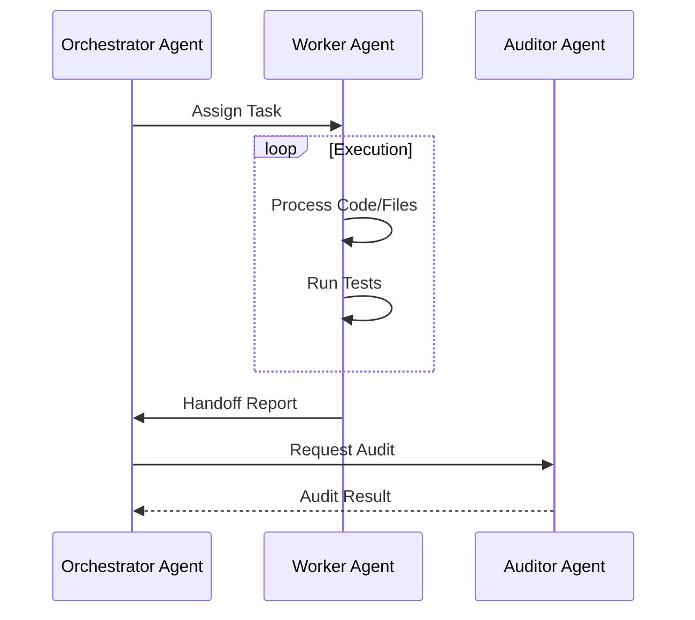
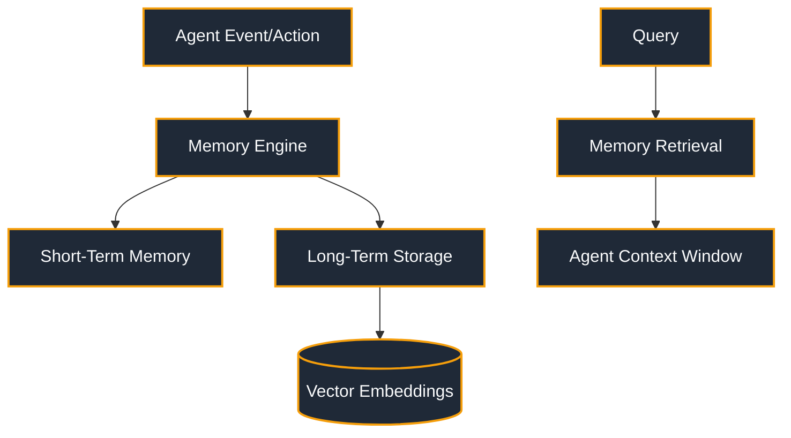

<!-- SPDX-License-Identifier: MIT -->
<!-- Copyright (c) 2026 ScholarForm AI -->


---
title: ScholarForm AI — Agent Documentation
description: AI agent pipeline with 11-step generation workflow
sidebar_position: 21
version: "1.0"
status: ✅ Complete
owner: Docs Team
review_cadence: quarterly
last_updated: July 2026
---

# ScholarForm AI — Agent Documentation

## Agent Pipeline Overview
Generator Mode B uses an 11-step AI agent pipeline implemented in `pipeline/generation/agent.py` (34KB).

## The 11 Steps

| Step | Name | Description |
|------|------|-------------|
| 1 | **Task Parsing** | LLM extracts requirements from user prompt (doc type, topic, length, template) |
| 2 | **Web Research** | Optional: search academic sources for context |
| 3 | **Outline Generation** | LLM generates structured outline in JSON mode |
| 4 | **Outline Approval** | User reviews, edits, and approves outline |
| 5 | **Section Writing** | LLM writes each section with streaming tokens |
| 6 | **Citation Insertion** | CrossRef lookup, CSL formatting, inline citations |
| 7 | **Quality Check** | Coherence, tone, and novelty scoring |
| 8 | **User Review** | User reviews generated content |
| 9 | **Rewrite/Refine** | User can request section rewrites |
| 10 | **Final Assembly** | Combine all sections + citations + formatting |
| 11 | **Export** | Render to template DOCX |

## Agent State Machine
```
IDLE → TASK_PARSING → RESEARCHING → OUTLINING
  → PENDING_APPROVAL → WRITING → CITING
  → SCORING → REVIEWING → REFINING → EXPORTING → DONE
```

## Key Components

### Backend
- `pipeline/generation/agent.py` — Main agent orchestrator
- `pipeline/generation/task_parser.py` — NLP extraction
- `pipeline/generation/section_prompts.py` — Per-section prompts
- `pipeline/generation/quality_scorer.py` — Quality assessment
- `services/citation_assembly_service.py` — CrossRef + CSL
- `routers/v1/generator.py` — API endpoints

### Frontend
- `AgentChatPane.jsx` — Chat interface (11KB)
- `OutlineApproval.jsx` — Outline review/edit (10.7KB)
- `TokenStream.jsx` — Token streaming display (11.3KB)
- `DocumentBuildPane.jsx` — Live doc building (6.6KB)
- `SessionHistory.jsx` — Past sessions (8KB)

## SSE Events
```json
{"stage": "task_parsing", "progress": 10, "message": "Understanding your request..."}
{"stage": "outlining", "progress": 25, "message": "Creating document outline..."}
{"stage": "writing", "progress": 50, "section": "Introduction", "tokens": ["The", " field", " of..."]}
{"stage": "citing", "progress": 80, "message": "Adding citations..."}
{"stage": "done", "progress": 100, "docx_path": "/storage/..."}
```

## Agent Configuration
```json
{
  "session_type": "agent",
  "template": "ieee",
  "config": {
    "max_sections": 8,
    "max_tokens_per_section": 2000,
    "enable_citations": true,
    "enable_web_research": false,
    "quality_threshold": 70
  }
}
```
\n
## Agent Workflow Diagram


\n
## Memory Flow Diagram


