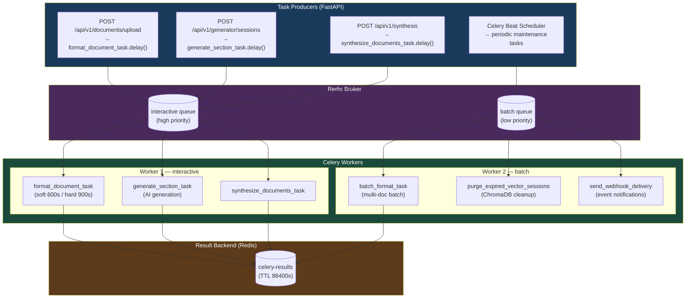

# Celery Tasks Reference — ScholarForm AI

**Last updated:** 2026-07-17

## Table of Contents

- [Overview](#overview)
- [Task Queue Architecture](#task-queue-architecture)
- [Configuration](#configuration)
- [Task Categories](#task-categories)
- [Task Routing](#task-routing)

---

## Overview

ScholarForm AI uses **Celery** as its distributed task queue to offload long-running
background work from the FastAPI request-response cycle. The queue handles document
formatting, AI-driven generation, multi-document synthesis, agent pipeline execution,
and periodic maintenance.

The Celery app is defined in `backend/app/tasks/celery_tasks.py` and consumes from
**two queues** — `interactive` (user-facing, high priority) and `batch` (background,
low priority). The worker is deployed on Render as a separate service alongside the
web process and a managed Redis instance.

---

## Task Queue Architecture



> [!NOTE]
> Tasks are configured with `task_acks_late=True` and `task_reject_on_worker_lost=True` to guarantee at-least-once delivery even if a worker dies mid-processing.

---

## Configuration

| Parameter | Value | Source |
|-----------|-------|--------|
| Broker | `REDIS_URL` (default `redis://localhost:6379/0`) | `settings.CELERY_BROKER_URL` |
| Result backend | `REDIS_URL` (same Redis, DB 0) | `settings.CELERY_RESULT_BACKEND` |
| Result expiry | 1 day (Celery default `result_expires=86400`) | Implicit |
| Task serialization | JSON (`task_serializer=json`) | Celery default |
| Accept content | JSON (pickle not enabled) | Celery default |
| Timezone | UTC | Celery default |
| Task tracking | `task_track_started=True` | `celery_app.conf.update()` |
| Acks late | `task_acks_late=True` | `celery_app.conf.update()` |
| Reject on worker lost | `task_reject_on_worker_lost=True` | `celery_app.conf.update()` |
| Global soft time limit | 600 seconds | `celery_app.conf.update()` |
| Global hard time limit | 900 seconds | `celery_app.conf.update()` |

### Queues

```python
celery_app.conf.task_queues = (
    Queue("interactive"),
    Queue("batch"),
)
```

### Task Routing

Routing is prefix-based via `task_routes`:

```python
celery_app.conf.task_routes = {
    "interactive.*": {"queue": "interactive"},
    "batch.*": {"queue": "batch"},
}
```

Tasks named with the `interactive.` prefix land on the `interactive` queue; tasks
named with the `batch.` prefix land on the `batch` queue.

---

## Tasks Reference Table

| Task | Celery Name | Queue | Max Retries | Soft / Hard Timeout | Description |
|------|-------------|-------|-------------|---------------------|-------------|
| `process_document_task` | `interactive.process_document_async` | interactive | 3 | 600s / 900s | Format a single uploaded document via agent orchestrator |
| `process_generation_task` | `interactive.process_generation_async` | interactive | 3 | 600s / 900s | AI document generation from scratch |
| `process_synthesis_task` | `interactive.process_synthesis_async` | interactive | 3 | 600s / 900s | Multi-document synthesis pipeline |
| `process_agent_pipeline_task` | `interactive.process_agent_pipeline_async` | interactive | 3 | 600s / 900s | AI agent pipeline execution |
| `process_agent_resume_task` | `interactive.process_agent_resume_async` | interactive | 3 | 600s / 900s | Resume paused agent session after outline approval |
| `process_agent_rewrite_task` | `interactive.process_agent_rewrite_async` | interactive | 3 | 600s / 900s | Rewrite a specific section with AI agent |
| `process_edit_document_task` | `interactive.process_edit_document_async` | interactive | 3 | 600s / 900s | Process user edit submission (reformat flow) |
| `cleanup_uploads_task` | `batch.cleanup_uploads` | batch | 3 | 600s / 900s | Remove expired uploaded files |
| `classification_benchmark_task` | `batch.classification_benchmark` | batch | 3 | 600s / 900s | Run LLMClassifier performance benchmark over fixtures |

> **Note:** All tasks inherit the global `task_soft_time_limit=600` and
> `task_time_limit=900`. No per-task overrides are currently defined. If tighter
> timeouts are needed for specific tasks (e.g. `cleanup_uploads_task`), pass
> `soft_time_limit` / `time_limit` kwargs to the `@celery_app.task` decorator.

---

## Task Details

### Common Patterns

Every task follows these conventions:

- **Async-to-sync bridge:** `_run_async(coro)` runs an async coroutine from the
  synchronous Celery worker context. It attempts `run_coroutine_threadsafe` when
  a running loop exists, and falls into recursive retry on `RuntimeError` (see
  [Known Quirks](#known-quirks)).
- **Error handling:** `autoretry_for=(Exception,)` with exponential backoff
  (`retry_backoff=True`, `retry_backoff_max=300`, `retry_jitter=True`).
- **Path safety:** `validate_path_safety(path)` checks the resolved absolute path
  is within one of `ALLOWED_DIRECTORIES` (`uploads/`, `data/uploads/`, `output/`,
  `outputs/`) and rejects path-traversal patterns (`..`).
- **Acks-late:** `acks_late=True` and `reject_on_worker_lost=True` prevent message
  loss when a worker crashes mid-task.
- **Return value:** `True` on success, `False` on failure (never re-raises).

#### `_run_async(coro)`

```python
def _run_async(coro):
    try:
        loop = asyncio.get_running_loop()
        return asyncio.run_coroutine_threadsafe(coro, loop).result()
    except RuntimeError:
        return _run_async(coro)  # recursive retry — see Known Quirks
```

#### `validate_path_safety(path)`

```python
ALLOWED_DIRECTORIES = [
    os.path.abspath("uploads"),
    os.path.abspath("data/uploads"),
    os.path.abspath("output"),
    os.path.abspath("outputs"),
]
```

Raises `ValueError` if the path is empty, outside allowed directories, or contains
path traversal.

---

### `process_document_task`

| Attribute | Value |
|-----------|-------|
| Celery name | `interactive.process_document_async` |
| Queue | `interactive` |
| Signature | `(document_id: str, use_agent: bool = True)` |

Fetches document metadata from Supabase via `DocumentService.get_document()`,
instantiates a `PipelineOrchestrator`, runs `orchestrator.run_pipeline()` with
the validated input path, and updates the document status to `COMPLETED` or
`FAILED`. Progress is reported at 10% (initializing), then 100% (complete).

---

### `process_generation_task`

| Attribute | Value |
|-----------|-------|
| Celery name | `interactive.process_generation_async` |
| Queue | `interactive` |
| Signature | `(job_id: str)` |

Lazily imports `get_generator` from `app.pipeline.generation.document_generator`
and runs the generation pipeline for a from-scratch document job.

---

### `process_synthesis_task`

| Attribute | Value |
|-----------|-------|
| Celery name | `interactive.process_synthesis_async` |
| Queue | `interactive` |
| Signature | `(session_id: str, file_paths: list[str], template: str)` |

Lazily imports `MultiDocSynthesizer`, `RedisPubSub`, `GeneratorSessionService`,
and `SessionVectorStore`. Constructs all dependencies and runs the synthesis
pipeline. Each file path is validated through `validate_path_safety()`.

> **Design note:** Although synthesis is a long-running batch-like operation, this
> task is registered under the `interactive.` prefix and routes to the interactive
> queue. If it should be moved to the batch queue, rename it to
> `batch.process_synthesis_async` or add an explicit route override.

---

### `process_agent_pipeline_task`

| Attribute | Value |
|-----------|-------|
| Celery name | `interactive.process_agent_pipeline_async` |
| Queue | `interactive` |
| Signature | `(session_id: str, user_prompt: str)` |

Lazily imports `AgentPipeline`, `GeneratorSessionService`, and `RedisPubSub`.
Runs the full agent-based document generation pipeline.

---

### `process_agent_resume_task`

| Attribute | Value |
|-----------|-------|
| Celery name | `interactive.process_agent_resume_async` |
| Queue | `interactive` |
| Signature | `(session_id: str)` |

Resumes an `AgentPipeline` after the user approves the generated outline. Calls
`pipeline.resume(session_id)`.

---

### `process_agent_rewrite_task`

| Attribute | Value |
|-----------|-------|
| Celery name | `interactive.process_agent_rewrite_async` |
| Queue | `interactive` |
| Signature | `(session_id: str, section_name: str, instruction: str)` |

Rewrites a single section of an agent-generated document. Calls
`pipeline.rewrite_section(session_id, section_name, instruction)`.

---

### `process_edit_document_task`

| Attribute | Value |
|-----------|-------|
| Celery name | `interactive.process_edit_document_async` |
| Queue | `interactive` |
| Signature | `(job_id: str, edited_structured_data: dict, template_name: str = "IEEE")` |

Runs `orchestrator.run_edit_flow()` with the user's edited structured data and
chosen template. Returns `True` when `result["status"] == "success"`.

---

### `cleanup_uploads_task`

| Attribute | Value |
|-----------|-------|
| Celery name | `batch.cleanup_uploads` |
| Queue | `batch` |
| Signature | `(upload_dir: str = "uploads", retention_days: int | None = None)` |

Invokes `cleanup_stranded_uploads()` from `backend/app/tasks/cleanup.py`. Walks
the upload directory tree in reverse, deletes files older than the retention
window (default: `settings.RETENTION_DAYS`, typically 30), and removes empty
directories. Returns `{"deleted": int, "removed_dirs": int, "retention_days": int}`.

---

### `classification_benchmark_task`

| Attribute | Value |
|-----------|-------|
| Celery name | `batch.classification_benchmark` |
| Queue | `batch` |
| Signature | `(fixtures_dir: str | None = None)` |

Runs a LLMClassifier section-classification benchmark against labeled fixtures. Uses
`ParserFactory` + `SemanticParser` to predict section types per paper, computes
macro-averaged F1 across all papers, and persists the result via
`persist_classification_benchmark_result()`. Skips papers with label-length mismatches.
Returns `{"status": "ok" | "missing_fixtures", "overall_f1": float, "per_paper": dict}`.

---

## Beat Schedule

The periodic task schedule is defined in `celery_app.conf.beat_schedule`:

```python
celery_app.conf.beat_schedule = {
    "cleanup-stranded-uploads-daily": {
        "task": "batch.cleanup_uploads",
        "schedule": crontab(hour=3, minute=0),    # daily at 03:00 UTC
        "kwargs": {"upload_dir": "uploads"},
    },
}
```

The `cleanup_uploads_task` runs once per day at 3:00 AM UTC. This schedule
requires a **Celery Beat** process to be running alongside the worker:

```bash
celery -A app.tasks.celery_tasks beat --loglevel=info
```

On Render, add a separate Beat service or embed `celery beat` into the worker
start command with `--beat`:

```bash
celery -A app.tasks.celery_tasks worker -Q interactive,batch -c 2 --loglevel=info --prefetch-multiplier=1 --beat
```

---

## Worker Configuration (render.yaml)

The Celery worker is defined as a separate Render service in `render.yaml`:

```yaml
- type: worker
  name: scholarform-celery-worker
  runtime: python
  rootDir: backend
  buildCommand: pip install -r requirements-render.txt
  startCommand: >
    celery -A app.tasks.celery_tasks worker
    -Q interactive,batch
    -c ${WORKER_CONCURRENCY:-2}
    --loglevel=info
    --prefetch-multiplier=1
```

| Setting | Value | Rationale |
|---------|-------|-----------|
| Queues consumed | `interactive,batch` | Both queues served by a single worker pool |
| Concurrency (`-c`) | `${WORKER_CONCURRENCY:-2}` | 2 processes by default; overridable via env var |
| Prefetch multiplier | `1` | One task per worker at a time — prevents head-of-line blocking on long tasks |
| Acks late | `true` (code) | Tasks are re-delivered if the worker crashes |
| Reject on worker lost | `true` (code) | Messages go back to the queue on abrupt disconnect |

### Autoscaling Guidance

- The `interactive` queue benefits from higher concurrency during peak hours.
  Consider setting `WORKER_CONCURRENCY=4` for production.
- The `batch` queue tasks are less time-sensitive; they share the pool.
- For stricter isolation, deploy a dedicated batch-only worker:

  ```bash
  celery -A app.tasks.celery_tasks worker -Q batch -c 1 --loglevel=info
  ```

---

## Monitoring

### Queue Depth Metrics

Queue depths are polled every 30 seconds via an asyncio task in `main.py`:

```python
async def _periodic_queue_depth_update(interval_seconds: int = 30):
    while True:
        depths = await asyncio.to_thread(_fetch_queue_depths)
        for queue, depth in depths.items():
            MetricsManager.set_celery_queue_depth(queue, depth)
        await asyncio.sleep(interval_seconds)
```

`_fetch_queue_depths()` uses `redis.Redis.llen()` on each queue key. Results are
pushed to a Prometheus gauge via `MetricsManager.set_celery_queue_depth()`. When
Redis is disabled (`settings.REDIS_ENABLED=False`) or unreachable, depths fall
back to `0`.

Prometheus metric exposed:

```
# HELP scholarform_celery_queue_depth Current number of items in Celery task queue
# TYPE scholarform_celery_queue_depth gauge
scholarform_celery_queue_depth{queue="interactive"} 0
scholarform_celery_queue_depth{queue="batch"} 0
```

### Recommended: Celery Flower

For production deployments, run [Celery Flower](https://github.com/mher/flower)
to monitor task progress, worker health, and queue lengths in real time:

```bash
celery -A app.tasks.celery_tasks flower --port=5555 --broker=$REDIS_URL
```

---

## Graceful Shutdown

### Worker Shutdown

Render sends `SIGTERM` to the worker process during deployment or scaling events.
Celery handles this with a **warm shutdown**:

1. Worker stops accepting new tasks from the broker.
2. In-flight tasks continue until they complete or hit their hard time limit.
3. Once all tasks finish (or a configurable `--timeout` elapses), the worker exits.

To set a hard shutdown deadline, add `--timeout=30` to the worker start command:

```bash
celery -A app.tasks.celery_tasks worker -Q interactive,batch -c 2 --timeout=30 ...
```

### Task Revocation

During a rolling restart or emergency deploy, running tasks can be revoked:

```bash
# Revoke a single task by ID (tasks may still complete if already started)
celery -A app.tasks.celery_tasks control revoke <task-id>

# Terminate already-running tasks
celery -A app.tasks.celery_tasks control revoke <task-id> --terminate
```

### Application Shutdown

The FastAPI lifespan handler (`main.py:lifespan`) cancels the queue-depth polling
task on shutdown:

```python
# SHUTDOWN
if queue_metrics_task is not None:
    queue_metrics_task.cancel()
```

Note: The lifespan handler does **not** communicate with the Celery worker or
broker during shutdown. Task state is managed entirely by the worker process.

---

## Known Quirks

### `_run_async` Recursion Bug

When `_run_async` is called outside a running event loop, the `except RuntimeError`
branch calls `_run_async(coro)` recursively instead of executing
`asyncio.run(coro)`. This creates infinite recursion and will eventually raise a
`RecursionError`. The intended fix is:

```python
def _run_async(coro):
    try:
        loop = asyncio.get_running_loop()
        return asyncio.run_coroutine_threadsafe(coro, loop).result()
    except RuntimeError:
        return asyncio.run(coro)  # NOT recursive call
```

### `process_edit_document_task` Marking Failed

The `process_edit_document_task` handler calls `DocumentService.mark_document_failed`
synchronously (not via `_run_async`), unlike the other interactive tasks. If the
`mark_document_failed` method is async, this will produce a coroutine object
instead of actually recording the failure.

## Appendix: Celery CLI Cheatsheet

```bash
# Start worker (both queues)
celery -A app.tasks.celery_tasks worker -Q interactive,batch -c 2 --loglevel=info --prefetch-multiplier=1

# Start Celery Beat for periodic tasks
celery -A app.tasks.celery_tasks beat --loglevel=info

# Combined worker + beat
celery -A app.tasks.celery_tasks worker -Q interactive,batch -c 2 --loglevel=info -B

# Inspect active tasks
celery -A app.tasks.celery_tasks inspect active

# Inspect registered tasks
celery -A app.tasks.celery_tasks inspect registered

# Purge all queued tasks
celery -A app.tasks.celery_tasks purge -f

# List queue lengths (via Redis directly)
redis-cli -u $REDIS_URL LLEN interactive
redis-cli -u $REDIS_URL LLEN batch
```
