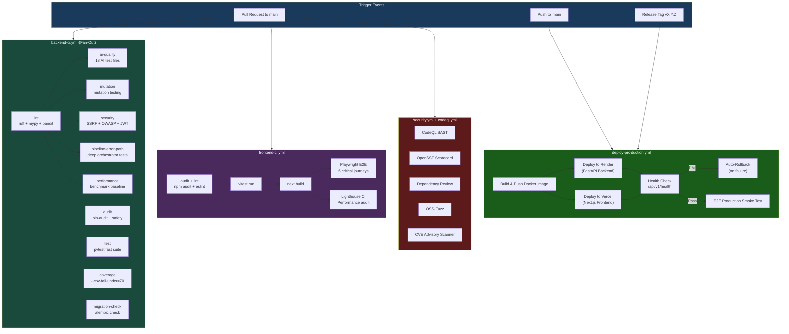

# CI/CD Architecture

> **ScholarForm AI** — Enterprise CI/CD pipeline built on 25 GitHub Actions workflows.

## Table of Contents

- [Overview](#overview)
- [Pipeline Architecture Diagram](#pipeline-architecture-diagram)
- [Backend CI](#backend-ci-backend-ciyml)
- [Frontend CI](#frontend-ci-frontend-ciyml)
- [Deployment Workflows](#deployment-workflows)
- [Security Workflows](#security-workflows)
- [Release & Ops Workflows](#release--ops-workflows)
- [Merge Strategy](#merge-strategy)

---

## Overview

ScholarForm AI uses **GitHub Actions** as its sole CI/CD orchestrator (no Jenkins, GitLab CI, or CircleCI). The 25 workflows fall into five categories:

| Category | Workflows | Purpose |
|----------|-----------|---------|
| **Backend CI** | `backend-ci.yml` | Lint, audit, test, coverage, AI quality, mutation, security, pipeline error-path, migration check, performance |
| **Frontend CI** | `frontend-ci.yml` | Audit, lint + typecheck + vitest, Lighthouse, Playwright E2E |
| **Deployment** | `deploy-production.yml`, `deploy-staging.yml` | Render + Vercel deploy, health checks, auto-rollback |
| **Security** | `codeql.yml`, `security.yml`, `scorecard.yml`, `dependency-review.yml`, `fuzzing.yml`, `cve-advisory.yml` | SAST, DAST, dependency scanning, fuzzing, supply-chain |
| **Release & Ops** | `create-release.yml`, `docker-publish.yml`, `npm-publish.yml`, `python-publish.yml`, `sbom.yml`, `slsa-provenance.yml`, `merge-queue.yml`, `commitlint.yml`, `labeler.yml`, `release-drafter.yml`, `stale.yml`, `docs-freshness.yml`, `keepalive-free-tier.yml`, `e2e-production.yml`, `e2e-staging.yml` | Release orchestration, package publishing, housekeeping, monitoring |

---

## Pipeline Architecture Diagram

The diagram below shows the full CI/CD pipeline flow from a pull request to production deployment.



> [!NOTE]
> All CI jobs run on `ubuntu-latest`. Backend jobs use Python 3.12 with cached pip dependencies per-job. Frontend jobs use Node.js 20 LTS with cached npm.

---

## Backend CI (`backend-ci.yml`)

**Trigger**: Push to any branch or PR targeting `main`, scoped to `backend/**`, `.github/workflows/backend-ci.yml`, or `requirements*.txt`.

**Python**: 3.12, cached pip dependencies per-job.

### Job Dependency Chain

```
lint (parallel fan-out) ──┬── ai-quality
                          ├── mutation
                          ├── security
                          ├── pipeline-error-path
                          └── performance
audit (independent)
test (independent)
coverage (independent, continue-on-error)
migration-check (independent)
```

| Job | Description | Notes |
|-----|-------------|-------|
| **lint** | Ruff (E9/F63/F7/F82), mypy (continue-on-error), Bandit SAST | `--config ruff.toml` |
| **audit** | `pip-audit` + `safety` CVE scans | Both non-fatal, `--require-license --desc` |
| **test** | Pytest (unit+service markers), property-based, observability, contract | `-m "not integration and not llm and not contract"` |
| **coverage** | Pytest with `--cov-fail-under=70` | `continue-on-error: true` (coverage measurement is broken — `KeyError: pydantic.root_model`) |
| **ai-quality** | 18 AI quality test files with `ai_quality` marker | Needs `lint`; 120s timeout |
| **mutation** | Mutation testing via `test_mutation.py` | Needs `lint` |
| **security** | Security tests: SSRF, OWASP AI Top 10, vector DB, file upload, CSRF, JWT, rate limit, prompt injection | Needs `lint` |
| **pipeline-error-path** | Deep pipeline tests: orchestrator, RAG engine, classifier gaps | Needs `lint` |
| **migration-check** | Alembic `check` — verifies schema matches models | No `needs`; fast smoke |
| **performance** | Performance benchmarks via `test_performance_baseline.py` | `continue-on-error: true`; uploads JUnit XML |

**Key design**: lint gates 5 downstream jobs (fan-out). audit, test, coverage, and migration-check run in parallel with lint. This minimizes wall-clock time while ensuring lint failures block expensive downstream jobs.

---

## Frontend CI (`frontend-ci.yml`)

**Trigger**: Push/PR to `main`, scoped to `frontend/**` or the workflow file.

**Node**: 20 with npm cache.

### Steps

```
audit (independent)
test-and-lint ──┬── lighthouse
               └── playwright-e2e
```

| Job | Steps | Description |
|-----|-------|-------------|
| **audit** | `npm ci` → `npm audit --audit-level=high` | `continue-on-error: true`; independent of other jobs |
| **test-and-lint** | `npm ci` → TypeScript typecheck → ESLint → vitest with coverage → security tests | Uploads coverage artifact (7-day retention) |
| **lighthouse** | (needs: test-and-lint) → build → bundle size check (< 5MB JS) → Lighthouse CI | Enforces Core Web Vitals via `lhci autorun` |
| **playwright-e2e** | (needs: test-and-lint) → build → install browsers → `npx playwright test` | Headless E2E suite |

---

## Deployment Workflows

### `deploy-staging.yml`

**Trigger**: Push to `develop` or `workflow_dispatch`.

```
test ──→ deploy
```

Two jobs: run tests + lint first, then trigger a Render deploy via API. Uses `concurrency: staging` with `cancel-in-progress: true` to prevent queue buildup.

### `deploy-production.yml`

**Trigger**: `workflow_run` on successful Frontend CI (main branch) or `workflow_dispatch`.

**Three-gate architecture**:

```
verify-ci-gates ──→ pre-deploy-health ──→ deploy-production
```

| Job | Purpose |
|-----|---------|
| **verify-ci-gates** | Resolves commit SHA, verifies `backend-ci.yml`, `frontend-ci.yml`, and `security.yml` all passed for the target commit. Skips workflows excluded by path filters. Blocks deploy if any CI failed. |
| **pre-deploy-health** | Checks current production `/api/v1/health/live` returns 200. Warns but does not block. |
| **deploy-production** | Full deploy sequence: |

**Deploy sequence (within deploy-production job)**:

1. **Preflight validation** — checks all required secrets (Render deploy hook or API key + service ID, Vercel token + org + project ID)
2. **Service verification** — validates Render service (`srv-` prefix) and Vercel project exist via API
3. **Database migrations** — `alembic upgrade head` against `DATABASE_URL`
4. **Backend deploy** — via Render Deploy Hook (preferred) or Render API
5. **Health poll** — up to 20 attempts (15s interval) waiting for `/api/v1/health/live` → 200
6. **Post-deploy verification** — single health check after successful poll
7. **Auto-rollback** — on failure, calls Render API rollback on the deployed version
8. **Frontend deploy** — `npx vercel deploy --prod` with org/project ID env vars

### E2E Post-Deploy

Both `e2e-production.yml` and `e2e-staging.yml` trigger on successful deployment workflow runs. They run Playwright tests against the live environment using `PROD_FRONTEND_URL` / `STAGING_FRONTEND_URL`.

---

## Security Workflows

### `codeql.yml`

- **Trigger**: Push/PR to main/develop (backend or frontend paths), weekly schedule (Monday 04:00 UTC)
- **Matrix**: `python`, `javascript-typescript`
- **Queries**: `security-and-quality` (default + community)
- **Autobuild** followed by SARIF upload
- **Trivy filesystem scan** as a separate job (CRITICAL/HIGH, `exit-code: 0`, SARIF upload)

### `security.yml`

- **Trigger**: PR to main/develop, weekly schedule (Monday 03:00 UTC)
- **Steps**: Docker build → Trivy image scan → Bandit SAST → OWASP Dependency Check (CVSS ≥ 7) → injection security tests → chaos & recovery tests
- `continue-on-error: true` for non-PR events (schedule runs don't block)

### `scorecard.yml`

- **Trigger**: Branch protection rule changes, weekly schedule (Monday 06:00 UTC), push to main
- **Action**: `ossf/scorecard-action` → SARIF upload to GitHub Security tab
- **Permissions**: `id-token: write` for scorecard result publishing

### `dependency-review.yml`

- **Trigger**: PR to main
- **Action**: `actions/dependency-review-action` with license allow/deny lists
  - **Allowed**: MIT, BSD, Apache-2.0, ISC, Python-2.0, MPL-2.0, Unlicense, CC0-1.0, 0BSD
  - **Denied**: AGPL-3.0, GPL-3.0, GPL-2.0, LGPL-3.0, BSL-1.0
- `fail-on-severity: high`, `warn-only: false`

### `fuzzing.yml`

- **Trigger**: PR to main affecting backend or fuzz targets
- **Tool**: Atheris (libFuzzer-based Python coverage-guided fuzzer)
- **Targets**: `fuzz_document_title.py`, `fuzz_metadata_parser.py`
- **Duration**: 5 seconds per target (smoke test; long-running fuzzing is local-only)

### `cve-advisory.yml`

- **Trigger**: Weekly schedule (Monday 07:00 UTC)
- **Two jobs**:
  - `create-advisory` — queries Dependabot API for open critical/high alerts, creates GitHub Issues with structured CVE templates
  - `dependency-scan` — runs `pip-audit` and `npm audit`, uploads JSON reports as artifacts

---

## Release Workflow (`create-release.yml`)

### 5-Job Pipeline

```
verify ──→ release-notes ──→ create ──→ sbom ──→ attest
                                          ↑
                                          └── (only for stable releases)
```

| Job | Details |
|-----|---------|
| **verify** | Extracts version from tag (`v*`), runs `python scripts/sync_version.py --check` to ensure tag matches `pyproject.toml`, detects pre-release (`rc`, `beta`, `alpha`, `preview`) |
| **release-notes** | Generates changelog from `git log` (categorized: features, fixes, docs, security, maintenance), uses GitHub Release Notes API as authoritative source, builds release body with Docker pull instructions, cosign verify commands, gh attestation commands, and asset table |
| **create** | Generates SHA256 checksums, creates GitHub Release via `softprops/action-gh-release` with SBOM and checksum assets |
| **sbom** | Generates CycloneDX SBOM for release deps, uploads to release assets |
| **attest** | (stable only) Attests release checksums and SBOM via `actions/attest-build-provenance` for SLSA provenance |

---

## Docker Build (`docker-publish.yml`)

### Trigger

Push to main (tags `latest`, `sha-*`), version tags (`v*`), or release published.

### 5-Job Pipeline

```
prepare ─┬── build-and-push-backend (matrix: amd64 + arm64) ─┬── sign-images
          │                                                   └── generate-sbom
          └── build-and-push-worker (amd64) ─┬── sign-images
                                             └── generate-sbom
```

| Job | Architecture | Details |
|-----|-------------|---------|
| **prepare** | — | Extracts version, generates Docker metadata tags via `docker/metadata-action` (semver, latest, sha) for both `ghcr.io/$REPO/backend` and `ghcr.io/$REPO/celery-worker` |
| **build-and-push-backend** | linux/amd64 + linux/arm64 (matrix) | QEMU + Buildx, GHA cache, `provenance: mode=max`, `sbom: true`, attested via `actions/attest-build-provenance` |
| **build-and-push-worker** | linux/amd64 | Same as backend, includes `CELERY_WORKER=true` build-arg, `target: runtime` |
| **sign-images** | — | Installs cosign, signs both images with OIDC issuer |
| **generate-sbom** | — | CycloneDX SBOM for Python (via `cyclonedx-py`) + npm (via `@cyclonedx/cyclonedx-npm`), attested against image digests |

---

## Merge Queue (`merge-queue.yml`)

**Trigger**: `merge_group` checks_requested event.

Validates:
1. No merge conflicts (`git merge-base --is-ancestor HEAD origin/main`)
2. Backend CI (lint, test, ai-quality) passed for merge SHA
3. Security checks passed

Uses `lewagon/wait-on-check-action` with 30s polling interval for each required check name.

---

## Housekeeping & Automation

| Workflow | Trigger | Function |
|----------|---------|----------|
| **stale.yml** | Schedule M-F 08:00 UTC | Marks issues/PRs stale after 60d (30d for PRs), closes after 14d. Exempts security, bug, roadmap, pinned, priority-critical, priority-high labels. |
| **labeler.yml** | PR opened/synchronize/reopened | Auto-labels PRs by changed files against `.github/labeler.yml` patterns (backend, frontend, pipeline, docs, deps, docker, ci-cd, deployment, security, release, tests, size). |
| **commitlint.yml** | PR opened/synchronize/reopened/edited | Validates PR title and all commits against conventional commit spec via `@commitlint/config-conventional`. |
| **release-drafter.yml** | Push to main, PR events | Maintains a draft release updated on every main push, categorizes PRs by labels. Uses `.github/release-drafter.yml` with version resolution (major: breaking, minor: feature, patch: default). |
| **sbom.yml** | Push to main (dep files), weekly Monday | Generates CycloneDX SBOM (Python + npm) + SPDX combined summary, opens a PR if changes detected. |
| **docs-freshness.yml** | Weekly Monday 09:00 UTC, PR on docs | Flags docs >90d stale via frontmatter `last_updated`; checks for broken internal links (fails on broken). |
| **keepalive-free-tier.yml** | Every 14 minutes (`*/14 * * * *`) | Pings Render backend live endpoint + all 6 Hugging Face microservice pairs (grobid, docling, OCR, docx-converter, LLMPDFParser, LLMClassifier) with primary/shadow fallback probing to prevent Render free-tier cold starts. |

### Dependabot Configuration

Managed via `.github/dependabot.yml`:
- **pip** (backend): weekly Monday 09:00 UTC, grouped minor/patch, ignores `chromadb`, `docling-core`, `pydantic`
- **docker** (7 Dockerfiles): weekly Monday 09:00 UTC, grouped
- **npm** (frontend): weekly Monday 09:00 UTC, separated minor/patch and major groups
- **github-actions**: weekly Monday 09:00 UTC, grouped minor/patch

---

## Package Publishing

| Workflow | Trigger | Registry |
|----------|---------|----------|
| **npm-publish.yml** | Release published | GitHub Packages (`@$OWNER/frontend`), with build provenance attestation |
| **python-publish.yml** | Release published | PyPI (token) + GitHub Packages, with build provenance attestation |
| **slsa-provenance.yml** | Release published | Attests all release artifacts via `actions/attest-build-provenance` for SLSA-compatible provenance |

---

## Key Decisions

### Why GitHub Actions over alternatives

- **Native GitHub integration** — no webhook management, no PAT for CI triggers, built-in secrets management
- **Matrix builds** — native multi-language matrix (Python + JavaScript in same repo) without separate runners
- **Marketplace ecosystem** — 20,000+ actions (CodeQL, Trivy, Scorecard, Lighthouse CI, Playwright)
- **Cost** — 2,000 free minutes/month for private repos; free for public repos
- **Merge queue** — native `merge_group` trigger (not available in Jenkins/CircleCI) enables CI-before-merge guarantees

### Parallel vs Sequential Job Design

**Fan-out pattern**: Backend `lint` gates 5 downstream jobs (`ai-quality`, `mutation`, `security`, `pipeline-error-path`, `performance`). This pattern:
- Prevents resource waste: lint failure kills all 5 downstream jobs immediately
- Minimizes wall-clock time: non-dependent jobs (`test`, `audit`, `coverage`, `migration-check`) start concurrently with lint
- Enables targeted parallelism: the 5 downstream jobs run in parallel on separate runners

**Sequential deployment gating**: The production deploy requires 3 sequential gate jobs before the deploy job:
```
verify-ci-gates → pre-deploy-health → deploy(health poll → migrations → backends → wait → verify → frontend)
```
This ensures CI green, current prod healthy, and all preflight validations pass before touching production.

**Frontend CI linear chain**: `test-and-lint` must succeed before `lighthouse` and `playwright-e2e` run — no point running Lighthouse on code that fails typecheck, or E2E on code that fails unit tests.

### Security-First Design

- **Defense in depth**: 7 dedicated security workflows (CodeQL, Trivy, Bandit, OWASP DC, Dependency Review, Fuzzing, CVE Advisory) + security tests in both backend CI (`security` job) and frontend CI (`Security Tests` step)
- **Fail-closed on PR**: Security tools use `exit-code: 1` on PR events, `continue-on-error: true` on schedule events
- **License governance**: Dependency Review blocks PRs with GPL/AGPL/BSL dependencies
- **Supply chain integrity**: SBOM generation, cosign signing, SLSA provenance attestation, and image digests tracked across all release artifacts

### Infrastructure Decisions

- **Container registry**: ghcr.io (GitHub Container Registry) — co-located with source, no separate Docker Hub credentials
- **Multi-arch builds**: Backend images built for both `linux/amd64` and `linux/arm64` via QEMU + Buildx matrix; worker images `amd64` only (Render free tier limitation)
- **Database migrations**: Run in-ci during deploy (not at container startup) to prevent race conditions across multiple instances
- **Render deploy mode**: Deploy Hook preferred (simpler, no API key rotation); Render API as fallback with service ID verification (`srv-` prefix check)
- **Free-tier keepalive**: Every 14 minutes (Render free tier sleep timeout is 15 min) with 6-retry fallback and multi-path probing for Hugging Face microservices

### Merge Queue

The `merge-queue.yml` workflow validates merge group checks before GitHub allows merging into main. This provides:
- Atomic merge commits with passing CI
- Prevention of semantic merge conflicts
- Branch protection without requiring `Require branches to be up to date` (which causes noise on long-lived branches)

### Release Orchestration

The 5-job release pipeline (`verify → release-notes → create → sbom → attest`) is intentionally sequential:
- Each job produces artifacts consumed by the next (version → changelog → release → SBOM → attestation)
- `attest` only runs for stable releases (not pre-release), avoiding wasted OIDC token exchange for RC/beta tags
- Version consistency enforced at the start: tag must match `python scripts/sync_version.py --show` output, preventing tag-vs-manifest mismatches
