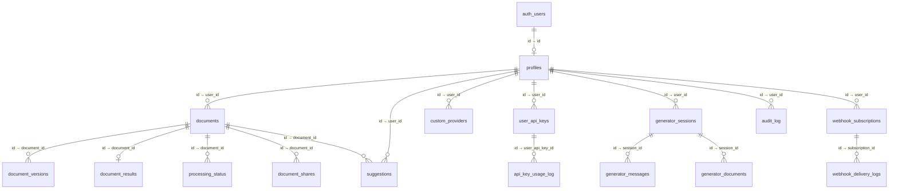
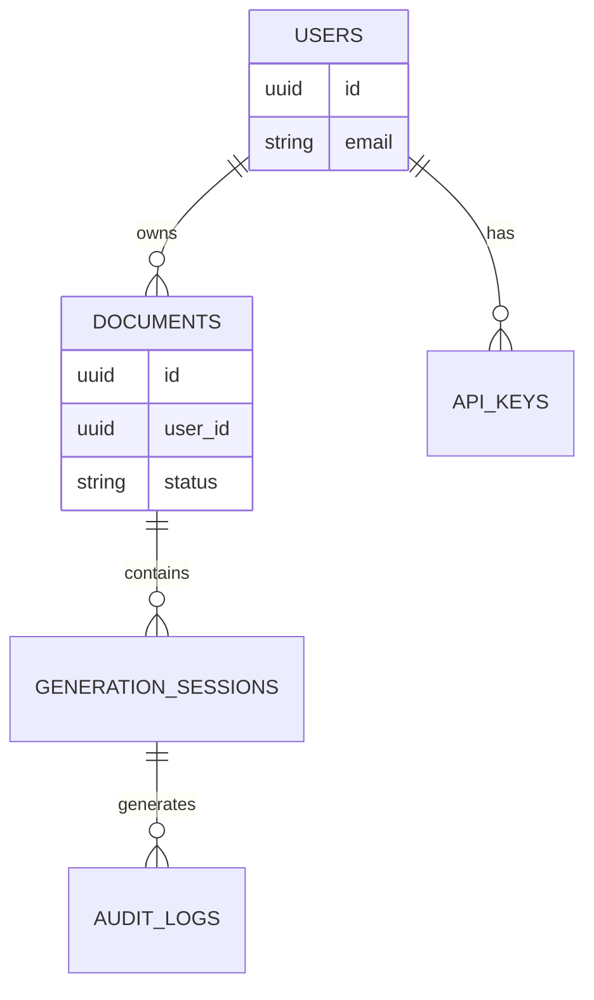

# Database Architecture — ScholarForm AI

> **Version:** 1.0 | **Last Updated:** 2026-07-16 | **Stack:** Supabase (PostgreSQL 15+) + Redis + ChromaDB

---

## 1. Overview

ScholarForm AI uses a **three-store architecture**:

| Store | Purpose | Hosting | Connection |
|-------|---------|---------|------------|
| **PostgreSQL (Supabase)** | Primary OLTP — documents, users, billing, audit, webhooks | Supabase managed | `SUPABASE_DB_URL` (direct PG) + `supabase-py` (REST) |
| **Redis** | Cache layer + Celery broker + rate limiting + token blacklist | Self-hosted / Upstash | `REDIS_URL` |
| **ChromaDB** | Vector store for RAG — formatting guideline embeddings | Local `PersistentClient` | Filesystem at `db/semantic_store/` |

All three support **graceful degradation**: if any store is unavailable, the application starts in degraded mode and returns 503 for affected endpoints rather than crashing.

---

## 2. PostgreSQL Schema

### 2.1 Entity-Relationship Diagram



### 2.2 Table Reference

#### `profiles` — User Profiles

| Column | Type | Constraints | Notes |
|--------|------|-------------|-------|
| `id` | `UUID` | `PK → auth.users(id) ON DELETE CASCADE` | Mirrors Supabase Auth UID |
| `email` | `TEXT` | Indexed | — |
| `full_name` | `TEXT` | — | — |
| `institution` | `TEXT` | — | — |
| `role` | `TEXT` | `NOT NULL DEFAULT 'authenticated'` | — |
| `plan_tier` | `TEXT` | `NOT NULL DEFAULT 'free'` | Added by migration `20260315_0002` |
| `stripe_customer_id` | `TEXT` | — | Added by migration `20260315_0002` |
| `billing_status` | `TEXT` | — | Added by migration `20260315_0002` |
| `created_at` | `TIMESTAMPTZ` | `NOT NULL DEFAULT NOW()` | — |
| `updated_at` | `TIMESTAMPTZ` | `NOT NULL DEFAULT NOW()` | Auto-updated via trigger |
| **Indexes** | `idx_profiles_email` on `email` | | |

#### `documents` — Core Document Jobs

| Column | Type | Constraints | Notes |
|--------|------|-------------|-------|
| `id` | `UUID` | `PK DEFAULT gen_random_uuid()` | — |
| `user_id` | `UUID` | Indexed, nullable | References `auth.users.id` (app-level, no FK) |
| `filename` | `TEXT` | `NOT NULL` | Original upload filename |
| `template` | `TEXT` | Nullable | e.g., `"ieee"`, `"springer"` |
| `status` | `TEXT` | `NOT NULL DEFAULT 'RUNNING'` | `RUNNING │ COMPLETED │ FAILED` |
| `original_file_path` | `TEXT` | Nullable | Upload storage path |
| `raw_text` | `TEXT` | Nullable | Extracted plain text |
| `output_path` | `TEXT` | Nullable | Generated DOCX/PDF path |
| `formatting_options` | `JSONB` | Nullable | e.g., `{"page_size":"A4","toc":true}` |
| `file_hash` | `TEXT` | Indexed | SHA-256 of uploaded content |
| `progress` | `INTEGER` | `DEFAULT 0` | 0–100 |
| `current_stage` | `TEXT` | Nullable | Active pipeline stage name |
| `error_message` | `TEXT` | Nullable | Failure reason |
| `created_at` | `TIMESTAMPTZ` | `NOT NULL DEFAULT NOW()` | — |
| `updated_at` | `TIMESTAMPTZ` | `NOT NULL DEFAULT NOW()` | Auto-updated |
| **Indexes** | `idx_documents_user_id`, `idx_documents_status`, `idx_documents_created_at DESC`, `idx_documents_file_hash`, `idx_documents_user_created (user_id, created_at DESC)`, `idx_documents_user_updated (user_id, updated_at DESC)`, `idx_documents_fts (GIN to_tsvector)` | | |

#### `document_versions` — Output Snapshots

| Column | Type | Constraints | Notes |
|--------|------|-------------|-------|
| `id` | `UUID` | `PK DEFAULT gen_random_uuid()` | — |
| `document_id` | `UUID` | `FK → documents(id) ON DELETE CASCADE` | Indexed |
| `version_number` | `TEXT` | `NOT NULL` | e.g., `"v1"`, `"v2-edited"` |
| `edited_structured_data` | `JSON` | Nullable | Editor snapshot |
| `output_path` | `TEXT` | Nullable | Generated file path |
| `created_at` | `TIMESTAMPTZ` | `NOT NULL DEFAULT NOW()` | — |

#### `document_results` — Pipeline Structured Output

| Column | Type | Constraints | Notes |
|--------|------|-------------|-------|
| `id` | `UUID` | `PK DEFAULT gen_random_uuid()` | — |
| `document_id` | `UUID` | `FK → documents(id) ON DELETE CASCADE`, `UNIQUE` | One result per document |
| `structured_data` | `JSONB` | Nullable | Sections, citations, references |
| `validation_results` | `JSONB` | Nullable | Violations, suggested fixes |
| `created_at` | `TIMESTAMPTZ` | `NOT NULL DEFAULT NOW()` | — |

#### `processing_status` — Per-Phase Pipeline Progress

| Column | Type | Constraints | Notes |
|--------|------|-------------|-------|
| `id` | `UUID` | `PK DEFAULT gen_random_uuid()` | — |
| `document_id` | `UUID` | `FK → documents(id) ON DELETE CASCADE` | Indexed |
| `phase` | `TEXT` | `NOT NULL` | `UPLOAD │ EXTRACTION │ NLP_ANALYSIS │ VALIDATION │ PERSISTENCE` |
| `status` | `TEXT` | `NOT NULL` | `PENDING │ IN_PROGRESS │ COMPLETED │ FAILED` |
| `progress_percentage` | `INTEGER` | Nullable | 0–100 |
| `message` | `TEXT` | Nullable | Human-readable status |
| `updated_at` | `TIMESTAMPTZ` | `NOT NULL DEFAULT NOW()` | Auto-updated |
| **Unique** | `uq_processing_status_doc_phase (document_id, phase)` | Supports upsert | — |

#### `model_metrics` — LLM Telemetry

| Column | Type | Constraints | Notes |
|--------|------|-------------|-------|
| `id` | `UUID` | `PK DEFAULT gen_random_uuid()` | — |
| `model_name` | `TEXT` | `NOT NULL` | e.g., `"nvidia/llama-3.1"` |
| `latency_ms` | `REAL` | `NOT NULL` | Response time |
| `success` | `BOOLEAN` | `NOT NULL DEFAULT TRUE` | Request success flag |
| `quality_score` | `REAL` | Nullable | 0.0–1.0 heuristic score |
| `timestamp` | `TIMESTAMPTZ` | `NOT NULL DEFAULT NOW()` | Indexed DESC |
| **Indexes** | `idx_model_metrics_timestamp DESC`, `idx_model_metrics_model` | | |

#### `ab_test_results` — A/B Provider Comparison

| Column | Type | Constraints | Notes |
|--------|------|-------------|-------|
| `id` | `UUID` | `PK DEFAULT gen_random_uuid()` | — |
| `nvidia_latency` | `REAL` | — | — |
| `deepseek_latency` | `REAL` | — | — |
| `nvidia_success` | `BOOLEAN` | `NOT NULL DEFAULT FALSE` | — |
| `deepseek_success` | `BOOLEAN` | `NOT NULL DEFAULT FALSE` | — |
| `latency_winner` | `TEXT` | — | `"nvidia"` or `"deepseek"` |
| `both_succeeded` | `BOOLEAN` | `NOT NULL DEFAULT FALSE` | — |
| `timestamp` | `TIMESTAMPTZ` | `NOT NULL DEFAULT NOW()` | Indexed DESC |

#### `user_api_keys` — User-Provided LLM Keys

| Column | Type | Constraints | Notes |
|--------|------|-------------|-------|
| `id` | `UUID` | `PK` | — |
| `user_id` | `UUID` | `NOT NULL`, Indexed | References `auth.users.id` |
| `provider` | `VARCHAR(50)` | `NOT NULL`, Indexed | e.g., `"openai"`, `"anthropic"` |
| `api_key_encrypted` | `TEXT` | `NOT NULL` | Fernet-encrypted key |
| `key_label` | `VARCHAR(100)` | Nullable | User-friendly label |
| `is_active` | `BOOLEAN` | `NOT NULL DEFAULT TRUE` | Soft-delete |
| `rate_limit_per_minute` | `INTEGER` | `NOT NULL DEFAULT 60` | — |
| `rate_limit_per_hour` | `INTEGER` | `NOT NULL DEFAULT 1000` | — |
| `daily_quota` | `INTEGER` | `NOT NULL DEFAULT 10000` | — |
| `total_requests` | `INTEGER` | `NOT NULL DEFAULT 0` | Cumulative counter |
| `last_request_at` | `TIMESTAMPTZ` | Nullable | — |
| `created_at` | `TIMESTAMPTZ` | — | — |
| `updated_at` | `TIMESTAMPTZ` | — | — |

#### `api_key_usage_log` — Per-Key Usage Analytics

| Column | Type | Constraints | Notes |
|--------|------|-------------|-------|
| `id` | `UUID` | `PK` | — |
| `user_api_key_id` | `UUID` | `NOT NULL`, Indexed | FK to `user_api_keys` |
| `endpoint` | `VARCHAR(200)` | Nullable | API endpoint called |
| `model` | `VARCHAR(100)` | Nullable | Model used |
| `tokens_used` | `INTEGER` | Nullable | Token count |
| `status_code` | `INTEGER` | Nullable | HTTP status |
| `response_time_ms` | `INTEGER` | Nullable | Latency |
| `created_at` | `TIMESTAMPTZ` | Indexed | — |

#### `custom_providers` — BYO Provider Endpoints

| Column | Type | Constraints | Notes |
|--------|------|-------------|-------|
| `id` | `UUID` | `PK` | — |
| `user_id` | `UUID` | `NOT NULL`, Indexed | — |
| `name` | `VARCHAR(100)` | `NOT NULL` | Provider display name |
| `base_url` | `VARCHAR(500)` | `NOT NULL` | API base URL |
| `api_key_encrypted` | `TEXT` | Nullable | Optional encrypted key |
| `models` | `JSON` | `NOT NULL DEFAULT []` | List of model names |
| `is_local` | `BOOLEAN` | `NOT NULL DEFAULT FALSE` | Local (Ollama) flag |
| `description` | `VARCHAR(500)` | Nullable | — |
| `is_active` | `BOOLEAN` | `NOT NULL DEFAULT TRUE` | Soft-delete |
| `created_at` | `TIMESTAMPTZ` | — | — |
| `updated_at` | `TIMESTAMPTZ` | — | — |

#### `webhook_subscriptions` — Outgoing Webhooks

| Column | Type | Constraints | Notes |
|--------|------|-------------|-------|
| `id` | `UUID` | `PK` | — |
| `user_id` | `UUID` | `NOT NULL`, Indexed | — |
| `name` | `TEXT` | `NOT NULL` | Webhook label |
| `url` | `TEXT` | `NOT NULL` | Destination URL |
| `events` | `JSONB` | `NOT NULL` | Event type array |
| `secret` | `TEXT` | `NOT NULL DEFAULT ''` | HMAC signing secret |
| `is_active` | `BOOLEAN` | `NOT NULL DEFAULT TRUE` | — |
| `created_at` | `TIMESTAMPTZ` | `NOT NULL` | — |
| `updated_at` | `TIMESTAMPTZ` | `NOT NULL` | — |
| **Indexes** | `idx_webhook_subs_user_id`, `idx_webhook_subs_active_events (is_active, events)` using GIN | | |

#### `webhook_delivery_logs` — Webhook Delivery History

| Column | Type | Constraints | Notes |
|--------|------|-------------|-------|
| `id` | `UUID` | `PK` | — |
| `subscription_id` | `UUID` | `NOT NULL` | FK to `webhook_subscriptions` |
| `event_type` | `TEXT` | `NOT NULL` | — |
| `payload` | `TEXT` | `NOT NULL` | Serialized payload |
| `status` | `TEXT` | `NOT NULL` | `success │ failed │ retrying` |
| `response_code` | `INTEGER` | `NOT NULL` | HTTP status |
| `response_body` | `TEXT` | `NOT NULL DEFAULT ''` | — |
| `attempted_at` | `TIMESTAMPTZ` | `NOT NULL` | — |
| `next_retry_at` | `TIMESTAMPTZ` | Nullable | — |
| **Index** | `idx_webhook_delivery_sub_attempted (subscription_id, attempted_at DESC)` | | |

#### `suggestions` — AI-Generated Edits

| Column | Type | Constraints | Notes |
|--------|------|-------------|-------|
| `id` | `UUID` | `PK DEFAULT gen_random_uuid()` | — |
| `user_id` | `UUID` | `NOT NULL`, Indexed | — |
| `document_id` | `UUID` | Nullable, Indexed | — |
| `session_id` | `TEXT` | Nullable | Generator session ID |
| `original_text` | `TEXT` | `NOT NULL` | Source text |
| `suggested_text` | `TEXT` | `NOT NULL` | AI-proposed edit |
| `suggestion_type` | `TEXT` | `NOT NULL` | e.g., `"clarity"`, `"style"` |
| `score` | `FLOAT` | `NOT NULL DEFAULT 0.0` | Confidence score |
| `status` | `TEXT` | `NOT NULL DEFAULT 'pending'` | `pending │ accepted │ rejected` |
| `context` | `JSON` | Nullable | Surrounding context |
| `created_at` | `TIMESTAMPTZ` | — | — |
| `updated_at` | `TIMESTAMPTZ` | — | — |
| `accepted_at` | `TIMESTAMPTZ` | Nullable | — |

#### `audit_log` — Security Audit Trail

| Column | Type | Constraints | Notes |
|--------|------|-------------|-------|
| `id` | `UUID` | `PK DEFAULT gen_random_uuid()` | — |
| `user_id` | `TEXT` | Nullable | Actor |
| `action` | `TEXT` | `NOT NULL` | e.g., `"document.delete"` |
| `resource_type` | `TEXT` | `NOT NULL` | e.g., `"generator_session"` |
| `resource_id` | `TEXT` | Nullable | — |
| `ip_address` | `TEXT` | Nullable | Request origin |
| `details` | `JSONB` | Nullable | Arbitrary metadata |
| `created_at` | `TIMESTAMPTZ` | `NOT NULL DEFAULT NOW()` | Indexed DESC |
| **Indexes** | `idx_audit_log_user_id`, `idx_audit_log_timestamp DESC`, `idx_audit_log_resource (resource_type, resource_id)` | | |

#### `document_shares` — Collaborative Access

| Column | Type | Constraints | Notes |
|--------|------|-------------|-------|
| `id` | `UUID` | `PK DEFAULT gen_random_uuid()` | — |
| `document_id` | `UUID` | `FK → documents(id) ON DELETE CASCADE` | Indexed |
| `shared_with_user_id` | `TEXT` | `NOT NULL` | Indexed |
| `permission` | `TEXT` | `NOT NULL DEFAULT 'view'` | `view │ edit` |
| `shared_by_user_id` | `TEXT` | `NOT NULL` | — |
| `created_at` | `TIMESTAMPTZ` | — | — |
| `updated_at` | `TIMESTAMPTZ` | — | — |
| **Unique** | `uq_document_shares (document_id, shared_with_user_id)` | Prevents duplicates | — |

#### `generator_sessions` — AI Document Generation Sessions

| Column | Type | Constraints | Notes |
|--------|------|-------------|-------|
| `id` | `UUID` | `PK` | Client-generated |
| `user_id` | `TEXT` | Nullable | — |
| `session_type` | `TEXT` | `NOT NULL DEFAULT 'agent'` | `agent │ multi_doc` |
| `status` | `TEXT` | `NOT NULL DEFAULT 'pending'` | `pending │ running │ completed │ failed` |
| `progress` | `INTEGER` | `NOT NULL DEFAULT 0` | 0–100 |
| `config_json` | `JSONB` | Nullable | Generation config |
| `outline_json` | `JSONB` | Nullable | Generated outline |
| `created_at` | `TIMESTAMPTZ` | `NOT NULL DEFAULT NOW()` | — |
| `updated_at` | `TIMESTAMPTZ` | `NOT NULL DEFAULT NOW()` | — |

#### `generator_messages` — Chat Messages

| Column | Type | Constraints | Notes |
|--------|------|-------------|-------|
| `id` | `UUID` | `PK DEFAULT gen_random_uuid()` | — |
| `session_id` | `UUID` | `FK → generator_sessions(id) ON DELETE CASCADE` | Indexed |
| `role` | `TEXT` | `NOT NULL` | `user │ assistant │ system` |
| `content` | `TEXT` | `NOT NULL` | Message body |
| `token_count` | `INTEGER` | Nullable | Token estimate |
| `created_at` | `TIMESTAMPTZ` | `NOT NULL DEFAULT NOW()` | — |

#### `generator_documents` — Generated Document Versions

| Column | Type | Constraints | Notes |
|--------|------|-------------|-------|
| `id` | `UUID` | `PK DEFAULT gen_random_uuid()` | — |
| `session_id` | `UUID` | `FK → generator_sessions(id) ON DELETE CASCADE` | Indexed |
| `content_json` | `JSONB` | Nullable | Full document content |
| `docx_path` | `TEXT` | Nullable | Path to generated DOCX |
| `version_number` | `INTEGER` | `NOT NULL DEFAULT 1` | Auto-incrementing |
| `created_at` | `TIMESTAMPTZ` | `NOT NULL DEFAULT NOW()` | — |

---

## 3. ChromaDB Schema

ChromaDB runs as a local `PersistentClient` storing academic formatting guideline embeddings.

### 3.1 Persistence

| Setting | Value |
|---------|-------|
| **Client type** | `chromadb.PersistentClient` |
| **Base path** | `<project_root>/db/semantic_store/` |
| **Native fallback** | `kb.json` in the same directory |
| **Backend resolution** | ChromaDB → native JSON store if ChromaDB unavailable |

### 3.2 Collections

| Collection Name | Embedding Model | Dimensions | Purpose |
|----------------|-----------------|-----------|---------|
| `guidelines_bge_m3` | `BAAI/bge-m3` (primary) | 1024 | Primary semantic search, 8192-token context, multilingual |
| `publisher_guidelines` | `BAAI/bge-small-en-v1.5` (fallback) | 384 | Legacy collection, lighter model |

When neither transformer model is available, a **deterministic hash fallback** (256-d, using BLAKE2b token hashing with cosine similarity) keeps retrieval operational.

### 3.3 Document Structure

Each entry in ChromaDB (and the native `kb.json` fallback) follows:

```json
{
  "text": "Use Times New Roman font, 10pt size for the main body text. ...",
  "metadata": {
    "source": "auto-seed",
    "publisher": "IEEE",
    "section": "formatting"
  },
  "embedding": [0.0, 0.0, ...]
}
```

**Metadata filters** applied at query time:
- `publisher` — uppercase publisher name (e.g., `"IEEE"`, `"SPRINGER"`)
- `section` — lowercase section category (e.g., `"formatting"`, `"headings"`)

### 3.4 Query Flow

```
query_guidelines(publisher, intent, top_k=3)
  ├── ChromaDB available?
  │   ├── Yes → collection.query(where={"publisher": publisher}, n_results=top_k)
  │   └── No  → Native cosine-similarity scan over kb.json
  └── Return top_k guideline text strings
```

### 3.5 Session Vector Store

A secondary ChromaDB instance at `db/session_store/` uses `multi-qa-MiniLM-L6-v2` (384-d) for per-session conversational retrieval, with a 24-hour TTL.

---

## 4. Redis Data Model

Redis is accessed via the `RedisCache` singleton (lazy-initialized, controlled by `REDIS_ENABLED`).

### 4.1 Cache Key Namespaces

| Key Pattern | Purpose | TTL | Example |
|-------------|---------|-----|---------|
| `grobid:<sha256>` | GROBID extraction cache | 3600s | `grobid:a1b2c3...` |
| `llm:<cache_key>` | LLM response cache | 86400s (24h) | `llm:ieee_formatting` |
| `blacklisted_token:<jti>` | JWT token blacklist | 3600s | `blacklisted_token:abc-123` |

### 4.2 Celery Broker & Result Backend

| Key Pattern | Purpose |
|-------------|---------|
| `celery` (default vhost) | Celery task queue |
| `celery-task-meta-<task_id>` | Celery task result backend |
| `_kombu.binding.celery` | Kombu binding metadata |
| `unacked` | Unacknowledged message index |

Configured via:
```python
CELERY_BROKER_URL = "redis://localhost:6379/0"
CELERY_RESULT_BACKEND = "redis://localhost:6379/0"
```

### 4.3 Rate Limiting

Not stored in Redis directly — rate limiting is enforced per-endpoint via middleware using `GLOBAL_RATE_LIMIT_PER_MINUTE` (default 120) and per-user upload throttle at `UPLOADS_PER_MINUTE` (default 10). These are application-level counters (in-memory in `RateLimiter`).

### 4.4 Connection Settings

```python
socket_connect_timeout=1  # Fast failure on Redis unavailability
socket_timeout=1          # Quick operation timeout
retry_on_timeout=False    # Fail-fast, no retry
decode_responses=True     # Auto-decode bytes to str
```

---

## 5. SQLAlchemy Setup

### 5.1 Declarative Base

`app.db.base.Base` uses SQLAlchemy 2.x `DeclarativeBase`:

```python
from sqlalchemy.orm import DeclarativeBase

class Base(DeclarativeBase):
    pass
```

All 12 ORM models (User, Document, DocumentVersion, DocumentResult, ProcessingStatus, UserApiKey, ApiKeyUsageLog, CustomProvider, Suggestion, Block, Figure, Table, Reference, Equation) inherit from this base. The `__init__.py` exports 15 model classes.

### 5.2 Engine Configuration

```python
engine = create_engine(
    db_url,
    pool_size=5,           # 5 persistent connections
    max_overflow=10,        # Up to 15 total connections (5 base + 10 overflow)
    pool_timeout=30,        # Wait 30s before raising timeout
    pool_recycle=1800,      # Recycle after 30 minutes (avoids stale SSL)
    pool_pre_ping=True,     # Test connection before use
    echo=False,             # SQL logging off
)
```

### 5.3 Session Management

`SessionLocal = sessionmaker(autocommit=False, autoflush=False, bind=engine)`

**FastAPI dependency** (`get_db()`):

```
Request → get_db()
  ├── SessionLocal is None? → raise HTTP 503 (degraded mode)
  ├── yield db session
  ├── SQLAlchemyError? → rollback + raise HTTP 500
  └── finally: db.close()
```

### 5.4 Supabase-py Dual Access

Alongside SQLAlchemy, the system uses `supabase-py` (PostgREST client) with the **service role key** for:

- All CRUD on `generator_sessions`, `generator_messages`, `generator_documents`
- `document_shares` operations
- `ab_test_results` writes
- `model_metrics` writes
- All direct `sb.table()` calls in service layer

The SQLAlchemy engine is reserved for Alembic migrations and query patterns that need ORM features. The `supabase-py` client bypasses RLS (correct for server-side JWT-verified operations).

---

## 6. Migrations

### 6.1 Alembic Configuration

| Setting | Value |
|---------|-------|
| `script_location` | `backend/alembic/` |
| `prepend_sys_path` | `.` (project root) |
| `sqlalchemy.url` | Dynamic from `SUPABASE_DB_URL` env var |
| `target_metadata` | `Base.metadata` (all model imports) |
| Pool class | `NullPool` (no pooling in migrations) |

### 6.2 Migration History (12 revisions)

| Revision | Date | Description |
|----------|------|-------------|
| `530ab1236474` | 2026-02-08 | **Baseline** — no-op placeholder, schema managed by Supabase |
| `5ab5f4f9e36d` | 2026-02-08 | **Job state columns** — `progress`, `current_stage`, `error_message`, `updated_at` on documents; rename `document_result` → `document_results`, `document_version` → `document_versions`; add `profiles` table |
| `1f7c085e7ef2` | 2026-02-13 | **Template column** — idempotent add of `template` to `documents` |
| `20260311_0001` | 2026-03-11 | **Generator tables** — `generator_sessions`, `generator_messages`, `generator_documents` |
| `20260315_0001` | 2026-03-15 | **Audit log** — `audit_log` table |
| `20260315_0002` | 2026-03-15 | **Billing fields** — `plan_tier`, `stripe_customer_id`, `billing_status` on `profiles` |
| `20260521_0001` | 2026-05-21 | **User API keys** — `user_api_keys`, `api_key_usage_log` |
| `20260629_0001` | 2026-06-29 | **Custom providers** — `custom_providers` table |
| `20260708_add_performance_indexes` | 2026-07-08 | **Performance indexes** — composite indexes + GIN full-text on `documents`, audit log + API key usage indexes |
| `20260708_0002_add_document_shares` | 2026-07-08 | **Document shares** — `document_shares` with unique constraint + cascade delete |
| `20260708_add_v2_pagination_index` | 2026-07-08 | **Cursor pagination** — `(user_id, created_at DESC)` and `(user_id, updated_at DESC)` composite indexes |
| `20260708_add_webhook_tables` | 2026-07-08 | **Webhooks** — `webhook_subscriptions` (with GIN index on events) + `webhook_delivery_logs` |

### 6.3 Convention

- Revision IDs use date-based prefixes after the baseline (e.g., `20260311_0001`)
- Idempotent operations (`IF NOT EXISTS`, `inspector.get_columns()`) are used for production safety
- `from app.models import *` at module level ensures auto-generation discovers all tables
- Downgrade paths are maintained for all migrations

---

## 7. Indexing Strategy

### 7.1 Primary Indexes

| Table | Index Name | Columns | Type | Purpose |
|-------|-----------|---------|------|---------|
| `documents` | `idx_documents_user_id` | `user_id` | B-tree | User document listing |
| `documents` | `idx_documents_status` | `status` | B-tree | Status filtering |
| `documents` | `idx_documents_created_at` | `created_at DESC` | B-tree | Recent documents sort |
| `documents` | `idx_documents_file_hash` | `file_hash` | B-tree | Duplicate detection |
| `documents` | `idx_documents_user_created` | `(user_id, created_at DESC)` | Composite B-tree | Cursor-based pagination |
| `documents` | `idx_documents_user_updated` | `(user_id, updated_at DESC)` | Composite B-tree | Recent activity sort |
| `documents` | `idx_documents_fts` | `to_tsvector('english', raw_text)` | GIN | Full-text search |
| `documents` | `idx_documents_template` | `template` | B-tree | Template filtering |
| `profiles` | `idx_profiles_email` | `email` | B-tree | Email lookup |
| `document_results` | `idx_document_results_document_id` | `document_id` | B-tree | FK lookup |
| `document_versions` | `idx_document_versions_document_id` | `document_id` | B-tree | FK lookup |
| `processing_status` | `ix_processing_status_document_id` | `document_id` | B-tree | FK lookup |
| `model_metrics` | `idx_model_metrics_timestamp` | `timestamp DESC` | B-tree | Dashboard queries |
| `model_metrics` | `idx_model_metrics_model` | `model_name` | B-tree | Per-model aggregation |
| `audit_log` | `idx_audit_log_user_id` | `user_id` | B-tree | User audit trail |
| `audit_log` | `idx_audit_log_timestamp` | `created_at DESC` | B-tree | Time-range queries |
| `audit_log` | `idx_audit_log_resource` | `(resource_type, resource_id)` | Composite B-tree | Resource lookup |
| `user_api_keys` | `ix_user_api_keys_user_id` | `user_id` | B-tree | User key listing |
| `user_api_keys` | `ix_user_api_keys_provider` | `provider` | B-tree | Provider filtering |
| `api_key_usage_log` | `ix_api_key_usage_log_created_at` | `created_at` | B-tree | Time-series queries |
| `webhook_subscriptions` | `idx_webhook_subs_user_id` | `user_id` | B-tree | User subscription listing |
| `webhook_subscriptions` | `idx_webhook_subs_active_events` | `(is_active, events)` | GIN | Active webhook event matching |
| `webhook_delivery_logs` | `idx_webhook_delivery_sub_attempted` | `(subscription_id, attempted_at DESC)` | Composite B-tree | Per-subscription delivery history |
| `document_shares` | `idx_document_shares_doc_id` | `document_id` | B-tree | FK lookup |
| `document_shares` | `idx_document_shares_user_id` | `shared_with_user_id` | B-tree | Shared-with-me queries |
| `generator_messages` | `ix_generator_messages_session_id` | `session_id` | B-tree | Session message listing |
| `generator_documents` | `ix_generator_documents_session_id` | `session_id` | B-tree | Session document listing |
| `ab_test_results` | `idx_ab_test_results_timestamp` | `timestamp DESC` | B-tree | Dashboard queries |

### 7.2 Unique Constraints

| Table | Constraint | Columns | Purpose |
|-------|-----------|---------|---------|
| `document_results` | `uq_document_results_document_id` | `document_id` | One result per document |
| `processing_status` | `uq_processing_status_doc_phase` | `(document_id, phase)` | One row per phase per document |
| `document_shares` | `uq_document_shares` | `(document_id, shared_with_user_id)` | No duplicate shares |

---

## 8. Connection Pooling

### 8.1 PostgreSQL (SQLAlchemy Engine)

| Setting | Value | Rationale |
|---------|-------|-----------|
| `pool_size` | 5 | Matches typical Supabase free/pro plan connection limits |
| `max_overflow` | 10 | Allows burst traffic up to 15 concurrent connections |
| `pool_timeout` | 30s | Clients wait up to 30s for a connection before failing |
| `pool_recycle` | 1800s (30 min) | Prevents stale SSL connections after idle periods |
| `pool_pre_ping` | `True` | Executes `SELECT 1` before handing out a connection |
| `poolclass` (Alembic) | `NullPool` | Migrations get a fresh connection each time |

### 8.2 Health Checks

The `/health` endpoint calls `check_db_health()` which executes `SELECT 1` against the engine. For Supabase-py, `client.table("profiles").select("id").limit(1).execute()` is used as a lightweight ping.

### 8.3 Graceful Degradation

- **Engine creation failure**: `engine = None`, `SessionLocal = None`
- **Runtime health check failure**: returns `{"status": "unhealthy", "detail": ...}`
- **Request-time unavailability**: `get_db()` raises `HTTP 503`
- **Unhandled SQLAlchemy errors**: rolled back, logged, `HTTP 500` returned

---

## 9. Backup Strategy

### 9.1 PostgreSQL (Supabase Managed)

Supabase provides:
- **Daily automatic backups** on Pro/Team plans (7-day retention)
- **Point-in-time recovery** (PITR) on Team plan (up to 7 days)
- **Manual backups** via `pg_dump` or Supabase Dashboard
- **Database branching** for preview/staging environments

### 9.2 ChromaDB

ChromaDB `PersistentClient` writes to the local filesystem at `db/semantic_store/`. The native JSON fallback (`kb.json`) provides a portable, commit-friendly backup:

- ChromaDB data is ephemeral and regenerated by auto-seeding on reset
- `kb.json` can be version-controlled (committed to git)
- ChromaDB can be rebuilt at any time from the seed data + user uploads

### 9.3 Redis

Redis is cache-only with configurable TTLs:
- GROBID results: 1 hour
- LLM responses: 24 hours
- Token blacklist: matches token expiry (default 1 hour)

No persistence is configured (`REDIS_ENABLED=false` by default). Cache is warmable and loss is non-critical.

---

## 10. Performance

### 10.1 Key Query Patterns

| Pattern | Table(s) | Index Used | Strategy |
|---------|----------|-----------|----------|
| User's documents (sorted) | `documents` | `idx_documents_user_created` | Cursor pagination with `WHERE (user_id, created_at) < (?, ?)` |
| Recent pipeline status | `processing_status` | `ix_processing_status_document_id` | Batch fetch per document |
| Model dashboard | `model_metrics` | `idx_model_metrics_timestamp` | Windowed aggregation by model |
| Audit trail | `audit_log` | `idx_audit_log_user_id` | Filtered by actor + time range |
| Full-text search | `documents` | `idx_documents_fts` (GIN) | `to_tsvector('english', raw_text)` |
| Active webhook events | `webhook_subscriptions` | `idx_webhook_subs_active_events` (GIN) | Match `is_active=true` + event containment |
| Delivery history | `webhook_delivery_logs` | `idx_webhook_delivery_sub_attempted` | Descending per-subscription |
| Generator messages | `generator_messages` | `ix_generator_messages_session_id` | Ordered by `created_at` ASC |

### 10.2 N+1 Prevention

- **Eager loading**: Document queries join `document_results`, `processing_status`, `document_versions` only when explicitly requested
- **Batch processing**: Pipeline statuses are fetched in bulk per document batch
- **Supabase-py**: REST-based queries prevent N+1 by design — `.select("*")` returns full rows; `.select("field1,field2")` reduces payload

### 10.3 Pagination

**Cursor-based pagination** (v2 API):
```sql
-- First page
SELECT * FROM documents
WHERE user_id = '...'
ORDER BY created_at DESC
LIMIT 20;

-- Next page
SELECT * FROM documents
WHERE user_id = '...'
  AND (created_at, id) < ('2026-07-01T00:00:00Z', 'last-seen-uuid')
ORDER BY created_at DESC
LIMIT 20;
```

Composite indexes `idx_documents_user_created` and `idx_documents_user_updated` support this pattern with efficient index-only scans.

**Offset-based pagination** (v1 API, legacy):
Used for admin/small-table queries where cursor overhead is unnecessary.

### 10.4 JSONB Usage

`formatting_options`, `structured_data`, `validation_results`, `config_json`, `content_json`, `outline_json`, `events`, `details`, `context`, `models` are all `JSONB` columns — benefiting from:
- No schema migration for optional pipeline metadata
- GIN indexing on webhook events for containment queries
- Efficient partial reads via PostgREST column selection

### 10.5 Caching Strategy

| Layer | What | TTL | Invalidation |
|-------|------|-----|-------------|
| Redis | GROBID extraction | 1h | Content-hash based, auto-expire |
| Redis | LLM responses | 24h | `delete()` by key |
| In-memory | Generator sessions | 2s | Write-through invalidation |
| In-memory | Generator messages | 1s | Write-through invalidation |
| In-memory | Session list | 3s | Write-through invalidation |
| In-memory | Latest document | 2s | Write-through invalidation |

The in-memory cache (in `GeneratorSessionService`) uses `asyncio.Lock` for thread-safe, time-expiring dics. Redis cache (`RedisCache`) has an independent fallback — if Redis is unavailable, the system continues without caching.

---

## 11. ORM Models (Pydantic vs SQLAlchemy)

The codebase distinguishes between:

| Layer | Technology | Purpose | Tables/Objects |
|-------|-----------|---------|----------------|
| **Database ORM** | `SQLAlchemy Base` | Persistence/CRUD | `User`, `Document`, `DocumentVersion`, `DocumentResult`, `ProcessingStatus`, `UserApiKey`, `ApiKeyUsageLog`, `CustomProvider`, `Suggestion` |
| **Pipeline models** | `Pydantic BaseModel` | In-memory document processing | `Block`, `Figure`, `Table`, `Reference`, `Equation`, `PipelineDocument`, `ReviewMetadata`, `DocumentMetadata` |

Pipeline models (`Block`, `Figure`, `Table`, `Reference`, `Equation`) are Pydantic-only — they exist transiently in the processing pipeline and are serialized to `JSONB` columns when persisted.

---

## 12. Non-PostgreSQL Tables (Supabase REST)

The `schema.sql` and `migrations.sql` include `model_metrics` and `ab_test_results` — these are accessed exclusively through `supabase-py` REST calls, never through SQLAlchemy ORM. Both have RLS policies granting read access to authenticated users, while writes are performed by the backend service role.
\n
## Database Relationships Diagram




## Related Documentation

- [AI Architecture](AI_ARCHITECTURE.md)
- [Frontend Architecture](FRONTEND_ARCHITECTURE.md)
- [Realtime Architecture](REALTIME_ARCHITECTURE.md)
- [Chroma RAG Architecture](CHROMA_RAG_ARCHITECTURE.md)
- [Database Architecture](DATABASE_ARCHITECTURE.md)
- [API Reference](API.md)

