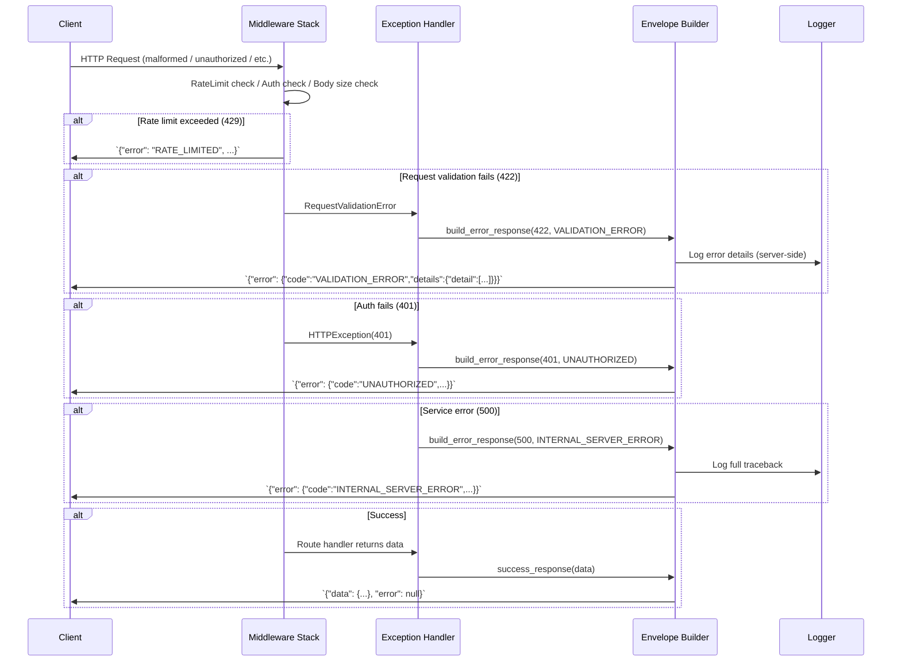

<!-- SPDX-License-Identifier: MIT -->
<!-- Copyright (c) 2026 ScholarForm AI -->

---
title: ScholarForm AI — Error Handling Architecture
description: Comprehensive reference for error handling patterns, API error envelope, status codes, and pipeline resilience
sidebar_position: 12
version: "1.0"
status: ✅ Complete
owner: Engineering
review_cadence: quarterly
last_updated: July 2026
---

# Error Handling Architecture

- [Philosophy](#1-philosophy)
- [API Error Envelope](#2-api-error-envelope)
- [HTTP Status Codes](#3-http-status-codes)
- [Error Code Reference](#4-error-code-reference)
- [Custom Exceptions](#5-custom-exceptions)
- [Exception Handlers](#6-exception-handlers)
- [Frontend Error Handling](#7-frontend-error-handling)
- [Pipeline Error Handling](#8-pipeline-error-handling)
- [Error Logging](#9-error-logging)
- [Monitoring Alerts](#10-monitoring-alerts)

---

## 1. Philosophy

ScholarForm AI follows three core error handling principles:

**Graceful degradation** — the system never crashes fatally. When an external dependency (database, LLM provider, GROBID) is unavailable, the affected feature degrades locally. The rest of the application continues serving requests. Startup steps use timeouts so a single hung dependency does not block the boot sequence.

**User-friendly messages** — error messages returned to clients are human-readable and actionable. Technical details (stack traces, internal service names) are logged server-side; the API response envelope carries only the information a user or frontend can act on.

**Envelope pattern** — every API response uses the `APIResponse` envelope (`app/schemas/api_envelope.py`). Successful responses carry `data`, errors carry `error`, and both include `request_id` and `timestamp` for tracing.

---

## 2. API Error Envelope

All API responses (both success and error) use a uniform Pydantic model defined in `app/schemas/api_envelope.py:21`:

```python
class APIResponse(BaseModel):
    data: Any           # Response payload (null on errors)
    error: Optional[APIError]  # null on success
    request_id: str     # UUID for request tracing
    timestamp: datetime # UTC timestamp
```

Error objects conform to the `APIError` sub-model:

```python
class APIError(BaseModel):
    code: str                    # Machine-readable error code (e.g. "VALIDATION_ERROR")
    message: str                 # Human-readable description
    details: Optional[dict]      # Optional structured error details
```

### 2.1 Success Response Example

```json
{
  "data": { "id": "doc-abc123", "title": "My Paper" },
  "error": null,
  "request_id": "a1b2c3d4-e5f6-7890-abcd-ef1234567890",
  "timestamp": "2026-07-16T12:34:56Z"
}
```

### 2.2 Error Response Example

```json
{
  "data": null,
  "error": {
    "code": "VALIDATION_ERROR",
    "message": "Request validation failed",
    "details": {
      "detail": [
        {
          "loc": ["body", "title"],
          "msg": "field required",
          "type": "value_error.missing"
        }
      ]
    }
  },
  "request_id": "b2c3d4e5-f6a7-8901-bcde-f12345678901",
  "timestamp": "2026-07-16T12:35:00Z"
}
```

### 2.3 Helper Functions

| Function | Location | Purpose |
|----------|----------|---------|
| `success_response(data, request_id)` | `api_envelope.py:34` | Build success envelope |
| `error_response(code, message, request_id, details)` | `api_envelope.py:38` | Build error envelope |
| `build_error_response(request, *, status_code, code, message, details)` | `main.py:152` | Full error JSON response with status code |

---

## 3. HTTP Status Codes

The following status codes are used across the API. The mapping from status code to error code is defined in `DEFAULT_ERROR_CODES` (`main.py:136`).

| Code | Name | Error Code | When Raised |
|------|------|------------|-------------|
| 200 | OK | — | Successful GET, PUT, PATCH, DELETE |
| 201 | Created | — | Successful POST (resource created) |
| 204 | No Content | — | Successful DELETE, empty response |
| 400 | Bad Request | `BAD_REQUEST` | Malformed syntax, missing required fields |
| 401 | Unauthorized | `UNAUTHORIZED` | Missing/invalid/expired Bearer token, query param token rejected |
| 403 | Forbidden | `FORBIDDEN` | Authenticated but insufficient permissions (admin required) |
| 404 | Not Found | `NOT_FOUND` | Resource does not exist |
| 409 | Conflict | `CONFLICT` | Resource state conflict (e.g. duplicate creation) |
| 413 | Payload Too Large | `PAYLOAD_TOO_LARGE` | Request body exceeds `MaxBodySizeMiddleware` limit (60 MB) |
| 422 | Validation Error | `VALIDATION_ERROR` | Request body fails Pydantic validation or schema constraints |
| 429 | Rate Limited | `RATE_LIMITED` | Per-IP or per-user rate limit exceeded |
| 500 | Internal Server Error | `INTERNAL_SERVER_ERROR` | Unhandled server-side exception |
| 501 | Not Implemented | `NOT_IMPLEMENTED` | Endpoint not yet implemented |
| 502 | Bad Gateway | `BAD_GATEWAY` | Upstream service (LLM, GROBID) returned invalid response |
| 503 | Service Unavailable | `SERVICE_UNAVAILABLE` | Database unreachable, degraded mode, maintenance |

### 3.1 Status Code Implementation Notes

- **401** — raised when Bearer token is missing, expired, revoked (JWT blacklist), or when a token is passed via query parameter (rejected for security). See `app/utils/dependencies.py:30`.
- **403** — raised by `require_admin_user` when the authenticated user lacks admin scope. See `app/utils/dependencies.py:133`.
- **413** — enforced by `MaxBodySizeMiddleware` in `app/middleware/security_headers.py`. Hard limit of 60 MB.
- **422** — handled by `RequestValidationError` handler at `main.py:668`. Returns structured field-level errors.
- **429** — enforced by `RateLimitMiddleware` (per-IP sliding window, configurable `GLOBAL_RATE_LIMIT_PER_MINUTE`) and `SlowAPIMiddleware` (when available). Uploads have a separate, stricter limit (`UPLOADS_PER_MINUTE`).

---

## 4. Error Code Reference

Error codes are defined as a lookup table in `DEFAULT_ERROR_CODES` (`main.py:136`):

```python
DEFAULT_ERROR_CODES = {
    400: "BAD_REQUEST",
    401: "UNAUTHORIZED",
    403: "FORBIDDEN",
    404: "NOT_FOUND",
    409: "CONFLICT",
    413: "PAYLOAD_TOO_LARGE",
    422: "VALIDATION_ERROR",
    429: "RATE_LIMITED",
    500: "INTERNAL_SERVER_ERROR",
    501: "NOT_IMPLEMENTED",
    502: "BAD_GATEWAY",
    503: "SERVICE_UNAVAILABLE",
}
```

| Code | Meaning | Client Action |
|------|---------|---------------|
| `BAD_REQUEST` | Request malformed | Fix request syntax and retry |
| `UNAUTHORIZED` | Not authenticated | Provide valid Bearer token or re-authenticate |
| `FORBIDDEN` | Insufficient permissions | Request admin access |
| `NOT_FOUND` | Resource missing | Verify resource identifier |
| `CONFLICT` | State conflict | Check resource state and retry with corrected data |
| `PAYLOAD_TOO_LARGE` | Body exceeds limit | Reduce payload size (max 60 MB) |
| `VALIDATION_ERROR` | Schema validation failed | Inspect `details.detail` for field-level errors |
| `RATE_LIMITED` | Rate limit exceeded | Respect `Retry-After` header and back off |
| `INTERNAL_SERVER_ERROR` | Server-side failure | Retry later; if persistent, contact support |
| `NOT_IMPLEMENTED` | Endpoint not available | Upgrade client or use alternative endpoint |
| `BAD_GATEWAY` | Upstream service failure | Retry later with exponential backoff |
| `SERVICE_UNAVAILABLE` | System in degraded mode | Wait and retry |

---

## 5. Custom Exceptions

Custom exception classes live in `app/exceptions.py`. All service-layer code should raise these instead of returning `None` or empty collections on failure.

| Exception | Raised When | Default Message |
|-----------|-------------|----------------|
| `DatabaseUnavailableError` | Database connectivity failure | "Database is currently unavailable." |
| `DocumentNotFoundError` | Requested document does not exist | "Document not found." (includes `doc_id` if provided) |
| `AuthenticationError` | Authentication failure | "Authentication failed." |
| `RateLimitExceededError` | Rate limit exceeded | "Rate limit exceeded. Please try again later." |
| `FileStorageError` | File storage operation fails | "File storage operation failed." |
| `ExternalServiceError` | External service (LLM, GROBID, OCR) fails | "External service call failed." (includes service name if provided) |

### 5.1 Usage Pattern

Exceptions carry a human-readable message as the first argument and are meant to be caught at the handler boundary (not propagated to the client directly). Example:

```python
from app.exceptions import DocumentNotFoundError

def get_document(doc_id: str) -> Document:
    result = db.fetch(doc_id)
    if not result:
        raise DocumentNotFoundError(doc_id=doc_id)
    return result
```

> **Note**: These exceptions are not automatically mapped to HTTP responses. Route handlers or dependencies should catch them and raise appropriate `HTTPException`, which the global exception handler then formats into the envelope.

---

## 6. Exception Handlers

Global exception handlers are registered on the FastAPI application in `main.py`.

### 6.1 HTTPException Handler

**Location**: `main.py:642`

Wraps all `HTTPException` instances into the standard `APIResponse` error envelope. Only V1+ requests (`/api/v1/`) are wrapped; non-API requests fall through to FastAPI's default handler.

```python
@app.exception_handler(HTTPException)
async def http_exception_handler(request: Request, exc: HTTPException):
    if not _is_v1_request(request):
        return await fastapi_http_exception_handler(request, exc)

    detail = exc.detail
    if isinstance(detail, str):
        message = detail
        details = None
    else:
        message = "Request failed"
        details = {"detail": detail}

    code = DEFAULT_ERROR_CODES.get(exc.status_code, "API_ERROR")
    response = build_error_response(
        request,
        status_code=exc.status_code,
        code=code,
        message=message,
        details=details,
    )
    for header, value in (exc.headers or {}).items():
        response.headers[header] = value
    return response
```

Key behaviors:
- String details become the `message` field directly.
- Structured details (list/dict) are placed in `details.detail`.
- Custom response headers (e.g. `WWW-Authenticate`, `Retry-After`) are propagated.

### 6.2 RequestValidationError Handler

**Location**: `main.py:668`

Handles Pydantic validation failures from FastAPI's request validation:

```python
@app.exception_handler(RequestValidationError)
async def request_validation_handler(request: Request, exc: RequestValidationError):
    if not _is_v1_request(request):
        return await fastapi_validation_exception_handler(request, exc)

    return build_error_response(
        request,
        status_code=422,
        code="VALIDATION_ERROR",
        message="Request validation failed",
        details={"detail": exc.errors()},
    )
```

Returns the raw Pydantic error list in `details.detail` so clients can display field-level errors.

### 6.3 RateLimitExceeded Handler (SlowAPI)

**Location**: `main.py:635`

When `slowapi` is available, the `RateLimitExceeded` exception is registered with the `_rate_limit_exceeded_handler`. Returns HTTP 429 with a plain error message.

### 6.4 RateLimitMiddleware Fallback Response

**Location**: `app/middleware/rate_limit.py:165`

When the custom `RateLimitMiddleware` rejects a request, it returns a direct JSON response (not via the envelope):

```json
{
  "error": "Rate limit exceeded",
  "message": "Maximum 120 requests per minute allowed.",
  "retry_after": 60
}
```

---

## 7. Frontend Error Handling

The frontend error handling layer is in `frontend/src/services/api.core.js`.

### 7.1 fetchWithAuth

Central function for all authenticated API calls. Wraps `fetch()` with:

1. **Request ID generation** — every request gets a `X-Request-Id` header via `generateRequestId()` (`api.core.js:30`).
2. **Auth header injection** — Supabase session token is retrieved and attached as `Authorization: Bearer <token>` (`api.core.js:331`).
3. **Offline detection** — if `navigator.onLine === false`, write requests throw an immediate offline error (`api.core.js:426`).
4. **Automatic retry** — retryable status codes (408, 429, 500, 502, 503, 504) and network errors are retried up to 2 times with exponential backoff (`api.core.js:279`). Only safe methods (GET, HEAD, OPTIONS) are retried.
5. **401 auto-logout** — on 401 response, `handleUnauthorizedSession()` clears Supabase auth storage, dispatches `scholarform:session-expired` custom event, and redirects to `/login` (`api.core.js:233`).
6. **User-friendly error messages** — status codes are mapped to readable strings via `getFriendlyErrorMessage()` (`api.core.js:137`).
7. **Frontend error logging** — unhandled errors are POSTed to `/api/v1/metrics/log-error` for server-side collection (`api.core.js:400`).

### 7.2 Retry Logic

```javascript
const RETRYABLE_STATUS_CODES = [408, 429, 500, 502, 503, 504];
const DEFAULT_MAX_RETRIES = 2;
const BASE_RETRY_DELAY_MS = 500;
```

Only idempotent methods (GET, HEAD, OPTIONS) are retried. Delay follows exponential backoff: `BASE_RETRY_DELAY_MS * (2 ^ attempt)`.

### 7.3 Friendly Error Message Mapping

| Status / Condition | Message |
|--------------------|---------|
| 401 (login endpoint) | "Invalid email or password." |
| 401 (other) | "Your session has expired. Please log in again." |
| 403 | "You do not have permission to perform this action." |
| 404 | "The requested resource could not be found." |
| 429 | "Too many requests right now. Please wait a moment and try again." |
| 5xx | "The server is temporarily unavailable. Please try again shortly." |
| Network error | "Unable to reach the server. Please check your internet connection and try again." |
| Server `detail` field | Returned verbatim from `extractServerErrorMessage()` |
| Fallback | "Something went wrong. Please try again." |

### 7.4 Zod Runtime Validation

`parseApiResponse()` (`api.core.js:525`) validates API responses against Zod schemas at runtime. On mismatch it either returns a `fallback` value or throws a descriptive error:

```
API contract error at "response.title": Expected string, received number
```

This catches API contract drift before it reaches UI code.

---

## 8. Pipeline Error Handling

The pipeline safety layer lives in `backend/app/pipeline/safety/`. It provides four resilience mechanisms:

### 8.1 Circuit Breaker

**File**: `circuit_breaker.py`

Prevents cascading failures by stopping calls to a repeatedly-failing function. Decorator-backed with two implementations:

- **pybreaker mode** (default when `pybreaker` is installed): uses `pybreaker.CircuitBreaker` with configurable `fail_max` and `reset_timeout`. State transitions (CLOSED, OPEN, HALF_OPEN) are logged via `_Log` listener.
- **Legacy mode** (fallback when `pybreaker` not available): maintains per-function state dict with manual CLOSED → OPEN → HALF_OPEN transitions.

```python
@circuit_breaker(failure_threshold=3, recovery_timeout=60, fallback_function=my_fallback)
def risky_llm_call(prompt: str) -> dict:
    ...
```

| Parameter | Default | Description |
|-----------|---------|-------------|
| `failure_threshold` | 3 | Consecutive failures before circuit opens |
| `recovery_timeout` | 60 | Seconds before transitioning to HALF_OPEN |
| `fallback_function` | None | Optional fallback called when circuit is open |

When a fallback is defined and also fails, the function returns `{}` (graceful empty result).

### 8.2 Retry Guard

**File**: `retry_guard.py`

Decorator and inline helper for retrying operations with exponential backoff. Supports both sync and async functions.

```python
@retry_with_backoff(max_retries=2, base_delay=1.0)
def fetch_from_external_api() -> dict:
    ...

# Inline usage:
result = execute_with_retry(risky_func, arg1, arg2, max_retries=3, backoff_factor=2.0)
```

| Parameter | Default | Description |
|-----------|---------|-------------|
| `max_retries` | 2 | Maximum retry attempts before giving up |
| `base_delay` | 1.0 | Initial delay (doubles each retry) |

The `retry_guard` alias is provided for backward compatibility.

### 8.3 Safe Execution

**File**: `safe_execution.py`

Catches and logs any exception within a context while suppressing the crash. Available as context manager and decorator.

**Context manager** — used for startup steps that should never block boot:

```python
with safe_execution("Critical Startup Step"):
    initialize_expensive_service()
```

**Decorator** — used on functions that must return a value even on failure:

```python
@safe_function(fallback_value={}, error_message="LLM call failed")
def generate_text(prompt: str) -> dict:
    ...
```

**Async decorator**:

```python
@safe_async_function(fallback_value=[])
async def batch_process(docs: list) -> list:
    ...
```

The `safe_execution` context logs the full traceback at `ERROR` level.

### 8.4 Output Validator

**File**: `validator_guard.py`

Checks function output against a Pydantic schema to prevent malformed data from propagating downstream. Returns `error_return_value` (default `{}`) on validation failure.

```python
@validate_output(schema=DocumentSchema, error_return_value=None)
def parse_llm_response(raw: str) -> dict:
    ...
```

### 8.5 LLM Validator

**File**: `llm_validator.py`

Advanced output validation using Guardrails AI (when available). Falls back to `validator_guard.validate_output` when Guardrails is not installed or Python >= 3.14.

```python
@guard_llm_output(schema=CitationSchema, error_return_value={})
def extract_citations(text: str) -> dict:
    ...
```

### 8.6 Safety Module Exports

From `pipeline/safety/__init__.py`:

```python
from .circuit_breaker import circuit_breaker
from .retry_guard import execute_with_retry, retry_with_backoff, retry_guard
from .validator_guard import validate_output
from .safe_execution import safe_execution, safe_function, safe_async_function
```

### 8.7 Graceful Degradation in Practice

Startup uses `safe_execution` to ensure no single failure blocks the application:

- GROBID probe failure → degraded PDF parsing with downstream fallbacks
- Redis connection failure → in-memory rate limiting and cache bypass
- Supabase health check failure → DB-dependent endpoints return 503 at request time
- AI model pre-load failure → lazy-loading on first use
- Enhancement manager refresh failure → default enhancement capabilities

---

## 9. Error Logging

### 9.1 Error Tracking (Sentry Removed)

Sentry error tracking has been removed. Error monitoring is handled via Prometheus metrics and structured logging.

### 9.2 Structured Logging

When `ENABLE_STRUCTURED_LOGGING` is true, `app.config.logging_config.setup_logging()` is called at startup (`main.py:36`). Module-level logging uses standard Python `logging.getLogger(__name__)` throughout.

### 9.3 Log Levels by Severity

| Level | Usage | Example |
|-------|-------|---------|
| `CRITICAL` | Data loss or security risk | Missing `ENCRYPTION_KEY` in production |
| `ERROR` | Service failure | Startup validation failure, circuit breaker open |
| `WARNING` | Degraded mode | Redis unavailable, GROBID probe failed, optional API key missing |
| `INFO` | Normal operations | Startup steps, cleanup results, model loaded |
| `DEBUG` | Troubleshooting | Queue depth fetch failures, audit middleware skipped |

### 9.4 Logging Context

All log messages include:
- Module name (via `__name__`)
- Request ID (via `get_request_id(request)` in middleware)
- Timestamp (automatic via logging config)

The `MonitoringMiddleware` (`app/middleware/monitoring.py`) adds per-request timing and structured context.

---

## 10. Monitoring Alerts

### 10.1 Prometheus Metrics

Prometheus instrumentation is exposed at `/metrics` (`main.py:682`) via `prometheus_fastapi_instrumentator`. The `MetricsManager` (`app/middleware/prometheus_metrics.py`) tracks:

- Request count and duration (per endpoint, per method, per status code)
- Celery queue depths (`interactive`, `batch`)
- User activity counts
- Error rates by status code family

### 10.2 Error Rate Alert Criteria

| Alert | Threshold | Window | Action |
|-------|-----------|--------|--------|
| High 5xx rate | >5% of requests return 5xx | 5 minutes | Page on-call engineer |
| Elevated 4xx rate | >20% of requests return 4xx | 5 minutes | Investigate client behavior changes |
| Circuit breaker open | Any circuit breaker in OPEN state | Immediate | Alert engineer; check upstream services |
| Rate limit saturation | >80% of requests hitting rate limits | 5 minutes | Consider scaling or adjusting limits |
| Redis unavailable | Rate limiter falls back to in-memory | 1 minute | Alert DevOps for Redis recovery |

### 10.3 Health Check Endpoints

| Endpoint | Purpose | Returns |
|----------|---------|---------|
| `GET /health` | Liveness | Always 200; returns dependency status |
| `GET /ready` | Readiness | 200 when all critical dependencies healthy; 503 otherwise |

The `/health` endpoint always returns 200 to prevent host-level liveness checks from flapping when optional dependencies are degraded. Strict readiness is verified via `/ready`.

### 10.4 Prometheus Alert Rule Example

```yaml
groups:
  - name: scholarform-error-rate
    rules:
      - alert: HighErrorRate5xx
        expr: |
          rate(fastapi_requests_total{status=~"5.."}[5m])
          /
          rate(fastapi_requests_total[5m]) > 0.05
        for: 2m
        labels:
          severity: critical
        annotations:
          summary: "5xx error rate > 5% over 5 minutes"
```

---

## 11. Testing — Error Handler & Envelope Tests

### Error Handler Test Patterns

Tests in `tests/test_error_handling.py` verify each exception handler produces the correct envelope response:

```python
# test_error_handling.py
async def test_http_exception_returns_envelope(client):
    response = await client.get("/api/v1/documents/nonexistent")
    assert response.status_code == 404
    body = response.json()
    assert body["data"] is None
    assert body["error"]["code"] == "NOT_FOUND"
    assert "request_id" in body
    assert "timestamp" in body

async def test_validation_error_returns_field_details(client):
    response = await client.post("/api/v1/documents/upload", json={})
    assert response.status_code == 422
    body = response.json()
    assert body["error"]["code"] == "VALIDATION_ERROR"
    assert "detail" in body["error"]["details"]

async def test_rate_limited_returns_429(client):
    # Exhaust rate limit
    for _ in range(61):
        await client.get("/api/v1/templates")
    response = await client.get("/api/v1/templates")
    assert response.status_code == 429
    assert response.json()["error"]["code"] == "RATE_LIMITED"

async def test_internal_error_returns_envelope(client):
    with patch("app.routers.v1.templates.get_template", side_effect=ValueError("test")):
        response = await client.get("/api/v1/templates")
    assert response.status_code == 500
    body = response.json()
    assert body["error"]["code"] == "INTERNAL_SERVER_ERROR"

async def test_non_v1_request_uses_default_handler(client):
    response = await client.get("/docs")
    # Non-API paths don't wrap in envelope
    assert "error" not in response.text or response.status_code in (200, 404)
```

### Envelope Format Verification

```python
# test_api_envelope_schema.py
from app.schemas.api_envelope import APIResponse, APIError

def test_success_envelope_schema():
    env = APIResponse(data={"id": "doc-1"}, error=None, request_id="abc", timestamp=datetime.now())
    assert env.data == {"id": "doc-1"}
    assert env.error is None

def test_error_envelope_schema():
    err = APIError(code="NOT_FOUND", message="Document not found", details={"doc_id": "doc-1"})
    env = APIResponse(data=None, error=err, request_id="abc", timestamp=datetime.now())
    assert env.data is None
    assert env.error.code == "NOT_FOUND"
    assert env.error.details["doc_id"] == "doc-1"
```

### Status Code Coverage Tests

```python
# test_status_code_coverage.py
STATUS_CODE_MAP = {
    400: "BAD_REQUEST", 401: "UNAUTHORIZED", 403: "FORBIDDEN",
    404: "NOT_FOUND", 409: "CONFLICT", 413: "PAYLOAD_TOO_LARGE",
    422: "VALIDATION_ERROR", 429: "RATE_LIMITED", 500: "INTERNAL_SERVER_ERROR",
    501: "NOT_IMPLEMENTED", 502: "BAD_GATEWAY", 503: "SERVICE_UNAVAILABLE",
}

@pytest.mark.parametrize("status_code,expected_code", STATUS_CODE_MAP.items())
async def test_all_status_codes_map_to_error_codes(status_code, expected_code, client):
    # Test that each status code produces the correct error code in the envelope
    ...
```

### Error Flow Diagram



## 12. API Reference — Error Response Examples

### 400 Bad Request

```json
{
  "data": null,
  "error": { "code": "BAD_REQUEST", "message": "Request validation failed", "details": null },
  "request_id": "a1b2c3d4-e5f6-7890-abcd-ef1234567890",
  "timestamp": "2026-07-16T12:34:56Z"
}
```

### 401 Unauthorized

```json
{
  "data": null,
  "error": { "code": "UNAUTHORIZED", "message": "Not authenticated", "details": null },
  "request_id": "b2c3d4e5-f6a7-8901-bcde-f12345678901",
  "timestamp": "2026-07-16T12:34:57Z"
}
```

### 403 Forbidden

```json
{
  "data": null,
  "error": { "code": "FORBIDDEN", "message": "Insufficient permissions", "details": null },
  "request_id": "c3d4e5f6-a7b8-9012-cdef-123456789012",
  "timestamp": "2026-07-16T12:34:58Z"
}
```

### 404 Not Found

```json
{
  "data": null,
  "error": { "code": "NOT_FOUND", "message": "Document not found", "details": null },
  "request_id": "d4e5f6a7-b8c9-0123-defa-234567890123",
  "timestamp": "2026-07-16T12:34:59Z"
}
```

### 422 Validation Error

```json
{
  "data": null,
  "error": {
    "code": "VALIDATION_ERROR",
    "message": "Request validation failed",
    "details": {
      "detail": [{ "loc": ["body", "title"], "msg": "field required", "type": "value_error.missing" }]
    }
  },
  "request_id": "e5f6a7b8-c9d0-1234-efab-345678901234",
  "timestamp": "2026-07-16T12:35:00Z"
}
```

### 429 Rate Limited

```json
{
  "data": null,
  "error": { "code": "RATE_LIMITED", "message": "Maximum 120 requests per minute allowed.", "details": { "retry_after": 60 } },
  "request_id": "f6a7b8c9-d0e1-2345-fabc-456789012345",
  "timestamp": "2026-07-16T12:35:01Z"
}
```

### 503 Service Unavailable

```json
{
  "data": null,
  "error": { "code": "SERVICE_UNAVAILABLE", "message": "Database is currently unavailable.", "details": null },
  "request_id": "a7b8c9d0-e1f2-3456-abcd-567890123456",
  "timestamp": "2026-07-16T12:35:02Z"
}
```

## See Also

- [API Reference](API.md) — endpoint documentation
- [Testing Architecture](TESTING_ARCHITECTURE.md) — test coverage for error paths
- [Monitoring & Observability](MONITORING_OBSERVABILITY.md) — metrics and logging infrastructure
- [Deployment Guide](Deployment.md) — environment configuration
- [Security Architecture](SECURITY_ARCHITECTURE.md) — middleware security layers
- [Configuration Reference](CONFIGURATION_REFERENCE.md) — rate limit and timeout settings
