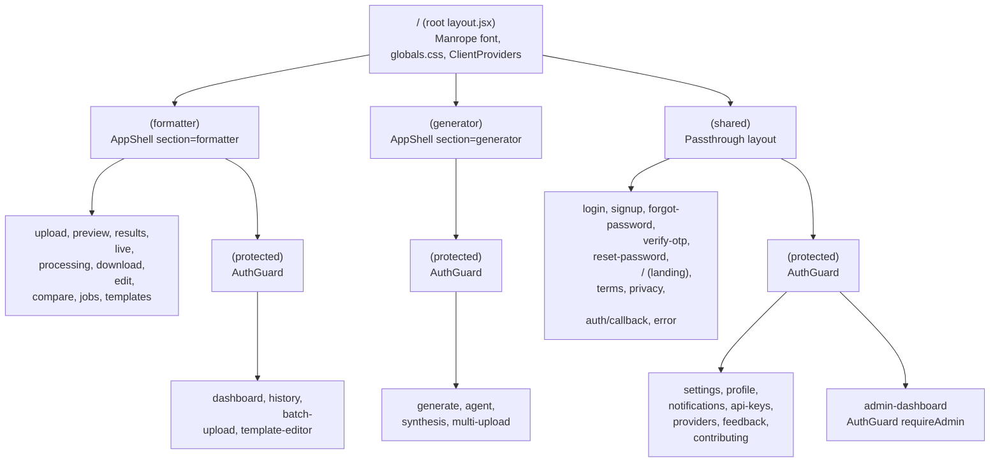

# ScholarForm AI — Frontend Architecture

## 1. Overview

ScholarForm AI is a Next.js-based academic manuscript formatting platform that allows researchers to upload `.docx` papers and receive publication-ready output formatted for any journal (IEEE, APA, Springer, Nature, Elsevier, and 1000+ templates). The frontend handles document upload, AI-powered formatting, live preview, agent-based manuscript generation, multi-document synthesis, template management, and admin monitoring.

**Architectural philosophy:** server-rendered shells with client-side hydration for interactivity. Security-sensitive auth is enforced at the middleware (edge) layer; business-level state uses React Context + TanStack React Query. Real-time features use Server-Sent Events (SSE) for job streaming and WebSocket for collaborative live editing.

## 2. Technology Stack

| Category | Technology | Version | Purpose |
|----------|-----------|---------|---------|
| Framework | Next.js | ^16.1.6 | App Router, server components, Turbopack dev |
| UI Library | React | ^19.2.7 | Component model, hooks, concurrent features |
| Styling | Tailwind CSS 3 | ^3.4.1 | Utility-first CSS via PostCSS |
| Auth | Supabase SSR | ^0.12.0 + ^2.94.0 | JWT-based auth, OAuth (Google), session management |
| Data Fetching | TanStack React Query | ^5.90.21 | Server state, caching, background refetch |
| Rich Text | Tiptap | ^3.20.5 | ProseMirror-based document editing (tables, character count, placeholder) |
| Animation | Framer Motion | ^12.35.2 | Page transitions, micro-interactions |
| Validation | Zod | ^4.3.6 | Runtime schema validation for forms, API responses, agent inputs |
| Icons | Lucide React + Material Symbols | 0.577.0 + CDN | Icon system |
| Testing | Vitest + Testing Library | ^4.1.8 | Unit/integration tests |
| E2E Testing | Playwright | ^1.58.2 | Headless browser E2E tests |
| A11y Testing | jest-axe | ^10.0.0 | Automated accessibility checks |
| WebSocket | Custom `ReconnectingWebSocket` | — | Live preview collaboration |
| PWA | next-pwa | ^5.6.0 | Service worker, offline support |
| Resizable Panels | react-resizable-panels | ^4.11.2 | Split-pane editor layouts |
| File Upload | react-dropzone | ^15.0.0 | Drag-and-drop file selection |

### Key Framework Decisions

- **No Vite.** The app was migrated from Vite to Next.js App Router. All `VITE_*` env vars are legacy refs.
- **No `@supabase/ssr` middleware.** JWT verification in `middleware.js` uses a raw `createClient` with `SUPABASE_SERVICE_ROLE_KEY` and cookie parsing instead of the Supabase SSR helper — chosen to support chunked cookies for large JWTs.
- **next-themes for dark mode.** `ThemeProvider` wraps `next-themes` with `attribute="class"` strategy, syncing the preference to Supabase `user_metadata`.
- **Turbopack dev server.** `next dev --turbopack` for faster iteration.

## 3. Project Structure

```
frontend/
├── app/                              # Next.js App Router pages
│   ├── layout.jsx                    # Root layout (Manrope font, globals.css, ClientProviders)
│   ├── globals.css                   # Tailwind directives + custom CSS
│   ├── manifest.json                 # PWA manifest
│   ├── (formatter)/                  # Route group: Document formatter
│   │   ├── layout.jsx                #   → AppShell section="formatter"
│   │   ├── loading.jsx               #   Route-level loading state
│   │   ├── error.jsx                 #   Route-level error boundary
│   │   ├── upload/page.jsx
│   │   ├── preview/page.jsx
│   │   ├── results/page.jsx
│   │   ├── live/page.jsx
│   │   ├── processing/page.jsx
│   │   ├── download/page.jsx
│   │   ├── edit/page.jsx
│   │   ├── compare/page.jsx
│   │   ├── jobs/page.jsx
│   │   ├── templates/page.jsx
│   │   ├── jobs/[jobId]/[step]/page.jsx
│   │   └── (protected)/             #   Wrapped in AuthGuard
│   │       ├── layout.jsx
│   │       ├── dashboard/page.jsx
│   │       ├── history/page.jsx
│   │       ├── batch-upload/page.jsx
│   │       └── template-editor/page.jsx
│   ├── (generator)/                  # Route group: AI generation
│   │   ├── layout.jsx                #   → AppShell section="generator"
│   │   ├── loading.jsx
│   │   ├── error.jsx
│   │   └── (protected)/
│   │       ├── layout.jsx            #   AuthGuard
│   │       ├── generate/page.jsx
│   │       ├── agent/page.jsx
│   │       ├── synthesis/page.jsx
│   │       ├── multi-upload/page.jsx
│   │       └── generate/_components/ #  StepIndicator, TemplateStep, DocTypeStep,
│   │                                 #  MetadataStep, GenerateStep, useGeneratorState.js
│   └── (shared)/                     # Route group: Landing, auth, settings
│       ├── layout.jsx                #   Passthrough (no AppShell)
│       ├── page.jsx                  #   Landing page
│       ├── loading.jsx
│       ├── error.jsx
│       ├── login/page.jsx
│       ├── signup/page.jsx
│       ├── forgot-password/page.jsx
│       ├── verify-otp/page.jsx
│       ├── reset-password/page.jsx
│       ├── auth/callback/page.jsx
│       ├── terms/page.jsx
│       ├── privacy/page.jsx
│       ├── error/page.jsx
│       ├── components/LandingSections.jsx
│       └── (protected)/             #  AuthGuard (or requireAdmin for admin)
│           ├── layout.jsx
│           ├── settings/page.jsx
│           ├── profile/page.jsx
│           ├── notifications/page.jsx
│           ├── api-keys/page.jsx
│           ├── api-keys/usage/page.jsx
│           ├── providers/page.jsx
│           ├── feedback/page.jsx
│           ├── contributing/page.jsx
│           └── admin-dashboard/
│               ├── layout.jsx        # AuthGuard requireAdmin
│               ├── page.jsx
│               └── error.jsx
├── src/
│   ├── components/
│   │   ├── layout/                   # Shell components
│   │   │   ├── AppShell.jsx          #   Header + Sidebar + main content orchestrator
│   │   │   ├── ClientProviders.jsx   #   All context providers
│   │   │   ├── AuthGuard.jsx         #   Client-side auth route guard
│   │   │   ├── Header.jsx
│   │   │   ├── Sidebar.jsx
│   │   │   ├── FocusManager.jsx      #   Keyboard focus ring management
│   │   │   ├── DynamicMeta.jsx       #   Dynamic meta tag injection
│   │   │   └── JobStatusCard.jsx
│   │   ├── ui/                       # Primitive UI components
│   │   │   ├── Button.jsx
│   │   │   ├── Card.jsx
│   │   │   ├── Input.jsx
│   │   │   ├── Badge.jsx
│   │   │   ├── Skeleton.jsx
│   │   │   ├── EmptyState.jsx
│   │   │   ├── ConfirmDialog.jsx
│   │   │   ├── Minimap.jsx
│   │   │   └── index.js              # Barrel export
│   │   ├── Toast.jsx                 # Toast notification component
│   │   ├── ConfirmDialog.jsx         # Confirm dialog provider
│   │   ├── OnboardingTour.jsx
│   │   └── ...                       # Feature components (generator/, upload/, etc.)
│   ├── context/                      # React Context providers
│   │   ├── AuthContext.jsx
│   │   ├── ThemeContext.jsx
│   │   ├── ToastContext.jsx
│   │   ├── DocumentContext.jsx
│   │   └── UserPreferencesContext.jsx
│   ├── hooks/                        # Custom React hooks (14 total)
│   │   ├── useAgent.js
│   │   ├── useAgentEvents.js
│   │   ├── useAutosave.js
│   │   ├── useDebounce.js
│   │   ├── useGeneratorSessionStream.js
│   │   ├── useJobFromUrl.js
│   │   ├── useLivePreviewSocket.js
│   │   ├── usePageTitle.js
│   │   ├── useSSEStream.js
│   │   ├── useScrollReveal.js
│   │   ├── useSessionEventStream.js
│   │   ├── useSynthesisSessionStream.js
│   │   ├── useUnsavedChanges.js
│   │   └── useUpload.js
│   ├── services/                     # API client layer
│   │   ├── api.js                    #   Barrel export
│   │   ├── api.core.js               #   Base: fetchWithAuth, sanitize, retry, auth recovery
│   │   ├── api.v1.js                 #   V1 wrapper: idempotency, envelope unwrapping
│   │   ├── api.auth.js               #   Auth endpoints (login, signup, OTP, Google OAuth)
│   │   ├── api.documents.js          #   Document CRUD, upload, chunked upload, download
│   │   ├── api.generation.js         #   Generation + SSE streaming
│   │   ├── api.generator.v1.js       #   Agent session CRUD, messages, outline
│   │   ├── api.synthesis.js          #   Multi-doc synthesis
│   │   ├── api.templates.js          #   Built-in/custom templates, CSL search
│   │   ├── api.metrics.js            #   Health, dashboard, feedback, error logging
│   │   ├── api.keys.js               #   API key CRUD, provider management
│   │   ├── api.preview.v1.js         #   HTTP preview fallback + AI suggestions SSE
│   │   └── api.hooks.js              #   TanStack Query hooks (useDocuments, useDocumentStatus,
│   │                                 #   useMetricsHealth, useMetricsDashboard, useJobStatusSSE)
│   ├── lib/                          # Utilities and third-party wrappers
│   │   ├── supabaseClient.js         #   Supabase client factory (null-safe)
│   │   ├── schemas.js                #   Zod schemas (forms, API responses, agent, synthesis)
│   │   ├── ReconnectingWebSocket.js  #   WebSocket with exponential backoff + jitter
│   │   ├── planTier.js               #   User tier/ quota logic (guest, free, pro)
│   │   ├── metrics.js                #   Front-end Prometheus histogram for RUM
│   │   └── rum.js                    #   RUM placeholder
│   ├── constants/
│   │   └── status.js                 #   STATUS enum + helpers (isCompleted, isProcessing, isFailed)
│   └── test/
│       ├── setup.js                  #   Vitest setup (jsdom, matchers)
│       └── ...                       #   Test files co-located or in __tests__/
├── e2e/                              # Playwright E2E tests
├── __mocks__/                        # Vitest manual mocks
│   └── next/
│       └── navigation.js
├── public/                           # Static assets (PWA service worker injected by next-pwa)
├── middleware.js                      # Edge-level auth + 25-route matcher
├── next.config.mjs                   # PWA + headers + rewrites
├── tailwind.config.js                # Custom theme, colors, glassmorphism
├── vitest.config.js                  # Vitest with jsdom, path aliases
├── eslint.config.js                  # Flat config (JS ESLint 9)
├── jsconfig.json                     # Path aliases (@/, @/components/*, etc.)
├── postcss.config.js
├── playwright.config.js              # E2E config
├── lighthouserc.js                   # Lighthouse CI thresholds
└── .env.template                     # Env var reference
```

### Path Aliases (`jsconfig.json`)

| Alias | Resolves To |
|-------|-------------|
| `@/` | `./` (project root) |
| `@/components/*` | `./src/components/*` then `./components/*` |
| `@/context/*` | `./src/context/*` |
| `@/hooks/*` | `./src/hooks/*` |
| `@/services/*` | `./src/services/*` |
| `@/lib/*` | `./src/lib/*` then `./lib/*` |
| `@/constants/*` | `./constants/*` then `./src/constants/*` |

## 4. Routing Architecture

### 4.1 Route Groups

The app uses three route groups to organize layouts and enforce different shells:



### 4.2 Route Protection

The `middleware.js` file runs at the Edge for every matching route. It:

1. Parses Supabase session cookies from the request (handles both single-cookie and chunked `sb-*-auth-token.*` formats)
2. Verifies the JWT with `supabaseAdmin.auth.getUser(token)` (the service role key)
3. Redirects to `/login?reason=auth_required` if no valid token (or `reason=session_expired` if exp is past)
4. Returns 403 JSON for admin routes (`/admin-dashboard/*`) if the user lacks `app_metadata.role === 'admin'` or `user_metadata.role === 'admin'`

**25 protected route patterns** matched by the `config.matcher` array:

| Group | Routes |
|-------|--------|
| Formatter | `/dashboard/*`, `/upload/*`, `/history/*`, `/batch-upload/*`, `/templates/*`, `/template-editor/*`, `/edit/*`, `/preview/*`, `/compare/*`, `/processing/*`, `/results/*`, `/live/*`, `/download/*` |
| Generator | `/agent/*`, `/generate/*`, `/multi-upload/*`, `/synthesis/*` |
| Shared protected | `/settings/*`, `/profile/*`, `/feedback/*`, `/notifications/*`, `/api-keys/*`, `/providers/*`, `/contributing/*` |
| Admin | `/admin-dashboard/*` |

Additionally, `AuthGuard.jsx` provides **client-side** protection for routes nested under `(protected)/` sub-layouts. It guards against stale sessions that the edge middleware might have missed (e.g., in-app navigation via `router.push` that doesn't trigger a server request).

`AdminDashboardLayout` wraps in `<AuthGuard requireAdmin>` to enforce admin role at the client level.

### 4.3 Nested Layout Hierarchy

```
RootLayout (html, body, ClientProviders)
├── (shared)/layout                (passthrough)
│   ├── (shared)/(protected)/layout  (AuthGuard)
│   │   ├── admin-dashboard/layout  (AuthGuard requireAdmin)
│   │   └── ...
│   └── login, signup, etc.         (public)
├── (formatter)/layout              (AppShell section="formatter")
│   ├── upload, preview, etc.       (public, but middleware-protected)
│   └── (protected)/layout          (AuthGuard + Toast + ConfirmProvider)
│       ├── dashboard
│       ├── history
│       ├── batch-upload
│       └── template-editor
└── (generator)/layout              (AppShell section="generator")
    └── (protected)/layout          (AuthGuard + Toast + ConfirmProvider)
        ├── generate
        ├── agent
        ├── synthesis
        └── multi-upload
```

## 5. State Management

### 5.1 React Context Layer

Five providers, nested in `ClientProviders.jsx`:

```
QueryClientProvider
└── ThemeProvider (next-themes wrapper + Supabase sync)
    └── ToastProvider (queue-based toast notifications)
        └── AuthProvider (user, session, signIn/signOut/refreshSession)
            └── UserPreferencesProvider (fastMode, statusUpdates, newsletter)
                └── DocumentProvider (current job, processing state)
                    └── FocusManager + DynamicMeta + children
```

| Context | Purpose | Key State |
|---------|---------|-----------|
| `AuthContext` | User authentication lifecycle | `user`, `isLoggedIn`, `loading` |
| `ThemeContext` | Dark/light mode with Supabase sync | `theme`, `toggleTheme`, `systemPrefersDark` |
| `ToastContext` | Non-blocking notification toasts | `showToast(type, msg, duration)`, `dismiss(id)` |
| `DocumentContext` | Current formatting job state | `job`, `setJob`, `processing`, `startProcessing`, `finishProcessing`, `failProcessing` |
| `UserPreferencesContext` | User settings (persisted to localStorage + Supabase) | `preferences`, `setPreference(key, value)` |

**Auth flow** (`AuthProvider`):
1. On mount: calls `supabase.auth.getSession()` for fast local JWT check, then `supabase.auth.getUser()` for server verification
2. Rejects cached sessions that fail server verification by calling `supabase.auth.signOut({ scope: 'local' })`
3. Listens to `onAuthStateChange` for `SIGNED_IN`, `SIGNED_OUT`, `TOKEN_REFRESHED` events
4. Uses `signingInRef` ref guard to prevent spurious `SIGNED_OUT` events during OAuth flow (Supabase fires `SIGNED_OUT` before `SIGNED_IN` during `setSession`)
5. `signIn()` calls backend login API, then calls `supabase.auth.setSession()` to persist tokens
6. Supports E2E test mode via `scholarform_e2e_user` sessionStorage key

**Theme sync**: `ThemeProvider` wraps `next-themes`'s `ThemeProvider` (with `attribute="class"`, `defaultTheme="light"`). On mount, reads `user_metadata.theme` from Supabase. `toggleTheme()` calls `supabase.auth.updateUser({ data: { theme } })`.

**Document persistence**: `DocumentProvider` syncs `job` to `sessionStorage` key `scholarform_currentJob` and hydrates from it on mount, providing crash resilience.

**Toast architecture**: `ToastProvider` maintains a queue (max 5 toasts). Each toast has auto-dismiss via `setTimeout` with a progress bar animated via `requestAnimationFrame`. Supports 4 types: `success`, `error`, `warning`, `info`.

### 5.2 TanStack React Query

Defined in `api.hooks.js`:

| Hook | Query Key | Endpoint | Caching |
|------|-----------|----------|---------|
| `useDocuments(params)` | `['documents', normalizedParams]` | `GET /api/v1/documents` | Default (staleTime 10s) |
| `useDocumentStatus(jobId)` | `['document-status', jobId]` | `GET /api/v1/documents/{id}/status` | Configurable `refetchInterval` |
| `useMetricsHealth()` | `['metrics-health']` | `GET /api/v1/health/ready` | `retry: false`, no refetch on focus |
| `useMetricsDashboard()` | `['metrics-dashboard']` | `GET /api/v1/metrics/dashboard` | `retry: false`, no refetch on focus |
| `useJobStatusSSE(jobId, opts)` | Hybrid SSE + poll fallback | `GET /api/v1/stream/{id}` or `GET /api/v1/documents/{id}/status` | SSE with 2500ms fallback polling |

**QueryClient defaults** (set in `ClientProviders.jsx`):
- `staleTime: 10000` (10s)
- `refetchOnWindowFocus: false`
- `retry: 1`

### 5.3 Custom Hooks (14 total)

| Hook | File | Purpose | Key Return Values |
|------|------|---------|-------------------|
| `useAgent()` | `useAgent.js` | Agent session lifecycle (start, message, stop, approve outline, load existing) | `activeSessionId`, `messages[]`, `sessionState`, `outlineData`, `isTyping`, `error` |
| `useAgentEvents()` | `useAgentEvents.js` | Manages EventSource for agent SSE events (`outline_chunk`, `stage_update`) | Side-effect only; populates outline, messages, session state |
| `useAutosave()` | `useAutosave.js` | Auto-saves generator form to localStorage every 10s; restores drafts <24h old | `restoreDraft()`, `clearDraft()` |
| `useDebounce(value, delay)` | `useDebounce.js` | Generic debounce hook (300ms default) | `debouncedValue` |
| `useGeneratorSessionStream()` | `useGeneratorSessionStream.js` | SSE listener for generator session events (stage, token, outline, complete) | `status`, `stages[]`, `reconnectCount`, `latencyMs` |
| `useJobFromUrl()` | `useJobFromUrl.js` | Reads `jobId` from URL params, fetches job summary if not in DocumentContext | `job`, `isLoading`, `error` |
| `useLivePreviewSocket()` | `useLivePreviewSocket.js` | WebSocket connection for live preview; sends content, receives rendered HTML | `html`, `latencyMs`, `warnings[]`, `isConnected`, `isReconnecting`, `sendContent()` |
| `usePageTitle(title)` | `usePageTitle.js` | Sets `document.title` with `— ScholarForm AI` suffix; restores on unmount | Side-effect only |
| `useSSEStream()` | `useSSEStream.js` | Generic SSE hook with auth token injection, exponential backoff reconnect | `eventSource`, `status`, `reconnectCount` |
| `useScrollReveal()` | `useScrollReveal.js` | IntersectionObserver-driven reveal animation; respects `prefers-reduced-motion` | `ref` (attach to element) |
| `useSessionEventStream()` | `useSessionEventStream.js` | Higher-level SSE hook for synthesis/generator event streams with stage tracking | `stages[]`, `currentStage`, `progress`, `isComplete`, `error` |
| `useSynthesisSessionStream()` | `useSynthesisSessionStream.js` | SSE listener for multi-doc synthesis (stage_start, stage_complete, synthesis_complete) | `status`, `stages[]`, `reconnectCount`, `latencyMs` |
| `useUnsavedChanges(isDirty)` | `useUnsavedChanges.js` | `beforeunload` handler to warn on unsaved changes | Side-effect only |
| `useUpload()` | `useUpload.js` | Full upload workflow: file selection, chunked/normal upload, progress, status polling, notification, retry, redirect | `file`, `isProcessing`, `progress`, `currentStep`, `startUpload()`, `cancelUpload()` |

## 6. API Client Architecture

### 6.1 Layered Design

```
Layer 4: api.js (barrel export)
         Re-exports from api.core, api.auth, api.documents, api.templates,
         api.generation, api.metrics, api.hooks

Layer 3: Domain services
         api.auth.js        — signup, login, forgotPassword, verifyOtp, resetPassword, googleAuth
         api.documents.js   — getDocuments, uploadDocument (FormData), uploadDocumentWithProgress
                              (XHR), uploadChunked, getJobStatus, getPreview, getComparison,
                              submitEdit, downloadFile, downloadExport, deleteDocument, getJobSummary
         api.generation.js  — generateDocument, getGenerationStatus, streamGenerationStatus
                              (ReadableStream SSE), downloadGeneratedDocument
         api.generator.v1.js— createSession, createAgentSession, getSession, getSessionMessages,
                              getSessionDocument, sendMessage, approveOutline, stopSession
         api.synthesis.js   — createSynthesisSession, getSynthesisSession, sendSynthesisMessage
         api.templates.js   — getBuiltinTemplates (with fallback), searchCSLStyles, fetchCSLStyle,
                              getCustomTemplates, saveCustomTemplate
         api.metrics.js     — getMetricsHealth, getMetricsDashboard, logFrontendError,
                              submitFeedback, getFeedbackSummary
         api.keys.js        — listApiKeys, createApiKey, updateApiKey, deleteApiKey,
                              testApiKey, getApiKeyUsage, getUsageStats, getSupportedProviders
         api.preview.v1.js  — getPreviewHtml (HTTP fallback), getAiSuggestion (SSE EventSource)

Layer 2: api.v1.js (v1 envelope wrapper)
         GET/POST/PUT/DELETE helpers with:
         - Automatic Idempotency-Key header for POSTs (SHA-256 hash, 5-min sessionStorage cache)
         - X-Request-Id header on every call
         - Envelope unwrapping: returns { data, error, requestId, timestamp }
         - Response Zod validation (GeneratorSessionsResponseSchema)

Layer 1: api.core.js (base transport)
         fetchWithAuth(endpoint, options):
         - Injects Authorization: Bearer <token> (from Supabase session, with 300ms retry)
         - Passes credentials: 'include'
         - Handles offline detection (navigator.onLine) with friendly error
         - 401 handling: calls supabase.auth.signOut(), clears sb-* storage, dispatches
           'scholarform:session-expired' custom event, redirects to /login with next param
         - Auth recovery deduplication via AUTH_RECOVERY_IN_FLIGHT Map
         fetchWithRetry(url, options, retryConfig):
         - Retries on 408/429/500-504 and network errors (GET/HEAD/OPTIONS only)
         - Exponential backoff: 500ms * 2^attempt, max 2 retries by default
         parseResponseData(response): JSON or text with fallback
         sanitizePayload(payload): Recursive HTML entity decoding + control char removal
         getFriendlyErrorMessage(status, errorData): User-facing messages per status code
         parseApiResponse(schema, data): Runtime Zod validation for API contract drift
         sendFrontendErrorLog(error): POST to /api/v1/metrics/log-error
```

### 6.2 Auth Token Flow

```
1. User signs in via login page
   → POST /api/v1/auth/login (fetchWithAuth)
   → Backend returns { session: { access_token, refresh_token } }
   → AuthContext.signIn() calls supabase.auth.setSession() to persist tokens
   → Supabase writes to localStorage key sb-<ref>-auth-token (.0, .1, … chunked)

2. Subsequent page loads
   → RootLayout renders → ClientProviders mounts → AuthProvider reads supabase.auth.getSession()
   → API call triggered → fetchWithAuth calls supabase.auth.getSession() → injects Bearer token

3. Server-side (middleware.js)
   → Edge request arrives at protected route
   → extractAccessToken() parses cookie header for sb-*-auth-token pattern
   → Decodes JWT payload for exp check
   → Verifies via supabaseAdmin.auth.getUser(token) (service role key)
   → 403 for expired/invalid tokens; redirect for missing tokens

4. Token refresh
   → Supabase SDK handles refresh automatically via onAuthStateChange('TOKEN_REFRESHED')
   → AuthContext handles TOKEN_REFRESHED event: setUser(session.user), setIsLoggedIn(true)
```

### 6.3 Error Handling

- **401 responses**: `handleUnauthorizedSession()` — signs out locally, clears Supabase auth storage (`sb-*` keys from localStorage + sessionStorage), dispatches `scholarform:session-expired`, redirects to `/login` (with `?next=` param for post-login redirect). Deduplicates concurrent 401s via `AUTH_RECOVERY_IN_FLIGHT` Map.
- **Retryable failures (408, 429, 500-504, network errors)**: `fetchWithRetry` retries up to 2 times with exponential backoff (500ms → 1000ms → 2000ms). Only retries safe methods (GET, HEAD, OPTIONS).
- **User-friendly messages**: `getFriendlyErrorMessage()` maps status codes to human-readable strings (e.g., 401 → "Your session has expired. Please log in again."). Falls back to server `error.detail` field if available.
- **Monitoring**: Errors are logged via `sendFrontendErrorLog()` to `POST /api/v1/metrics/log-error` unless `suppressMonitoring: true`.
- **Offline detection**: Before mutating requests (POST/PUT/DELETE/PATCH), checks `navigator.onLine` and throws if offline.
- **Runtime contract drift**: `parseApiResponse(schema, data)` validates API responses against Zod schemas and throws descriptive errors on mismatch. Schemas applied: `JobStatusResponseSchema`, `DocumentListResponseSchema`, `GeneratorSessionsResponseSchema`.

## 7. Component Architecture

### 7.1 UI Component Library

All primitives in `src/components/ui/`, re-exported via `index.js`:

| Component | Props | Notes |
|-----------|-------|-------|
| `Button` | `variant`, `size`, `loading`, `disabled`, `icon` | Supports loading spinner, multiple variants |
| `Card` | `title`, `subtitle`, `children`, `className` | Container card with optional header |
| `Input` | `label`, `error`, `icon`, `type` | Form input with label and error state |
| `Badge` | `variant`, `children` | Status/category labels |
| `Skeleton` | `width`, `height`, `rounded` | Loading placeholder |
| `EmptyState` | `icon`, `title`, `description`, `action` | Empty/no-results state |
| `ConfirmDialog` | `open`, `onConfirm`, `onCancel`, `title`, `message` | Confirmation modal |
| `Minimap` | `sections`, `activeSection`, `onSectionClick` | Document outline minimap |

### 7.2 Layout Components

| Component | Location | Role |
|-----------|----------|------|
| `AppShell` | `components/layout/AppShell.jsx` | Top-level shell: renders Header + Sidebar + main content area. Manages desktop/mobile sidebar toggle. Detects auth routes, landing routes, and sidebar routes. Redirects logged-in users from `/` to `/dashboard`. Applies glassmorphism background (`backdrop-blur-xl`). |
| `Header` | `components/layout/Header.jsx` | Fixed top bar (48px). Shows section title, sidebar toggle button, user menu. Always rendered. |
| `Sidebar` | `components/layout/Sidebar.jsx` | Collapsible nav (240px expanded, 72px collapsed). Section-aware (formatter vs generator links). Mobile overlay mode. |
| `AuthGuard` | `components/layout/AuthGuard.jsx` | Client-side route guard. Shows loading spinner while `AuthContext.loading`. Redirects unauthenticated to `/login?next=...`. Optional `requireAdmin` prop for admin routes. |
| `FocusManager` | `components/layout/FocusManager.jsx` | Manages visible focus ring (`:focus-visible` vs `:focus`) for keyboard navigation. |
| `DynamicMeta` | `components/layout/DynamicMeta.jsx` | Updates page meta tags dynamically. |

### 7.3 Feature Components

Key feature components (non-layout) found across the app:

| Area | Components |
|------|------------|
| Generator wizard | `_components/StepIndicator.jsx`, `TemplateStep.jsx`, `DocTypeStep.jsx`, `MetadataStep.jsx`, `GenerateStep.jsx`, `useGeneratorState.js` |
| Landing page | `components/LandingSections.jsx` |
| Toast/Feedback | `components/Toast.jsx`, `components/ConfirmDialog.jsx` |
| Onboarding | `components/OnboardingTour.jsx` |

## 8. Real-time Architecture

### 8.1 SSE Streaming

Three SSE hooks built on `useSSEStream` (which uses the native `EventSource` API):

```
useSSEStream(sessionId, getEventsUrl, { maxRetries, streamName })
├── useGeneratorSessionStream()  →  /api/v1/generator/sessions/{id}/events
│   Events: connected, stage, token, outline, complete, error
│   Used by: generator agent page
├── useSynthesisSessionStream()  →  /api/v1/synthesis/sessions/{id}/events
│   Events: connected, stage_start, stage_complete, synthesis_complete, error
│   Used by: multi-doc synthesis page
└── useSessionEventStream()      →  Generic wrapper
    Events: onmessage (JSON), progress tracking, completion/error detection
    Used by: synthesis and generator flows
```

Additional SSE:
- `streamGenerationStatus()` in `api.generation.js` — a ReadableStream-based SSE reader (not `EventSource`) that connects to `/api/v1/stream/{jobId}`. Parses `event:` and `data:` lines from fetch body. Used by `useJobStatusSSE` hook for document processing status. Falls back to polling `useDocumentStatus` when `ReadableStream` is unavailable.
- `getAiSuggestion()` in `api.preview.v1.js` — returns an `EventSource` for `/api/v1/preview/{sessionId}/ai-suggest`.

**Reconnection strategy** in `useSSEStream`: exponential backoff with cap (min 1s, max 30s for infinite retries; 2^attempt * 1000ms for finite). On max retries exceeded, calls `onMaxRetriesExceeded` callback.

### 8.2 WebSocket

`ReconnectingWebSocket` (`src/lib/ReconnectingWebSocket.js`) wraps the native `WebSocket` API with:
- Automatic reconnection with **exponential backoff + jitter** (default: initialDelay=1000ms, maxDelay=30000ms, factor=2, jitter=0.3)
- Configurable `maxRetries` (default: Infinity)
- Optional `shouldReconnect` filter callback
- Exposed events: `onopen`, `onmessage`, `onclose`, `onerror`, `onreconnect({ attempt, delay })`
- `forcedClose` flag prevents reconnection on intentional close

### 8.3 Live Preview

`useLivePreviewSocket(sessionId)` connects to `ws://<api>/api/v1/ws/preview/<sessionId>`:

1. Sends debounced content payloads (200ms debounce) with structure: `{ content, templateId, cursor, checksum, seq }`
2. Receives `{ html, warnings }` responses from the server
3. Queues payloads while disconnected; replays on reconnect
4. Reports connection state: `isConnected`, `isReconnecting`, `reconnectAttempt`, `isAnalyzing`, `latencyMs`

HTTP fallback available via `getPreviewHtml(content, templateId)` in `api.preview.v1.js` for when WebSocket is unavailable.

## 9. Styling Architecture

**Tailwind CSS 3** with `darkMode: "class"` strategy (triggered by `next-themes` adding/removing the `dark` class on `<html>`).

### Custom Theme (`tailwind.config.js`)

| Token | Value |
|-------|-------|
| `font-display` | `var(--font-manrope)`, "Manrope", sans-serif |
| `border-radius` | Default: 0.5rem, lg: 1rem, xl: 1.5rem, 2xl: 2rem |
| `transition-timing` | `spring: cubic-bezier(0.175, 0.885, 0.32, 1.275)` |

### Color Palette

| Token | Light | Dark |
|-------|-------|------|
| `background` | `#f6f6f8` | `#09090b` |
| `primary` | `#136dec` | `#136dec` |
| `primary-hover` | `#0f5bbd` | `#0f5bbd` |
| `primary-light` | `#4d94f8` | `#4d94f8` |
| `primary-dark` | `#0d4faa` | `#0d4faa` |
| `success` | `#10b981` | `#10b981` |
| `warning` | `#f59e0b` | `#f59e0b` |
| `error` | `#ef4444` | `#ef4444` |
| `info` | `#3b82f6` | `#3b82f6` |
| `secondary` | `#6b7280` | `#6b7280` |

### Glassmorphism

Applied via CSS classes in `AppShell.jsx`:

```css
backdrop-blur-xl saturate-[160%] bg-white/40 dark:bg-slate-950/40
```

Used on the Header, Sidebar, and mobile sidebar overlay to create a frosted-glass effect that adapts to dark mode.

### Diff Highlighting

| Token | Background | Text |
|-------|-----------|------|
| `diff-add` | `#dcfce7` | `#166534` |
| `diff-remove` | `#fee2e2` | `#991b1b` |
| `diff-mod` | `#fef9c3` | `#854d0e` |

### Plugins

- `@tailwindcss/forms` — Form input resets
- `@tailwindcss/container-queries` — Container query support (e.g., `@sm:` variants)

### Global Styles (`app/globals.css`)

- Tailwind directives (`@tailwind base/components/utilities`)
- Selection styling: `bg-primary text-white`
- Custom scrollbar styles
- `material-symbols-outlined` font-variation-settings

## 10. Testing Strategy

### Test Runners

| Layer | Tool | Configuration |
|-------|------|---------------|
| Unit/Integration | Vitest v4 | `vitest.config.js` |
| E2E | Playwright | `playwright.config.js` |
| Accessibility | jest-axe | Via `@testing-library/jest-dom` |
| Coverage | v8 (Vitest) | Thresholds: statements 70%, branches 60%, functions 65%, lines 70% |

### 10.1 Testing Patterns

#### `vi.mock()` Conventions

All mocks are declared at the **top level** of the test file (not inside `describe`/`it` blocks) so Vitest can hoist them before module evaluation:

```js
// Source: src/test/useAgentEvents.test.js:8-23
const { mockEventSource } = vi.hoisted(() => ({
    mockEventSource: { addEventListener: vi.fn(), close: vi.fn() },
}));
vi.mock('@/src/lib/supabaseClient', () => ({
    supabase: { auth: { getSession: vi.fn().mockResolvedValue({...}) } },
}));
```

For **dynamic module access** (mocking a module whose exports you need to reference at runtime), use `await import()` inside async test functions rather than `require()`:

```js
// Source: src/test/security/sanitization.test.jsx:16
it('prevents open redirects', async () => {
    const auth = await import('../../services/api.auth');
    // auth.getRedirectPath is the mocked version
});
```

**Common mock patterns** (from 50+ test files):
- `next/navigation`: mock `useRouter`, `usePathname`, `useSearchParams`, `Link`
- `framer-motion`: mock with `({ children }) => <>{children}</>` wrapper
- `lucide-react`: mock each icon as `() => <svg />` or `({ size }) => <span data-size={size} />`
- `@/src/context/AuthContext`: provide `{ useAuth: () => ({ user, isLoggedIn, loading }) }`
- `@/src/lib/supabaseClient`: mock with `{ supabase: null }` or `{ supabase: { auth: { ... } } }`

#### Context Testing

Components depending on React Context are tested by wrapping in `ClientProviders` or the specific context provider:

```js
// Source: src/test/AuthGuard.test.jsx
import { AuthContext } from '@/src/context/AuthContext';
const renderWithAuth = (ui, contextValue) =>
    render(<AuthContext.Provider value={contextValue}>{ui}</AuthContext.Provider>);
```

For **hook testing**, use `renderHook` with a wrapper:

```js
// Source: src/test/useAgent.test.js
import { renderHook, act } from '@testing-library/react';
const { result } = renderHook(() => useAgent(), { wrapper: AllProviders });
```

**Reference files**: `AuthContext.initialization.test.jsx`, `AuthContext.actions.test.jsx`, `ThemeContext.test.jsx`, `ToastContext.test.jsx`, `UserPreferencesContext.test.jsx`, `DocumentContext tests`.

#### SSE / WebSocket Mocking

**EventSource mocking** (used in 5+ hook test files):

```js
// Source: src/test/useGeneratorSessionStream.test.js:19-34
let mockEventSource = { addEventListener: vi.fn(), close: vi.fn() };
function MockES(url, opts) {
    mockEventSource.url = url;
    mockEventSource.opts = opts;
    return mockEventSource;
}
MockES.prototype = {};
vi.stubGlobal('EventSource', MockES);
```

Event handlers are verified by searching `addEventListener.mock.calls`:

```js
// Source: src/test/useAgentEvents.test.js:102-109
const chunkHandler = mockEventSource.addEventListener.mock.calls.find(
    ([event]) => event === 'outline_chunk'
);
expect(chunkHandler).toBeDefined();
```

**ReconnectingWebSocket mocking** (source: `src/test/ReconnectingWebSocket.test.js:10-22`):

```js
let mockWs = { readyState: 1, send: vi.fn(), close: vi.fn() };
function MockWebSocket() { return mockWs; }
MockWebSocket.prototype = WebSocket.prototype;
MockWebSocket.CONNECTING = 0;
MockWebSocket.OPEN = 1;
MockWebSocket.CLOSING = 2;
MockWebSocket.CLOSED = 3;
vi.stubGlobal('WebSocket', MockWebSocket);
```

For hooks that import the module (`useLivePreviewSocket`), mock at the import boundary:

```js
// Source: src/test/useLivePreviewSocket.test.js:22
vi.mock('@/src/lib/ReconnectingWebSocket', () => ({
    default: vi.fn().mockImplementation(() => ({...})),
}));
```

**Reference files**: `useSSEStream test`, `useSessionEventStream.test.js`, `useSynthesisSessionStream.test.js`, `useAgentEvents.test.js`, `TokenStream.test.jsx`, `api.preview.v1.test.js`, `ReconnectingWebSocket.test.js`.

#### State Isolation

Configured globally in `vitest.config.js:22`: `clearMocks: true` resets all mock call counts between tests.

**Context reset pattern** — stateful context providers (AuthContext, DocumentContext) are re-created per test via fresh `render()` or `renderHook()`:

```js
// Source: src/test/AuthContext.actions.test.jsx:33-36
beforeEach(() => {
    vi.clearAllMocks();
    // Each test creates a fresh provider tree
});
```

**Session storage isolation**: Tests that touch `sessionStorage` use `beforeEach` to clear keys:

```js
beforeEach(() => sessionStorage.clear());
```

**Reference files**: all context test files, `api.hooks.test.js`, `ClientProviders.test.jsx`.

#### Accessibility Testing

Configured in `src/test/setup.js`:

```js
import { toHaveNoViolations } from 'jest-axe';
expect.extend(toHaveNoViolations);
```

Usage pattern for axe-core audits:

```js
// Source: src/test/accessibility-standalone.test.jsx:309-318
it('Button does not have accessibility violations', async () => {
    const { container } = render(<Button variant="primary">Submit</Button>);
    const results = await axe(container);
    expect(results).toHaveNoViolations();
});
```

**Dedicated a11y test files**:
- `src/test/accessibility-standalone.test.jsx` — 409 lines covering color contrast, keyboard nav, ARIA, semantic structure, reduced motion
- `src/test/a11y/a11y.keyboard.test.jsx` — 12 keyboard navigation tests (tab order, focus trapping, Escape to dismiss)
- `src/test/a11y/color-contrast.test.jsx` — 10 WCAG AA contrast ratio tests using `getComputedStyle` stubs
- `src/test/A11y.focus.test.jsx` — Focus ring visibility, `:focus-visible` detection

### Vitest Configuration (`vitest.config.js`)

- **Environment**: `jsdom`
- **Globals**: `true` (describe, it, expect, vi)
- **Setup file**: `src/test/setup.js`
- **Pattern**: `src/**/*.{test,spec}.{js,jsx,ts,tsx}`
- **Mocks**: `next/navigation` resolved to `__mocks__/next/navigation.js`
- **Aliases**: `@` → root, `@testing-library/react/user-event` resolved explicitly
- **Clear mocks**: `clearMocks: true`
- **Timeout**: 10s per test
- **FS allow**: `'..'` for importing from outside `src/`

### ESLint + Testing

ESLint config includes separate overrides for:
- Test files (`src/test/`, `*.test.*`): adds `globals.jest`, `vi: readonly`
- E2E files (`e2e/`): adds `globals.node`, allows unused `page` param

### E2E

- Playwright config at `frontend/playwright.config.js`
- Tests in `frontend/e2e/`
- Commands: `npm run test:e2e` (headless), `test:e2e:ui` (Playwright UI), `test:e2e:headed` (headed browser)

## 11. Performance & Monitoring

### Monitoring (Removed: Sentry, PostHog)

Sentry error tracking and PostHog analytics have been removed. Error monitoring is handled via structured logging + Prometheus metrics.

### Real User Monitoring (RUM)
### Real User Monitoring (RUM)

Placeholder in `src/lib/rum.js` with `initRUM()`, `trackPageView()`, `trackEvent()` — ready for Datadog/Sentry RUM integration.

### Lighthouse CI (`lighthouserc.js`)

Enforced in CI pipeline with performance and accessibility thresholds.

### Front-end Metrics

`src/lib/metrics.js` implements a Prometheus-compatible histogram (`http_request_duration_seconds`) in the browser, storing observations in a `Map` keyed by method/route/status_code. Exposed via the `/metrics` rewrite (→ `/api/metrics`).

## 12. Frontend Operations

### 12.1 Error Tracking (Removed: Sentry)

Error tracking is handled via Prometheus metrics (`/metrics`) and structured logging.

See: `api.core.js:sendFrontendErrorLog()` ? `POST /api/v1/metrics/log-error`


### 12.2 Real User Monitoring (RUM)

RUM infrastructure in `src/lib/rum.js` exposes three functions:

| Function | Purpose |
|----------|---------|
| `trackPageView(pageName)` | Captures URL + timestamp per page view |
| `trackEvent(eventName, properties)` | Captures custom events with metadata |

**Web Vitals tracking**: `next/next-web-vitals` event in `app/layout.jsx` reports LCP, FID, CLS, INP to the RUM pipeline via Prometheus metrics.

**API call timing**: `api.core.js` wraps `fetchWithAuth` with performance timing via `performance.mark()` / `performance.measure()`. Observations are stored in the Prometheus histogram (`src/lib/metrics.js`) through the `http_request_duration_seconds` metric.

### 12.3 Lighthouse CI Enforcement

Defined in `lighthouserc.js` with gates enforced in `frontend-ci.yml`:

| Category | Minimum Score | Effect |
|----------|---------------|--------|
| Performance | 80 | Pipeline failure if below |
| Accessibility | 90 | Pipeline failure if below |
| Best Practices | 90 | Pipeline failure if below |
| SEO | 90 | Pipeline failure if below |

**Configuration** (`lighthouserc.js:8-28`):
- 6 URLs collected per run (landing, dashboard, upload, settings, live, agent)
- Server started via `npm run start`
- Results uploaded to `temporary-public-storage` for review
- Run in CI via `npx lhci autorun` (step in `frontend-ci.yml:116-120`)

### 12.4 Build Size Budgets

Enforced in `frontend-ci.yml:108-114` as part of the Lighthouse job:

- **Budget**: total JS bundle under 5MB
- **Measurement**: `Get-ChildItem .next/static/chunks -Filter *.js | Measure-Object -Property Length -Sum`
- **Failure**: non-zero exit if threshold exceeded
- **Recommendation**: integrate `@next/bundle-analyzer` for per-page size breakdown (add `ANALYZE=true npm run build` for local inspection)

### 12.5 Error Tracking Patterns

- **Suppression**: `sendFrontendErrorLog()` in `api.core.js:427` accepts `{ suppressMonitoring: true }` option to skip logging for expected errors (e.g., 404s on optional resources)
- **Error boundaries**: `app/(formatter)/error.jsx` and `app/(generator)/error.jsx` provide route-level error boundaries; `src/components/ErrorBoundary.jsx` provides a reusable class-based boundary for component subtrees
- **Console error hygiene**: ESLint rule `no-console` allows only `console.warn` and `console.error`; `removeDebugLogging: true` in Sentry webpack config strips debug logs from production bundles
- Errors are tracked via `sendFrontendErrorLog()` ? Prometheus metrics

## 13. Security Architecture

### 13.1 Content Security Policy (CSP)

The platform currently lacks a full CSP `script-src` directive in `next.config.mjs` headers. For production hardening, the recommended approach is:

1. **Server-side nonce generation**: middleware (`middleware.js`) generates a cryptographically random nonce per request using `crypto.randomBytes(16).toString('base64')`
2. **Nonce injection**: nonce is passed to Next.js via `res.headers.set('x-nonce', nonce)` and consumed in `app/layout.jsx` via `dangerouslySetInnerHTML` on inline `<script>` tags
3. **CSP header**:
   ```
   script-src 'strict-dynamic' 'nonce-{nonce}' 'unsafe-inline' https:;
   style-src 'self' 'unsafe-inline' https://fonts.googleapis.com;
   img-src 'self' data: blob: https://*.supabase.co;
   ```
4. **Third-party script loading**: All external scripts should load via a nonced bootstrap script with `strict-dynamic` propagation

**Current state**: `next.config.mjs` sets `X-Content-Type-Options`, `X-Frame-Options`, and `Referrer-Policy` only. CSP header is a known gap tracked in security hardening roadmap.

### 13.2 XSS Attack Surface Map

| Attack Vector | Source | Defense | Test Coverage |
|---------------|--------|---------|---------------|
| User-generated content in preview | Document content uploaded via `uploadDocument()` → rendered in `PreviewPane` | `sanitizeText()` (angle bracket removal) + DOMPurify in `PreviewPane` | `src/test/security/xss.test.jsx` (161 lines) |
| AI-generated text rendering | Agent/synthesis output from SSE stream → rendered in `TokenStream`, `AgentChatPane` | `sanitizePayload()` recursive entity decoding + `sanitizeText()` | `src/test/security/sanitization.test.jsx` (111 lines) |
| Profile/bio fields | User profile data in settings | `sanitizeText()` on display | `src/test/security/sanitization.test.jsx:59-80` |
| File upload metadata | DOCX filename, author metadata | Strip HTML from metadata fields server-side | Manual verification |
| URL query params | `?next=` redirect parameter | `sanitizeRedirectPath()` — rejects non-relative paths | `src/test/security/sanitization.test.jsx:14-37` |
| Template names | Custom template names from API | `sanitizePayload()` on response parsing | Implicit (Zod validation) |

**Sanitization chain** (`api.core.js`):
1. `sanitizeText(str)` — removes angle brackets (`<>`), control characters (`\x00-\x1F\x7F`), decodes HTML entities
2. `sanitizePayload(obj)` — recursively walks object values, applying `sanitizeText` to all string fields
3. `PreviewPane` — applies `dangerouslySetInnerHTML` only after DOMPurify.sanitize() on server-rendered HTML

### 13.3 Dependency Vulnerability Scanning

- **npm audit**: run in CI via `frontend-ci.yml:39-42` as `npm audit --audit-level=high` with `continue-on-error: true` (non-blocking advisory)
- **Dependabot**: configured in `.github/dependabot.yml` with weekly `npm` ecosystem checks on `frontend/` directory — auto-creates PRs for patched vulnerabilities
- **Security workflow**: `.github/workflows/security.yml` runs `npm audit` alongside SAST/SCA tools on every push to main and weekly schedule
- **Override policy**: critical-severity CVEs in production dependencies block CI via `--audit-level=critical` in pre-release gate

### 13.4 Auth Token Storage & XSS Implications

| Storage | Mechanism | XSS Risk | Rationale |
|---------|-----------|----------|-----------|
| localStorage | `sb-<ref>-auth-token` (Supabase default) | **HIGH** — accessible to any JS executing on the same origin | Migrating to httpOnly cookies is tracked; `sanitizePayload` mitigates token exfiltration via XSS by stripping `<script>` from all rendered content |
| httpOnly cookie (planned) | `__Host-sb-token` with `Secure; HttpOnly; SameSite=Lax; Path=/` | **NONE** — inaccessible to JavaScript | Preferred approach; requires server-side token refresh endpoint and `middleware.js` cookie injection |
| sessionStorage | `sb-<ref>-auth-token` chunked cookies | **MODERATE** — scoped to tab, but accessible to JS | Used for E2E test mode (`scholarform_e2e_user`); lower persistence window reduces exfiltration window |

**Current auth flow** (documented in Section 6.2): tokens are stored in localStorage by Supabase JS SDK. The primary XSS defense is input sanitization (`sanitizeText`/`sanitizePayload`) applied before any user/AI content is rendered. Migration to httpOnly cookies would eliminate this attack surface entirely but requires backend changes for token refresh.

## 14. Build & Deployment

### Build Pipeline

```
npm run build     → next build
npm run dev       → next dev --turbopack
npm run start     → next start (production server)
```

### next.config.mjs

- **PWA**: `next-pwa` with `dest: "public"`, disabled in development, `register: true`, `skipWaiting: true`
- **CDN**: `assetPrefix: process.env.CDN_URL || ""` — all static assets served from CDN in production
- **Image remote patterns**: configured from `CDN_URL` env var
- **React strict mode**: `reactStrictMode: true`
- **Transpilation**: `react-resizable-panels` transpiled (ESM-only package)
- **Optimized imports**: `lucide-react`, `framer-motion`, `@tanstack/react-query` via `experimental.optimizePackageImports`
- **Security headers**:
  - `X-Content-Type-Options: nosniff`
  - `X-Frame-Options: DENY`
  - `Referrer-Policy: strict-origin-when-cross-origin`
- **Cache policy**: `_next/static/*` and `static/*` → `public, max-age=31536000, immutable`
- **Rewrite**: `/metrics` → `/api/metrics`

### 14.1 Vercel Deployment

The frontend is deployed to Vercel (production from `main`, preview per branch):

| Environment | Trigger | Domain | CI Gate |
|-------------|---------|--------|---------|
| Production | Push to `main` via `deploy-production.yml` | `app.scholarform.ai` | Frontend CI + Lighthouse + E2E |
| Preview | PR to `main` | `<branch>.scholarform.vercel.app` | Frontend CI only |
| Development | Push to `develop` | `dev.scholarform.onrender.com` | Lint + typecheck only |

**Deployment workflow** (`.github/workflows/deploy-production.yml`):
1. `verify-ci-gates` — confirms `backend-ci.yml`, `frontend-ci.yml`, `security.yml` all passed for the commit
2. `pre-deploy-health` — health-check the currently running production backend (`GET /api/v1/health/live`)
3. `deploy-production` — runs `npx vercel deploy --prod --yes --token ${VERCEL_TOKEN}` with `VERCEL_ORG_ID` and `VERCEL_PROJECT_ID` from secrets
4. Post-deploy verification — re-checks backend health; auto-rollback via Render API on failure

**Vercel project configuration** (set via `vercel.json` or Vercel dashboard):
- **Framework preset**: Next.js
- **Build command**: `npm run build`
- **Output directory**: `.next`
- **Node version**: 20.x
- **Environment variables**: all `NEXT_PUBLIC_*` vars injected at build time; server-side vars (`SUPABASE_SERVICE_ROLE_KEY`, `CDN_URL`) injected at runtime

### 14.2 Feature Flags for Gradual Rollouts

Feature flags are managed through a combination of mechanisms:

| Mechanism | Example | Scope |
|-----------|---------|-------|
| `NEXT_PUBLIC_*` env vars | `NEXT_PUBLIC_LATEX_EXPORT_ENABLED=false` | Build-time, global |
| Backend feature flags | `GET /api/v1/features` response | User-level, runtime |
| `UserPreferencesContext` | `fastMode`, `statusUpdates` | User-level, persisted to Supabase |
| Admin-only UI gating | `AuthGuard requireAdmin` on admin routes | Role-based |

**Planned**: integration with a feature flag service (LaunchDarkly / GrowthBook) for phased rollouts — 10% → 50% → 100% user exposure with A/B test support.

### 14.3 CDN Configuration

Static assets are served via CDN when `CDN_URL` is set:

```js
// next.config.mjs:22
assetPrefix: process.env.CDN_URL || "",
```

- **Production**: all `/_next/static/*` and `/static/*` assets served from `https://cdn.scholarform.ai`
- **Cache policy**: `public, max-age=31536000, immutable` (1-year immutable cache)
- **Image optimization**: Next.js built-in image optimizer configured via `images.remotePatterns` derived from `CDN_URL`
- **Fallback**: when `CDN_URL` is unset (dev/staging), assets served directly from the Vercel origin

### 14.4 Environment-Specific Configuration

| Config | Development | Preview | Staging | Production |
|--------|-------------|---------|---------|------------|
| API URL | `http://localhost:8000` | Staging backend | Staging backend | Production backend |
| Supabase project | Dev project | Dev project | Staging project | Production project |
| CDN | Unset | Unset | CDN URL | CDN URL |
| LaTeX export | `false` | `false` | Toggle | Toggle |
| Debug mode | `true` | `false` | `false` | `false` |

**Env var injection**: `NEXT_PUBLIC_*` variables are baked at build time (Next.js requirement). Server-only vars (no prefix) are read at runtime by `middleware.js` and `next.config.mjs`. Each Vercel environment has its own env var set configured in the Vercel dashboard.

## 15. Key Configuration Reference

### Environment Variables (`NEXT_PUBLIC_*`)

| Variable | Default | Purpose |
|----------|---------|---------|
| `NEXT_PUBLIC_SUPABASE_URL` | — | Supabase project URL |
| `NEXT_PUBLIC_SUPABASE_ANON_KEY` | — | Supabase anonymous API key |
| `NEXT_PUBLIC_API_URL` | `http://localhost:8000` | Backend FastAPI base URL |
| `NEXT_PUBLIC_LATEX_EXPORT_ENABLED` | `false` | Toggle LaTeX export support |
| `NEXT_PUBLIC_API_BASE_URL` | (none) | API base URL (alternative/legacy) |

### Server-side Env Vars

| Variable | Purpose |
|----------|---------|
| `SUPABASE_SERVICE_ROLE_KEY` | Used by middleware.js for JWT verification |
| `CDN_URL` | CDN origin for static asset prefix |

### Session Storage Keys

| Key | Purpose |
|-----|---------|
| `scholarform_currentJob` | Current formatting job (DocumentProvider persistence) |
| `scholarform_job` | Legacy job key |
| `scholarform_active_job` | Legacy active job key |
| `scholarform_e2e_user` | E2E test user override |
| `scholarform_generator_draft` | Generator wizard draft (useAutosave, 24h TTL) |
| `scholarform_preferences` | User preferences (localStorage, UserPreferencesProvider) |
| `idemp_<hash>` | Idempotency key cache (sessionStorage, 5min TTL) |

---

## 16. Frontend Operations

### 16.1 Source Map Upload (Sentry Removed)

Source map upload via Sentry webpack plugin has been removed. Source maps are generated during build but not uploaded externally.

**Key configuration** (`next.config.mjs`):
- `devtool: process.env.NODE_ENV === "production" ? "hidden-source-map" : "inline-source-map"`


### 16.2 Real User Monitoring (RUM) with Web Vitals

Web Vitals are collected via the `useReportWebVitals` hook in `app/layout.jsx` and reported to both the internal metrics pipeline:

```javascript
// app/layout.jsx — Web Vitals collection
export function reportWebVitals(metric) {
  const { id, name, label, value, rating } = metric;
// Internal RUM histogram
  window.__RUM_HISTOGRAM?.observe(`web_vital_${name}`, value, { rating });
}
```

| Metric | Target (Good) | Threshold (Needs Improvement) | Collection |
|--------|---------------|-------------------------------|------------|
| LCP (Largest Contentful Paint) | ≤ 2.5s | 2.5s – 4.0s | `useReportWebVitals` |
| FID (First Input Delay) / INP | ≤ 100ms | 100ms – 300ms | `useReportWebVitals` |
| CLS (Cumulative Layout Shift) | ≤ 0.1 | 0.1 – 0.25 | `useReportWebVitals` |
| TTFB (Time to First Byte) | ≤ 800ms | 800ms – 1800ms | Navigation API + `performance.getEntriesByType('navigation')` |

**RUM data flow**:

```
Browser ? useReportWebVitals ? src/lib/rum.js (trackEvent)
                              → src/lib/rum.js (trackEvent)
                                   → src/lib/metrics.js (Prometheus histogram)
                                        → GET /metrics → POST /api/v1/metrics/log-error
```

```

**Integration pattern**:

```javascript
// src/components/ABTestGate.jsx
function ABTestGate({ flag, control, treatment, fallback }) {
  // Feature flags evaluated via provider
  const variant = getFeatureFlag(flag);

  if (variant === 'treatment') return treatment;
  if (variant === 'control') return control;
  return fallback;
}
```

| Test Type | Example | Metric | Duration | Min Sample |
|-----------|---------|--------|----------|------------|
| UI variant | "Generate" button placement | Click-through rate | 14 days | 10,000 users/variant |
| Flow variant | Stepped vs. single-page upload | Completion rate | 21 days | 5,000 users/variant |
| Content variant | Hero section CTA text | Sign-up conversion | 14 days | 8,000 users/variant |

**Cross-reference**: See [Section 14.2](#142-feature-flags-for-gradual-rollouts) for feature flag infrastructure and [Section 16.5](#165-feature-flag-integration-with-enhancement-manager) for the EnhancementManager evaluation pipeline.

---

## 19. Testing Patterns Expansion

### 19.1 Mocking Conventions

All mocks follow the **top-level hoisted pattern** required by Vitest. Files placed in `__mocks__/` directories provide auto-mocking for `vi.mock('module')` calls without explicit factory arguments.

**`__mocks__/` directory structure**:

```
frontend/
├── __mocks__/
│   └── next/
│       └── navigation.js    ← vi.mock('next/navigation') resolves here
└── src/
    └── test/
        └── __mocks__/        ← Additional mocks for internal modules
            ├── context/
            │   ├── AuthContext.jsx
            │   └── ThemeContext.jsx
            └── services/
                └── api.core.js
```

**`__mocks__` guidelines**:

| Mock Target | File | Pattern |
|-------------|------|---------|
| `next/navigation` | `__mocks__/next/navigation.js` | Export `useRouter`, `usePathname`, `useSearchParams`, `Link` |
| `next/dynamic` | Inline in test | `vi.mock('next/dynamic', () => () => ({ children }) => <>{children}</>)` |
| `framer-motion` | Inline in test | `vi.mock('framer-motion', () => ({ motion: { div: ({children}) => <>{children}</> } }))` |
| `lucide-react` | Inline in test | `vi.mock('lucide-react', () => ({ Icon: () => <svg /> }))` |
| Internal contexts | `__mocks__/context/` | Export mock providers with predictable values |

**`vi.hoisted()` pattern** for mocks that need runtime configuration:

```javascript
const { mockRouter } = vi.hoisted(() => ({
  mockRouter: { push: vi.fn(), replace: vi.fn(), prefetch: vi.fn() },
}));
vi.mock('next/navigation', () => ({
  useRouter: () => mockRouter,
  usePathname: () => '/dashboard',
}));
```

### 19.2 State Contamination Prevention

State contamination occurs when a test leaves side effects (mocked globals, context state, DOM state, timers) that affect subsequent tests. The following cleanup patterns are enforced across all test files:

| Contamination Source | Cleanup Pattern | Enforcement |
|---------------------|-----------------|-------------|
| Mock call counts | `clearMocks: true` in `vitest.config.js` | Global — all mocks reset between tests |
| Mock implementations | `vi.resetAllMocks()` in `afterEach` | Manual — per-file pattern |
| `sessionStorage` / `localStorage` | `beforeEach(() => { sessionStorage.clear(); localStorage.clear(); })` | Manual — required for storage-dependent tests |
| Global event listeners | `afterEach(() => { window.removeEventListener(...) })` | Manual — pattern for SSE/WS tests |
| Timers (fake timers) | `afterEach(() => { vi.useRealTimers() })` | Manual — required after `vi.useFakeTimers()` |
| `global.EventSource` / `global.WebSocket` | `afterEach(() => { delete global.EventSource })` | Manual — restored per test via `beforeEach` |
| React Query cache | `queryClient.clear()` in `afterEach` | Manual — context provider fixture |
| CSS animations (jsdom) | Global setup in `vitest.config.js` | Configured once — `animate: false` |

**Recommended per-file template**:

```javascript
beforeEach(() => {
  vi.clearAllMocks();
  sessionStorage.clear();
  localStorage.clear();
});

afterEach(() => {
  vi.useRealTimers();
});
```

### 19.3 Component Test Patterns

Every component test follows the **render → act → assert** cycle:

```
┌──────────────────────────────────────────────────┐
│  RENDER                                           │
│  render(<Button variant="primary">Submit</Button>)│
│  → container rendered in jsdom DOM               │
├──────────────────────────────────────────────────┤
│  ACT                                              │
│  await user.click(screen.getByRole('button'))     │
│  → event dispatched, state transitions applied    │
│  → React batched updates processed               │
├──────────────────────────────────────────────────┤
│  ASSERT                                           │
│  expect(screen.getByText('Clicked!')).toBeInTheDocument()
│  → assertion against updated DOM                 │
└──────────────────────────────────────────────────┘
```

**Standard test template**:

```javascript
import { render, screen } from '@testing-library/react';
import userEvent from '@testing-library/user-event';

describe('ComponentName', () => {
  beforeEach(() => {
    // Mock dependencies, set up context
  });

  it('renders default state', () => {
    render(<ComponentName />);
    expect(screen.getByRole('button')).toBeInTheDocument();
  });

  it('responds to user interaction', async () => {
    const user = userEvent.setup();
    const onAction = vi.fn();
    render(<ComponentName onAction={onAction} />);
    await user.click(screen.getByRole('button'));
    expect(onAction).toHaveBeenCalledTimes(1);
  });

  it('handles loading state', () => {
    render(<ComponentName loading />);
    expect(screen.getByRole('button')).toBeDisabled();
    expect(screen.getByText('Processing...')).toBeInTheDocument();
  });
});
```

**Key conventions**:
- Use `@testing-library/user-event` (not `fireEvent`) for realistic interaction simulation
- Prefer `screen.getByRole()` queries (accessibility-first) over `getByTestId`
- Use `waitFor` for async state changes (loading spinners, API responses)
- Test loading, empty, error, and edge case states — not just the happy path

### 19.4 Hook Testing with renderHook

Custom hooks are tested with `@testing-library/react`'s `renderHook`, which creates an isolated React component tree for the hook:

```javascript
import { renderHook, act } from '@testing-library/react';
import { useAuth } from '@/src/context/AuthContext';
import { useSSEStream } from '@/src/hooks/useSSEStream';

// Context-dependent hook
it('provides auth state', () => {
  const wrapper = ({ children }) => (
    <AuthContext.Provider value={{ user: { id: '1' }, isLoggedIn: true }}>
      {children}
    </AuthContext.Provider>
  );
  const { result } = renderHook(() => useAuth(), { wrapper });
  expect(result.current.isLoggedIn).toBe(true);
});

// Hook with async side effects
it('connects SSE stream', async () => {
  const { result } = renderHook(() => useSSEStream('sess-1', (id) => `/events/${id}`));
  expect(result.current.status).toBe('connecting');

  act(() => { mockEventSource.onopen(); });
  expect(result.current.status).toBe('streaming');
});

// Hook with timing
it('debounces value after 300ms', async () => {
  vi.useFakeTimers();
  const { result, rerender } = renderHook(
    ({ value }) => useDebounce(value, 300),
    { initialProps: { value: 'a' } }
  );
  expect(result.current).toBe('a');

  rerender({ value: 'ab' });
  act(() => { vi.advanceTimersByTime(300); });
  expect(result.current).toBe('ab');

  vi.useRealTimers();
});
```

**Hook testing patterns reference**: `src/test/useAgent.test.js`, `src/test/useSSEStream.test.js`, `src/test/useDebounce.test.js`.

### 19.5 E2E Test Patterns with Playwright

Playwright tests live in `frontend/e2e/` and follow a page-object-light pattern:

```
e2e/
├── auth.spec.js              # Login, signup, logout flows
├── upload-flow.spec.js       # File upload → processing → results
├── generator-flow.spec.js    # Generator wizard → agent interaction
├── preview.spec.js           # Live preview WebSocket interaction
├── template-browser.spec.js  # Template search, selection, custom
├── api-keys.spec.js          # API key management
├── responsive.spec.js        # Mobile/tablet/desktop layout checks
└── fixtures/
    ├── sample.docx           # Test document fixture
    └── auth.setup.js         # Auth state seeding
```

**Pattern: Authenticated flow with session replay**:

```javascript
// e2e/auth.setup.js — seed storage state
import { test as setup } from '@playwright/test';
setup('authenticate', async ({ page }) => {
  await page.goto('/login');
  await page.fill('[name=email]', 'test@scholarform.ai');
  await page.fill('[name=password]', process.env.E2E_PASSWORD);
  await page.click('button[type=submit]');
  await page.waitForURL('/dashboard');
  await page.context().storageState({ path: 'e2e/.auth/user.json' });
});
```

**Pattern: WebSocket interaction in E2E**:

```javascript
test('live preview sends content and receives rendered HTML', async ({ page }) => {
  await page.goto(`/live?sessionId=${TEST_SESSION_ID}`);
  await page.fill('[contenteditable="true"]', 'Hello World');
  await page.waitForTimeout(500); // debounce

  // Verify WebSocket message was sent
  const wsMessages = []; // captured via page.routeWebSocket or page.on('websocket')
  expect(wsMessages).toContainEqual(
    expect.objectContaining({ content: 'Hello World' })
  );
});
```

**Configuration** (`playwright.config.js`):
- FullyParallel: `true` (all test files run in parallel)
- Workers: 4 (CI), 1 (headed local)
- Retries: 2 (CI), 0 (local)
- Timeout: 30s per test, 5s per assertion
- Trace: `on-first-retry` for CI debugging
- Projects: `setup` (auth seeding) → `chromium` (default) + `firefox` (smoke)

**Cross-reference**: See [Section 10](#10-testing-strategy) for Vitest configuration and [docs/ENTERPRISE_CERTIFICATION.md](../../ENTERPRISE_CERTIFICATION.md) for the full test coverage report.

---

## 20. API Contract Validation

### 20.1 Zod Schema Testing Patterns

Zod schemas in `src/lib/schemas.js` define the contract between frontend and backend. Every API response is validated at runtime via `parseApiResponse()` in `api.core.js`. Schema tests ensure both valid and invalid payloads are handled correctly:

```javascript
// Example: GeneratorSessionsResponseSchema test pattern
import { GeneratorSessionsResponseSchema } from '@/src/lib/schemas';

describe('GeneratorSessionsResponseSchema', () => {
  it('accepts a valid session response', () => {
    const valid = {
      session_id: 'sess-abc-123',
      status: 'started',
      created_at: '2026-07-16T12:00:00Z',
      stages: [{ name: 'Generating outline', progress: 0, status: 'pending' }],
    };
    expect(() => GeneratorSessionsResponseSchema.parse(valid)).not.toThrow();
  });

  it('rejects a session response with missing fields', () => {
    const invalid = { session_id: 'sess-abc-123' };  // missing status, created_at
    expect(() => GeneratorSessionsResponseSchema.parse(invalid)).toThrow();
  });

  it('rejects a session with invalid status value', () => {
    const invalid = {
      session_id: 'sess-abc-123',
      status: 'unknown_status',                        // not in enum
      created_at: '2026-07-16T12:00:00Z',
    };
    expect(() => GeneratorSessionsResponseSchema.parse(invalid)).toThrow();
  });

  it('applies default values for optional fields', () => {
    const minimal = {
      session_id: 'sess-abc-123',
      status: 'started',
      created_at: '2026-07-16T12:00:00Z',
    };
    const parsed = GeneratorSessionsResponseSchema.parse(minimal);
    expect(parsed.stages).toEqual([]);                 // default empty array
    expect(parsed.error).toBeUndefined();              // optional field omitted
  });
});
```

**All schemas tested** (from `src/test/schemas.test.js`):
- `JobStatusResponseSchema` — status transitions, progress bounds (0-100), phase validation
- `DocumentListResponseSchema` — pagination, sorting, empty response
- `GeneratorSessionsResponseSchema` — session lifecycle states, stage progression
- `ApiKeyResponseSchema` — key masking, expiry formats, permission sets
- `FeedbackSubmitSchema` — required fields, rating bounds (1-5), content length
- `TemplateSearchSchema` — query params, results pagination, fallback sources

### 20.2 Contract Drift Detection

Contract drift occurs when the backend API response structure changes without a corresponding frontend schema update. Detection happens at three levels:

| Level | Detection Mechanism | Action |
|-------|-------------------|--------|
| **Runtime** | `parseApiResponse(schema, data)` in `api.core.js` | Throws `SchemaValidationError` with field-level mismatch details |
| **Test time** | Schema tests against recorded API responses (fixtures) | Fails CI if fixtures don't match schemas |
| **CI time** | TypeScript type generation from OpenAPI spec | Fails CI if generated types differ from Zod schemas |

**Runtime validation flow**:

```
API response arrives
  → parseApiResponse(ResponseSchema, response.data)
    → ResponseSchema.safeParse(response.data)
      → success: return { data: parsed, requestId, timestamp }
      → failure: log ZodError details, throw SchemaValidationError
        → error handler calls sendFrontendErrorLog()
        → displays "Unexpected server response. Please refresh." to user
```

**Test-time drift detection** (fixture validation):

```javascript
// src/test/schemas.test.js — drift detection
import jobStatusFixture from './fixtures/job-status-response.json';

it('detects backend contract drift for job status', () => {
  const result = JobStatusResponseSchema.safeParse(jobStatusFixture);
  if (!result.success) {
    const missingFields = result.error.issues
      .filter(i => i.code === 'invalid_type')
      .map(i => i.path.join('.'));
    console.warn(`Contract drift detected. Backend added/changed: ${missingFields.join(', ')}`);
  }
  expect(result.success).toBe(true);
});
```

**OpenAPI schema sync** (planned): Generate TypeScript types from the backend OpenAPI spec and compare against Zod schema definitions in CI. Mismatch triggers a warning in the PR comment:

```bash
# scripts/check-api-contract.sh (planned)
curl -s $BACKEND_URL/openapi.json | npx openapi-typescript -o /tmp/api-types.ts
diff <(npx ts-to-zod /tmp/api-types.ts) src/lib/schemas.js || echo " ️ Contract drift detected"
```

### 20.3 Integration Test Patterns for API Client Services

Integration tests verify that the frontend API client layer (`api.core.js` → `api.v1.js` → domain services) correctly handles real HTTP interactions with the backend. Tests use the **interception pattern** (mock the transport, not the service):

```javascript
// src/test/services/api.documents.integration.test.js
import { api } from '@/src/services/api';
import { supabase } from '@/src/lib/supabaseClient';

vi.mock('@/src/lib/supabaseClient', () => ({
  supabase: {
    auth: { getSession: vi.fn().mockResolvedValue({
      data: { session: { access_token: 'test-token' } },
    })},
  },
}));

describe('api.documents integration', () => {
  beforeEach(() => {
    global.fetch = vi.fn();
  });

  it('GET documents parses response correctly', async () => {
    const mockResponse = {
      data: [{ id: 'doc-1', title: 'Test', status: 'completed' }],
      pagination: { page: 1, per_page: 20, total: 1 },
      requestId: 'req-abc',
      timestamp: '2026-07-16T12:00:00Z',
    };
    global.fetch.mockResolvedValue({
      ok: true,
      json: () => Promise.resolve(mockResponse),
    });

    const result = await api.getDocuments({ page: 1 });
    expect(result.data).toHaveLength(1);
    expect(result.data[0].id).toBe('doc-1');
    expect(fetch).toHaveBeenCalledWith(
      expect.stringContaining('/api/v1/documents'),
      expect.objectContaining({ headers: { Authorization: 'Bearer test-token' } })
    );
  });

  it('handles 500 error gracefully', async () => {
    global.fetch.mockResolvedValue({
      ok: false,
      status: 500,
      json: () => Promise.resolve({ error: { detail: 'Internal error' } }),
    });

    await expect(api.getDocuments({ page: 1 })).rejects.toThrow();
  });

  it('handles malformed response', async () => {
    global.fetch.mockResolvedValue({
      ok: true,
      json: () => Promise.resolve({ invalid: 'structure' }), // missing 'data' field
    });

    await expect(api.getDocuments({ page: 1 })).rejects.toThrow('SchemaValidationError');
  });
});
```

**Integration test patterns reference**:

| Service | Test File | Key Scenarios |
|---------|-----------|---------------|
| `api.auth` | `api.auth.test.js` | Signup → login → refresh → logout chain; error mapping |
| `api.documents` | `api.documents.test.js` | Upload progress, chunked upload, status polling, download |
| `api.templates` | `api.templates.test.js` | Built-in cache fallback, CSL search, custom template CRUD |
| `api.generator.v1` | `api.generator.v1.test.js` | Session lifecycle, outline approval, message streaming |
| `api.preview.v1` | `api.preview.v1.test.js` | HTTP preview, AI suggestion SSE, WebSocket fallback |
| `api.metrics` | `api.metrics.test.js` | Health check, dashboard, error logging, feedback submission |

**Cross-reference**: See [Section 6](#6-api-client-architecture) for the API client layer design and [Section 10.1](#101-testing-patterns) for general mocking patterns. Full test coverage details in [COVERAGE_GAP_REPORT.md](../../COVERAGE_GAP_REPORT.md).
