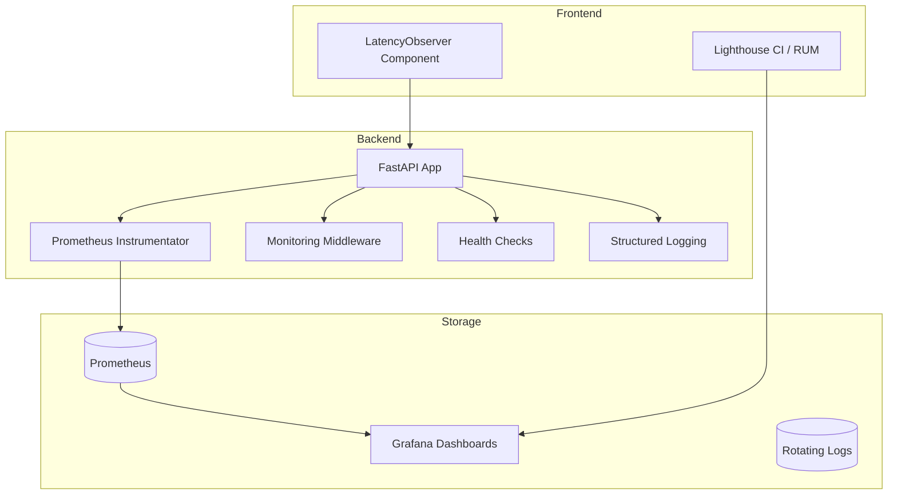
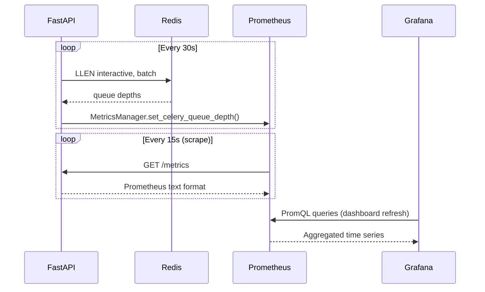
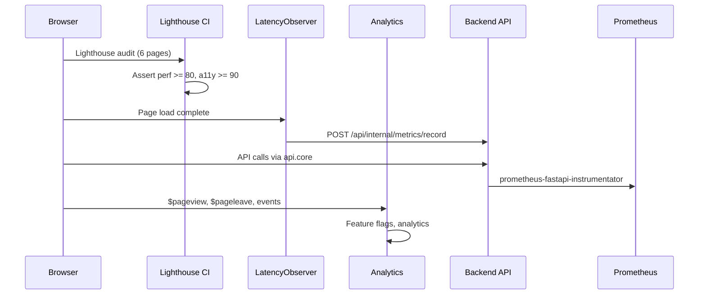
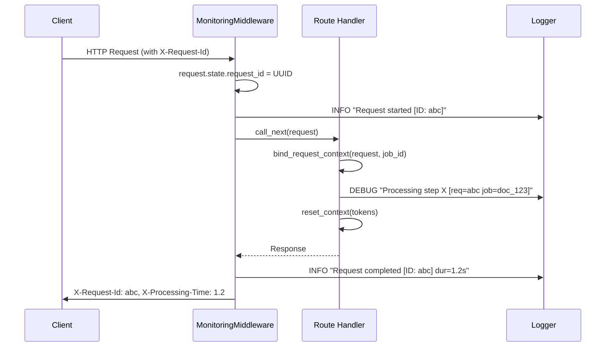
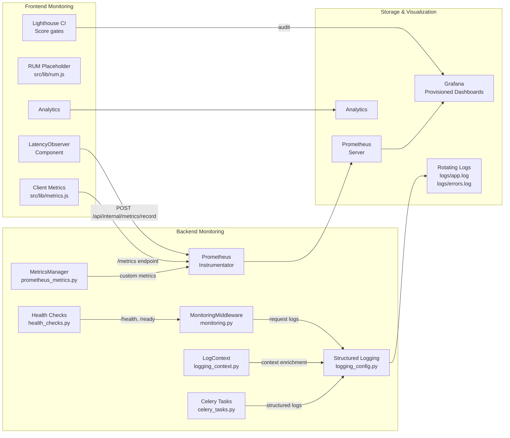

# Monitoring & Observability

> **Last updated:** 2026-07-16  
> **Audience:** Platform engineers, SRE, on-call responders

---

## 1. Overview

ScholarForm AI follows the **three pillars of observability** — metrics, logging, and tracing — with a
fourth (analytics) layer for product intelligence.

### Tech Stack

| Pillar | Tool | Deployment |
|--------|------|------------|
| Metrics | Prometheus + prometheus-fastapi-instrumentator | `/metrics` endpoint on backend |
| Dashboards | Grafana | Provisioned via `ops/grafana/provisioning/` |
| Structured Logging | `structlog` via `logging_config.py` | Rotating files + console |
| Real User Monitoring | Lighthouse CI + Navigation Timing API | CI pipeline + frontend component |
| Health Probes | `/health` (liveness) + `/ready` (readiness) | Exposed on FastAPI |



---

## 2. Metrics Architecture

### 2.1 Prometheus Instrumentation

Backend metrics are collected via two mechanisms:

1. **prometheus-fastapi-instrumentator** — auto-instruments all HTTP routes
   (request rate, duration histogram, error count). Exposed at `/metrics` in
   `backend/app/main.py:682`:

   ```python
   Instrumentator().instrument(app).expose(app, endpoint="/metrics", include_in_schema=False)
   ```

2. **Custom metrics** — defined in `backend/app/middleware/prometheus_metrics.py` via
   the `MetricsManager` helper class, which wraps Prometheus client primitives
   (`Counter`, `Histogram`, `Gauge`).

### 2.2 MetricsManager API

`MetricsManager` is a static-method facade used across the codebase to record
metrics without importing raw Prometheus objects. Key methods:

| Category | Method | Metric |
|----------|--------|--------|
| Pipeline | `record_pipeline_start()` | `pipeline_requests_total{status="active"}`, `active_processing_jobs++` |
| Pipeline | `record_pipeline_completion(duration, success)` | `pipeline_duration_seconds`, `active_processing_jobs--` |
| Pipeline | `record_step_duration(step, duration)` | `pipeline_step_duration_seconds` |
| Pipeline | `record_pipeline_stage_duration(stage, duration)` | `pipeline_stage_duration_ms` |
| LLM | `record_llm_usage(provider, model, in, out)` | `agent_llm_tokens_total` (input/output) |
| LLM | `record_llm_failure(provider)` | `llm_failures_total` |
| LLM | `record_llm_duration(provider, model, dur)` | `llm_request_duration_seconds`, `llm_duration_ms` |
| LLM | `record_llm_ttft(provider, model, dur)` | `llm_ttft_seconds` |
| LLM | `record_llm_cache_hit/miss(provider, model)` | `llm_cache_hits/misses_total` |
| Agent | `record_tool_usage(tool, success)` | `agent_tools_usage_total` |
| Agent | `record_retry()` | `agent_retries_total` |
| Queue | `set_celery_queue_depth(queue, depth)` | `celery_queue_depth` |
| SSE | `sse_connection_open/closed()` | `sse_active_connections`, `sse_connections_total` |
| Realtime | `ws_connection_open/closed()` | `ws_active_connections`, `ws_connections_total` |
| Security | `record_clamav_scan_duration(dur)` | `clamav_scan_duration_seconds` |
| Users | `record_user_activity(user_id)` | `active_users` (sliding 5 min window) |
| Providers | `record_provider_operation(action, status)` | `provider_operations_total` |
| Persona | `record_persona_event(persona, event, outcome)` | `persona_events_total` |
| Persona | `record_persona_latency(persona, operation, dur)` | `persona_operation_duration_seconds` |

### 2.3 Celery Queue Depth

The `_periodic_queue_depth_update` background task in `main.py` polls Redis
every 30 seconds and records queue lengths for both `interactive` and `batch`
queues:

```python
async def _periodic_queue_depth_update(interval_seconds: int = 30) -> None:
    while True:
        depths = await asyncio.to_thread(_fetch_queue_depths)
        for queue, depth in depths.items():
            MetricsManager.set_celery_queue_depth(queue, depth)
        await asyncio.sleep(interval_seconds)
```



---

## 3. Key Metrics

### 3.1 HTTP Performance

| Metric | Type | Labels | Purpose |
|--------|------|--------|---------|
| `http_requests_total` | Counter | `method`, `path`, `status` | Request volume |
| `http_request_duration_seconds` | Histogram | `method`, `path` | Latency distribution (default buckets) |

### 3.2 Pipeline Performance

| Metric | Type | Labels | Buckets | Purpose |
|--------|------|--------|---------|---------|
| `pipeline_requests_total` | Counter | `status` (active/completed/failed) | — | Pipeline throughput |
| `pipeline_duration_seconds` | Histogram | `status` (success/error) | 1, 5, 10, 30, 60, 120, 300, 600, 1800 | Total pipeline time |
| `pipeline_stage_duration_ms` | Histogram | `stage` | 10, 25, 50, 100, 250, 500, 1K, 2.5K, 5K, 10K, 30K, 60K | Per-stage timing |
| `pipeline_step_duration_seconds` | Histogram | `step` | 0.1, 0.5, 1, 2, 5, 10, 30, 60 | Per-step timing |

### 3.3 LLM Performance

| Metric | Type | Labels | Purpose |
|--------|------|--------|---------|
| `llm_requests_total` | Counter | `provider`, `model`, `status` | LLM call volume |
| `llm_failures_total` | Counter | `provider` | Failure count by provider |
| `llm_duration_ms` | Histogram | `provider`, `model` | Latency (25ms–60s) |
| `llm_ttft_seconds` | Histogram | `provider`, `model` | Time to first token |
| `llm_cache_hits/misses_total` | Counter | `provider`, `model` | Cache efficiency |
| `agent_llm_tokens_total` | Counter | `provider`, `model`, `type` | Token consumption |

### 3.4 System Health

| Metric | Type | Description |
|--------|------|-------------|
| `active_processing_jobs` | Gauge | Concurrent pipeline jobs |
| `celery_queue_depth{queue="interactive"}` | Gauge | Interactive Celery backlog |
| `celery_queue_depth{queue="batch"}` | Gauge | Batch Celery backlog |
| `sse_active_connections` | Gauge | Server-sent events |
| `ws_active_connections` | Gauge | WebSocket connections |
| `active_users` | Gauge | Authenticated users in last 5 min |
| `agent_retries_total` | Counter | Agent retry count |

---

## 4. Alerting Rules

Eight Prometheus alert rules are defined in
`deploy/prometheus/error_budget.yml`:

| Alert | Expression | For | Severity | Threshold |
|-------|-----------|-----|----------|-----------|
| `ScholarFormServiceDown` | `up{job="scholarform"} == 0` | 2m | **critical** | Instance unreachable |
| `ScholarFormHighErrorRate` | 5xx / total >= 5% | 5m | warning | > 5% error rate |
| `ScholarFormHighLatency` | p95 latency > 5s | 5m | warning | > 5s p95 |
| `ScholarFormDBPoolExhausted` | `active_connections > 18` | 2m | **critical** | > 18 of 20 |
| `ScholarFormRedisMemoryHigh` | usage > 90% | 5m | warning | > 90% |
| `ScholarFormQueueBacklog` | `interactive` queue > 100 | 10m | warning | > 100 jobs |
| `ScholarFormRateLimitSpike` | rate limited/s > 10 | 5m | info | Spike in throttling |
| `ScholarFormDiskSpaceLow` | available < 10% | 10m | **critical** | < 10% free |

All alerts carry a `runbook` annotation linking to GitHub runbooks.

---

## 5. Grafana Dashboard

The production dashboard (`deploy/grafana/dashboards/scholarform-production.json`,
UID `scholarform-production`) consists of **10 panels**:

| # | Panel | Type | Queries | Grid Position |
|---|-------|------|---------|---------------|
| 1 | API Request Rate | Time series | `rate(http_requests_total[5m])` | (0,0) 12×8 |
| 2 | Error Rate | Time series | `rate(5xx)/rate(total)*100` with thresholds | (12,0) 12×8 |
| 3 | Response Latency (p50/p95/p99) | Time series | Three `histogram_quantile` queries | (0,8) 24×8 |
| 4 | Active Users | Stat | `count(scholarform_active_users)` | (0,16) 6×4 |
| 5 | Pipeline Processing Rate | Stat | `rate(pipeline_documents_processed_total[5m])` | (6,16) 6×4 |
| 6 | API Key Usage Rate | Time series | `rate(scholarform_api_key_requests_total[5m])` | (12,16) 12×8 |
| 7 | DB Connection Pool | Gauge | `active_connections` (max 20, thresholds at 15/18) | (0,20) 6×4 |
| 8 | Redis Memory Usage | Gauge | `used/max * 100` (thresholds at 75%/90%) | (6,20) 6×4 |
| 9 | Error Budget Remaining (30d) | Gauge | SLO-based budget (thresholds at 25%/50%) | (0,24) 12×8 |
| 10 | Celery Queue Depth | Time series | `interactive` + `batch` queues | (12,24) 12×8 |

The dashboard is auto-provisioned via `ops/grafana/provisioning/`:

- **Datasource** (`ops/grafana/provisioning/datasources/prometheus.yml`): points to
  `http://prometheus:9090`
- **Dashboard provider** (`ops/grafana/provisioning/dashboards/scholarform.yml`):
  file-based provisioning from `/etc/grafana/dashboards`, refresh every 30s

---

## 6. Structured Logging

### 6.1 Configuration

Defined in `backend/app/config/logging_config.py`. Uses Python's `logging.config.dictConfig`
with three outputs:

| Handler | Level | Formatter | Target | Rotation |
|---------|-------|-----------|--------|----------|
| `console` | INFO | `default` | stdout | — |
| `file` | DEBUG | `detailed` | `logs/app.log` | 10 MB × 5 |
| `error_file` | ERROR | `detailed` | `logs/errors.log` | 10 MB × 5 |

### 6.2 Log Format

**Default** (console):

```
2026-07-16 14:30:00 - app.services.llm_service - INFO - [request_id=abc job_id=doc_123 session_id=sess_456] LLM request completed
```

**Detailed** (file handlers):

```
2026-07-16 14:30:00 - app.services.llm_service - ERROR - llm_service.py:312 - generate_with_fallback() - [request_id=abc job_id=doc_123 session_id=sess_456] Provider timeout
```

### 6.3 Context Filter

The `LogContextFilter` (`backend/app/utils/logging_context.py`) enriches every
log record with three context variables from `contextvars`:

- `request_id` — per-request UUID
- `job_id` — document/document ID
- `session_id` — chat/generator session

These are set via `bind_request_context()` (an async context manager used in
route handlers) or the `log_context()` context manager for background tasks.

### 6.4 Third-Party Logger Suppression

Noisy libraries are throttled to reduce log volume:

| Logger | Level | Handler |
|--------|-------|---------|
| `uvicorn` | INFO | console only |
| `uvicorn.access` | INFO | console only |
| `sqlalchemy` | WARNING | file only |
| `httpx` | WARNING | file only |
| `transformers` | WARNING | file only |
| `sentence_transformers` | WARNING | file only |

---


## 9. Real User Monitoring (RUM)

### 9.1 Lighthouse CI (`frontend/lighthouserc.js`)

Six pages are audited: `/`, `/dashboard`, `/upload`, `/settings`, `/live`, `/agent`.

**Assertions (hard gates):**

| Category | Minimum Score |
|----------|---------------|
| Performance | 80 |
| Accessibility | 90 |
| Best Practices | 90 |
| SEO | 90 |

Results are uploaded to `temporary-public-storage`.

### 9.2 Navigation Timing (`frontend/src/components/monitoring/LatencyObserver.jsx`)

A zero-visibility React component that reports client-side page load
durations to the backend's `/api/internal/metrics/record` endpoint using
the Performance Navigation Timing API:

```js
const [navigation] = performance.getEntriesByType('navigation');
fetchWithRetry('/api/internal/metrics/record', {
    method: 'POST',
    body: JSON.stringify({ method: 'GET', route: pathname, status: 200, duration: navigation.duration }),
});
```

### 9.3 RUM Infrastructure (`frontend/src/lib/rum.js`)

The placeholder `initRUM()` function is ready for future integration with
monitoring RUM. Currently emits debug logs with `trackPageView()`
and `trackEvent()`.

### 9.4 Frontend Metrics Registry (`frontend/src/lib/metrics.js`)

An in-browser Prometheus histogram registry that tracks HTTP request durations
client-side with configurable buckets: `[0.1, 0.3, 0.5, 0.7, 1, 3, 5, 7, 10]`
seconds. The `httpRequestDurationMicroseconds.observe()` method is called by
the API layer to capture real user request latency.

### 9.5 API Metrics (`frontend/src/services/api.metrics.js`)

Provides normalized health and dashboard data to the frontend:

| Function | Endpoint | Purpose |
|----------|----------|---------|
| `getMetricsHealth()` | `GET /api/v1/health/ready` | Normalized health with AI/DB/provider status |
| `getMetricsDashboard()` | `GET /api/v1/metrics/dashboard` | Live KPIs with model comparison |
| `getMetricsDb()` | `GET /api/v1/metrics/db` | Database-level metrics |
| `getMetricsEnhancements()` | `GET /api/v1/metrics/enhancements` | Enhancement pipeline stats |
| `logFrontendError()` | `POST /api/v1/error-log` | Client-side error reporting |
| `submitFeedback()` | `POST /api/v1/feedback/` | User feedback submission |



---

## 10. Health Checks

### 10.1 Endpoints

| Endpoint | Handler | Purpose | Always 200? |
|----------|---------|---------|-------------|
| `GET /health` | `health_check()` in `main.py:780` | Liveness probe | Yes — uses `get_health_payload()` but returns 200 regardless |
| `GET /ready` | `readiness_probe()` in `main.py:767` | Readiness probe | No — returns 503 if dependencies degraded |

### 10.2 Liveness (`/health`)

Built by `_build_health_payload()` in `backend/app/services/health_checks.py:199`:

```json
{
  "status": "healthy",
  "version": "1.0.0",
  "components": {
    "supabase_db": "healthy",
    "ollama": "healthy",
    "ai_models": "loaded"
  }
}
```

Components checked: Supabase DB, Ollama reachability, loaded AI models.

### 10.3 Readiness (`/ready`)

Built by `_build_readiness_payload()` at `health_checks.py:250`:

```json
{
  "ready": true,
  "checks": {
    "database": "healthy",
    "grobid": "ready",
    "docling": "ready",
    "ocr": "ready",
    "docx_converter": "ready",
    "llm_status": { /* per-provider status */ },
    "ai_models": "loaded"
  },
  "dependencies": { /* per-service probe details */ },
  "timestamp": "2026-07-16T14:30:00Z"
}
```

All dependencies probed with a 2s timeout via `httpx`. Responses are cached
with a configurable TTL (`READINESS_CACHE_TTL_SECONDS`, default 15s) to
prevent thundering herds.

---

## 11. Logging Context

### 11.1 Context Variables

Three `contextvars` track the execution context across async boundaries
(`backend/app/utils/logging_context.py`):

| Variable | ContextVar | Set By |
|----------|-----------|--------|
| `request_id` | `_request_id_ctx` | `MonitoringMiddleware` (from header or UUID4) |
| `job_id` | `_job_id_ctx` | `bind_request_context()` in route handlers |
| `session_id` | `_session_id_ctx` | `bind_request_context()` in generator routes |

### 11.2 API

```python
# Context manager (for background tasks)
with log_context(request_id="...", job_id="...", session_id="..."):
    do_work()

# Async context manager (for route handlers)
async with bind_request_context(connection, job_id="doc_123"):
    await handle_document()

# Manual binding (for Celery tasks)
tokens = bind_context(request_id="...")
try:
    process()
finally:
    reset_context(tokens)
```

### 11.3 Propagation

The `LogContextFilter` reads these context vars and injects them as
`LogRecord` attributes, so they appear in **every** log line without
manual `extra=` parameters.



---

## 12. LatencyObserver Frontend Component

Defined in `frontend/src/components/monitoring/LatencyObserver.jsx`:

- **Type:** `'use client'` React component (zero-render — returns `null`)
- **Trigger:** Fires on every route change (`usePathname()` dependency)
- **Data:** Uses `performance.getEntriesByType('navigation')` to capture full
  page load duration
- **Delivery:** POSTs to `/api/internal/metrics/record` with method, route,
  status code, and duration
- **Resilience:** Network failures are silently caught (`catch(() => {})`)

---

## 13. Monitoring Middleware

Defined in `backend/app/middleware/monitoring.py`:

```python
class MonitoringMiddleware(BaseHTTPMiddleware):
    async def dispatch(self, request, call_next):
        request_id = request.headers.get("x-request-id") or str(uuid.uuid4())
        request.state.request_id = request_id
        start_time = time.time()
        # ... await call_next ...
        duration = time.time() - start_time
        response.headers["X-Request-Id"] = request_id
        response.headers["X-Processing-Time"] = str(duration)
```

Logs every request start and completion with status code, duration, and
request ID. Exceptions are caught and logged at ERROR level before re-raising.

---

## 14. Celery Background Tasks

Defined in `backend/app/tasks/celery_tasks.py`:

| Task | Queue | Schedule | Description |
|------|-------|----------|-------------|
| `batch.cleanup_uploads` | batch | Daily at 3:00 AM | Delete uploads older than retention window |
| `batch.classification_benchmark` | batch | On-demand | Run LLMClassifier classification benchmark over fixtures |

Both tasks emit structured logs with context variables and record metrics
via `MetricsManager`.

### Celery Configuration

```python
celery_app.conf.update(
    task_acks_late=True,
    task_reject_on_worker_lost=True,
    task_track_started=True,
    task_soft_time_limit=600,  # 10 min
    task_time_limit=900,       # 15 min
)
```

---

## 15. Configuration Reference

### 15.1 Backend Env Vars

| Variable | Source | Default | Description |
|----------|--------|---------|-------------|
| `ENABLE_STRUCTURED_LOGGING` | `DeploymentSettings` | `false` | Enable rotating file logging |
| `FORCE_HTTPS` | `SecuritySettings` | `false` | HTTPS redirect + HSTS middleware |
| `REDIS_ENABLED` | `CacheSettings` | `false` | Redis connection for queue depth |
| `REDIS_URL` | `CacheSettings` | `redis://localhost:6379` | Redis connection string |
| `READINESS_CACHE_TTL_SECONDS` | `CacheSettings` | `15` | Readiness probe cache TTL |
| `HEALTH_CACHE_TTL_SECONDS` | `CacheSettings` | `15` | Health probe cache TTL |

### 15.2 Frontend Env Vars

| Variable | Default | Description |
|----------|---------|-------------|

---

## 16. Full Stack Diagram



## 17. API Reference

### Metrics Endpoint

| Endpoint | Method | Purpose | Auth |
|---|---|---|---|
| `GET /metrics` | GET | Prometheus-formatted metrics (counter, histogram, gauge) | No (internal network) |

Response format (Prometheus text-based exposition):

```
# HELP http_requests_total Total HTTP requests
# TYPE http_requests_total counter
http_requests_total{method="GET",path="/api/v1/templates",status="200"} 1024
# HELP pipeline_duration_seconds Pipeline execution duration
# TYPE pipeline_duration_seconds histogram
pipeline_duration_seconds_bucket{status="success",le="1.0"} 0
...
```

### Health Endpoints

| Endpoint | Method | Purpose | Auth | Response |
|---|---|---|---|---|
| `GET /health` | GET | Liveness probe | No | `{"status":"healthy","version":"1.0.0","components":{...}}` — always 200 |
| `GET /ready` | GET | Readiness probe | No | `{"ready":true,"checks":{...}}` — 200 if healthy, 503 if degraded |
| `GET /api/v1/health/live` | GET | K8s/Render liveness | No | 200 with minimal payload |
| `GET /api/v1/health/ready` | GET | Strict readiness | No | 503 if any dependency degraded |

### Internal Metrics Endpoint

| Endpoint | Method | Purpose | Auth |
|---|---|---|---|
| `POST /api/internal/metrics/record` | POST | Client-side RUM ingestion | No (internal) |

Payload:

```json
{
  "method": "GET",
  "route": "/dashboard",
  "status": 200,
  "duration": 1234.5
}
```

### Frontend Metrics API

| Function | Endpoint | Purpose |
|---|---|---|
| `getMetricsHealth()` | `GET /api/v1/health/ready` | Normalized health with AI/DB/provider status |
| `getMetricsDashboard()` | `GET /api/v1/metrics/dashboard` | Live KPIs with model comparison |
| `getMetricsDb()` | `GET /api/v1/metrics/db` | Database-level metrics |
| `getMetricsEnhancements()` | `GET /api/v1/metrics/enhancements` | Enhancement pipeline stats |
| `logFrontendError()` | `POST /api/v1/error-log` | Client-side error reporting |

## 18. Testing

### Testing Alert Rules

Alert rules are defined in `deploy/prometheus/error_budget.yml`. Validate them with `promtool`:

```bash
# Check rule syntax
promtool check rules deploy/prometheus/error_budget.yml

# Simulate alert evaluation (requires running Prometheus)
promtool test rules deploy/prometheus/error_budget_test.yml
```

Example test file (`error_budget_test.yml`):

```yaml
rule_files:
  - error_budget.yml

evaluation_interval: 1m

tests:
  - interval: 1m
    input_series:
      - series: 'up{job="scholarform"}'
        values: '0x10'
    alert_rule_test:
      - eval_time: 3m
        alertname: ScholarFormServiceDown
        exp_alerts:
          - exp_labels:
              severity: critical
            exp_annotations:
              summary: "Service is down"
```

### Verifying Metrics Emission

```python
# test_metrics_emission.py
import pytest
from app.middleware.prometheus_metrics import MetricsManager

def test_record_pipeline_start_increments_counter():
    MetricsManager.reset_for_test()
    MetricsManager.record_pipeline_start()
    metrics = MetricsManager.get_metrics()
    assert metrics["pipeline_requests_total"]["active"] == 1

def test_http_request_duration_recorded(client):
    response = client.get("/api/v1/templates")
    assert response.status_code == 200
    # Verify prometheus-fastapi-instrumentator recorded the request
    metrics_text = client.get("/metrics").text
    assert 'http_request_duration_seconds_bucket' in metrics_text
    assert '/api/v1/templates' in metrics_text
```

### Testing Health Check Endpoints

```python
# test_health_endpoints.py
async def test_liveness_always_200(client):
    response = await client.get("/health")
    assert response.status_code == 200

async def test_readiness_healthy(client):
    response = await client.get("/ready")
    assert response.status_code in (200, 503)
    data = response.json()
    assert "ready" in data
    assert "checks" in data
    assert "database" in data["checks"]

async def test_readiness_with_degraded_db(client):
    with patch("app.services.health_checks._check_database", return_value=False):
        response = await client.get("/ready")
        assert response.status_code == 503

async def test_health_cache_invalidation(client):
    response1 = await client.get("/health")
    response2 = await client.get("/health?force=1")
    assert response2.status_code == 200

async def test_metrics_endpoint_returns_prometheus_format(client):
    response = await client.get("/metrics")
    assert response.status_code == 200
    assert response.headers["content-type"].startswith("text/plain")
    assert "# HELP" in response.text or response.text.startswith("http_")
```
```
