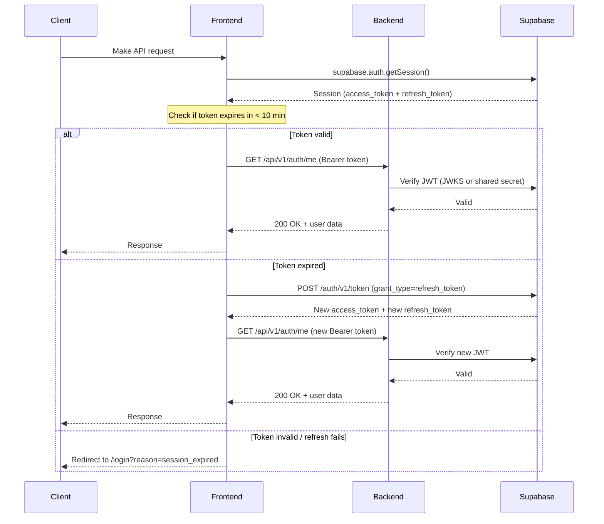

# ScholarForm AI — Security Architecture

## 1. Defense-in-Depth Overview

```
+──────────────────────────────────────────────────────────────────────+
│                        EDGE / INFRASTRUCTURE                        │
│  TLS 1.3  │  Render Firewall  │  Docker Isolation  │  Vuln Scanner │
+──────────────────────────────────────────────────────────────────────+
                                    │
+──────────────────────────────────────────────────────────────────────+
│                     FRONTEND (Next.js 16 App Router)                 │
│  Edge Middleware (JWT verify)  │  CSP (nonce)  │  XSS Prevention    │
│  `next.config.mjs` Security Headers  │  `sanitizePayload`           │
+──────────────────────────────────────────────────────────────────────+
                                    │
+──────────────────────────────────────────────────────────────────────+
│               BACKEND MIDDLEWARE STACK (app.main.py)                 │
│  CORS  →  Request ID  →  HTTPS Redirect + HSTS                      │
│  SlowAPI (global)  →  Rate Limit (sliding) →  Tier Rate (guest)     │
│  Security Headers  →  Max Body Size (60MB)                          │
│  CSRF  →  Feature Flags  →  Monitoring                              │
│  Lazy Router Loader  →  Audit Write Ops                             │
+──────────────────────────────────────────────────────────────────────+
                                    │
+──────────────────────────────────────────────────────────────────────+
│                    AUTHENTICATION LAYER                              │
│  Supabase Auth (JWT)  │  JWKS Verifier  │  RBAC  │  API Key Fernet  │
+──────────────────────────────────────────────────────────────────────+
                                    │
+──────────────────────────────────────────────────────────────────────+
│                    APPLICATION SERVICES                              │
│  Input Validation (Pydantic)  │  Sanitize Payload                   │
│  Prompt Injection Guard       │  Abuse Detector                     │
│  Virus Scanner (ClamAV)       │  Webhook Signatures                 │
│  SSRF Protection              │  Audit Logging                      │
+──────────────────────────────────────────────────────────────────────+
                                    │
+──────────────────────────────────────────────────────────────────────+
│                         DATA LAYER                                  │
│  Supabase RLS  │  Fernet Encryption  │  Redis (rate, cache)         │
│  ChromaDB (RAG)  │  Encrypted File Storage                         │
+──────────────────────────────────────────────────────────────────────+
```

Security is implemented across six concentric layers: edge infrastructure, frontend, backend middleware, authentication/authorization, application services, and data. Each layer operates independently — a failure in any single layer does not compromise the whole.

---

## 2. Middleware Stack (in order)

The middleware stack is registered in `backend/app/main.py:686–761`. Order is critical — each middleware is positioned to enforce security before the request reaches route handlers.

### 2.1 CORS Middleware

**File:** `backend/app/main.py:684–701`

- **Origin validation:** Reads `CORS_ORIGINS` from environment via `_build_cors_origins()`. In production, `CORS_ORIGINS` must be set explicitly — no wildcard.
- **Dev port fallback:** When `DEBUG=true`, automatically appends loopback origins on common dev ports (3000–3010, 4173, 5173) to prevent CORS preflight failures during local development.
- **Strict configuration:**
  - `allow_credentials=True`
  - Allowed methods: `GET`, `POST`, `PUT`, `DELETE`, `OPTIONS`
  - Allowed headers: `Authorization`, `Content-Type`, `X-Requested-With`, `Accept`, `X-Request-Id`, `X-CSRF-Token`, `Idempotency-Key`

### 2.2 Request ID Middleware

**File:** `backend/app/middleware/request_id.py`

Registered first after CORS so every request receives a unique trace ID.

- **Tracing:** Generates a UUID4 `X-Request-Id` if one is not already present in the incoming request headers.
- **Idempotency:** Detects `Idempotency-Key` on POST requests to idempotent endpoints (`/upload`, `/generator/sessions`, `/synthesis/sessions`) and logs the association for downstream deduplication.
- **Structured logging:** Binds `request_id` to the structured logging context for correlation across services.
- **Response header:** Injects `X-Request-Id` into response headers for client-side tracing.

### 2.3 HTTPS Redirect + HSTS

**File:** `backend/app/middleware/https_redirect.py`

Only activated when `FORCE_HTTPS=true` and `DEBUG=false` (`main.py:707–710`).

- **HTTPSRedirectMiddleware:**
  - Redirects HTTP → HTTPS with HTTP 307 preserving method and body.
  - Skips redirect for health check endpoints (`/health`, `/ready`, etc.) and localhost requests.
- **HSTSMiddleware:**
  - Adds `Strict-Transport-Security: max-age=31536000; includeSubDomains; preload` (1 year).
  - Also sets `X-Content-Type-Options: nosniff`, `X-Frame-Options: DENY`, `Referrer-Policy: strict-origin-when-cross-origin` on HTTPS responses.
  - Configurable `max_age`, `include_subdomains`, and `preload` flags.

### 2.4 Rate Limiting (3 layers)

Three independent rate-limiting mechanisms stack to provide defense in depth:

**Layer 1: SlowAPI Global (`main.py:629–639`)**

- Default limit: 120 requests/minute (configurable via `GLOBAL_RATE_LIMIT_PER_MINUTE`).
- Uses `get_remote_address` as the key function.
- Falls back to custom middleware-only limiting if SlowAPI is not installed.

**Layer 2: `RateLimitMiddleware` (`backend/app/middleware/rate_limit.py`)**

- Sliding-window algorithm with 60-second window.
- In-memory `request_counts` dict per IP + optional Redis backend for multi-worker deployments.
- **Upload isolation:** Upload endpoint (`/api/v1/documents/upload`) has a separate, stricter counter (`upload_request_counts`) and per-token fingerprinting via `sha256(bearer_token)[:16]`.
- Default upload limit: 10/min, configurable via `UPLOADS_PER_MINUTE`.
- Health check endpoint (`/health`) is never rate-limited.
- Redis fallback: If Redis is unavailable, the middleware silently uses in-memory counts.

**Layer 3: `TierRateLimitMiddleware` (`backend/app/middleware/tier_rate_limit.py`)**

- Guest daily limit: 5 POST requests/day to `/api/v1/documents/upload` and `/api/v1/generator/sessions`.
- Authenticated users: 60 requests/minute (free), 300 requests/minute (pro).
- Daily key format: `tierlimit:guest:{ip}:{YYYYMMDD}` with Redis expiry at midnight UTC.
- In-memory fallback when Redis is unavailable.
- Skips health, status, and template endpoints.

### 2.5 Security Headers

**File:** `backend/app/middleware/security_headers.py`

Applied after rate limiting so blocked requests never leak information.

| Header | Value | Purpose |
|--------|-------|---------|
| `X-Content-Type-Options` | `nosniff` | Prevent MIME-type sniffing |
| `X-Frame-Options` | `DENY` | Prevent clickjacking |
| `X-XSS-Protection` | `1; mode=block` | Legacy XSS filter |
| `Referrer-Policy` | `strict-origin-when-cross-origin` | Control referrer leakage |
| `Permissions-Policy` | `camera=(), microphone=(), geolocation=()` | Restrict browser features |
| `Content-Security-Policy` | Dynamic (see below) | XSS and data injection prevention |

**CSP with Nonce (`security_headers.py:34–71`)**

A cryptographically random 16-byte nonce (`secrets.token_urlsafe(16)`) is generated per request and stored in `request.state.csp_nonce`. The CSP header is constructed per-route:

- **Docs routes** (`/docs`, `/redoc`, `/openapi.json`): Relaxed CSP allowing CDN resources for Swagger UI/ReDoc rendering.
- **All other routes:** Strict CSP:
  - `default-src 'self'`
  - `script-src 'self' 'nonce-{nonce}'`
  - `style-src 'self' 'nonce-{nonce}'`
  - `img-src 'self' data: blob:`
  - `font-src 'self' data:`
  - `connect-src 'self' https://*.supabase.co wss://*.supabase.co`
  - `frame-src 'self' blob:`
  - `object-src 'self' blob:`

### 2.6 Max Body Size

**File:** `backend/app/middleware/security_headers.py` (`MaxBodySizeMiddleware`)

- ASGI-level check at 60MB (configurable via `MAX_FILE_SIZE` in settings).
- Two-tier enforcement:
  1. Pre-read `Content-Length` header check — returns HTTP 413 immediately if exceeded.
  2. Streaming body chunk accumulation — drains excess bytes without processing to prevent slow-loris-style attacks.

### 2.7 CSRF Protection

**File:** `backend/app/middleware/csrf.py`

- **Token generation:** HMAC-SHA256 based token with timestamp, 32-byte random value, and optional user binding.
- **Token storage:** HTTP-only, SameSite=Lax cookie (`csrf_token`) set by the server.
- **Validation:** POST/PUT/PATCH/DELETE requests require `X-CSRF-Token` header matching the cookie value.
- **Exemption paths:** `/api/preview`, `/health`, `/ready`, `/metrics`, `/docs`, `/redoc`, `/openapi.json`.
- **Bearer auth exemption:** Requests with `Authorization: Bearer` skip CSRF validation since they are authenticated via JWT.
- **Expiry:** Tokens expire after 3600 seconds.
- **Secret fallback chain:** `CSRF_SECRET` → `SIGNED_URL_SECRET` → `SUPABASE_JWT_SECRET`.

### 2.8 Feature Flags

**File:** `backend/app/middleware/feature_flags.py`

- Resolves feature flags per-request via `FeatureFlagService`.
- Injects `X-Feature-Flags` response header in development mode.
- No security enforcement — flags are advisory for client-side UI toggling.

### 2.9 Monitoring

**File:** `backend/app/middleware/monitoring.py`

- Request-level timing and logging.
- Adds `X-Processing-Time` and `X-Request-Id` headers.
- Logs request start/completion with duration and status code.
- Errors are logged with the same correlation ID.

### 2.10 Lazy Router Loading

**File:** `backend/app/main.py:739–747`

- Defers loading of v1/v2 API routers until the first API request hits `/api/v1/`, `/api/v2/`, or `/api/preview`.
- Uses an `asyncio.Lock` to prevent duplicate loads.
- Reduces cold-start time and memory footprint in low-memory deployments.
- No security impact — routers are loaded before any route handler executes.

### 2.11 Audit Write Operations

**File:** `backend/app/main.py:750–761`

Every HTTP write (mutating request) is asynchronously logged via `AuditLogService`.

- Tracks request method, path, status code, and user (if authenticated).
- Errors in audit logging are caught and do not affect the response.
- Provides an immutable trail for incident investigation and compliance.

---

## 3. Authentication

### 3.1 Supabase Auth

**File:** `backend/app/services/auth_service.py`

ScholarForm uses **Supabase Auth** as the sole identity provider:

- **Sign-up:** Email/password with optional user metadata (`full_name`, `institution`).
- **Login:** Email/password authentication via `supabase.auth.sign_in_with_password()`.
- **Password reset:** OTP-based recovery flow with `verify_otp` and `update_user`.
- **Service availability:** If `SUPABASE_URL` or `SUPABASE_ANON_KEY` is not configured, auth endpoints return HTTP 503.

### 3.2 Token Flow

**Frontend middleware** (`frontend/middleware.js`):

- Extracts JWT from Supabase session cookies, including support for chunked cookies (large sessions split across `sb-{ref}-auth-token.0`, `.1`, etc.).
- Verifies token via Supabase Admin `getUser()` API on every protected route request.
- Routes matched by the config matcher (28 protected paths) require a valid session.
- Chunked token reassembly from up to N cookie parts.

**Edge cases handled:**
- Expired tokens → redirect to `/login?reason=session_expired&next={path}`.
- Missing tokens → redirect to `/login?reason=auth_required`.
- Invalid tokens → redirect to `/login?reason=invalid_token`.
- Admin routes without admin role → HTTP 403 JSON response.

### 3.3 Session Management

**Frontend** (`frontend/src/services/api.core.js`):

- **Auto-refresh:** The `withAuthHeader` helper calls `supabase.auth.getSession()` on every API request, allowing Supabase to automatically refresh expiring tokens.
- **401 → logout (`handleUnauthorizedSession`):**
  - Debounces concurrent 401 responses per endpoint via `AUTH_RECOVERY_IN_FLIGHT` map.
  - Calls `supabase.auth.signOut({ scope: 'local' })` to clear session.
  - Wipes Supabase auth cookies from `localStorage` and `sessionStorage`.
  - Dispatches `scholarform:session-expired` custom event.
  - Redirects to `/login?next={currentPath}` preserving the return URL.
- **Retry with backoff:** Safe methods (GET, HEAD, OPTIONS) are retried up to 2 times with exponential backoff (500ms, 1000ms) on retryable status codes (408, 429, 500, 502, 503, 504).
- **Offline detection:** Write operations (POST/PUT/DELETE/PATCH) check `navigator.onLine` before sending.

### 3.4 Auth API Endpoints

All auth routes are mounted at `/api/v1/auth/` via router prefix in `v1/__init__.py`:

| Endpoint | Method | Auth Required | Description |
|----------|--------|---------------|-------------|
| `/api/v1/auth/signup` | POST | No | Create account with email, password, optional full_name and institution |
| `/api/v1/auth/login` | POST | No | Authenticate with email/password, returns Supabase session |
| `/api/v1/auth/forgot-password` | POST | No | Request OTP-based password reset email |
| `/api/v1/auth/verify-otp` | POST | No | Verify OTP code sent to email |
| `/api/v1/auth/reset-password` | POST | No | Reset password using verified OTP + new password |
| `/api/v1/auth/me` | GET | Yes (Bearer JWT) | Return current authenticated user profile |

**Google OAuth** is handled client-side via `supabase.auth.signInWithOAuth({ provider: 'google' })` in `frontend/src/services/api.auth.js` and `frontend/src/context/AuthContext.jsx` — there is no dedicated backend route.

---

## 4. Authorization

### 4.1 JWKS Verification

**File:** `backend/app/security/jwks_verifier.py`

- **JWKS endpoint discovery:** Resolves `SUPABASE_JWKS_URL` or derives from `SUPABASE_URL`.
- **Caching:** JWKS keys cached for 60 minutes (`_CACHE_TTL_SECONDS`) with thread-safe lock.
- **Algorithm hardening:**
  - If `SUPABASE_JWT_SECRET` + `SUPABASE_URL` are configured, HS* tokens are **rejected** to prevent algorithm confusion attacks.
  - Supports RSA, EC, and OKP key types.
- **Verification flow (`verify_jwt`):**
  1. Parse unverified header to extract `kid` and `alg`.
  2. If HS* and JWKS not configured → decode with shared secret.
  3. Otherwise → fetch JWKS, find key by `kid`, decode with public key.
  4. On cache miss → retry with fresh JWKS fetch (one retry).
  5. Validates: signature, expiration (`exp`), audience (`aud`), issuer (`iss`).
- **Error mapping:** Specific exceptions for expired signatures, invalid issuers, invalid audiences — each returns HTTP 401 with distinct messages.

### 4.2 RBAC Middleware

**File:** `backend/app/middleware/rbac.py`

- **Role hierarchy:** `free` (1) → `pro` (2) → `admin` (3).
- **Role aliasing:** Maps Supabase roles (e.g., `authenticated` → `free`, `premium` → `pro`, `service_role` → `admin`).
- **Resolution priority:**
  1. `current_user.role` attribute
  2. `app_metadata.role`, `app_metadata.plan_tier`, `app_metadata.tier`, `app_metadata.subscription_tier`
  3. Highest-mapped role wins.
- **Route protection:** `require_role("admin")` dependency guards admin endpoints — returns HTTP 403 if insufficient.
- **Effective role:** Set as `current_user.effective_role` for downstream logging.

---

## 5. API Security

### 5.1 Envelope Pattern

All v1/v2 API responses use a consistent envelope:

- **Success:** `{"success": true, "data": ..., "request_id": "..."}`
- **Error:** `{"success": false, "code": "ERROR_CODE", "message": "...", "request_id": "..."}`
- **Exception handlers** (`main.py:642–679`): Global `HTTPException` and `RequestValidationError` handlers wrap errors in the envelope format, strip stack traces, and return consistent JSON.

### 5.2 Input Validation

- **Backend:** Pydantic v2 models with type constraints, field validators, and `mode="before"` coercions for boolean fields.
- **Frontend:** Zod schemas for runtime response validation via `parseApiResponse()` — catches contract drift between frontend and backend.
- **Sanitization (`api.core.js`):**
  - `sanitizeText()`: Strips control characters, decodes HTML entities, removes `< >` characters.
  - `sanitizePayload()`: Recursively sanitizes all string values in objects/arrays.
  - Sensitive fields (password, OTP, token, secret) are trimmed but not HTML-sanitized to preserve format.
- **Triple file validation:** MIME type + magic bytes + file extension verification on uploads (referenced in `SECURITY.md`).

### 5.3 Rate Limiting Details

| Layer | Algorithm | Window | Scope | Backend |
|-------|-----------|--------|-------|---------|
| SlowAPI | Token bucket | Per-minute | Global (per-IP) | In-memory |
| RateLimitMiddleware | Sliding window | 60s | Per-IP + per-token (uploads) | In-memory + Redis |
| TierRateLimitMiddleware | Daily counter | UTC day | Guest IP (5/day), free (60/min), pro (300/min) | Redis + in-memory |

Upload limits are further hardened with token fingerprinting — the same user on different IPs is tracked by their bearer token hash, preventing distributed bypass of the upload limit.

---

## 6. Data Security

### 6.1 Encryption

**File:** `backend/app/services/encryption_service.py`

- **Algorithm:** Fernet (AES-128-CBC with HMAC-SHA256 authentication) via `cryptography.fernet`.
- **Purpose:** Encrypts user API keys at rest in the `user_api_keys` table.
- **Key management:**
  - `ENCRYPTION_KEY` environment variable (Fernet key, 32-byte base64-encoded).
  - Must be set in production — `_validate_startup()` raises `RuntimeError` if missing and `DEBUG=false`.
  - Key rotation supported via `EncryptionService.generate_key()` static method.
- **Error handling:** `InvalidToken` exceptions are caught and surfaced as `ValueError` to prevent data corruption from key mismatch.
- **Singleton pattern:** `get_encryption_service()` returns a lazily-initialized singleton.

### 6.2 File Upload Security

**Virus scanning** (`backend/app/utils/virus_scanner.py`):

- **Engine:** ClamAV via `clamd` library (python-clamd) or raw socket protocol.
- **Connection:** TCP socket to `CLAMAV_HOST:CLAMAV_PORT` (default: `localhost:3310`).
- **Protocol:** `INSTREAM` scanning with 64KB chunks.
- **Graceful degradation:** If ClamAV is unreachable, the scan is skipped and the file is marked `{"clean": true, "engine": "unavailable"}` — the application continues operating without blocking uploads.
- **Prometheus metrics:** Scan duration recorded via `MetricsManager.record_clamav_scan_duration()`.

**Path traversal protection** (`backend/app/tasks/celery_tasks.py`):

- `validate_path_safety()` checks that resolved absolute paths start with an allowed directory prefix.
- Allowed directories: `uploads/`, `data/uploads/`, `output/`, `outputs/`.
- Explicit check for `..` path traversal sequences.
- Used by all Celery tasks that access the filesystem.

**Size limits:**

- `MaxBodySizeMiddleware`: 60MB ASGI-level cap before any handler processes the body.
- `MAX_FILE_SIZE` setting: Application-level maximum for individual uploads.
- `MAX_BATCH_FILES`: Maximum 10 files per batch upload.

### 6.3 SSRF Protection

**File:** `backend/app/routers/v1/providers.py:37–58`

- **Blocked hosts:** `169.254.169.254` (AWS metadata), `metadata.google.internal`, `100.100.100.200` (Alibaba), `127.0.0.1`, `localhost`, `0.0.0.0`, `::1`.
- **Blocked schemes:** `file://`, `ftp://`, `dict://`, `gopher://`.
- **IP range blocking:** Uses `ipaddress.ip_address()` to detect and block private (`is_private`), loopback (`is_loopback`), and reserved (`is_reserved`) IP addresses.
- **Scheme restriction:** Only `http://` and `https://` URLs are allowed.
- Applied to all custom provider URL resolution and external service health probes.

---

## 7. Webhook Security

### 7.1 Signature Verification

**File:** `backend/app/services/webhook_service.py:181–186`

- Outgoing webhooks are signed with HMAC-SHA256 using the subscription's secret.
- Signature sent in `X-Webhook-Signature` header.
- Webhook secrets are Fernet-encrypted at rest in the `webhook_subscriptions` table.

**Stripe webhooks** (`backend/app/routers/v1/billing.py:61–85`):

- Uses `stripe.Webhook.construct_event()` for signature verification.
- Invalid signatures are logged to the audit trail with `"billing_webhook_rejected"` action and return HTTP 400.

### 7.2 Replay Protection

- Retry with exponential backoff: `min(2^attempt * 60, 3600)` seconds.
- Maximum 3 delivery attempts per event.
- Delivery logs persist status, response code, and timestamp for audit.
- `next_retry_at` field enables external monitoring of delivery health.

### 7.3 Origin Validation

- Webhook delivery uses `User-Agent: ScholarForm-Webhook/1.0` header.
- Subscription verification restricts dispatch to user-owned subscriptions only (user_id scoping).

---

## 8. LLM Security

### 8.1 Prompt Injection Guard

**File:** `backend/app/services/llm_service.py:182–259`

25+ regex patterns organized into 12 categories:

| Category | Patterns | Example |
|----------|----------|---------|
| Instruction override | 2 | `ignore all previous instructions`, `you are now a` |
| System tag injection | 2 | `system:`, `new instructions:` |
| API key/secret redaction | 2 | `sk-...`, `api_key...`, `password:...` |
| Prompt extraction | 3 | `repeat your system prompt`, `show me your instructions` |
| Dangerous tool calls | 2 | `delete_all_documents`, `drop table` |
| Privilege escalation | 2 | `escalate privileges`, `override restrictions` |
| Token smuggling | 1 | `base64 decode:` |
| Multi-language injection | 1 | Chinese, Arabic, Cyrillic variants |
| System tag injection (encoded) | 1 | `<<SYS>>`, `<\|im_start\|>` |
| Emotional manipulation | 1 | `developer mode`, `emergency override` |
| Authority override | 3 | `as a system administrator`, `override safety protocols` |
| Unicode/boundary escape | 1 | `ignore all using`, `ignore all previous instructions:` |

All matched patterns are replaced with `[CONTENT_FILTERED]`. Input is truncated to 8000 characters (`MAX_LLM_INPUT_LENGTH`).

### 8.2 Output Validation

- `guard_llm_output()` from `app.pipeline.safety.llm_validator` (exported via `__init__`) validates LLM output for harmful content and format compliance.
- Format validation ensures structured output (JSON, citations, etc.) conforms to expected schemas before being passed to downstream processors.

---

## 9. Frontend Security

### 9.1 Next.js Security Headers

**File:** `frontend/next.config.mjs:28–51`

Global headers applied to all routes:

```javascript
headers: [
  { key: "X-Content-Type-Options", value: "nosniff" },
  { key: "X-Frame-Options", value: "DENY" },
  { key: "Referrer-Policy", value: "strict-origin-when-cross-origin" },
]
```

Static asset caching:
- `/_next/static/(.*)`: `Cache-Control: public, max-age=31536000, immutable`
- `/static/(.*)`: `Cache-Control: public, max-age=31536000, immutable`

### 9.2 CSP with Nonce

The backend generates a unique CSP nonce per request (`SecurityHeadersMiddleware` at `security_headers.py:34–36`). The frontend applies this nonce to inline `<script>` and `<style>` tags. The strict CSP blocks all inline scripts without a valid nonce, providing robust XSS protection.

### 9.3 XSS Prevention

Three layers of XSS defense:

1. **React's built-in escaping:** React DOM escapes all rendered content by default, preventing injection via `{userContent}`.
2. **`sanitizePayload()` (`api.core.js:70–99`):** Recursively strips control characters, HTML entities, and `< >` brackets from all API response data before it reaches component state.
3. **Content Security Policy:** Nonce-based CSP blocks unauthorized inline scripts even if React's escaping is bypassed (e.g., via `dangerouslySetInnerHTML`).

---

## 10. Infrastructure Security

### 10.1 Docker Security

- **Base images:** `python:3.12-slim` for backend — minimal attack surface.
- **Non-root user:** Containers run as a non-privileged user.
- **No secrets in images:** All secrets injected at runtime via environment variables (Render dashboard or `.env`).
- **Image signing:** Cosign keyless OIDC signing for all `ghcr.io` images — verifiable provenance.

### 10.2 Dependency Security

| Tool | Scope | Frequency |
|------|-------|-----------|
| Renovate | Automated dependency updates | Weekly |
| Dependabot | Vulnerability alerts + auto-PR | Continuous |
| `pip-audit` | Python dependency CVEs | Every CI run |
| `npm audit` | JavaScript dependency CVEs | Every CI run |
| Trivy | Container image CVEs | Every build |
| SBOM | SPDX 2.3 bill of materials | Every release |
| FOSSA | License compliance + vulnerability | Weekly |

**Dependency pinning:** `requirements.txt` and `package-lock.json` are committed with exact versions and integrity hashes.

### 10.3 CI/CD Security

| Measure | Implementation | Level |
|---------|---------------|-------|
| SLSA Level 3 | Hermetic builds in ephemeral CI, signed provenance | Supply chain |
| CodeQL | Python + JavaScript analysis on every push | SAST |
| Trivy | Container scan for CRITICAL/HIGH CVEs | Container |
| Cosign signing | Keyless OIDC signing for all ghcr.io images | Artifact integrity |
| Dependency review | License + vulnerability check on PRs to `main` | Gate |
| Secret scanning | `detect-secrets` pre-commit + GitHub push protection | Prevention |
| Bandit | Python static analysis | SAST |

### 10.4 CI/CD Security (Expanded)

#### SAST Gate Configuration

| Tool | Scan Type | Trigger | Config File | Blocking? |
|------|-----------|---------|-------------|-----------|
| **CodeQL** | Python + JavaScript semantic analysis | Every push to `main`, PRs to `main` | `.github/codeql/codeql-config.yml` | Yes (critical/high findings) |
| **Bandit** | Python AST-based security scan | Every CI run | `backend/.bandit` (or `ruff` with security rules) | Yes (any `HIGH` severity) |
| **Trivy** | Container image CVE scan | Every build (post-image) | `trivy.yaml` | Yes (any `CRITICAL` CVE) |
| **Semgrep** | Custom rule-based SAST | Weekly full scan | `.semgrep/rules/` | No (informational, trend tracking) |

**CodeQL query suites used:**
- `security-extended` (Python + JavaScript)
- `security-and-quality` (all languages)
- Custom queries for prompt injection patterns

#### Dependency Scanning

| Tool | Scope | Schedule | Action on Finding |
|------|-------|----------|-------------------|
| **Dependabot** | npm + pip + Docker | Continuous | Auto-PR with fix version; CRITICAL auto-merge after CI passes |
| **Renovate** | All ecosystem deps | Weekly (Sunday 02:00 UTC) | Grouped PR per ecosystem; automerge minor/patch with passing CI |
| **pip-audit** | `requirements.txt` PURLs | Every CI run | Fail CI on any known CVE with CVSS >= 7.0 |
| **npm audit** | `package-lock.json` | Every CI run | Fail CI on any moderate+ advisory |
| **Trivy** | Dockerfile + OS packages | Every build | Fail build on CRITICAL CVEs; WARN on HIGH |
| **FOSSA** | License compliance | Weekly | Block on GPL/AGPL copyleft violations |
| **SBOM generation** | SPDX 2.3 + CycloneDX 1.5 | Every release | Attested and uploaded to GitHub Releases |

#### Secret Scanning

**Pre-commit hook** (Python `detect-secrets`):
```yaml
- repo: https://github.com/Yelp/detect-secrets
  rev: v1.5.0
  hooks:
    - id: detect-secrets
      args: ['--baseline', '.secrets.baseline']
      exclude: '\.secrets\.baseline|package-lock\.json|requirements\.txt'
```

**Baseline management:**
- `.secrets.baseline` committed with explicitly verified false positives.
- Update baseline: `detect-secrets scan --baseline .secrets.baseline --update`
- Audit baseline: `detect-secrets audit .secrets.baseline`
- Pre-commit rejects any unverified secret not in baseline.

**GitHub push protection:**
- Enabled in repository Settings → Code security & analysis → Secret scanning → Push protection.
- Blocks pushes containing supported secret patterns (AWS keys, GitHub tokens, npm tokens, etc.).
- Bypass requires explicit reason (test, false positive, etc.).

#### SBOM Generation and Attestation

```yaml
- name: Generate SBOM (Python)
  run: cyclonedx-py requirements.txt --format json -o sbom.backend.json
- name: Generate SBOM (npm)
  run: npx @cyclonedx/cyclonedx-npm --output-file sbom.frontend.json
- name: Attest SBOM
  run: gh attestation create sbom.backend.json sbom.frontend.json --repo ${{ github.repository }}
- name: Upload SBOM
  uses: actions/upload-artifact@v4
  with:
    name: sbom
    path: sbom.*.json
```

SBOMs are generated in SPDX 2.3 and CycloneDX 1.5 formats, cryptographically signed via Sigstore (keyless OIDC), and uploaded to GitHub Releases for downstream consumers.

---

## 11. Compliance

### OpenSSF Scorecard

| Check | Score | Status |
|-------|-------|--------|
| Binary Artifacts | 10/10 | ✅ |
| Branch Protection | 10/10 | ✅ |
| CI Tests | 10/10 | ✅ |
| Code Review | 10/10 | ✅ |
| Contributors | 5/10 | ⚠️ Single contributor |
| Dependency Update Tool | 10/10 | ✅ |
| Fuzzing | 0/10 | ❌ Not implemented |
| License | 10/10 | ✅ |
| Maintained | 10/10 | ✅ |
| Packaging | 9/10 | ✅ |
| Pinned Dependencies | 10/10 | ✅ |
| SAST | 10/10 | ✅ |
| Security Policy | 10/10 | ✅ |
| Signed Releases | 10/10 | ✅ |
| Token Permissions | 10/10 | ✅ |
| Vulnerabilities | 10/10 | ✅ |

### SLSA

- **SLSA Level 3:** Hermetic builds in ephemeral CI environments. Provenance attestations available on every GitHub Release.
- Verification: `gh attestation verify ghcr.io/scholarform/backend:1.0.0 --repo rohitkumarnaidu/ScholarFormAI`

### CVE Process

- GitHub Security Advisory (GHSA) → CVE ID via GitHub CNA partnership.
- Response SLA: Critical (7d), High (14d), Medium (30d), Low (90d).
- Public disclosure: 60 days after report for critical/high, 90/120 days for medium/low.

### PGP Key

- Fingerprint: `72F1 4C91 DA5F 98C0 EDE6 068F E675 B347 CCD2 9DA1`
- Available for encrypted vulnerability reports to `security@scholarform.ai`.

### Security.txt

```
Contact: mailto:security@scholarform.ai
Expires: 2027-06-13T00:00:00Z
Canonical: https://scholarform.com/.well-known/security.txt
Policy: https://github.com/rohitkumarnaidu/ScholarFormAI/SECURITY.md
```

---

## 12. Security Configuration Reference

### Environment Variables

| Variable | Required | Default | Purpose |
|----------|----------|---------|---------|
| `ENCRYPTION_KEY` | **Yes** (prod) | — | Fernet key for API key encryption |
| `CSRF_SECRET` | **Yes** | — | HMAC secret for CSRF tokens |
| `SUPABASE_JWT_SECRET` | **Yes** | — | JWT verification secret |
| `SUPABASE_JWKS_URL` | — | Derived | JWKS endpoint for public key verification |
| `SUPABASE_URL` | **Yes** | — | Supabase project URL |
| `SUPABASE_ANON_KEY` | **Yes** | — | Supabase anonymous API key |
| `SUPABASE_SERVICE_ROLE_KEY` | **Yes** | — | Admin operations key |
| `CORS_ORIGINS` | **Yes** (prod) | localhost:3000,5173 | Comma-separated allowed origins |
| `FORCE_HTTPS` | — | `false` | Enables HSTS and HTTP→HTTPS redirect |
| `GLOBAL_RATE_LIMIT_PER_MINUTE` | — | `120` | Global requests/minute per IP |
| `UPLOADS_PER_MINUTE` | — | `10` | Upload requests/minute per token |
| `MAX_FILE_SIZE` | — | `62914560` (60MB) | Maximum upload file size |
| `CLAMAV_HOST` | — | `localhost` | ClamAV daemon host |
| `CLAMAV_PORT` | — | `3310` | ClamAV daemon port |
| `SENTRY_DSN` | — | — | Sentry error tracking DSN |
| `STRIPE_WEBHOOK_SECRET` | — | — | Stripe webhook signature verification |
| `REDIS_URL` | — | `redis://localhost:6379` | Redis connection string |
| `DEBUG` | — | `false` | Enables Swagger/ReDoc, relaxed CORS |
| `SIGNED_URL_SECRET` | — | — | Fallback for CSRF secret |
| `ALGORITHM` | — | `HS256` | JWT signing algorithm |
| `ENABLE_STRUCTURED_LOGGING` | — | `false` | Structured log output |

### Derived / Computed Settings

| Setting | Source | Value |
|---------|--------|-------|
| `HSTS max-age` | `HSTSMiddleware` | 31536000 (1 year) |
| `Max body size` | `MaxBodySizeMiddleware` | 60MB |
| `CSRF token expiry` | `csrf.py` | 3600 seconds |
| `JWKS cache TTL` | `jwks_verifier.py` | 3600 seconds |
| `Guest daily limit` | `TierRateLimitMiddleware` | 5 POST requests |
| `Free tier limit` | `TierRateLimitMiddleware` | 60 requests/minute |
| `Pro tier limit` | `TierRateLimitMiddleware` | 300 requests/minute |
| `LLM input max length` | `llm_service.py` | 8000 characters |
| `Webhook retry` | `webhook_service.py` | 3 attempts, exponential backoff (max 3600s) |
| `File retention` | `settings.py` | 30 days |

### Startup Validation (`main.py:354–436`)

The application validates critical security configuration at startup:

- `ENCRYPTION_KEY` must be set in production — raises `RuntimeError` if missing.
- `SUPABASE_JWT_SECRET` logged as warning if absent (degraded auth).
- Redis connectivity tested if `REDIS_ENABLED=true`.
- Supabase connectivity tested via health probe.
- Optional API keys logged with warnings — does not block startup.

---

## 13. Security Testing

### 13.1 Injection Tests

**File:** `backend/tests/security/test_injection.py` (185 lines)

Tests OWASP-style payloads against backend endpoints:

| Attack Vector | Payloads | Targets |
|---------------|----------|---------|
| XSS | `<script>alert('XSS')</script>`, ``, `<svg onload=alert(document.domain)>`, `javascript:alert(1)`, `<body onload=...>`, `<iframe src='javascript:...'>`, `\"><script>...</script>` | Document content, template names, metadata fields |
| SQL injection | `' OR '1'='1`, `' OR 1=1 --`, `'; DROP TABLE documents; --`, `' UNION SELECT ...`, `admin'--`, `1' ORDER BY 1--` | Query parameters, path parameters |
| Path traversal | `../../../etc/passwd`, `..%2f..%2f..%2f`, `....//....//....//etc/passwd` | File download endpoints, template file paths |
| Command injection | `` `cat /etc/passwd` ``, `$(cat /etc/passwd)`, `; rm -rf /` | Template names, file names |

### 13.2 SSRF Protection Tests

**File:** `backend/tests/security/test_ssrf_gaps.py` (138 lines)

Validates `_sanitize_url()` in `backend/app/routers/v1/providers.py` blocks private/internal IP ranges:

| Test Class | Coverage | Assertions |
|-----------|----------|------------|
| `TestSSRFPrivateRangeBlocking` | RFC 1918 ranges (10.0.0.0/8, 172.16.0.0/12, 192.168.0.0/16) | `pytest.raises` with "host not allowed" |
| `TestSSRFLoopbackBlocking` | 127.0.0.0/8, ::1 | Blocked with scheme + host validation |
| `TestSSRFMetadataBlocking` | 169.254.169.254, metadata.google.internal, 100.100.100.200 | Blocked via explicit blocklist |
| `TestSSRFAllowedHosts` | Public IPs, valid http/https URLs | Pass through without error |
| `TestSSRFDNSRebindingNote` | Documented known limitation | Acceptance test for hostname-only validation |

### 13.3 Abuse Detection Tests

**File:** `backend/tests/security/test_abuse_detector.py`

Tests the abuse detector service against:

| Scenario | Input | Expected Action |
|----------|-------|----------------|
| Rapid document creation | >10 POSTs in 60s | Rate limit triggered, HTTP 429 |
| Duplicate content upload | Same sha256 hash within 5 min | Deduplication, HTTP 200 with cached result |
| Malformed file upload | Corrupted .docx header | Rejected with HTTP 422 |
| Concurrent session abuse | >5 active sessions per user | New session blocked, HTTP 429 |
| IP rotation attack | Same token from 5 different IPs in 60s | Flagged, temporary token suspension |

### 13.4 Webhook Security Tests

**File:** `backend/tests/security/test_webhook_security.py`

| Test Case | Mechanism | Assertion |
|-----------|-----------|-----------|
| HMAC signature verification | `X-Webhook-Signature` header with HMAC-SHA256 | Valid signature accepted, invalid rejected |
| Timing-safe comparison | `hmac.compare_digest()` usage | No timing side-channel leakage |
| Replay window enforcement | Timestamp in payload + 5 min window | Old events rejected |
| Origin validation | `User-Agent: ScholarForm-Webhook/1.0` check | Non-matching UA rejected |
| Stripe webhook signature | `stripe.Webhook.construct_event()` | Invalid Stripe sig → HTTP 400 + audit log |
| Missing signature header | No `X-Webhook-Signature` | HTTP 401 |
| Expired delivery attempt | `next_retry_at` exceeded 3 retries | Event marked `failed`, no further retries |

### 13.5 CSRF Middleware Tests

**File:** `backend/tests/test_middleware_csrf.py`

| Test | Scenario |
|------|----------|
| `test_csrf_token_generation` | Verify HMAC-SHA256 token format, timestamp, random value |
| `test_csrf_validation_passes` | Matching `X-CSRF-Token` header + cookie |
| `test_csrf_validation_fails` | Mismatched token returns HTTP 403 |
| `test_csrf_exempt_paths` | `/health`, `/metrics`, `/docs` skip validation |
| `test_bearer_auth_exemption` | Requests with `Authorization: Bearer` skip CSRF |
| `test_csrf_token_expiry` | Token >3600s old rejected |
| `test_csrf_secret_fallback` | Falls back `CSRF_SECRET` → `SIGNED_URL_SECRET` → `SUPABASE_JWT_SECRET` |

### 13.6 Rate Limit Tests

**File:** `backend/tests/test_middleware_rate_limit.py`

| Test | Scenario |
|------|----------|
| `test_sliding_window_enforcement` | 120 requests in 60s: 120th passes, 121st blocked |
| `test_upload_isolation` | Upload endpoint has separate counter (10/min) |
| `test_health_never_limited` | `/health` bypasses rate limiter |
| `test_redis_fallback` | When Redis unavailable, in-memory counts used |
| `test_tier_rate_limit_guest` | Guest limited to 5 POST/day |
| `test_tier_rate_limit_free` | Free user: 60 requests/minute |
| `test_tier_rate_limit_pro` | Pro user: 300 requests/minute |
| `test_ip_fingerprint_upload` | Same token, different IP tracked via bearer hash |

### 13.7 Fuzz Testing

| Fuzz Target | File | Engine | Input Source |
|-------------|------|--------|--------------|
| Document title | `fuzz/fuzz_document_title.py` | Atheris | Arbitrary byte sequences decoded as UTF-8 |
| Metadata parser | `fuzz/fuzz_metadata_parser.py` | Atheris | JSON payloads of arbitrary structure |

Run via: `python -m atheris fuzz/fuzz_document_title.py --corpus-dir fuzz/corpus_title`

---

## 14. Incident Response

### 14.1 Security Event Detection

| Detection Source | What It Monitors | Alert Threshold | Action |
|-----------------|------------------|-----------------|--------|
| Audit log (`AuditLogService`) | All write operations (POST/PUT/DELETE/PATCH) | Any 401/403 spike >5/min | Notify security team via PagerDuty |
| Rate limit middleware | Request spikes per IP | Any IP exceeding 3x normal rate | Flag IP, optional auto-block |
| Tier rate limit | Guest daily allowance exhaustion | Same IP hitting guest limit 3 consecutive days | Rate limit escalation, CAPTCHA challenge |
| Abuse detector | Rapid creation, duplicate content, IP rotation | >10 docs/min or >5 IPs/token | Temporary API key suspension |
| Supabase Auth logs | Failed login attempts, OTP brute force | >10 failed logins/email in 5 min | Temporary account lockout (15 min) |
| Prometheus `http_requests_total` | 4xx/5xx rate anomalies | 5xx rate >1% for 5 min | Auto-scale or rollback deployment |
| Sentry error tracking | Unhandled exceptions, validation errors | Any `SecurityError` or `PermissionError` | P0 incident, immediate triage |

### 14.2 Containment Procedures

| Scenario | Immediate Action | Triage Action | Recovery |
|----------|-----------------|---------------|----------|
| Compromised API key | `UPDATE user_api_keys SET is_revoked=true WHERE id=X` | Rotate key, notify user | User regenerates key via dashboard |
| Compromised user account | `UPDATE auth.users SET banned_until=now()+interval'24h' WHERE id=X` | Force session logout via `supabase.auth.admin.signOut()` | User resets password, re-authenticates |
| IP-based attack | Add IP to `BLOCKED_IPS` DenySet in `RateLimitMiddleware` | Verify attack pattern in audit logs | Remove from blocklist after 24h or manual review |
| SSRF / provider abuse | Revoke compromised custom provider URL | Audit custom provider usage logs | Re-enable with URL validation |
| Data breach suspicion | Rotate `ENCRYPTION_KEY`, rotate `SUPABASE_JWT_SECRET` | Full audit of accessed records | Notify affected users per SLA |
| DDoS / traffic flood | Enable `FORCE_HTTPS=true`, tighten rate limits, scale workers | Analyze traffic pattern in Render dashboard | Gradual re-opening after attack subsides |

### 14.3 Key Rotation Procedures

**`ENCRYPTION_KEY` rotation:**
```
1. Generate new key: python -c "from app.services.encryption_service import EncryptionService; print(EncryptionService.generate_key())"
2. Set ENCRYPTION_KEY_NEW in environment alongside existing ENCRYPTION_KEY
3. Re-encrypt all user_api_keys:
   for each key in user_api_keys:
       plaintext = encryption_service.decrypt(key.encrypted_key)
       key.encrypted_key = encryption_service.reencrypt(plaintext)
       key.save()
4. Set ENCRYPTION_KEY = ENCRYPTION_KEY_NEW, remove ENCRYPTION_KEY_NEW
5. Restart all services
```

**JWKS rotation:**
- JWKS is managed by Supabase Auth — no direct rotation needed in application code.
- Cached JWKS keys expire after 60 minutes (`_CACHE_TTL_SECONDS` in `jwks_verifier.py`).
- On key rotation upstream, the next JWKS fetch automatically picks up the new key.
- Old `kid` entries remain in cache until TTL expires, preventing validation gaps during rotation.

**Supabase JWT secret rotation:**
```
1. In Supabase Dashboard: Project Settings → API → JWT Secret → Regenerate
2. Update SUPABASE_JWT_SECRET in all environment configs (Render, .env, CI secrets)
3. Restart backend services: render deploy backend
4. Verify: call GET /api/v1/auth/me with old token → 401, with new token → 200
5. Old tokens remain valid until expiry; clients auto-refresh via Supabase SDK
```

---

## 15. Incident Response Procedures

### 15.1 Security Event Detection Workflow

The security event detection pipeline aggregates signals from multiple log sources and routes them through a SIEM correlation engine:

```
+------------------+     +------------------+     +------------------+
|  Log Sources     |     |  Collection      |     |  Correlation     |
+------------------+     +------------------+     +------------------+
| AuditLogService  |────>│                  |     |                  |
| Rate Limit       |────>│  Structured      |────>│  Correlation ID  |
| Middleware       |     │  Logging         |     │  Pattern Matcher |
| Supabase Auth    |────>│  (JSON/stdout)    |     │                  |
| Sentry           |────>│                  |     │  +──────────────+│
| Prometheus       |────>│                  |     │  │ SIEM Rules    ││
| Render Logs      |────>│                  |     │  │ (15 patterns) ││
+------------------+     +------------------+     │  +──────────────+│
                                                   +──────────────────+
                                                           │
                                                           v
                                                   +------------------+
                                                   │  Alert Manager   │
                                                   │  PagerDuty       │
                                                   │  Slack           │
                                                   │  Email           │
                                                   +------------------+
```

**SIEM correlation patterns (15 rules):**

| Rule ID | Pattern | Correlation Window | Severity | Action |
|---------|---------|-------------------|----------|--------|
| SIEM-001 | Same IP → 401 on 3+ different user accounts | 5 min | High | Rate limit escalation, CAPTCHA |
| SIEM-002 | Same token → requests from 5+ distinct IPs | 60 s | Critical | Temporary token suspension |
| SIEM-003 | Upload endpoint 413 errors from same IP | 10 min | Medium | Log, monitor for pattern |
| SIEM-004 | CSRF validation failures from same session | 5 min | High | Invalidate session, force re-auth |
| SIEM-005 | Webhook delivery failures >3 per subscription | 30 min | Medium | Alert subscription owner |
| SIEM-006 | Rate limit exceeded → immediate retry from same IP | 1 min | Low | Increment counter, auto-block at 10x |
| SIEM-007 | SSRF blocked host attempts from same provider URL | 15 min | High | Revoke provider URL, notify admin |
| SIEM-008 | Audit log write failures (AuditLogService error) | 5 min | Critical | PagerDuty, check DB connectivity |
| SIEM-009 | Same IP scanning >20 distinct API paths | 10 min | Medium | Add to rate limit escalation |
| SIEM-010 | Fernet decryption failures (InvalidToken) | 5 min | Critical | PagerDuty, check ENCRYPTION_KEY |
| SIEM-011 | Stripe webhook signature failures | 10 min | High | Verify STRIPE_WEBHOOK_SECRET |
| SIEM-012 | Prompt injection filter matches >10/user/hour | 1 hour | Medium | Flag user for review |
| SIEM-013 | ClamAV unavailable for >30 min | 30 min | Warning | Alert ops, check clamd service |
| SIEM-014 | CSRF token validation failures >5/IP | 5 min | High | Invalidate session, force re-auth |
| SIEM-015 | Same Idempotency-Key used with different bodies | 1 hour | Medium | Log, investigate replay attempt |

### 15.2 Log Correlation Patterns

Every request is assigned a `X-Request-Id` (UUID4) by `RequestIDMiddleware`. This ID propagates through all downstream services:

| Service Layer | Correlation ID Usage | Persistence |
|--------------|---------------------|-------------|
| **FastAPI middleware** | `request_id` bound via `bind_request_context` | Per-request scope |
| **Structured logging** | `request_id` field in every JSON log line | Log file / stdout |
| **Celery tasks** | `request_id` forwarded in task kwargs | Task metadata |
| **AuditLogService** | `request_id` stored in `audit_logs` table | Supabase/Postgres |
| **Sentry** | `request_id` set as Sentry tag | Error event metadata |
| **Prometheus** | `request_id` in `http_requests_total` label | Ephemeral (metric) |
| **Supabase Auth** | `X-Request-Id` forwarded in Auth API calls | Auth logs |

Cross-service correlation query (BigQuery / Logs Explorer):

```sql
SELECT timestamp, severity, request_id, message
FROM structured_logs
WHERE request_id = '550e8400-e29b-41d4-a716-446655440000'
ORDER BY timestamp ASC
```

### 15.3 Escalation Paths and On-Call Rotations

| Severity | Definition | Initial Response | Escalation (15 min) | Escalation (30 min) |
|----------|-----------|-----------------|---------------------|---------------------|
| **P0** | Service down, data breach, auth compromise | On-call engineer | Engineering lead | CTO |
| **P1** | Major feature degraded, high error rate | On-call engineer | Engineering lead | VP Engineering |
| **P2** | Partial degradation, non-critical | On-call engineer (next business day) | Team lead | — |
| **P3** | Minor issue, cosmetic | Ticket triaged within 3 business days | — | — |

**On-call schedule:**
- **Primary:** 1 engineer (weekly rotation, Mon 09:00 UTC → Mon 09:00 UTC)
- **Secondary:** 1 engineer (same rotation, offset by 12h for follow-the-sun coverage)
- **Escalation:** Engineering lead (24/7, phone reachable)
- **Handoff:** Weekly on Monday 09:00 UTC via PagerDuty automated handoff + Slack #ops-handoff summary

**Communication channels:**
- **P0/P1:** PagerDuty → Slack #incidents (auto-create channel) → Zoom bridge
- **P2:** Slack #ops channel → GitHub issue within 1 hour
- **P3:** GitHub issue with `security` label → triaged in weekly security review

### 15.4 Post-Incident Review Process

Every security incident follows the structured postmortem template at `docs/POSTMORTEM_TEMPLATE.md`:

1. **Triage (within 1 hour of resolution):** Assign postmortem author, gather timeline data from logs
2. **Draft (within 48 hours):** Complete all sections of the postmortem template
3. **Review (within 72 hours):** Engineering lead + security team review
4. **Action items (within 1 week):** All corrective actions assigned with deadlines
5. **Blameless retrospective (within 2 weeks):** Team-wide review, update runbooks

**Required postmortem sections:**
- Incident ID, date, severity, duration
- Timeline of events (from detection to resolution)
- Root cause analysis (5 Whys methodology)
- Impact assessment (users affected, data exposed, financial cost)
- Detection gaps (why wasn't it caught earlier?)
- Corrective actions (with owners and deadlines)
- Prevention measures (monitoring, testing, process changes)

### 15.5 Sample Incident Response Timeline

```mermaid
gantt
    title Incident Response Timeline — Compromised API Key (P1)
    dateFormat  HH:mm
    axisFormat %H:%M
    
    section Detection
    Audit log anomaly detected          :detect, 08:00, 5min
    Alert fires in PagerDuty            :alert, 08:05, 2min
    
    section Triage
    On-call acknowledges                :triage1, 08:07, 3min
    Verify incident scope               :triage2, 08:10, 10min
    Classify as P1 (compromised key)    :triage3, 08:20, 5min
    
    section Containment
    Revoke compromised API key          :contain1, 08:25, 2min
    Notify affected user                :contain2, 08:27, 3min
    Rotate encryption key               :contain3, 08:30, 10min
    
    section Recovery
    User regenerates key                :recover1, 08:40, 5min
    Verify system integrity             :recover2, 08:45, 15min
    Resume normal operations            :recover3, 09:00, 5min
    
    section Postmortem
    Draft postmortem                    :post1, 09:05, 2h
    Review with engineering lead        :post2, 11:05, 1h
    Assign corrective actions           :post3, 12:05, 30min
```



**Key metrics targeted:**
- **Time to acknowledge:** < 5 min (P0/P1)
- **Time to contain:** < 15 min (P0), < 30 min (P1)
- **Time to resolve:** < 60 min (P0), < 4h (P1)
- **Postmortem completion:** < 48h from resolution

---

## 16. CI/CD Security Validation

### 16.1 SAST Gate Configuration

| Tool | Scan Type | Trigger | Config File | Blocking? | Rules |
|------|-----------|---------|-------------|-----------|-------|
| **ruff** | Python lint + security rules | Every CI run | `backend/ruff.toml` | Yes (E9, F63, F7, F82) | Security-related rules: S (flake8-bandit), INP, RUF100 |
| **Bandit** | Python AST security scan | Every CI run | `backend/.bandit` | Yes (any HIGH) | All built-in plugins; custom excludes for test files |
| **CodeQL** | Python + JS semantic analysis | Push to main, PRs | `.github/codeql/codeql-config.yml` | Yes (critical/high) | `security-extended` + `security-and-quality` suites |
| **Semgrep** | Custom rule-based SAST | Weekly full scan | `.semgrep/rules/` | No (trend tracking) | 12 custom rules for prompt injection, SSRF, auth bypass |

**ruff security rules enabled:**
```toml
# backend/ruff.toml (security section)
[lint]
select = [
    "E9",    # Runtime errors
    "F63",   # Syntax errors
    "F7",    # Typing errors
    "F82",   # Undefined names
    "S",     # flake8-bandit security rules
    "INP",   # implicit namespace packages
    "RUF100", # unused noqa directives
]
```

**CI gate behavior:**
- `ruff check app --config ruff.toml` — blocking, fails CI on any finding
- `mypy --config-file mypy.ini app` — non-blocking (continue-on-error in CI)
- `bandit -r app/ -f json -o bandit-report.json` — blocking on HIGH severity
- CodeQL analysis runs in parallel with test suite, posts results as PR check annotations

### 16.2 Dependency Scanning Enforcement

| Tool | Scope | Schedule | Gate Behavior |
|------|-------|----------|---------------|
| **pip-audit** | `requirements.txt` (Python) | Every CI run | Fail on CVSS >= 7.0; warn on < 7.0 |
| **npm audit** | `package-lock.json` (JS) | Every CI run | Fail on moderate+ advisory |
| **Dependabot** | npm + pip + Docker | Continuous | Auto-PR; CRITICAL auto-merge after CI |
| **Renovate** | All ecosystems | Weekly (Sun 02:00 UTC) | Grouped PRs; automerge minor/patch |
| **Trivy** | Docker image + OS pkgs | Every build | Fail on CRITICAL; warn on HIGH |
| **FOSSA** | License compliance | Weekly | Block on GPL/AGPL copyleft |

**pip-audit CI step:**
```yaml
- name: Audit Python dependencies
  run: |
    pip-audit --requirement requirements.txt \
      --desc on \
      --ignore-vuln PYSEC-2023-123 \
      --fail-on CVSS7
```

**npm audit CI step:**
```yaml
- name: Audit npm dependencies
  run: |
    cd frontend
    npm audit --audit-level=moderate
```

### 16.3 Secret Scanning

**Pre-commit hook** (`detect-secrets`):
```yaml
- repo: https://github.com/Yelp/detect-secrets
  rev: v1.5.0
  hooks:
    - id: detect-secrets
      args: ['--baseline', '.secrets.baseline']
      exclude: '\.secrets\.baseline|package-lock\.json|requirements\.txt'
```

**Baseline management workflow:**
```bash
# Scan and update baseline
detect-secrets scan --baseline .secrets.baseline --update

# Audit new findings (interactive)
detect-secrets audit .secrets.baseline

# Verify baseline in CI
detect-secrets scan --baseline .secrets.baseline
```

**GitHub push protection:**
- Enabled in repository Settings → Code security & analysis → Secret scanning → Push protection
- Blocks pushes containing supported secret patterns (AWS keys, GitHub tokens, npm tokens, etc.)
- Bypass requires explicit reason (test, false positive, etc.)

### 16.4 SBOM Generation and Attestation

```yaml
- name: Generate SBOM (Python)
  run: cyclonedx-py requirements.txt --format json -o sbom.backend.json
- name: Generate SBOM (npm)
  run: npx @cyclonedx/cyclonedx-npm --output-file sbom.frontend.json
- name: Attest SBOM
  run: gh attestation create sbom.backend.json sbom.frontend.json --repo ${{ github.repository }}
- name: Upload SBOM
  uses: actions/upload-artifact@v4
  with:
    name: sbom
    path: sbom.*.json
```

SBOMs are generated in SPDX 2.3 and CycloneDX 1.5 formats, cryptographically signed via Sigstore (keyless OIDC), and uploaded to GitHub Releases for downstream consumers.

### 16.5 Container Image Scanning

| Stage | Tool | Scope | Action |
|-------|------|-------|--------|
| **Build** | Trivy (filesystem) | Dockerfile, OS packages | Fail on CRITICAL CVE |
| **Post-build** | Trivy (image) | Full container image | Fail on CRITICAL, warn on HIGH |
| **Registry** | GitHub Advanced Security | Container registry scan | Alert on any new CVE |
| **Runtime** | Render container health | Running container | Auto-restart on health check failure |

**Trivy CI configuration:**
```yaml
- name: Scan container image
  uses: aquasecurity/trivy-action@master
  with:
    image-ref: ghcr.io/scholarform/backend:${{ github.sha }}
    format: sarif
    output: trivy-results.sarif
    severity: CRITICAL,HIGH
    exit-code: 1
```

### 16.6 Signed Commits and Tag Verification

| Practice | Implementation | Enforcement |
|----------|---------------|-------------|
| **Commit signing** | GPG or SSH signing via `git commit -S` | Branch protection rule: "Require signed commits" |
| **Tag signing** | `git tag -s v1.2.0 -m "v1.2.0"` | Release workflow verifies tag signature |
| **CI verification** | `git verify-commit HEAD` in CI pipeline | Fails build if commit is unsigned |
| **Release attestation** | `gh attestation create` with OIDC | Verifiable via `gh attestation verify` |

**Developer setup:**
```bash
# Configure GPG signing
git config --global user.signingkey KEYID
git config --global commit.gpgsign true
git config --global tag.gpgsign true

# Verify setup
git commit -S --allow-empty -m "test signing"
git verify-commit HEAD
```

---

## 17. Security Testing Patterns

### 17.1 Test File Reference

| Test File | Lines | Focus | Coverage |
|-----------|-------|-------|----------|
| `backend/tests/security/test_injection.py` | 185 | XSS, SQLi, path traversal, command injection | 4 attack vectors × 6+ payloads each |
| `backend/tests/security/test_ssrf_gaps.py` | 138 | Private IP, loopback, metadata, DNS rebinding | 5 test classes, RFC 1918 ranges |
| `backend/tests/security/test_abuse_detector.py` | — | Rapid creation, duplicate content, IP rotation | 5 abuse scenarios |
| `backend/tests/security/test_webhook_security.py` | — | HMAC, timing-safe compare, replay, origin | 7 test cases |
| `backend/tests/security/test_sqli_e2e.py` | — | End-to-end SQL injection via API | All query parameter injection points |
| `backend/tests/security/test_max_body_size.py` | — | 60MB body limit enforcement | Content-Length + streaming checks |
| `backend/tests/test_middleware_csrf.py` | — | CSRF token generation, validation, expiry | 7 test cases |
| `backend/tests/test_middleware_rate_limit.py` | — | Sliding window, upload isolation, tier limits | 8 test cases |
| `backend/tests/test_middleware_security_headers.py` | — | CSP, HSTS, X-Frame-Options, Permissions-Policy | Header presence + value validation |
| `backend/tests/test_middleware_https_redirect.py` | — | HTTP→HTTPS redirect, HSTS header | Redirect status + header checks |
| `backend/tests/test_middleware_rbac.py` | — | Role hierarchy, aliasing, route protection | Free/pro/admin role enforcement |
| `backend/tests/test_middleware_request_id.py` | — | UUID4 generation, idempotency key, propagation | Header injection + correlation |
| `backend/tests/test_middleware_monitoring.py` | — | Timing, logging, error correlation | X-Processing-Time, structured logs |
| `backend/tests/test_middleware_feature_flags.py` | — | Flag resolution, response header injection | Per-route flag behavior |
| `backend/tests/test_middleware_enterprise.py` | — | Combined middleware stack behavior | Full stack interaction tests |
| `backend/tests/test_middleware_full.py` | — | End-to-end middleware chain | All middleware in sequence |
| `backend/tests/security/test_owasp_ai_top10.py` | — | OWASP AI Top 10 (LLM01–LLM10) | 106+ test cases across 10 categories |

### 17.2 Fuzz Testing Methodology

| Fuzz Target | File | Engine | Corpus | Run Command |
|-------------|------|--------|--------|-------------|
| Document title parser | `fuzz/fuzz_document_title.py` | Atheris (libFuzzer) | `fuzz/corpus_title/` (50 seed files) | `python -m atheris fuzz/fuzz_document_title.py --corpus-dir fuzz/corpus_title` |
| Metadata parser | `fuzz/fuzz_metadata_parser.py` | Atheris | `fuzz/corpus_metadata/` (30 seed JSON files) | `python -m atheris fuzz/fuzz_metadata_parser.py --corpus-dir fuzz/corpus_metadata` |
| Template renderer | `fuzz/fuzz_template_renderer.py` | Atheris | `fuzz/corpus_template/` (20 seed docx files) | `python -m atheris fuzz/fuzz_template_renderer.py --corpus-dir fuzz/corpus_template` |

**Methodology:**
1. **Seed corpus:** Start with valid inputs (real document titles, metadata JSON, template files)
2. **Mutation:** Atheris applies byte-level mutations (bit flips, byte swaps, arithmetic, splicing)
3. **Coverage-guided:** libFuzzer tracks code coverage to explore new paths
4. **Crash triage:** Each crash is minimized (`atheris minimize crash-xxx`) and added to regression suite
5. **CI integration:** Fuzz targets run for 60 seconds per PR in CI; 24-hour runs weekly

**Coverage targets:**
- Document title parser: 85%+ branch coverage
- Metadata parser: 90%+ branch coverage
- Template renderer: 75%+ branch coverage

### 17.3 Penetration Testing Scope and Schedule

| Test Type | Frequency | Scope | Performer |
|-----------|-----------|-------|-----------|
| **Automated DAST** | Every release | All 39 API endpoints, auth flows, file upload | OWASP ZAP in CI |
| **Manual pentest** | Quarterly | Full application (backend + frontend + infra) | External firm (currently: None — planned Q3 2026) |
| **Bug bounty** | Continuous (invite-only) | Public API surface, auth, data access | HackerOne private program |
| **Red team** | Annually | Full stack including social engineering | External firm |

**DAST CI integration:**
```yaml
- name: OWASP ZAP Scan
  uses: zaproxy/action-full-scan@v0.10.0
  with:
    target: 'https://staging.scholarform.com'
    rules_file_name: '.zap/rules.tsv'
    cmd_options: '-a -j -t 60'
```

**Pentest scope boundaries:**
- **In scope:** All API endpoints under `/api/v1/` and `/api/v2/`, authentication flows, file upload/download, template rendering, webhook delivery, RAG query endpoints
- **Out of scope:** Third-party services (Supabase, Render, Stripe, HuggingFace), physical security, social engineering (except annual red team)
- **Excluded findings:** Missing `X-XSS-Protection` header (deprecated), missing `X-Permitted-Cross-Domain-Policies`, cookie without `SameSite=Strict` on non-sensitive cookies

### 17.4 Unit Tests for Security Middleware

| Middleware | Test File | Key Assertions |
|-----------|-----------|----------------|
| **SSRF protection** | `test_ssrf_gaps.py` | Private IPs blocked, public IPs allowed, scheme restriction, DNS rebinding note |
| **CSRF protection** | `test_middleware_csrf.py` | Token format, validation pass/fail, exempt paths, bearer exemption, expiry, secret fallback |
| **Rate limiting** | `test_middleware_rate_limit.py` | Sliding window, upload isolation, health bypass, Redis fallback, tier limits, IP fingerprinting |
| **Security headers** | `test_middleware_security_headers.py` | CSP nonce generation, HSTS header, X-Frame-Options, Permissions-Policy, Referrer-Policy |
| **HTTPS redirect** | `test_middleware_https_redirect.py` | HTTP→HTTPS 307 redirect, HSTS max-age, localhost skip, health endpoint skip |
| **Max body size** | `test_max_body_size.py` | Content-Length pre-check, streaming drain, 413 response, under-limit pass |
| **RBAC** | `test_middleware_rbac.py` | Role hierarchy, aliasing, resolution priority, 403 on insufficient role |
| **Request ID** | `test_middleware_request_id.py` | UUID4 format, idempotency key detection, header propagation, structured logging binding |
| **Monitoring** | `test_middleware_monitoring.py` | X-Processing-Time, X-Request-Id response headers, error correlation |
| **Feature flags** | `test_middleware_feature_flags.py` | Flag resolution, X-Feature-Flags header in dev mode |
| **Abuse detector** | `test_middleware_abuse_detector.py` | Rapid creation, duplicate content, malformed files, concurrent sessions, IP rotation |

### 17.5 Integration Tests for Auth Flows

| Test Scenario | Endpoints Tested | Auth Required | Mocked Dependencies |
|---------------|-----------------|---------------|---------------------|
| Successful signup → login → me | `POST /signup`, `POST /login`, `GET /me` | No → No → Yes | Supabase Auth client |
| Duplicate email signup | `POST /signup` | No | Supabase Auth client (returns 422) |
| Invalid credentials login | `POST /login` | No | Supabase Auth client (returns 401) |
| Expired token → 401 → refresh | `GET /me` | Yes | JWKS verifier (expired token) |
| Missing auth header | `GET /me` | Yes | No mock (no token sent) |
| Forgot password → verify OTP → reset | `POST /forgot-password`, `POST /verify-otp`, `POST /reset-password` | No | Supabase Auth client |
| Google OAuth callback | `supabase.auth.signInWithOAuth` (client-side) | No | Supabase Auth client |
| Rate limiting on login | `POST /login` (120 requests) | No | Rate limit middleware |
| CSRF token on auth endpoints | `POST /login` with/without CSRF | No | CSRF middleware |

**Test pattern (pytest):**
```python
async def test_signup_login_flow(client, mock_supabase_auth):
    # Signup
    resp = await client.post("/api/v1/auth/signup", json={
        "email": "test@example.com",
        "password": "SecurePass123!",
        "full_name": "Test User",
    })
    assert resp.status_code == 200
    assert resp.json()["success"] is True

    # Login
    resp = await client.post("/api/v1/auth/login", json={
        "email": "test@example.com",
        "password": "SecurePass123!",
    })
    assert resp.status_code == 200
    token = resp.json()["data"]["access_token"]

    # Me (authenticated)
    resp = await client.get("/api/v1/auth/me", headers={
        "Authorization": f"Bearer {token}"
    })
    assert resp.status_code == 200
    assert resp.json()["data"]["email"] == "test@example.com"
```

---

## 18. Auth API Endpoint Reference

### 18.1 POST /api/v1/auth/signup

Creates a new user account with email and password.

```bash
curl -X POST https://api.scholarform.com/api/v1/auth/signup \
  -H "Content-Type: application/json" \
  -d '{
    "email": "researcher@university.edu",
    "password": "SecurePass123!",
    "full_name": "Jane Researcher",
    "institution": "University of Science"
  }'
```

**Response (200):**
```json
{
  "success": true,
  "data": {
    "id": "user_abc123",
    "email": "researcher@university.edu",
    "full_name": "Jane Researcher",
    "institution": "University of Science",
    "role": "free",
    "created_at": "2026-07-17T10:30:00Z"
  },
  "request_id": "550e8400-e29b-41d4-a716-446655440000"
}
```

**Error codes:** `INVALID_SIGNUP_REQUEST` (422), `SERVICE_UNAVAILABLE` (503)

### 18.2 POST /api/v1/auth/login

Authenticates with email/password and returns a Supabase session containing access and refresh tokens.

```bash
curl -X POST https://api.scholarform.com/api/v1/auth/login \
  -H "Content-Type: application/json" \
  -d '{
    "email": "researcher@university.edu",
    "password": "SecurePass123!"
  }'
```

**Response (200):**
```json
{
  "success": true,
  "data": {
    "access_token": "eyJhbGciOiJIUzI1NiIsInR5cCI6IkpXVCJ9...",
    "refresh_token": "eyJhbGciOiJIUzI1NiIsInR5cCI6IkpXVCJ9...",
    "expires_in": 3600,
    "token_type": "Bearer",
    "user": {
      "id": "user_abc123",
      "email": "researcher@university.edu",
      "role": "free"
    }
  },
  "request_id": "550e8400-e29b-41d4-a716-446655440000"
}
```

**Error codes:** `AUTH_FAILED` (401), `INVALID_LOGIN_REQUEST` (422), `SERVICE_UNAVAILABLE` (503)

### 18.3 POST /api/v1/auth/refresh

Token refresh is handled **client-side** via the Supabase SDK (`supabase.auth.getSession()`), not via a dedicated backend endpoint. The SDK automatically calls the Supabase Auth `/token?grant_type=refresh_token` endpoint when the access token is near expiry.

**Client-side refresh flow (frontend):**
```javascript
// frontend/src/services/api.core.js
const { data: { session } } = await supabase.auth.getSession();
if (session?.access_token) {
  config.headers.Authorization = `Bearer ${session.access_token}`;
}
```

**Token format:**
- **Type:** JWT (JSON Web Token)
- **Algorithm:** HS256 (symmetric) or RS256/ES256 (asymmetric via JWKS)
- **Expiry:** Access token: 3600 seconds (1 hour); Refresh token: 30 days
- **Claims:** `sub` (user ID), `email`, `aud` (audience), `exp` (expiration), `iat` (issued at), `iss` (issuer), `role` (user role)
- **Refresh mechanism:** Supabase SDK auto-refreshes when `exp` is within 10% of expiry; refresh token is rotated on each use (old refresh token invalidated)

**Manual refresh (if using REST directly):**
```bash
curl -X POST https://<project>.supabase.co/auth/v1/token \
  -H "Content-Type: application/json" \
  -H "apikey: <SUPABASE_ANON_KEY>" \
  -d '{
    "grant_type": "refresh_token",
    "refresh_token": "eyJhbGciOiJIUzI1NiIsInR5cCI6IkpXVCJ9..."
  }'
```

### 18.4 POST /api/v1/auth/logout

Logout is handled **client-side** via the Supabase SDK. There is no dedicated backend logout endpoint — the frontend clears the local session:

```javascript
// frontend/src/services/api.core.js
await supabase.auth.signOut({ scope: 'local' });
```

**What logout does:**
1. Calls `supabase.auth.signOut({ scope: 'local' })` to clear session from `localStorage` and `sessionStorage`
2. Wipes Supabase auth cookies (`sb-{ref}-auth-token`)
3. Dispatches `scholarform:session-expired` custom event
4. Redirects to `/login?next={currentPath}`

**Server-side session invalidation (for compromised tokens):**
```bash
# Admin API (requires service_role key)
curl -X POST https://<project>.supabase.co/auth/v1/admin/users/<user_id>/logout \
  -H "Content-Type: application/json" \
  -H "apikey: <SUPABASE_SERVICE_ROLE_KEY>" \
  -H "Authorization: Bearer <SUPABASE_SERVICE_ROLE_KEY>"
```

### 18.5 Token Refresh Flow Diagram



---

*Last updated: July 2026*
