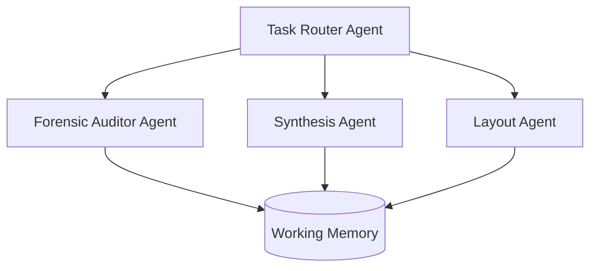

# AI Agents Architecture

ScholarFormAI utilizes a multi-agent orchestration architecture to handle the complexities of academic formatting. Instead of a monolithic prompt, tasks are delegated to specialized agents.

## Agent Orchestration

## Agent Profiles

### 1. Forensic Auditor Agent
- **Role:** Verifies citations, cross-references bibliography, and checks mathematical equations for structural integrity.
- **Input:** Extracted raw text.
- **Output:** Validation report, corrected citations.

### 2. Synthesis Agent
- **Role:** Merges structured data, resolves transition flow, and writes fluid paragraphs when generating content from scratch.
- **Integration:** Interacts heavily with the [RAG System](RAG.md) to ground its generation in factual source documents.

### 3. Layout Agent
- **Role:** Maps semantic structures (abstract, methodology, conclusion) into specific template directives (e.g., IEEE two-column format, APA style).
- **Output:** Final markdown or intermediate representation ready for PDF/DOCX rendering.

## Related Documents
- [AI Overview](AI.md)
