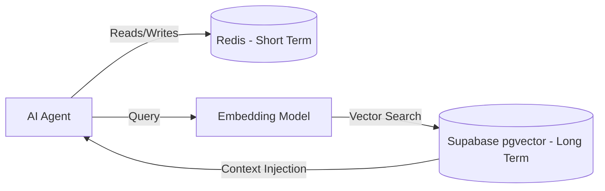

# AI Memory Management

To ensure context continuity across multi-turn generation and complex agent interactions, ScholarFormAI implements a two-tiered memory system.

## 1. Short-Term Memory (Working Context)
- **Technology:** Redis
- **Usage:** Stores the active context window for ongoing editor sessions or task executions.
- **Data:** Recent prompts, intermediate agent outputs, and fast-access metadata.
- **Eviction:** Volatile, typically expires after 24 hours of inactivity.

## 2. Long-Term Memory (Semantic Storage)
- **Technology:** Supabase (PostgreSQL with `pgvector`)
- **Usage:** Stores canonical document embeddings, user preference profiles, and historical generation patterns.
- **Mechanism:** Text chunks are embedded and saved to `pgvector`. Agents retrieve relevant context using cosine similarity searches.

## Memory Flow

## Related Documents
- [RAG System](RAG.md)
- [Database Schema](../database/DATABASE.md)
