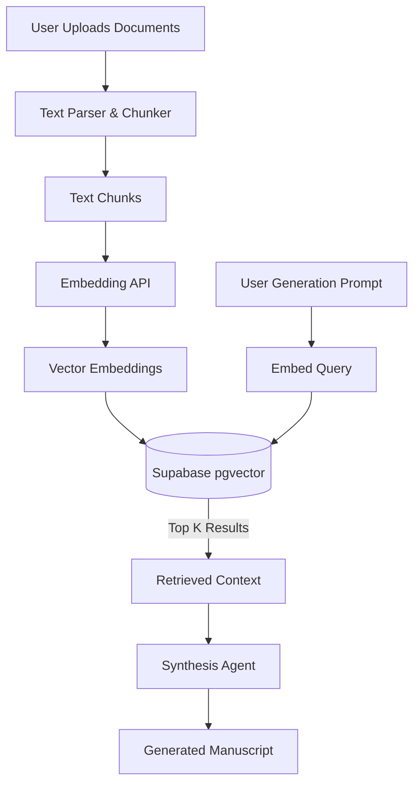

# Retrieval-Augmented Generation (RAG)

ScholarFormAI utilizes Multi-Doc RAG to synthesize, merge, and cross-reference content from multiple source documents.

## RAG Architecture Pipeline

## Key Components

1. **Ingestion & Chunking**
   - Documents are parsed (PDF, DOCX) and split into semantically coherent chunks (e.g., by paragraph or section heading).
   - Overlap is applied to maintain context between chunks.

2. **Embedding**
   - We utilize high-performance embedding models (e.g., OpenAI `text-embedding-3-small` or local variants) to generate vector representations.

3. **Retrieval**
   - Queries are embedded and compared against the vector database using cosine similarity.
   - Advanced retrieval techniques like **MMR (Maximal Marginal Relevance)** are used to ensure diversity in the retrieved context.

## Related Documents
- [AI Agents](AGENTS.md)
- [Memory Management](MEMORY.md)
