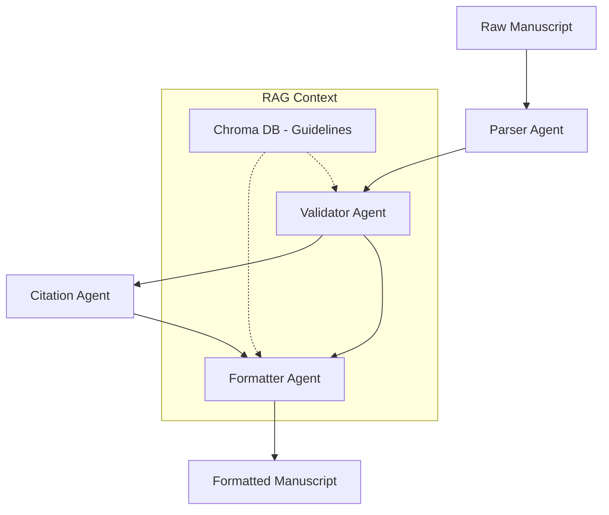

# AI Features and Architecture

## Overview
ScholarFormAI (AMF) heavily leverages AI and LLMs to assist researchers in creating, formatting, and improving their academic manuscripts. This document summarizes the AI module relationships, prompt documentation, and agent workflows.

For the exhaustive design, refer to [`../AI_ARCHITECTURE.md`](../AI_ARCHITECTURE.md) and [`../CHROMA_RAG_ARCHITECTURE.md`](../CHROMA_RAG_ARCHITECTURE.md).

## Agent Workflows
The AI system operates using specialized agent workflows:

1. **Parser Agent**: Extracts and understands the manuscript structure (Title, Authors, Abstract, Headings, Citations).
2. **Validator Agent**: Validates the extracted structure against specified formatting guidelines (e.g., APA, MLA). Identifies structural gaps and missing sections.
3. **Formatter Agent**: Restructures and refines the manuscript content based on the Validator's findings.
4. **Citation Management Agent**: Automatically detects, formats, and completes missing reference entries (e.g., retrieving missing DOIs).

### Workflow Diagram

## Module Relationships

- `backend/app/ai/`: Core directory for all AI features. Contains prompts, LLM clients, and agent orchestration.
- `backend/app/ai/prompts/`: Version-controlled prompts. (See Prompt Documentation below).
- `backend/app/ai/rag/`: Integration with Chroma DB for retrieving formatting guidelines.
- `backend/app/ai/models.py`: Pydantic models enforcing structured JSON outputs from LLMs.

## Prompt Documentation
Prompts are treated as code and stored in `backend/app/ai/prompts/`. 

- **Versioning**: Prompts must include version numbers and changelogs as comments.
- **Modularity**: Base instructions are separated from dynamic task-specific context (e.g., `<system_instructions>` vs `<user_request>`).
- **Guidelines**: Prompts follow the guidelines outlined in `../AI_Instructions.md`.

## Future AI Roadmap
- Multi-modal abstract summarization.
- Advanced Reference duplication detection and ML-based citation classification.
- Real-time AI editing assistant integrated into the frontend.
