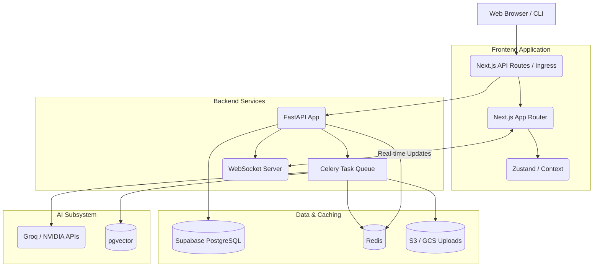

# System Architecture

This document provides a high-level overview of the ScholarFormAI system architecture, detailing the interaction between the frontend, backend, AI models, and data persistence layers.

## High-Level Architecture Overview

ScholarFormAI employs a modern, decoupled architecture designed for high scalability, asynchronous processing, and real-time user feedback.

## Core Components

1. **Frontend (Next.js)**
   - Responsible for the UI, split-pane editor, and real-time preview.
   - Built using React and the App Router.

2. **Backend (FastAPI)**
   - Handles API requests, authentication, and routing.
   - Enqueues heavy document processing tasks to Celery.

3. **Task Queue (Celery + Redis)**
   - Manages asynchronous document formatting, PDF extraction, and AI generation tasks.

4. **Storage (Supabase + Blob Storage)**
   - Relational data and vector embeddings (pgvector) are stored in Supabase PostgreSQL.
   - Raw documents and formatted outputs are stored in object storage.

## Related Documents
- [System Design](SYSTEM_DESIGN.md)
- [Database Schema](../database/DATABASE.md)
- [AI Overview](../ai/AI.md)
