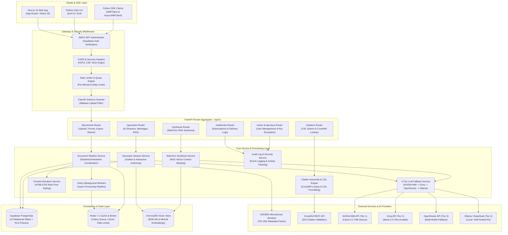
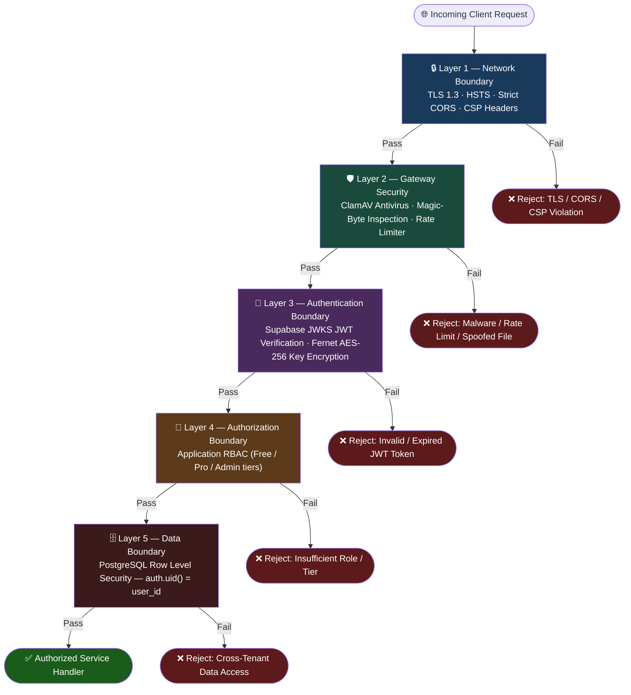
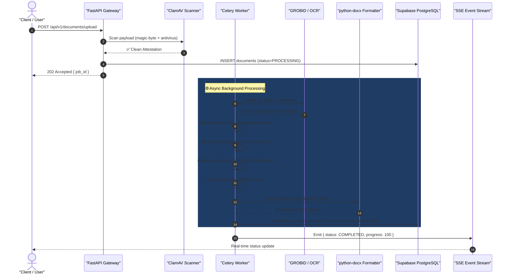
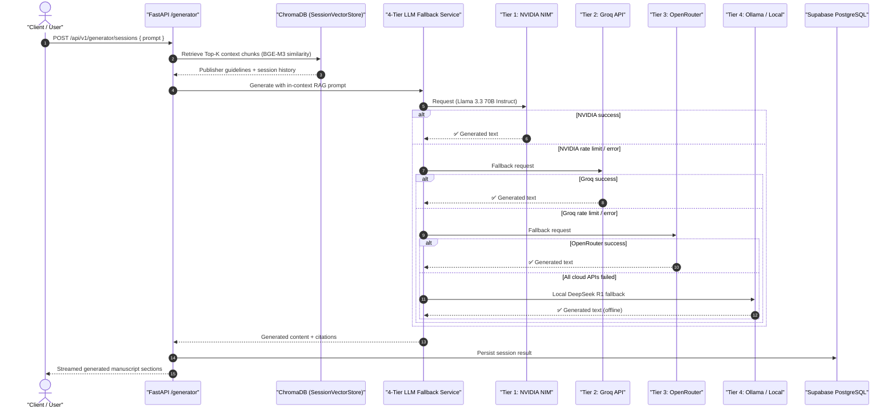

# ScholarForm AI — System Architecture

## Table of Contents

- [Overview](#overview)
- [Major Subsystems](#major-subsystems)
- [Complete System Topology & Component Diagram](#complete-system-topology--component-diagram)
- [Subsystem Responsibilities](#subsystem-responsibilities)
- [Security & Authentication Boundaries](#security--authentication-boundaries)
- [Primary Data Flow Patterns](#primary-data-flow-patterns)
- [Tech Stack & Runtime Versions](#tech-stack--runtime-versions)
- [Related Documentation](#related-documentation)

---

## Overview

ScholarForm AI (AMF - Automated Docx Formatter) is an enterprise-grade distributed document processing, formatting, and authoring platform. Built with a decoupled architecture, ScholarForm AI connects client frontends, programmatic SDKs, and CLI tools through a unified FastAPI gateway to a high-performance Python processing core, multi-store persistence layer, and external microservices.

### Major Subsystems

| Subsystem | Technology | Purpose / Role | Hosting / Runtime |
|-----------|------------|----------------|-------------------|
| **Frontend Web App** | Next.js 16 (App Router), React 19, Tailwind CSS 3 | Interactive UI for formatting, AI authoring, document management, and real-time previews. | Vercel Edge Platform |
| **API Gateway & Service Layer** | FastAPI, Uvicorn, Celery, Pydantic v2 | 93+ REST API endpoints, JWT/API key authentication, async job orchestration, and service execution. | Render / Container Service |
| **Relational Database** | Supabase PostgreSQL (v15+) | Primary OLTP persistence — profiles, documents, versions, results, audit logs, API keys, sessions. | Supabase Cloud |
| **Cache & Task Broker** | Redis 7.x (Upstash / Local) | Celery task queue broker, GROBID/LLM response caching, rate limit tracking, JWT token blacklist. | Managed Redis / Local |
| **Vector Store** | ChromaDB (PersistentClient) | Academic formatting guideline embeddings (`bge-m3`) and per-session RAG context (`miniLM`). | Local Filesystem Core |
| **Microservices & AI Tiers** | GROBID (Docker), Tesseract/RapidOCR, LLM APIs | Metadata TEI XML extraction, local OCR fallback, 4-tier LLM inference (NVIDIA NIM, Groq, OpenRouter, Ollama). | Docker Containers & External APIs |

---

## Complete System Topology & Component Diagram

The diagram below illustrates the end-to-end system topology of ScholarForm AI, mapping traffic flow from client tools through security middleware, API router aggregators, business services, multi-store persistence, and external AI services.



---

## Subsystem Responsibilities

### 1. Client & Frontend Subsystem
- **Next.js 16 Web App**: App Router architecture with 38 pages and 28+ React 19 components. Provides document uploading, live side-by-side HTML preview rendering (TipTap integration), interactive AI manuscript generator workspace, and billing/key management.
- **Python Click CLI (`amf`)**: Command-line tools supporting programmatic format jobs, issue reporting, update checks, and pipeline automation.
- **Python SDK (`amf_sdk`)**: Synchronous (`AMFClient`) and asynchronous (`AsyncAMFClient`) Python clients enabling headless integration into research workflows.

### 2. API Gateway & Middleware Layer
- **FastAPI Core**: Uvicorn-served async gateway using strict request validation via Pydantic v2 schemas and standard `api_envelope` responses (`APIResponse`).
- **JWKS JWT Verification**: Verifies incoming Bearer tokens using public keys dynamically fetched from Supabase Auth endpoints.
- **Rate Limiting & Security Controls**: Enforces per-minute and per-day request limits (`api_key_rate_limiter.py`). Passes incoming uploads through ClamAV antivirus and magic-byte validation.

### 3. Service & Pipeline Core
- **Pipeline Orchestrator (`app.pipeline.orchestrator`)**: Slim coordination layer managing document ingestion, extraction, structure detection, classification, NLP enrichment, validation, python-docx layout formatting, and export.
- **Generator Session Service (`generator_session_service.py`)**: Powers AI manuscript creation, outline negotiation, section drafting, and RAG retrieval.
- **Citation Assembly Service (`citation_assembly_service.py`)**: Extracts raw citations, fetches metadata from CrossRef, and formats references via the CSL Engine.
- **LLM Fallback Engine (`llm_fallback_service.py`)**: 4-tier model dispatcher ensuring high availability across LLM providers with automatic circuit breaker failover.

### 4. Persistence Subsystem
- **Supabase PostgreSQL**: Primary relational store holding 12 operational tables protected by Row Level Security (RLS) policies.
- **Redis Cache & Broker**: Low-latency caching for GROBID extractions (1h TTL) and LLM completions (24h TTL), combined with Celery background task queuing.
- **ChromaDB Vector Store**: Local vector database holding academic publisher guidelines (`BAAI/bge-m3` model) and per-session conversational context (`multi-qa-MiniLM-L6-v2`).

### 5. External Microservices
- **GROBID (Docker)**: TEI XML parsing engine for extracting titles, authors, abstracts, and reference structures from academic PDFs.
- **CrossRef REST API**: External service for validating DOIs and retrieving accurate bibliographic records.
- **LLM Provider APIs**: External inference APIs (NVIDIA NIM, Groq, OpenRouter) and local Ollama instances.

---

## Security & Authentication Boundaries

ScholarForm AI implements **defense-in-depth security** across five distinct layers — from network perimeter down to database-level row isolation.

> [!IMPORTANT]
> All five security layers are enforced on **every** request. No single layer is sufficient alone; they are designed to be collectively exhaustive.



1. **Token Validation**: FastAPI middleware intercepting Bearer tokens verifies signature, audience, and expiration against Supabase Auth JWKS.
2. **API Keys Security**: User-provided LLM API keys are encrypted at rest using AES-256 Fernet encryption (`encryption_service.py`).
3. **Upload Integrity**: Multi-layer upload defense combines extension validation, magic-byte inspection (e.g., `%PDF`, `PK\x03\x04`), and real-time ClamAV antivirus scanning.
4. **Row Level Security (RLS)**: PostgreSQL enforces data isolation at the database level (`auth.uid() = user_id`), preventing cross-tenant data leaks even under direct REST access.

---

## Primary Data Flow Patterns

### Pattern A: Single Document Upload & Formatting

This sequence shows the complete lifecycle of a document from upload through asynchronous processing to delivery. The API acknowledges in `<400ms`; all heavy processing is offloaded to Celery workers.



### Pattern B: Interactive AI Generation & 4-Tier RAG Fallback

This sequence shows how the Generator service retrieves RAG context and cascades through four LLM tiers to guarantee availability.



---

## Tech Stack & Runtime Versions

| Layer | Technology | Version | Purpose |
|-------|-----------|---------|---------|
| **Frontend** | Next.js | 16.x | App Router Web Application |
| | React | 19.x | UI Component Engine |
| | Tailwind CSS | 3.x | Styling Framework |
| | TipTap | 2.x | Rich Text Editor & Live Preview |
| **Backend** | Python | 3.12.x | Runtime Platform |
| | FastAPI | 0.127.1 | Async Web Framework |
| | Celery | 5.x | Background Task Queue |
| | SQLAlchemy | 2.x | Relational Database ORM |
| | Pydantic | 2.x | Request/Response Validation |
| **Database** | Supabase PostgreSQL | 15+ | Primary Relational Persistence |
| | Redis | 7.x | Task Broker & Response Cache |
| | ChromaDB | Latest | Persistent Vector Database |
| **AI / NLP** | LiteLLM | Latest | Unified LLM API Wrapper |
| | RapidOCR / ONNX | Latest | Local Image OCR Fallback |
| | GROBID | 0.8 | PDF TEI XML Metadata Parser |

---

## Related Documentation

- [SYSTEM_DESIGN.md](SYSTEM_DESIGN.md) — Subsystem detailed design, RAG flowcharts, and CSL engine logic.
- [DATABASE_SCHEMA.md](DATABASE_SCHEMA.md) — Complete 12-table PostgreSQL schema, ERD, and RLS policies.
- [PIPELINE.md](PIPELINE.md) — 12-Stage Document Processing Pipeline sequence diagram and breakdown.
- [API_REFERENCE.md](API_REFERENCE.md) — REST API endpoint specification.

---

*Last updated: July 2026*

---

## Middleware Stack (Execution Order)

| Middleware | File | Size |
|-----------|------|------|
| Prometheus metrics | `prometheus_metrics.py` | 7KB |
| Rate limit (base) | `rate_limit.py` | 6.9KB |
| Tier-aware rate limit | `tier_rate_limit.py` | 4.1KB |
| Abuse detection | `abuse_detector.py` | 2.7KB |
| Request ID | `request_id.py` | 2.2KB |
| Security headers (CSP, HSTS) | `security_headers.py` | 4.6KB |
| RBAC | `rbac.py` | 708B (stub) |

## Key Architecture Decisions

| Decision | Rationale |
|---------|---------|
| **No Spring Boot gateway** | FastAPI handles all middleware. Spring Boot was never built; it's obsolete in the requirements. |
| **No DOCX on live preview** | HTML/CSS only for <80ms latency — generating DOCX is too slow for real-time. |
| **No LLM during typing** | LLM fires only on explicit user action (not keystroke). |
| **Redis pub/sub as backbone** | Single consistent pattern for SSE, WebSocket, and Celery task events. |
| **LiteLLM abstraction** | Same client code for NVIDIA NIM, Groq, and Ollama. |
| **Background tasks for >400ms ops** | Never block the HTTP request thread. |
| **GROBID optional, Docling primary** | Render 512MB RAM constraint makes GROBID Docker (1.5GB) non-viable. 3-tier PDF fallback: GROBID (if `GROBID_ENABLED=true`) → Docling → PyMuPDF. |

## Detailed Request Flows

### Formatter Mode A — Upload & Format

```
Browser → POST /api/v1/documents/upload
  → ClamAV virus scan
  → MIME + magic byte + extension tri-validation
  → Start background task (Celery/asyncio)
  → Return job_id (< 400ms)

Background:
  → Parse (GROBID if enabled, else Docling, else PyMuPDF)
  → Structure Detection
  → Block Classification (LLMClassifier — if USE_LLM_CLASSIFICATION=true)
  → NLP Enhancement (YAKE/spaCy)
  → Validation
  → Format & Render (Template)
  → Export (DOCX/PDF)
  → SSE events: { stage, progress } → frontend Stepper.jsx
```

### Formatter Mode B — Live Preview

```
Browser ↔ WebSocket /api/v1/preview/ws/{session_id}
  → Client sends edited content + template choice
  → Server: HTML render (target < 80ms — no DOCX generated!)
  → Redis cache: preview:{session_id}
  → Server sends rendered HTML/CSS back
```
