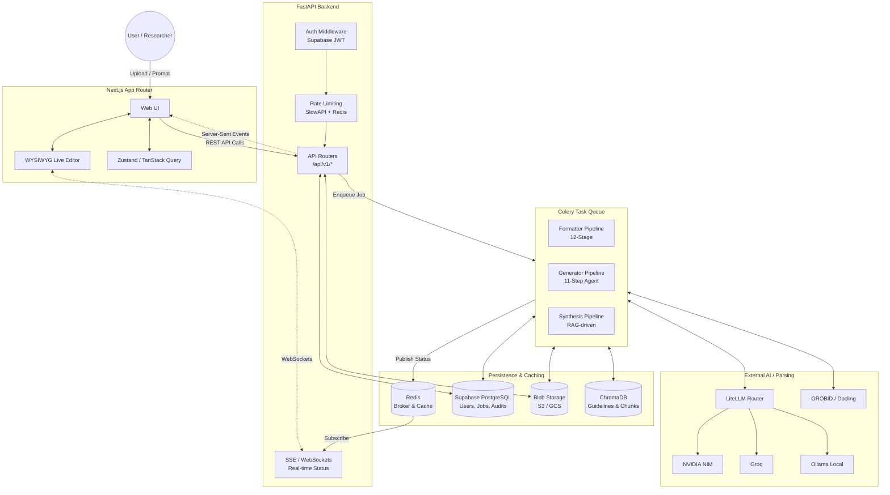

# System Design

This document details the complete end-to-end system design, asynchronous processing model, data flow, and core pipelines of ScholarForm AI.

## End-to-End Architecture

ScholarForm AI is designed to handle three computationally intensive workflows:

1. **Document Formatting:** Parsing unstructured DOCX/PDFs and applying journal-specific layout contracts.
2. **AI Agent Generation:** Synthesizing an academic manuscript from a prompt through an 11-step agentic pipeline.
3. **Multi-Doc Synthesis:** Combining multiple source PDFs into a single manuscript using RAG.

## Core Workflows

### 1. Formatting Workflow

When a user uploads a document to be formatted:

1. **Ingestion:** File uploaded to Supabase Blob Storage; Job created in PostgreSQL.
2. **Parsing:** Fallback chain parses document (GROBID -> Docling -> PyMuPDF).
3. **Structuring:** Content is converted to an internal Abstract Syntax Tree (AST).
4. **Validation:** Checks against `contract.yaml` (Jinja2 specs).
5. **Formatting:** Jinja2 compiler renders the final layout according to publisher constraints (IEEE, APA, Springer).

### 2. Generation Workflow (AI Agent)

When a user provides a prompt:

1. **Planning:** LLM maps out a research structure.
2. **Drafting:** Agent generates content section-by-section.
3. **Review:** Internal critic agent reviews output.
4. **Compilation:** Output is converted to DOCX/PDF via the formatting engine.

### 3. Synthesis Workflow

When multiple PDFs are provided:

1. **Chunking & Embedding:** PDFs chunked and stored in ChromaDB.
2. **Retrieval:** RAG queries context based on topic.
3. **Synthesis:** LLM synthesizes common themes into a cohesive manuscript.

## Scalability and Reliability

- **Stateless Backend:** FastAPI instances hold no state. RAG relies on ChromaDB; Queues on Redis.
- **Circuit Breakers & Fallbacks:** AI LLM calls fallback (Nvidia -> Groq -> Ollama) to prevent timeouts. Parser calls also fallback gracefully.
- **Asynchronous Feedback:** User receives real-time progress via Redis Pub/Sub connected to Server-Sent Events (SSE), preventing HTTP timeouts for long jobs.

## Related Documents

- [Database Schema](../database/DATABASE.md)
- [Realtime Architecture](REALTIME_ARCHITECTURE.md)
- [Security Architecture](SECURITY_ARCHITECTURE.md)
