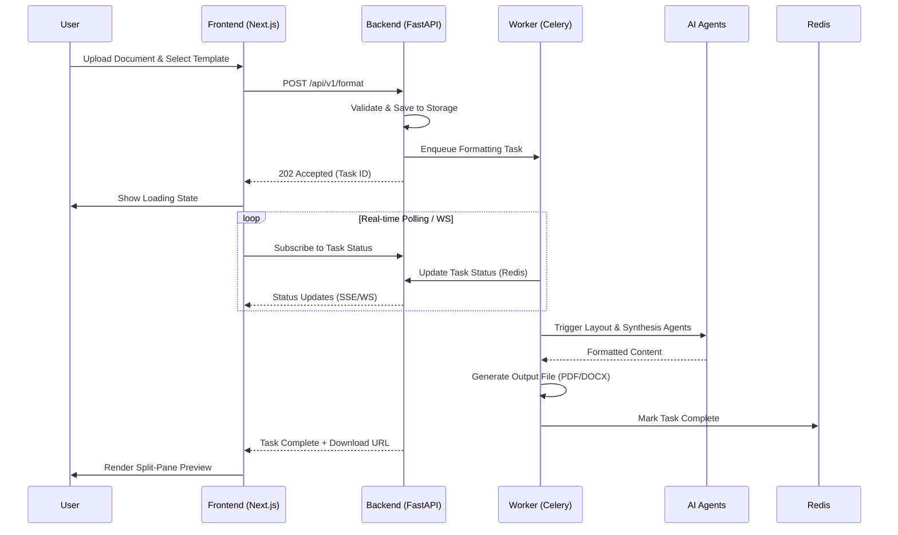

# System Design

This document details the detailed system design, asynchronous processing model, and data flow of ScholarFormAI.

## Document Processing Flow

The core workflow of ScholarFormAI involves processing raw documents into publisher-ready formats. Because these tasks are computationally and AI-intensive, they are handled asynchronously.

## Scalability and Reliability

- **Stateless Backend:** The FastAPI application instances are entirely stateless, allowing horizontal scaling behind a load balancer.
- **Queue Backpressure:** Celery is configured with rate limits to prevent overwhelming the downstream LLM APIs (Groq/NVIDIA).
- **Fault Tolerance:** Failed tasks are automatically retried with exponential backoff.

## Related Documents
- [Architecture](ARCHITECTURE.md)
- [Agents](../ai/AGENTS.md)
