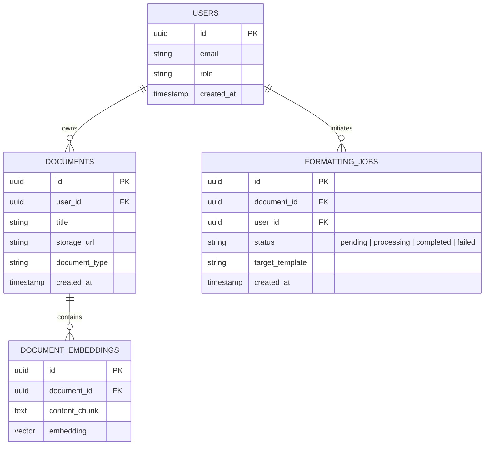

# Database Architecture

ScholarFormAI uses **PostgreSQL** hosted on **Supabase** as its primary relational data store, leveraging `pgvector` for AI embeddings.

## Schema Overview

## Key Technologies

- **Supabase PostgreSQL:** Managed database offering Row Level Security (RLS) and real-time subscriptions.
- **pgvector:** Extension for storing and querying high-dimensional vector embeddings for the RAG pipeline.
- **Migrations:** Database migrations are handled using Alembic (if using SQLAlchemy in FastAPI) or Prisma, ensuring version-controlled schema changes.

## Security

- **Row Level Security (RLS):** Enabled on all tables. Users can only access rows where `user_id` matches their auth token.
- **Connection Pooling:** Used to manage connections efficiently from the serverless edge and FastAPI backend.

## Related Documents

- [RAG System](../ai/RAG.md)
- [Authorization](../security/AUTHORIZATION.md)
