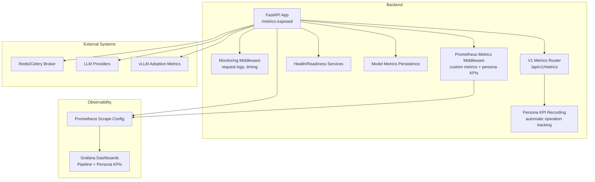
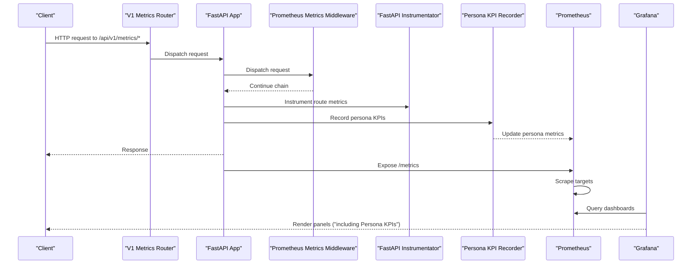
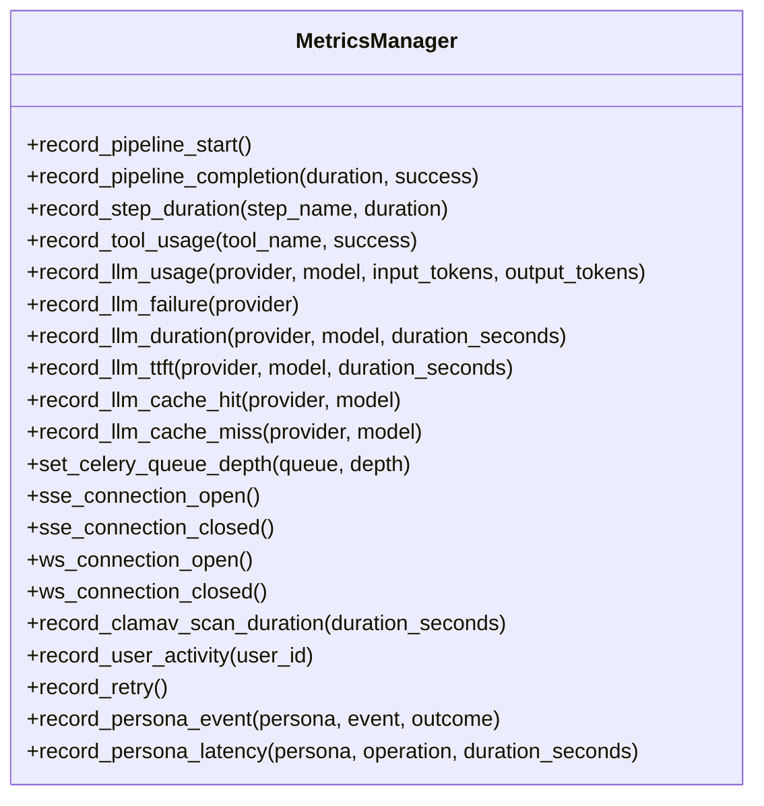
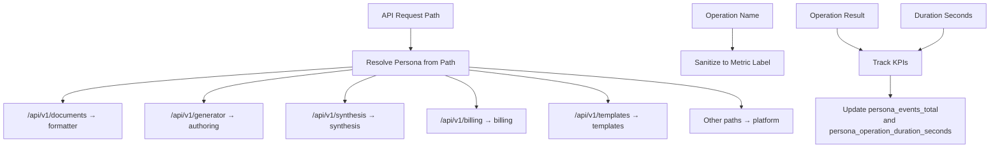
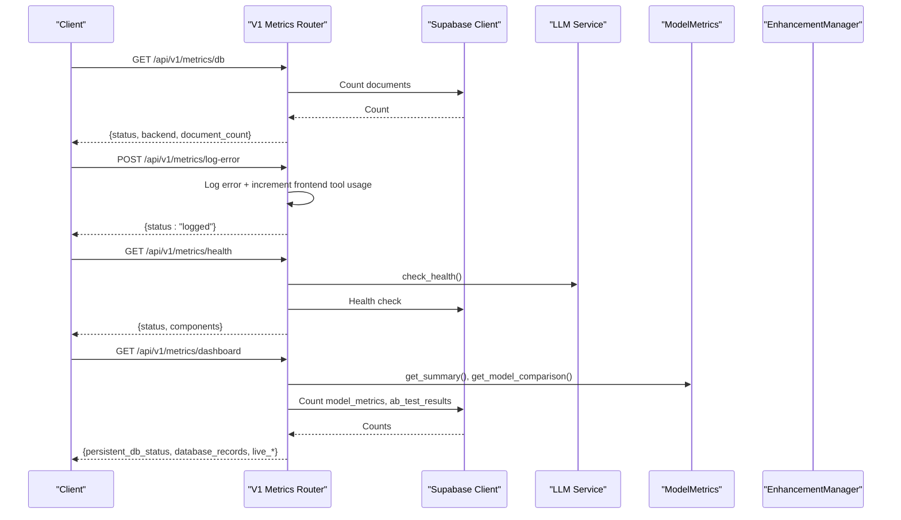
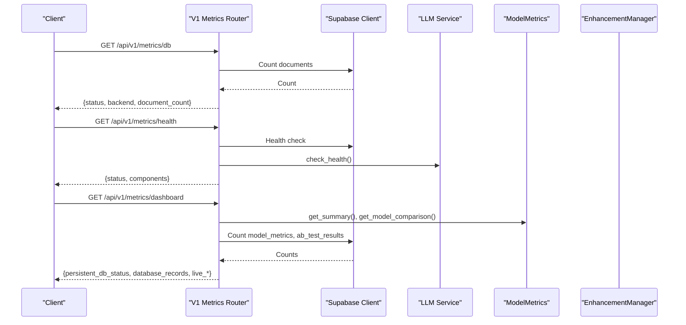
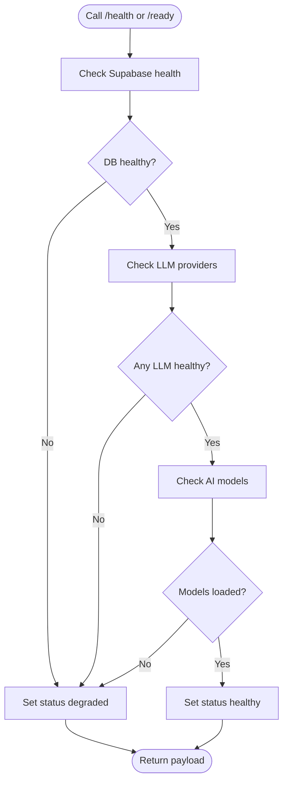
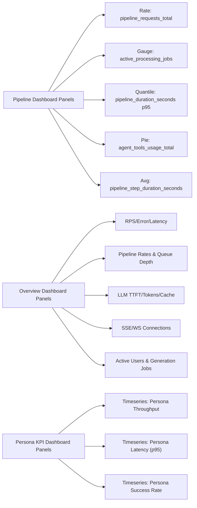
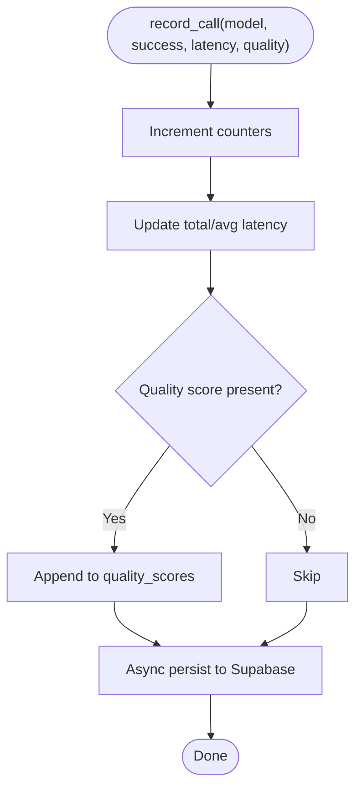
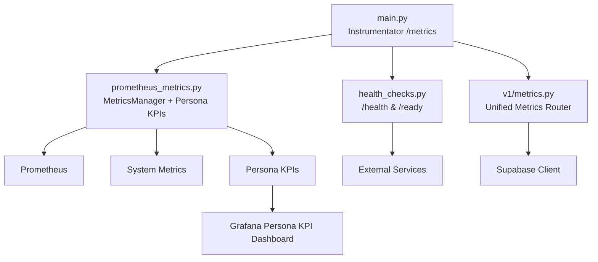

<!-- SPDX-License-Identifier: MIT -->
<!-- Copyright (c) 2026 ScholarForm AI -->

# Monitoring & Metrics

<cite>
**Referenced Files in This Document**
- [main.py](../../backend/app/main.py)
- [prometheus_metrics.py](../../backend/app/middleware/prometheus_metrics.py)
- [monitoring.py](../../backend/app/middleware/monitoring.py)
- [metrics.py](../../backend/app/routers/v1/metrics.py)
- [settings.py](../../backend/app/config/settings.py)
- [health_checks.py](../../backend/app/services/health_checks.py)
- [model_metrics.py](../../backend/app/services/model_metrics.py)
- [metrics.py](../../backend/app/pipeline/agents/metrics.py)
- [_helpers.py](../../backend/app/routers/v1/_helpers.py)
- [pipeline.json](../../backend/docker/grafana/dashboards/pipeline.json)
- [scholarform-overview.json](../../backend/ops/grafana/dashboards/scholarform-overview.json)
- [scholarform-persona-kpis.json](../../backend/ops/grafana/dashboards/scholarform-persona-kpis.json)
- [prometheus.yml](../../backend/docker/prometheus/prometheus.yml)
- [prometheus.yml](../../backend/ops/prometheus/prometheus.yml)
- [docker-compose.yml](../../backend/docker/docker-compose.yml)

- [test_database.py](../../backend/tests/test_database.py)
- [llm_validator.py](../../backend/app/pipeline/safety/llm_validator.py)
- [test_persona_kpi_dashboard.py](../../backend/tests/test_persona_kpi_dashboard.py)
</cite>

## Update Summary

**Changes Made**

- Enhanced monitoring system with new Grafana dashboards (scholarform-persona-kpis.json)
- Added persona-based KPI tracking with dedicated metrics (persona_events_total, persona_operation_duration_seconds)
- Consolidated metrics functionality into new v1 metrics router (/api/v1/metrics)
- Implemented automatic persona KPI recording for all API operations
- Added vLLM adoption readiness monitoring
- Updated metrics exposure endpoints to use v1 router structure

## Table of Contents

1. [Introduction](#introduction)
2. [Project Structure](#project-structure)
3. [Core Components](#core-components)
4. [Architecture Overview](#architecture-overview)
5. [Detailed Component Analysis](#detailed-component-analysis)
6. [Dependency Analysis](#dependency-analysis)
7. [Performance Considerations](#performance-considerations)
8. [Troubleshooting Guide](#troubleshooting-guide)
9. [Conclusion](#conclusion)
10. [Appendices](#appendices)

## Introduction

This document describes the monitoring and metrics system for the Automated Academic Docx Manuscript Formatter. It covers Prometheus instrumentation, custom metrics collection, Grafana dashboards, health and readiness checks, alerting strategies, log aggregation, distributed tracing integration. The system now includes persona-based KPI tracking, consolidated v1 metrics router, enhanced real-time metrics capabilities. The monitoring architecture has been significantly enhanced with new Grafana dashboards for persona analytics and improved metrics collection infrastructure.

## Project Structure

The monitoring stack integrates:

- Prometheus scraping of the FastAPI application's /metrics endpoint
- Grafana dashboards for pipeline, LLM, business KPIs, and persona analytics
- Health and readiness endpoints for platform observability
- Custom metrics for pipeline performance, queue depths, processing times, error rates, and persona-based KPIs
- Optional persistence of model metrics to Supabase
- **New**: Persona-based KPI tracking with automatic operation monitoring
- **New**: Consolidated v1 metrics router for unified metrics access

**Diagram sources**

- [main.py:45-106](../../backend/app/main.py#L45-L106)
- [prometheus_metrics.py:15-167](../../backend/app/middleware/prometheus_metrics.py#L15-L167)
- [monitoring.py:13-51](../../backend/app/middleware/monitoring.py#L13-L51)
- [health_checks.py:85-127](../../backend/app/services/health_checks.py#L85-L127)
- [model_metrics.py:101-137](../../backend/app/services/model_metrics.py#L101-L137)
- [metrics.py:24-248](../../backend/app/routers/v1/metrics.py#L24-L248)
- [_helpers.py:32-68](../../backend/app/routers/v1/_helpers.py#L32-L68)
- [main.py:47-66](../../backend/app/main.py#L47-L66)
- [prometheus.yml:5-16](../../backend/docker/prometheus/prometheus.yml#L5-L16)
- [scholarform-overview.json:1-239](../../backend/ops/grafana/dashboards/scholarform-overview.json#L1-L239)
- [scholarform-persona-kpis.json:1-142](../../backend/ops/grafana/dashboards/scholarform-persona-kpis.json#L1-L142)
**Section sources**
- [main.py:45-106](../../backend/app/main.py#L45-L106)
- [prometheus_metrics.py:15-167](../../backend/app/middleware/prometheus_metrics.py#L15-L167)
- [monitoring.py:13-51](../../backend/app/middleware/monitoring.py#L13-L51)
- [health_checks.py:85-127](../../backend/app/services/health_checks.py#L85-L127)
- [model_metrics.py:101-137](../../backend/app/services/model_metrics.py#L101-L137)
- [metrics.py:24-248](../../backend/app/routers/v1/metrics.py#L24-L248)
- [_helpers.py:32-68](../../backend/app/routers/v1/_helpers.py#L32-L68)
- [main.py:47-66](../../backend/app/main.py#L47-L66)
- [prometheus.yml:5-16](../../backend/docker/prometheus/prometheus.yml#L5-L16)
- [scholarform-overview.json:1-239](../../backend/ops/grafana/dashboards/scholarform-overview.json#L1-L239)
- [scholarform-persona-kpis.json:1-142](../../backend/ops/grafana/dashboards/scholarform-persona-kpis.json#L1-L142)

## Core Components

- Prometheus instrumentation and custom metrics:
  - Pipeline request volume, durations, and step durations
  - Agent tool usage, LLM token consumption, TTFT, cache hits/misses, failures
  - Queue depths (Celery), real-time connections (SSE/WebSocket)
  - Active users and ClamAV scan durations
  - **New**: Persona-based KPIs (persona_events_total, persona_operation_duration_seconds) with automatic operation tracking

- **Enhanced**: Consolidated metrics exposure:
  - V1 metrics router at /api/v1/metrics with unified endpoint structure
  - Database health, dashboard summaries, enhancements, and vLLM readiness monitoring
  - Frontend error logging with automatic tool usage tracking
- Health and readiness:
  - Health endpoint aggregates DB, LLM providers, and AI models
  - Readiness endpoint validates DB, external services, and model availability
- **Enhanced**: Grafana dashboards:
  - Pipeline dashboard for throughput, latency, and step breakdown
  - Overview dashboard for RPS, error rate, latency, pipeline, LLM, real-time, and business KPIs
  - **New**: Persona KPI dashboard for persona-based analytics (throughput, latency, success rates)
- Persistence and summaries:
  - Model metrics recorded and persisted asynchronously to Supabase
  - Agent vs legacy performance tracking stored locally and summarized

**Section sources**

- [prometheus_metrics.py:15-167](../../backend/app/middleware/prometheus_metrics.py#L15-L167)
- [prometheus_metrics.py:144-235](../../backend/app/middleware/prometheus_metrics.py#L144-L235)
- [metrics.py:24-248](../../backend/app/routers/v1/metrics.py#L24-L248)
- [main.py:360-380](../../backend/app/main.py#L360-L380)
- [health_checks.py:130-192](../../backend/app/services/health_checks.py#L130-L192)
- [model_metrics.py:23-181](../../backend/app/services/model_metrics.py#L23-L181)
- [metrics.py:48-260](../../backend/app/pipeline/agents/metrics.py#L48-L260)
- [scholarform-persona-kpis.json:1-142](../../backend/ops/grafana/dashboards/scholarform-persona-kpis.json#L1-L142)
- [pipeline.json:1-448](../../backend/docker/grafana/dashboards/pipeline.json#L1-L448)
- [scholarform-overview.json:1-239](../../backend/ops/grafana/dashboards/scholarform-overview.json#L1-L239)
- [main.py:47-66](../../backend/app/main.py#L47-L66)

## Architecture Overview

The monitoring architecture integrates Prometheus scraping, custom metrics recording, and Grafana visualization. Health and readiness endpoints provide operational signals. Optional Supabase persistence captures model performance for long-term analysis. **New persona-based KPI tracking automatically monitors all API operations with persona categorization.**

**Diagram sources**

- [main.py:273-274](../../backend/app/main.py#L273-L274)
- [prometheus_metrics.py:135-142](../../backend/app/middleware/prometheus_metrics.py#L135-L142)
- [metrics.py:24-248](../../backend/app/routers/v1/metrics.py#L24-L248)
- [_helpers.py:54-68](../../backend/app/routers/v1/_helpers.py#L54-L68)
- [main.py:47-66](../../backend/app/main.py#L47-L66)
- [prometheus.yml:5-16](../../backend/docker/prometheus/prometheus.yml#L5-L16)
- [scholarform-persona-kpis.json:1-142](../../backend/ops/grafana/dashboards/scholarform-persona-kpis.json#L1-L142)

## Detailed Component Analysis

### Enhanced Prometheus Metrics Middleware with Persona KPIs

Defines and records custom metrics for:

- Pipeline: total requests, duration histograms, per-step durations
- Agents: tool usage, retries, LLM token consumption, TTFT, cache stats, failures
- System: active processing jobs, queue depths, real-time connections, ClamAV scans, active users
- **New**: Persona KPIs: automatic operation tracking by persona category (formatter, authoring, synthesis, billing, templates, platform)

**Diagram sources**

- [prometheus_metrics.py:144-300](../../backend/app/middleware/prometheus_metrics.py#L144-L300)

**Section sources**

- [prometheus_metrics.py:15-167](../../backend/app/middleware/prometheus_metrics.py#L15-L167)
- [prometheus_metrics.py:144-300](../../backend/app/middleware/prometheus_metrics.py#L144-L300)

### Persona-Based KPI Tracking System

**New**: Automatic persona KPI recording for all API operations with intelligent persona categorization:

- Automatic persona resolution from URL paths (formatter, authoring, synthesis, billing, templates, platform)
- Operation name sanitization for metric labels
- Outcome tracking (success/error) with automatic latency recording
- Integration with v1 router helper functions for seamless operation

**Diagram sources**

- [_helpers.py:32-68](../../backend/app/routers/v1/_helpers.py#L32-L68)
- [prometheus_metrics.py:291-299](../../backend/app/middleware/prometheus_metrics.py#L291-L299)

**Section sources**

- [_helpers.py:32-68](../../backend/app/routers/v1/_helpers.py#L32-L68)
- [prometheus_metrics.py:291-299](../../backend/app/middleware/prometheus_metrics.py#L291-L299)

### Enhanced V1 Metrics Router

**New**: Consolidated metrics functionality in unified v1 router:

- Database health monitoring with authentication requirements
- Frontend error logging with automatic tool usage tracking
- Health checks with LLM provider status
- Dashboard summaries with model metrics, A/B testing, and database counts
- Enhancement capability profiles with queue status
- **New**: vLLM adoption readiness monitoring

**Diagram sources**

- [metrics.py:24-248](../../backend/app/routers/v1/metrics.py#L24-L248)
- [health_checks.py:85-127](../../backend/app/services/health_checks.py#L85-L127)
- [model_metrics.py:148-181](../../backend/app/services/model_metrics.py#L148-L181)

**Section sources**

- [metrics.py:24-248](../../backend/app/routers/v1/metrics.py#L24-L248)
- [health_checks.py:85-127](../../backend/app/services/health_checks.py#L85-L127)
- [model_metrics.py:148-181](../../backend/app/services/model_metrics.py#L148-L181)

### Metrics Exposure and Endpoints

**Enhanced**: Unified v1 metrics router structure:

- /api/v1/metrics/db: Database health and document count (admin-only)
- /api/v1/metrics/log-error: Frontend error logging with automatic tool usage tracking
- /api/v1/metrics/health: Aggregated health across DB, LLM providers, and AI models
- /api/v1/metrics/dashboard: Live summaries of model metrics, A/B testing, and DB record counts
- /api/v1/metrics/enhancements: Capability profile and queue status
- /api/v1/metrics/vllm-readiness: vLLM adoption readiness monitoring
- /metrics: Prometheus scrape endpoint handled by middleware

**Diagram sources**

- [metrics.py:24-248](../../backend/app/routers/v1/metrics.py#L24-L248)
- [health_checks.py:85-127](../../backend/app/services/health_checks.py#L85-L127)
- [model_metrics.py:148-181](../../backend/app/services/model_metrics.py#L148-L181)

**Section sources**

- [metrics.py:24-248](../../backend/app/routers/v1/metrics.py#L24-L248)
- [health_checks.py:85-127](../../backend/app/services/health_checks.py#L85-L127)
- [model_metrics.py:148-181](../../backend/app/services/model_metrics.py#L148-L181)

### Health and Readiness

- Health endpoint aggregates DB, LLM providers, and AI models; returns 200 healthy or 503 degraded
- Readiness endpoint validates DB, external services, and model loading; used by orchestrators for startup gating

**Diagram sources**

- [health_checks.py:85-127](../../backend/app/services/health_checks.py#L85-L127)
- [health_checks.py:130-192](../../backend/app/services/health_checks.py#L130-L192)

**Section sources**

- [health_checks.py:85-127](../../backend/app/services/health_checks.py#L85-L127)
- [health_checks.py:130-192](../../backend/app/services/health_checks.py#L130-L192)

### Enhanced Grafana Dashboards

**Enhanced**: Multiple dashboard configurations:

- Pipeline dashboard: request rate by status, active jobs gauge, P95 pipeline duration, tool usage distribution, average step duration
- Overview dashboard: RPS, error rate, latency; pipeline completed/failed rates and queue depth; LLM TTFT, tokens/sec, cache hit rate; SSE/WS connections; active users and generation jobs
- **New**: Persona KPI dashboard: persona-based throughput, latency (p95), and success rates with automatic persona categorization

**Diagram sources**

- [pipeline.json:101-426](../../backend/docker/grafana/dashboards/pipeline.json#L101-L426)
- [scholarform-overview.json:39-202](../../backend/ops/grafana/dashboards/scholarform-overview.json#L39-L202)
- [scholarform-persona-kpis.json:20-105](../../backend/ops/grafana/dashboards/scholarform-persona-kpis.json#L20-L105)

**Section sources**

- [pipeline.json:1-448](../../backend/docker/grafana/dashboards/pipeline.json#L1-L448)
- [scholarform-overview.json:1-239](../../backend/ops/grafana/dashboards/scholarform-overview.json#L1-L239)
- [scholarform-persona-kpis.json:1-142](../../backend/ops/grafana/dashboards/scholarform-persona-kpis.json#L1-L142)

### Model Metrics Persistence and Summaries

- Records model usage, latency, success/failure, and optional quality scores
- Asynchronously persists to Supabase; disables persistence if table not found
- Provides summaries and comparisons for model performance and fallback rates

**Diagram sources**

- [model_metrics.py:60-137](../../backend/app/services/model_metrics.py#L60-L137)

**Section sources**

- [model_metrics.py:23-181](../../backend/app/services/model_metrics.py#L23-L181)

### Agent vs Legacy Performance Tracking

- Tracks processing runs, tool usage, retries, and quality metrics
- Stores metrics in JSONL and maintains a summary with speed, quality, and reliability comparisons

**Section sources**

- [metrics.py:15-260](../../backend/app/pipeline/agents/metrics.py#L15-L260)

### Queue Depth Metrics and Periodic Updates

- Periodically reads Redis queue lengths and updates Celery queue depth metrics
- Runs on a background task during app lifespan

**Section sources**

- [main.py:117-147](../../backend/app/main.py#L117-L147)

## Dependency Analysis

Key dependencies and relationships:

- FastAPI instrumentation exposes /metrics
- Prometheus scrapes the backend target defined in prometheus.yml
- Grafana queries Prometheus for dashboards (including new persona KPI dashboard)
- **New**: V1 metrics router consolidates all metrics endpoints with unified structure
- **New**: Persona KPI recording integrates with v1 router helper functions
- Metrics router depends on Supabase client for DB health and counts
- Health/Readiness services depend on external systems (DB, LLM providers, AI models)
- Model metrics persistence depends on Supabase client and runs in background threads

**Diagram sources**

- [main.py:273-274](../../backend/app/main.py#L273-L274)
- [prometheus_metrics.py:144-300](../../backend/app/middleware/prometheus_metrics.py#L144-L300)
- [metrics.py:24-248](../../backend/app/routers/v1/metrics.py#L24-L248)
- [health_checks.py:85-127](../../backend/app/services/health_checks.py#L85-L127)
- [main.py:45-106](../../backend/app/main.py#L45-L106)
- [scholarform-persona-kpis.json:1-142](../../backend/ops/grafana/dashboards/scholarform-persona-kpis.json#L1-L142)

**Section sources**

- [main.py:273-274](../../backend/app/main.py#L273-L274)
- [prometheus_metrics.py:144-300](../../backend/app/middleware/prometheus_metrics.py#L144-L300)
- [metrics.py:24-248](../../backend/app/routers/v1/metrics.py#L24-L248)
- [health_checks.py:85-127](../../backend/app/services/health_checks.py#L85-L127)
- [main.py:45-106](../../backend/app/main.py#L45-L106)
- [scholarform-persona-kpis.json:1-142](../../backend/ops/grafana/dashboards/scholarform-persona-kpis.json#L1-L142)

## Performance Considerations

- Scraping cadence and intervals:
  - Prometheus scrape interval configured to 5s for the backend job
  - Global evaluation interval at 15s
- Metric cardinality:
  - Use label selectors and bucket configurations judiciously to avoid excessive series
  - **New**: Persona KPIs add persona and operation dimensions but use sanitized labels to control cardinality
- Background persistence:
  - Model metrics persistence runs in a background thread to avoid blocking the pipeline
- Queue depth updates:
  - Periodic updates reduce overhead while keeping queue metrics fresh
- Caching:
  - Health and readiness payloads are cached with TTLs to reduce repeated checks

- **New**: Persona KPI recording overhead:
  - Minimal performance impact with try/except blocks around persona KPI recording
  - Automatic persona resolution uses simple string matching for efficiency

**Section sources**

- [prometheus.yml:5-16](../../backend/docker/prometheus/prometheus.yml#L5-L16)
- [model_metrics.py:101-137](../../backend/app/services/model_metrics.py#L101-L137)
- [main.py:138-147](../../backend/app/main.py#L138-L147)
- [health_checks.py:195-226](../../backend/app/services/health_checks.py#L195-L226)
- [main.py:45-106](../../backend/app/main.py#L45-L106)
- [_helpers.py:54-68](../../backend/app/routers/v1/_helpers.py#L54-L68)

## Troubleshooting Guide

Common issues and resolutions:

- No metrics in Grafana:
  - Verify Prometheus scrape job target matches backend address and port
  - Confirm /metrics endpoint is reachable and returns text/plain
  - **New**: Check persona KPI dashboard exists and references persona_events_total and persona_operation_duration_seconds metrics
- Missing Supabase table for model metrics:
  - Persistence disables itself after detecting missing table; ensure table exists or adjust expectations
- Health/Readiness degraded:
  - Check DB connectivity, LLM provider availability, and AI model loading status
- High error rate or latency spikes:
  - Inspect pipeline P95 duration and step averages; correlate with queue depths and LLM cache hit rates
- Real-time connection churn:
  - Monitor SSE/WS reconnect rates and active connections to detect client-side instability

- **Persona KPI tracking issues**:
  - **New** Verify persona resolution works correctly for different API paths
  - Check that persona_events_total and persona_operation_duration_seconds metrics are being recorded
  - Ensure automatic KPI recording occurs in v1 router operations
  - Validate persona KPI dashboard queries return expected results
- **V1 metrics router issues**:
  - **New** Verify /api/v1/metrics endpoints are properly routed through v1 router
  - Check authentication requirements for admin-only endpoints
  - Ensure frontend error logging endpoint properly increments tool usage metrics

**Section sources**

- [prometheus.yml:5-16](../../backend/docker/prometheus/prometheus.yml#L5-L16)
- [model_metrics.py:123-135](../../backend/app/services/model_metrics.py#L123-L135)
- [health_checks.py:85-127](../../backend/app/services/health_checks.py#L85-L127)
- [scholarform-overview.json:41-202](../../backend/ops/grafana/dashboards/scholarform-overview.json#L41-L202)
- [main.py:45-106](../../backend/app/main.py#L45-L106)
- [test_database.py:25-48](../../backend/tests/test_database.py#L25-L48)
- [llm_validator.py:116-118](../../backend/app/pipeline/safety/llm_validator.py#L116-L118)
- [test_persona_kpi_dashboard.py:6-14](../../backend/tests/test_persona_kpi_dashboard.py#L6-L14)
- [metrics.py:24-248](../../backend/app/routers/v1/metrics.py#L24-L248)

## Conclusion

The monitoring and metrics system provides comprehensive observability for the manuscript formatter pipeline. It combines Prometheus instrumentation, custom metrics, health/readiness endpoints, and Grafana dashboards. Optional Supabase persistence enables long-term analysis of model performance. **New persona-based KPI tracking automatically monitors all API operations with intelligent persona categorization, providing valuable insights into user behavior patterns. The consolidated v1 metrics router offers a unified interface for all monitoring endpoints. With proper alerting and capacity planning aligned to queue depths, LLM usage, and persona analytics, the system supports reliable production operations.**

## Appendices

### Enhanced Metrics Exposure Endpoints

**Updated**: V1 router structure:

- /api/v1/metrics/db: Database health and document count (admin-only)
- /api/v1/metrics/log-error: Frontend error logging with automatic tool usage tracking
- /api/v1/metrics/health: Aggregated health status
- /api/v1/metrics/dashboard: Live model and A/B test summaries
- /api/v1/metrics/enhancements: Enhancement capability profile
- /api/v1/metrics/vllm-readiness: vLLM adoption readiness monitoring
- /metrics: Prometheus scrape endpoint

**Section sources**

- [prometheus_metrics.py:135-142](../../backend/app/middleware/prometheus_metrics.py#L135-L142)
- [metrics.py:24-248](../../backend/app/routers/v1/metrics.py#L24-L248)

### Enhanced Custom Metric Definitions

- Pipeline: requests_total, pipeline_duration_seconds, pipeline_step_duration_seconds
- Agent: agent_tools_usage_total, agent_llm_tokens_total, agent_retries_total
- LLM: llm_failures_total, llm_ttft_seconds, llm_cache_hits_total, llm_cache_misses_total, llm_request_duration_seconds
- System: active_processing_jobs, celery_queue_depth, sse/ws connections, clamav_scan_duration_seconds, active_users
- **New**: Persona KPIs: persona_events_total (persona, event, outcome), persona_operation_duration_seconds (persona, operation)

**Section sources**

- [prometheus_metrics.py:15-167](../../backend/app/middleware/prometheus_metrics.py#L15-L167)

### Enhanced Alerting Strategies

- Suggested alerts:
  - High pipeline failure rate or sustained P95 latency increases
  - Low LLM cache hit rate or frequent failures
  - Elevated error rate from HTTP instrumentor
  - Rising queue depths without corresponding worker throughput
  - Declining active users or generation jobs

  - **New**: Persona KPI monitoring: persona success rate drops, persona latency increases, persona throughput anomalies
  - **New**: vLLM adoption monitoring: readiness status changes, provider performance degradation

### Log Aggregation and Distributed Tracing

- Structured logging can be enabled via settings for production environments
- Request IDs are attached to responses for correlation across services
- **New**: Persona KPI correlation: automatic persona tagging for all monitored operations

**Section sources**

- [settings.py:26-28](../../backend/app/config/settings.py#L26-L28)
- [main.py:40-59](../../backend/app/main.py#L40-L59)
- [monitoring.py:17-50](../../backend/app/middleware/monitoring.py#L17-L50)
- [main.py:45-106](../../backend/app/main.py#L45-L106)

### Enhanced Metric Retention and Capacity Planning

- Retention policy:
  - File cleanup scheduled periodically based on settings; configure retention_days accordingly
- Capacity planning insights:
  - Monitor queue_depth and active_processing_jobs to size Celery workers
  - Track LLM tokens_total and cache hit rates to right-size provider resources
  - Observe pipeline step durations to optimize slowest stages
  - **Enhanced error monitoring**: Reduced error volume allows better focus on genuine performance issues
  - **Graceful degradation monitoring**: Track system resilience under various failure conditions
  - **New**: Persona KPI insights: identify high-value personas, optimize for top-performing persona categories
  - **New**: vLLM adoption metrics: monitor readiness progress and performance improvements

**Section sources**

- [settings.py:128-131](../../backend/app/config/settings.py#L128-L131)
- [main.py:106-114](../../backend/app/main.py#L106-L114)
- [main.py:138-147](../../backend/app/main.py#L138-L147)
- [scholarform-overview.json:88-125](../../backend/ops/grafana/dashboards/scholarform-overview.json#L88-L125)
- [scholarform-persona-kpis.json:88-105](../../backend/ops/grafana/dashboards/scholarform-persona-kpis.json#L88-L105)

### Enhanced Production Monitoring Best Practices

- Enforce HTTPS and HSTS headers in production
- Configure CORS origins carefully
- Use readiness probes to gate traffic until dependencies are ready
- Set appropriate scrape intervals and alert thresholds
- Back up and monitor dashboards and recording rules
- **Resilient error handling**: Use graceful degradation patterns for all critical dependencies
- **New**: Persona analytics monitoring: establish baseline persona success rates and latency targets
- **New**: vLLM adoption tracking: monitor migration progress and performance benefits
- **New**: V1 router validation: ensure all metrics endpoints are properly exposed and accessible

**Section sources**

- [main.py:303-313](../../backend/app/main.py#L303-L313)
- [settings.py:76-82](../../backend/app/config/settings.py#L76-L82)
- [health_checks.py:130-192](../../backend/app/services/health_checks.py#L130-L192)
- [main.py:45-106](../../backend/app/main.py#L45-L106)
- [test_database.py:25-48](../../backend/tests/test_database.py#L25-L48)
- [llm_validator.py:116-118](../../backend/app/pipeline/safety/llm_validator.py#L116-L118)
- [test_persona_kpi_dashboard.py:6-14](../../backend/tests/test_persona_kpi_dashboard.py#L6-L14)
- [metrics.py:24-248](../../backend/app/routers/v1/metrics.py#L24-L248)
