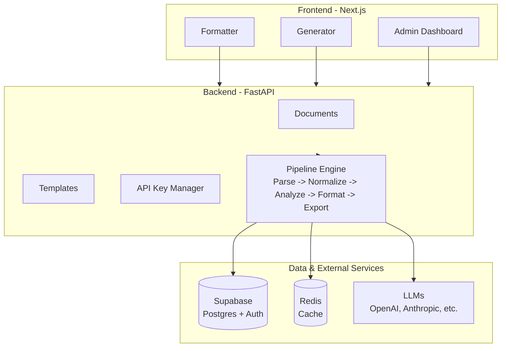

<!-- SPDX-License-Identifier: MIT -->
<!-- Copyright (c) 2026 ScholarForm AI -->

---

title: ScholarForm AI — Developer Onboarding Guide
description: 15-minute development setup guide from clone to running locally
sidebar_position: 50
version: "1.0"
status: ✅ Complete
owner: Docs Team
review_cadence: quarterly
last_updated: July 2026
---

# ScholarForm AI — Developer Onboarding Guide

**Audience:** New developers and open-source contributors

---

## Table of Contents

- [Quick Start (15 minutes)](#quick-start-15-minutes)
- [Architecture Overview](#architecture-overview)
- [Key Directories](#key-directories)
- [Development Workflow](#development-workflow)
- [API Documentation](#api-documentation)
- [Troubleshooting](#troubleshooting)

> **New contributor?** Check [CONTRIBUTING.md](../../CONTRIBUTING.md) first for the full guide on submitting issues and PRs.

## Quick Start (15 minutes)

### 1. Clone & Setup

```bash
git clone https://github.com/rohitkumarnaidu/ScholarFormAI.git
cd ScholarFormAI

# Backend
cd backend
python -m venv .venv && source .venv/bin/activate  # Linux/Mac
python -m venv .venv && .venv\Scripts\activate     # Windows
pip install -r requirements-dev.txt

# Frontend
cd ../frontend
npm install
```

### 2. Environment Variables

```bash
# Copy example env files
cp backend/.env.example backend/.env
cp frontend/.env.local.example frontend/.env.local

# Minimum required for local dev:
# backend/.env
SUPABASE_URL=https://your-project.supabase.co
SUPABASE_ANON_KEY=your-anon-key
SUPABASE_DB_URL=postgresql://...
SECRET_KEY=your-secret-key
```

### 3. Run Locally

```bash
# Backend
cd backend
uvicorn app.main:app --reload --port 8000

# Frontend (in another terminal)
cd frontend
npm run dev
```

### 4. Verify

- Backend: <http://localhost:8000/docs> (Swagger UI)
- Frontend: <http://localhost:3000>
- Health: <http://localhost:8000/api/v1/health/live>

---

## Architecture Overview



---

## Key Directories

| Path | Purpose |
| ------ | --------- |
| `backend/app/routers/v1/` | API endpoint definitions |
| `backend/app/services/` | Business logic services |
| `backend/app/pipeline/` | Document processing pipeline |
| `backend/app/models/` | SQLAlchemy ORM models |
| `backend/app/middleware/` | HTTP middleware |
| `backend/tests/` | Backend test suite |
| `frontend/app/` | Next.js App Router pages |
| `frontend/src/components/` | React components |
| `frontend/src/services/` | API client services |
| `frontend/e2e/` | Playwright E2E tests |

---

## Development Workflow

### 1. Create a Branch

```bash
git checkout -b feature/your-feature-name
```

### 2. Write Code + Tests

```bash
# Backend tests
cd backend
pytest tests/test_your_feature.py -v

# Frontend tests
cd frontend
npx vitest run

# E2E tests (requires running server)
npx playwright test
```

### 3. Pre-commit Checks

```bash
# Linting
ruff check backend/app/
ruff format backend/app/

# Type checking
mypy backend/app/

# Frontend linting
cd frontend
npm run lint
npx tsc --noEmit
```

### 4. Commit & Push

```bash
git add .
git commit -m "feat: add your feature description"
git push origin feature/your-feature-name
```

### 5. Create PR

- Link to relevant issue
- Include test results

---

## API Documentation

### Swagger UI

- Local: <http://localhost:8000/docs>
- Staging: <https://staging.scholarform.ai/docs>
- Production: <https://api.scholarform.ai/docs>

### Key Endpoints

| Method | Path | Description |
| -------- | ------ | ------------- |
| POST | `/api/v1/documents/upload` | Upload document for formatting |
| GET | `/api/v1/templates` | List available templates |
| POST | `/api/v1/generator/sessions` | Create AI generation session |
| POST | `/api/v1/keys` | Add user API key |
| GET | `/api/v1/keys/usage` | View API key usage |
| GET | `/api/v1/health/live` | Health check |

---

## Troubleshooting

### Common Issues

| Problem | Solution |
| --------- | ---------- |
| `ModuleNotFoundError` | Run `pip install -r requirements-dev.txt` |
| `SUPABASE_DB_URL not set` | Copy `.env.example` and fill in values |
| CORS errors | Check `ALLOWED_ORIGINS` in backend `.env` |
| Frontend build fails | Delete `node_modules` and `npm install` |
| Tests hang | Check if Supabase/Redis is reachable |

### Getting Help

- **Issues:** <https://github.com/rohitkumarnaidu/ScholarFormAI/issues>
- **Discussions:** <https://github.com/rohitkumarnaidu/ScholarFormAI/discussions>
