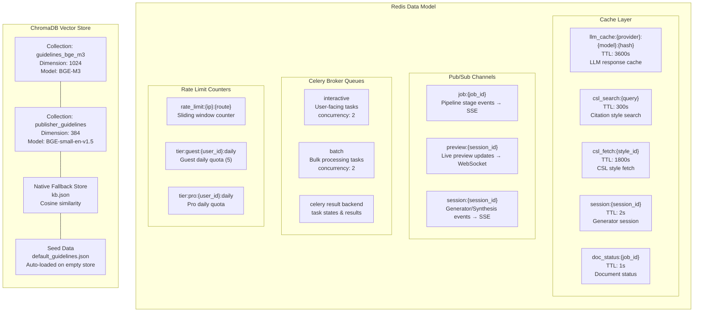

# Data Model

```mermaid
erDiagram
    auth_users {
        uuid id PK
        text email
        text encrypted_password
        timestamptz created_at
    }

    profiles {
        uuid id PK, FK
        text email
        text full_name
        text institution
        text role "authenticated | admin"
        timestamptz created_at
        timestamptz updated_at
    }

    documents {
        uuid id PK "gen_random_uuid()"
        uuid user_id FK
        text filename
        text template "e.g. IEEE"
        text status "RUNNING | COMPLETED | FAILED | CANCELLED"
        text original_file_path
        text raw_text
        text output_path
        jsonb formatting_options
        text file_hash "SHA-256"
        int progress "0-100"
        text current_stage
        text error_message
        timestamptz created_at
        timestamptz updated_at
    }

    document_versions {
        uuid id PK
        uuid document_id FK
        text version_number "v1, v2, ..."
        jsonb edited_structured_data
        text output_path
        timestamptz created_at
    }

    document_results {
        uuid id PK
        uuid document_id FK, UNIQUE
        jsonb structured_data "sections, citations, refs"
        jsonb validation_results "errors, warnings, fixes"
        timestamptz created_at
    }

    processing_status {
        uuid id PK
        uuid document_id FK
        text phase "UPLOAD | EXTRACTION | NLP_ANALYSIS | VALIDATION | PERSISTENCE"
        text status "PENDING | IN_PROGRESS | COMPLETED | FAILED"
        int progress_percentage "0-100"
        text message
        timestamptz updated_at
    }

    user_api_keys {
        uuid id PK
        uuid user_id FK
        text provider "openai | anthropic | groq | ..."
        text api_key_encrypted "Fernet encrypted"
        text key_label
        bool is_active
        int rate_limit_per_minute
        int rate_limit_per_hour
        int daily_quota
        int total_requests
        timestamptz last_request_at
        timestamptz created_at
        timestamptz updated_at
    }

    custom_providers {
        uuid id PK
        uuid user_id FK
        text name
        text base_url
        text api_key_encrypted
        json models "[]"
        bool is_local
        text description
        bool is_active
        timestamptz created_at
        timestamptz updated_at
    }

    api_key_usage_log {
        uuid id PK
        uuid user_id FK
        text provider
        text model
        bool success
        float latency_ms
        text endpoint
        timestamptz timestamp
    }

    webhook_subscriptions {
        uuid id PK
        uuid user_id FK
        text name
        text url
        jsonb events "["'document.completed', 'document.failed', ..."]"
        text secret "HMAC signing"
        bool is_active
        timestamptz created_at
        timestamptz updated_at
    }

    webhook_delivery_logs {
        uuid id PK
        uuid subscription_id FK
        text event_type
        text payload
        text status "delivered | failed | retrying"
        int response_code
        text response_body
        timestamptz attempted_at
        timestamptz next_retry_at
    }

    model_metrics {
        uuid id PK
        text model_name
        float latency_ms
        bool success
        float quality_score
        timestamptz timestamp
    }

    generator_sessions {
        uuid id PK
        uuid user_id FK
        text status "active | completed | cancelled"
        jsonb metadata
        timestamptz created_at
        timestamptz updated_at
    }

    suggestions {
        uuid id PK
        uuid document_id FK
        uuid user_id FK
        text content
        text type "formatting | content | reference"
        text status "pending | accepted | rejected | dismissed"
        jsonb context
        timestamptz created_at
        timestamptz updated_at
    }

    templates {
        uuid id PK
        text name
        text description
        text file_path
        jsonb metadata
        bool is_default
        timestamptz created_at
        timestamptz updated_at
    }

    %% Relationships
    auth_users ||--o| profiles : "has"
    auth_users ||--o{ documents : "owns"
    auth_users ||--o{ user_api_keys : "owns"
    auth_users ||--o{ custom_providers : "owns"
    auth_users ||--o{ api_key_usage_log : "generates"
    auth_users ||--o{ webhook_subscriptions : "owns"
    auth_users ||--o{ generator_sessions : "owns"
    auth_users ||--o{ suggestions : "receives"

    documents ||--o{ document_versions : "versioned by"
    documents ||--o| document_results : "has result"
    documents ||--o{ processing_status : "has phases"

    webhook_subscriptions ||--o{ webhook_delivery_logs : "delivered by"
```



## Description

The **entity-relationship diagram** shows all database tables and their relationships:

- **auth.users** (managed by Supabase Auth) is the root identity — `profiles` extends it with profile fields. All user-owned entities (documents, api_keys, providers, webhooks, sessions, suggestions) FK to `profiles.id`.
- **documents** is the core table with status (RUNNING/COMPLETED/FAILED/CANCELLED), progress tracking, file metadata, and formatting options. It has three child tables: `document_versions` (edit history snapshots), `document_results` (structured pipeline output with validation), and `processing_status` (per-phase tracking with upsert on document_id+phase).
- **user_api_keys** stores encrypted API keys (Fernet) for user BYOK per provider, with per-key rate limits and usage counters.
- **custom_providers** supports BYO LLM providers with base URL, encrypted key, model list, and local flag.
- **webhook_subscriptions** + **webhook_delivery_logs** form the outbound webhook system with HMAC signing and delivery tracking.
- **generator_sessions** and **suggestions** support the generator agent and AI suggestions features.
- **model_metrics** captures per-call latency/success/quality for all LLM providers.

The **Redis data model** shows four functional areas:

- **Cache layer** with configurable TTLs for LLM responses (1h), CSL searches (5min), CSL fetches (30min), and session/status data (1-2s)
- **Pub/Sub channels** for real-time SSE and WebSocket event delivery
- **Celery broker queues** (`interactive` and `batch`) plus result backend
- **Rate limit counters** for global IP-based, per-tier (guest/pro), and sliding window enforcement

The **ChromaDB vector store** has two collections (BGE-M3 1024-dim and BGE-small 384-dim) with a native JSON fallback store and auto-seeding from `default_guidelines.json`.
