# Deployment Architecture

```mermaid
graph TB
    subgraph INTERNET["Internet"]
        USER["End Users"]
        GH["GitHub<br/>Source Control"]
    end

    subgraph VERCEL["Vercel (Hobby)"]
        NEXT["Next.js 16<br/>React 19 SSR/Static"]
        VERCEL_ENV["Environment:<br/>NEXT_PUBLIC_SUPABASE_URL<br/>NEXT_PUBLIC_API_URL<br/>NEXT_PUBLIC_SUPABASE_ANON_KEY"]
        VERCEL_CDN["CDN Cache<br/>_next/static: 1 year TTL"]
    end

    subgraph RENDER["Render (Free Tier, 512MB)"]
        direction TB
        WEB_SVC["Web Service<br/>Uvicorn app.main:app<br/>--workers WEB_CONCURRENCY<br/>Health: /api/v1/health/live"]

        CELERY_WORKER["Celery Worker<br/>celery -A app.tasks.celery_tasks<br/>-Q interactive,batch<br/>-c WORKER_CONCURRENCY (2)"]

        RENDER_REDIS["Redis<br/>Plan: free<br/>allkeys-lru eviction"]
    end

    subgraph UPSTASH["Upstash Redis (Production)"]
        REDIS_CACHE["Cache: LLM, CSL, sessions"]
        REDIS_PUBSUB["Pub/Sub: SSE + WebSocket"]
        REDIS_BROKER["Celery Broker + Backend"]
    end

    subgraph SUPABASE["Supabase (Free Tier, 500MB)"]
        PG["PostgreSQL 15+<br/>Primary Database"]
        AUTH["Auth Service<br/>JWT + Row Level Security"]
        STORAGE["Storage<br/>File uploads"]
    end

    subgraph HF_SPACES["HuggingFace Spaces (Free, 2 vCPU each)"]
        direction TB
        subgraph GROBID_PAIR["GROBID × 2"]
            GRO_PRIMARY["GROBID Primary<br/>lfoppiano/grobid:0.8.2<br/>Port 7860"]
            GRO_SHADOW["GROBID Shadow<br/>Failover instance"]
        end
        subgraph DOCLING_PAIR["Docling × 2"]
            DOC_PRIMARY["Docling Primary<br/>POST /analyze"]
            DOC_SHADOW["Docling Shadow<br/>Failover instance"]
        end
        subgraph OCR_PAIR["OCR (RapidOCR) × 2"]
            OCR_PRIMARY["OCR Primary<br/>POST /ocr"]
            OCR_SHADOW["OCR Shadow<br/>Failover instance"]
        end
        subgraph DOCX_PAIR["DOCX Converter × 2"]
            DOCX_PRIMARY["DOCX Converter Primary<br/>LibreOffice headless<br/>POST /convert"]
            DOCX_SHADOW["DOCX Converter Shadow<br/>Failover instance"]
        end
        subgraph NOUGAT_PAIR["Nougat × 2"]
            NOUG_PRIMARY["Nougat Primary<br/>facebook/nougat-small<br/>POST /parse"]
            NOUG_SHADOW["Nougat Shadow<br/>Failover instance"]
        end
        subgraph SCIBERT_PAIR["SciBERT × 2"]
            SCI_PRIMARY["SciBERT Primary<br/>allenai/scibert_scivocab_uncased<br/>POST /predict"]
            SCI_SHADOW["SciBERT Shadow<br/>Failover instance"]
        end
    end

    subgraph CI_CD["CI/CD Pipeline"]
        direction TB
        REPO["GitHub Repository<br/>main / develop branches"]
        CI_BACKEND["backend-ci.yml<br/>ruff → mypy → pytest"]
        CI_FRONTEND["frontend-ci.yml<br/>eslint → vitest → build → Lighthouse → Playwright E2E"]
        CI_SECURITY["security.yml<br/>Dependency scan + secret detection"]
        CD_PRODUCTION["deploy-production.yml<br/>verify-ci-gates → pre-deploy-health → deploy-production<br/>→ wait-health → post-deploy-verify → deploy-frontend"]
        CD_STAGING["deploy-staging.yml<br/>test → deploy (push to develop)"]
        KEEPALIVE["Keepalive (cron: */14 * * * *)<br/>Pings Render + all 6 HF service pairs"]
    end

    subgraph MONITORING["Monitoring Stack"]
        PROMETHEUS["Prometheus<br/>Scrape: 15s interval<br/>Alerting rules: 8"]
        GRAFANA["Grafana<br/>10 Dashboard Panels"]
        ALERTMANAGER["Alertmanager<br/>→ PagerDuty / Slack"]
        SENTRY["Sentry<br/>Error Tracking<br/>traces_sample_rate: 0.1"]
    end

    subgraph EXTERNAL["External Dependencies"]
        LLM_APIS["LLM APIs<br/>NVIDIA NIM / Groq<br/>OpenRouter / DeepSeek"]
        STRIPE["Stripe<br/>Billing webhooks"]
        CROSSREF_API["CrossRef API<br/>Citation validation"]
    end

    %% User flows
    USER --> NEXT
    NEXT --> WEB_SVC

    %% Render internals
    WEB_SVC --> PG
    WEB_SVC --> UPSTASH
    WEB_SVC --> HF_SPACES
    WEB_SVC --> LLM_APIS
    WEB_SVC --> STRIPE
    WEB_SVC --> CROSSREF_API
    CELERY_WORKER --> UPSTASH
    CELERY_WORKER --> PG
    CELERY_WORKER --> HF_SPACES

    %% HF Spaces failover
    WEB_SVC --> GRO_PRIMARY
    WEB_SVC -.->|"failover"| GRO_SHADOW
    WEB_SVC --> DOC_PRIMARY
    WEB_SVC -.->|"failover"| DOC_SHADOW
    WEB_SVC --> OCR_PRIMARY
    WEB_SVC -.->|"failover"| OCR_SHADOW
    WEB_SVC --> DOCX_PRIMARY
    WEB_SVC -.->|"failover"| DOCX_SHADOW
    WEB_SVC --> NOUG_PRIMARY
    WEB_SVC -.->|"failover"| NOUG_SHADOW
    WEB_SVC --> SCI_PRIMARY
    WEB_SVC -.->|"failover"| SCI_SHADOW

    %% CI/CD flows
    GH --> REPO
    REPO --> CI_BACKEND
    REPO --> CI_FRONTEND
    REPO --> CI_SECURITY
    CI_BACKEND --> CD_PRODUCTION
    CI_FRONTEND --> CD_PRODUCTION
    CI_SECURITY --> CD_PRODUCTION
    CD_PRODUCTION -->|"Deploy Hook"| WEB_SVC
    CD_PRODUCTION -->|"Deploy Hook"| CELERY_WORKER
    CD_PRODUCTION -->|"vercel deploy --prod"| NEXT
    CD_STAGING -->|"Render API"| WEB_SVC
    KEEPALIVE --> WEB_SVC
    KEEPALIVE --> HF_SPACES

    %% Monitoring
    WEB_SVC -->|"/metrics"| PROMETHEUS
    PROMETHEUS --> GRAFANA
    PROMETHEUS --> ALERTMANAGER
    WEB_SVC -.->|"errors"| SENTRY
```

```mermaid
flowchart LR
    subgraph GIT["Git Flow"]
        DEV["develop branch"]
        MAIN["main branch"]
        PR["Pull Request"]
    end

    subgraph CI["CI Checks"]
        BACKEND["Backend CI<br/>ruff → mypy → pytest"]
        FRONTEND["Frontend CI<br/>eslint → vitest → build → LH → Playwright"]
        SEC["Security Scan<br/>deps + secrets"]
    end

    subgraph STAGING_DEPLOY["Staging Deploy"]
        STAGING_BUILD["Build & Migrate"]
        STAGING_DEP["Render Deploy<br/>(deploy-staging.yml)"]
        STAGING_SMOKE["Smoke Test"]
    end

    subgraph PROD_DEPLOY["Production Deploy"]
        GATE_CHECK["verify-ci-gates<br/>All CI green on commit"]
        PRE_HEALTH["pre-deploy-health<br/>Current prod healthy?"]
        PREFLIGHT["Preflight Validation<br/>Secrets present?<br/>Services exist?"]
        DB_MIGRATE["Alembic Migrations<br/>alembic upgrade head"]
        BACKEND_DEPLOY["Backend Deploy<br/>Deploy Hook / Render API"]
        WAIT_HEALTH["Wait for Health<br/>20 attempts × 15s"]
        POST_VERIFY["Post-deploy Verification"]
        AUTO_ROLLBACK["Auto-rollback<br/>(if health fails)"]
        FRONTEND_DEPLOY["Frontend Deploy<br/>vercel deploy --prod"]
        VERIFY["Verify Production<br/>Smoke test + Grafana"]
    end

    DEV --> PR
    PR --> MAIN
    MAIN --> CI
    CI -->|"all green"| STAGING_DEPLOY
    CI -->|"all green"| PROD_DEPLOY

    STAGING_DEPLOY --> STAGING_BUILD --> STAGING_DEP --> STAGING_SMOKE

    PROD_DEPLOY --> GATE_CHECK --> PRE_HEALTH --> PREFLIGHT
    PREFLIGHT --> DB_MIGRATE --> BACKEND_DEPLOY
    BACKEND_DEPLOY --> WAIT_HEALTH
    WAIT_HEALTH -->|"healthy"| POST_VERIFY
    WAIT_HEALTH -->|"unhealthy"| AUTO_ROLLBACK
    POST_VERIFY --> FRONTEND_DEPLOY --> VERIFY
```

## Description

**Production deployment architecture** diagram shows:

- **Vercel** (Hobby) serves the Next.js 16 frontend with SSR + static assets (1-year CDN cache for `_next/static`)
- **Render** (Free tier, 512MB) runs two services: the web service (Uvicorn with `WEB_CONCURRENCY` workers, health check at `/api/v1/health/live`) and the Celery worker (two queues: `interactive` + `batch`, concurrency 2 each)
- **Upstash Redis** (production) handles cache (LLM/CSL/session), pub/sub (SSE/WebSocket), and Celery broker/backend
- **Supabase** (Free, 500MB) provides PostgreSQL 15+, Auth (JWT + RLS), and Storage
- **HuggingFace Spaces** runs 6 service pairs (primary + shadow for high availability): GROBID (metadata extraction), Docling (layout analysis), RapidOCR, DOCX Converter (LibreOffice headless), Nougat (LaTeX PDF parser), and SciBERT (block-type classification). Each pair has automatic failover via `*_URLS` comma-separated env vars.
- **External dependencies**: LLM APIs (NVIDIA NIM, Groq, OpenRouter, DeepSeek), Stripe (billing webhooks), CrossRef API (citation validation)
- **Monitoring**: Prometheus scrapes `/metrics` every 15s with 8 alerting rules, Grafana dashboard with 10 panels, Alertmanager → PagerDuty/Slack, and Sentry (0.1 trace sample rate)

**CI/CD pipeline flow** shows:

- **Git flow**: PR from `develop` to `main` triggers CI
- **CI checks**: Backend CI (ruff → mypy → pytest), Frontend CI (eslint → vitest → build → Lighthouse → Playwright E2E), Security scan (dependency vulnerability + secret detection)
- **Staging**: Push to `develop` auto-deploys via `deploy-staging.yml` (test → Render deploy with cancel-in-progress)
- **Production** (`deploy-production.yml`): verify CI gates → pre-deploy health check → preflight validation → Alembic migrations → backend deploy (Deploy Hook or Render API) → wait for health (20 attempts at 15s intervals) → post-deploy verification → auto-rollback on failure → frontend Vercel deploy → production verification
- **Keepalive** workflow runs every 14 minutes (`*/14 * * * *`) pinging Render backend and all 6 HF service pairs (primary + shadow) to prevent free-tier spin-down
