# Pipeline Stages

```mermaid
graph LR
    subgraph INPUT["Input Layer"]
        A0["File Upload<br/>DOCX / PDF / TXT / MD<br/>HTML / TeX / LaTeX"]
        IC["InputConverter<br/>.doc / .odt / .rtf → DOCX"]
    end

    subgraph STAGE1["1. Parsing — ParserFactory (7 parsers)"]
        DP["DocxParser<br/>python-docx"]
        PP["PdfParser<br/>PyMuPDF (fitz)"]
        NP["NougatParser<br/>OCR Fallback (scanned PDFs)"]
        TP["TxtParser"]
        HP["HtmlParser<br/>BeautifulSoup4"]
        MP["MarkdownParser"]
        TEP["TexParser<br/>Regex-based"]
        PF["ParserFactory<br/>Select by extension"]
    end

    subgraph STAGE2["2. GROBID + Docling (parallel)"]
        GRO["GROBID Client<br/>Metadata Extraction<br/>title, authors, abstract, DOI<br/>Timeout: 30s"]
        DOC["Docling Client<br/>Layout Analysis<br/>headings, tables, figures<br/>Timeout: 30s"]
        PYM["PyMuPDF Fallback<br/>Page count, title, author<br/>When both GROBID/Docling fail"]
    end

    subgraph STAGE3["3. Core AI Pipeline"]
        ES["Equation Standardizer<br/>Detect & standardize math"]
        SD["StructureDetector<br/>Heading/section IDs<br/>@retry_with_backoff"]
        SP["SemanticParser<br/>SciBERT → Heuristics<br/>(optional, fast_mode flag)"]
        CC["ContentClassifier<br/>BlockType assignment<br/>12 labels"]
        NLP["ContentAnalyzer<br/>Keywords, language detection"]
    end

    subgraph STAGE4["4. Content Analysis"]
        CM["CaptionMatcher<br/>Figure captions + vision QA"]
        TCM["TableCaptionMatcher<br/>Table captions"]
        FA["FigureAnalyzer<br/>DPI / downsampling<br/>(skip in fast_mode)"]
        RP["ReferenceParser<br/>Reference extraction"]
        REF_FMT["ReferenceFormatterEngine<br/>CSL / Contract templates"]
    end

    subgraph STAGE5["5. AI Reasoning & Enrichment"]
        CR["CrossRef Enrichment<br/>Citation validation<br/>CROSSREF_MAX_WORKERS=4<br/>(optional)"]
        RAG["RAG Engine<br/>ChromaDB + SBERT<br/>Guideline retrieval"]
        RE["ReasoningEngine<br/>LLM instruction sets<br/>Timeout: 60s<br/>(optional)"]
    end

    subgraph STAGE6["6. Validation"]
        DV["DocumentValidator<br/>Contract-driven"]
        SV["SectionOrderValidator<br/>Section ordering"]
        XRE["CrossReferenceEngine<br/>Internal cross-refs"]
        AI_EX["AIExplainer<br/>Human-readable explanations"]
    end

    subgraph STAGE7["7. Formatting"]
        SM["StyleMapper<br/>BlockType → Word styles"]
        NE["NumberingEngine<br/>Section/equation/table"]
        RF["ReferenceFormatter<br/>Word reference blocks"]
        TR["TemplateRenderer<br/>Jinja2 / docxtpl"]
        TBL["TableRenderer<br/>Structured table gen"]
        FIG_R["FigureRenderer<br/>DPI-optimized embedding"]
        FMT["Formatter<br/>(combines all)"]
    end

    subgraph STAGE8["8. Export"]
        EX["Exporter<br/>DOCX (primary) / PDF<br/>LaTeX / JATS XML<br/>JSON / Markdown / HTML"]
    end

    subgraph SAFETY["Safety Layer (wraps all stages)"]
        CB["Circuit Breaker<br/>pybreaker<br/>3 failures → OPEN<br/>60s recovery"]
        RG["RetryGuard<br/>Exponential backoff<br/>sleep = factor × 2^(n-1)"]
        LV["LLM Validator<br/>Guardrails AI →<br/>Pydantic schema<br/>Prompt injection detection"]
        SE["SafeExecution<br/>Error containment<br/>Non-critical fallback"]
    end

    subgraph LLM_FALLBACK["LLM 4-Tier Fallback Chain<br/>(generate_with_fallback)"]
        T1["Tier 1: NVIDIA NIM<br/>Llama 3.3 70B"]
        T2["Tier 2: Groq<br/>Llama3 / Mixtral"]
        T3["Tier 3: OpenRouter<br/>Multi-model proxy"]
        T4["Tier 4: Ollama<br/>DeepSeek R1 (local)"]
        FAIL["→ ALL FAIL<br/>Raise LLMUnavailableError<br/>Callers use rule-based fallback"]
    end

    subgraph STATUS["Status & Monitoring"]
        SSE["SSE Events<br/>emit_event() per stage"]
        DB_WRITE["Supabase Updates<br/>processing_status table<br/>document.status"]
        Q_SUMMARY["Quality Summary<br/>avg_confidence × 0.60<br/>+ structure × 0.25<br/>+ asset × 0.15"]
    end

    A0 --> IC
    IC --> PF
    PF -->|".docx"| DP
    PF -->|".pdf"| PP
    PP -->|"empty blocks?"| NP
    PF -->|".txt"| TP
    PF -->|".html / .htm"| HP
    PF -->|".md / .markdown"| MP
    PF -->|".tex / .latex"| TEP

    DP --> GRO
    PP --> GRO
    TP --> GRO
    HP --> GRO
    MP --> GRO
    TEP --> GRO

    GRO -.->|"parallel"| DOC
    GRO -.->|"both fail"| PYM

    DOC --> ES
    PYM --> ES
    ES --> SD
    SD --> SP
    SP -->|"fast_mode=true"| CC
    SP --> CC
    CC --> NLP
    NLP --> CM
    CM --> TCM
    TCM --> FA
    FA -->|"fast_mode=true"| RP
    FA --> RP
    RP --> REF_FMT
    REF_FMT --> CR
    CR -->|"fast_mode=true"| DV
    CR --> RAG
    RAG --> RE
    RE --> DV
    DV --> SV --> XRE --> AI_EX
    AI_EX --> SM --> NE
    NE --> RF --> TR --> TBL --> FIG_R
    FIG_R --> FMT
    FMT --> EX

    RE -->|"LLM call"| T1
    T1 -->|"fail"| T2
    T2 -->|"fail"| T3
    T3 -->|"fail"| T4
    T4 -->|"fail"| FAIL

    RE -.-> SAFETY
    DV -.-> SAFETY
    FMT -.-> SAFETY

    RE --> SSE
    DV --> SSE
    EX --> SSE
    SSE --> DB_WRITE
    DB_WRITE --> Q_SUMMARY
```

## Description

This 16-stage document processing pipeline diagram shows:

- **Parser selection by file extension**: ParserFactory maps `.docx` → DocxParser, `.pdf` → PdfParser (with Nougat OCR fallback on empty extraction), `.txt` → TxtParser, `.html/.htm` → HtmlParser (BeautifulSoup4), `.md/.markdown` → MarkdownParser, `.tex/.latex` → TexParser. Non-native formats (`.doc`, `.odt`, `.rtf`) route through InputConverter → DOCX → DocxParser.
- **Parallel GROBID + Docling**: Both run concurrently via `ThreadPoolExecutor(max_workers=2)` with 30s timeouts each. PyMuPDF fallback when both fail.
- **Optional AI stages**: SemanticParser (SciBERT), CrossRef enrichment, RAG + ReasoningEngine, and FigureAnalyzer are all gated by `fast_mode` flag and runtime flags (`semantic_parser`, `crossref_enrichment`, `ai_reasoning`).
- **Safety layer** wraps all stages: circuit breaker (pybreaker, 3-failure threshold, 60s recovery), retry guard (exponential backoff), LLM validator (Guardrails AI + prompt injection detection with 25+ regex patterns), and `safe_execution` error containment.
- **LLM 4-tier fallback chain**: NVIDIA NIM → Groq → OpenRouter → Ollama (local DeepSeek R1), with per-provider circuit breakers and metrics recording via `MetricsManager`.
- **Status & monitoring**: Every stage emits SSE events via Redis pub/sub, updates Supabase `processing_status` table, and computes quality summary at pipeline end.
