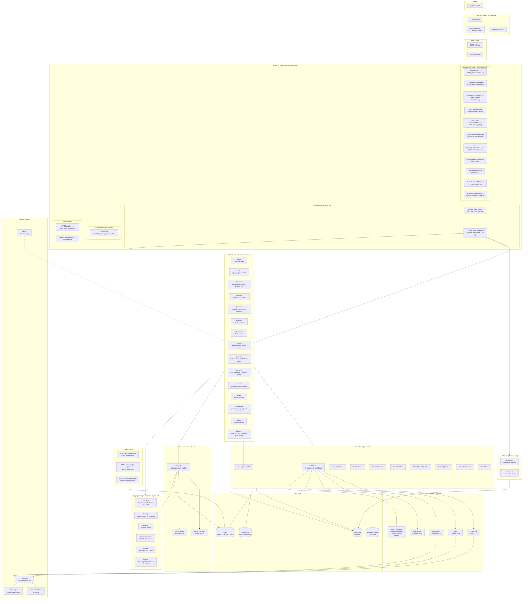

# System Architecture

## Description

This diagram shows the full ScholarForm AI system architecture across all deployment targets:

- **Vercel** hosts the Next.js 16 frontend (React 19) with 25 protected routes via middleware
- **Render** runs the FastAPI backend (Uvicorn on port 8000) with 11 middleware layers applied in order: CORS → Request ID → HTTPS/HSTS → Rate Limit (global + per-tier) → Security Headers → Max Body Size → CSRF → Feature Flags → Monitoring, plus 2 HTTP middleware functions (lazy router loader + audit logging)
- **15 v1 sub-routers** (95+ routes) and **2 v2 sub-routers** handle all API traffic, mounted lazily on first request for sub-2s cold boot
- **Celery worker** consumes two queues: `interactive` (user-facing, concurrency=2) and `batch` (bulk, concurrency=2), with Redis as the broker
- **27 services** handle LLM orchestration (10 providers with 4-tier fallback), authentication, generation sessions, quality scoring, preview rendering, CrossRef validation, citation assembly, audit logging, and encryption
- **Data layer** comprises PostgreSQL (Supabase for primary DB + auth + storage), Redis (cache + pub/sub + Celery broker), and ChromaDB (RAG vector store)
- **6 HuggingFace Spaces service pairs** (primary + shadow for HA) run GROBID, Docling, OCR, DOCX Converter, Nougat, and SciBERT
- **Prometheus + Grafana** scrape metrics from the backend at 15s intervals with 8 alerting rules, plus Sentry for error tracking
