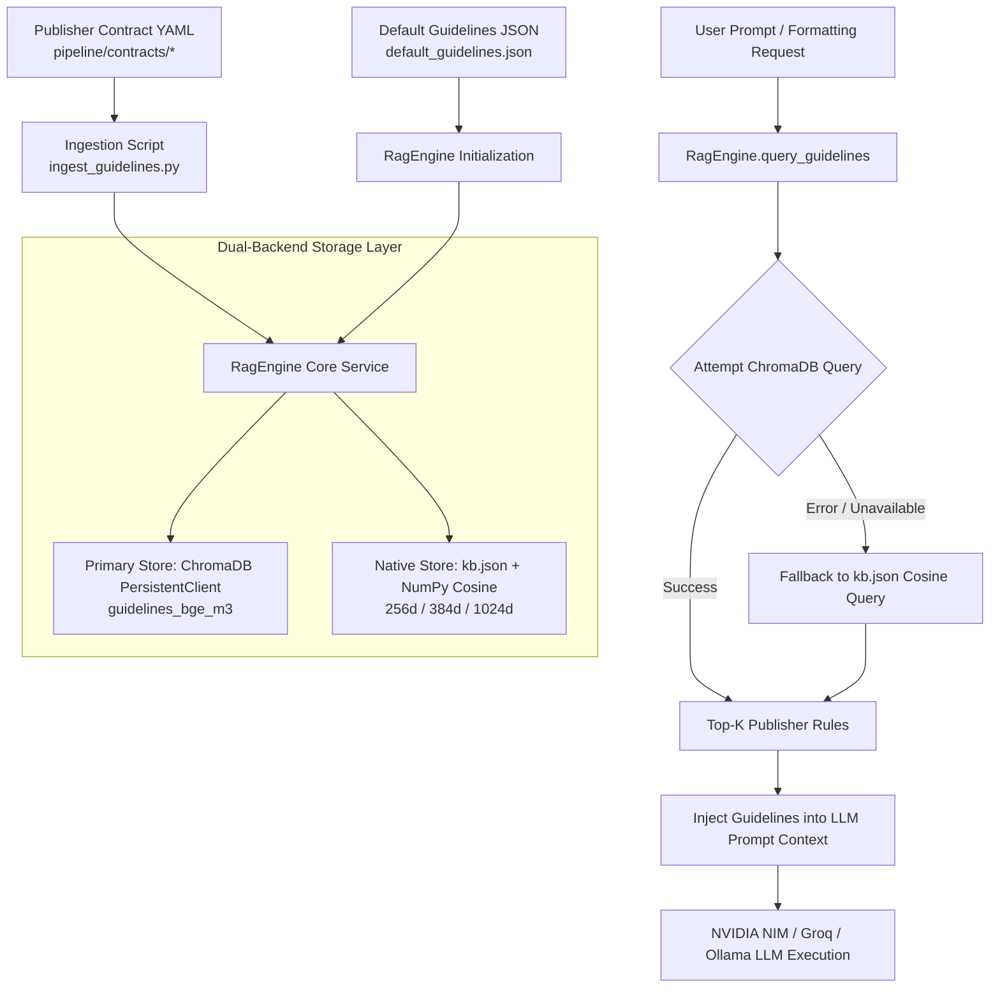
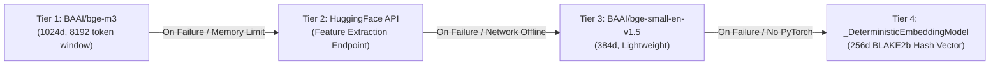

# ScholarForm AI — AI RAG & ChromaDB Vector Store Architecture Guide

## Overview

ScholarForm AI employs Retrieval-Augmented Generation (RAG) powered by **ChromaDB** to retrieve publisher-specific academic formatting guidelines and session context at runtime.

The RAG subsystem enables:

- **Rule Retrieval**: Injects exact publisher rules (IEEE, APA, Springer, Nature, ACM, Elsevier, etc.) into LLM prompts for block classification, reasoning, and styling.
- **Session RAG Context**: Maintains conversational history and document synthesis context during interactive paper drafting sessions.
- **Dual-Backend Resilience**: Operates a primary ChromaDB persistent vector store alongside a zero-dependency native JSON/NumPy (`kb.json`) vector store fallback.

---

## High-Level RAG Architecture Diagram



---

## Dual-Backend Architecture Design

The `RagEngine` maintains **two parallel stores** on every write operation:

| Store | Technology | Purpose & Mechanics |
| --- | --- | --- |
| **Primary Store** | `chromadb.PersistentClient` | High-performance vector retrieval using HNSW indexing and metadata filtering (`publisher`, `section`). Persists to disk at `backend/db/semantic_store/`. |
| **Native Failover** | `kb.json` + NumPy | Pure Python/NumPy cosine similarity calculation. Guarantees RAG capability even if ChromaDB or native C/SQLite dependencies fail. |

---

## 4-Tier Embedding Model Fallback Chain

When embedding queries or ingesting document guidelines, `RagEngine` cascades through a 4-tier embedding model chain:



### Embedding Tiers Specifications

| Tier | Model Identifier | Vector Dimension | Memory Footprint | Description |
| --- | --- | --- | --- | --- |
| **Tier 1** | `BAAI/bge-m3` | 1024d | ~2.0 GB RAM | Primary model; superior multilingual and long-context performance |
| **Tier 2** | HuggingFace Inference API | 384d / 1024d | Remote API | Offloads model memory when `LOW_MEMORY_MODE=true` |
| **Tier 3** | `BAAI/bge-small-en-v1.5` | 384d | ~500 MB RAM | Lightweight English transformer fallback |
| **Tier 4** | `deterministic-hash-v1` | 256d | ~0 MB (Stdlib) | BLAKE2b token hashing with L2 normalization; zero external dependencies |

---

## Collection Schemas & Metadata Taxonomy

### 1. Vector Store Collections

| Collection Name | Dimension | Primary Embedding Model | Scope |
| --- | --- | --- | --- |
| `guidelines_bge_m3` | 1024d | `BAAI/bge-m3` | Publisher formatting guidelines (IEEE, APA, Nature, etc.) |
| `publisher_guidelines` | 384d | `BAAI/bge-small-en-v1.5` | Legacy / lightweight collection fallback |
| `session_<session_id>` | 384d | `multi-qa-MiniLM-L6-v2` | Per-session interactive paper drafting context |

### 2. Guideline Document Metadata Structure

Every document ingested into ChromaDB or `kb.json` contains structured metadata:

```json
{
  "publisher": "IEEE",
  "section": "abstract",
  "source": "contract-ingest"
}
```

- `publisher`: Uppercase publisher identifier (`IEEE`, `APA`, `SPRINGER`, `NATURE`, `ACM`, `ELSEVIER`, etc.).
- `section`: Rule category (`abstract`, `section_order`, `references`, `figures`, `tables`, `equations`).
- `source`: Origin marker (`auto-seed`, `contract-ingest`, `user`).

---

## Ingestion & Retrieval Pipeline

### 1. Contract Ingestion (`scripts/ingest_guidelines.py`)

Ingests publisher formatting rules from YAML contract files under `backend/app/pipeline/contracts/`:

```python
from app.pipeline.intelligence.rag_engine import get_rag_engine

rag = get_rag_engine()
# Ingest rule entry
rag.add_guideline(
    publisher="IEEE",
    section="abstract",
    text="The abstract must be a single paragraph of 150-250 words in bold font.",
    metadata={"source": "contract-ingest"}
)
```

### 2. Pipeline Query Execution (`query_rules`)

During manuscript formatting, `PipelineOrchestrator` queries the RAG engine for section rules:

```python
# Phase-2 Adapter Call
rules = rag.query_rules(template_name="IEEE", section_name="abstract", top_k=2)

# Returns:
# [
#   {
#     "text": "The abstract must be a single paragraph of 150-250 words...",
#     "metadata": {"publisher": "IEEE", "section": "abstract"}
#   }
# ]
```

---

## Resilience & Degraded Modes Summary

| Scenario | System Reaction / Fallback Mode |
| --- | --- |
| **ChromaDB library crash / SQLite lock** | Switches to `kb.json` native store using NumPy cosine similarity |
| **Out of GPU/RAM memory** | Activates Tier 2 HuggingFace API or Tier 3 `bge-small` |
| **No Internet & No PyTorch** | Activates Tier 4 Deterministic BLAKE2b Hash vector model |
| **Missing Publisher Guidelines** | Returns fallback general academic rules from `default_guidelines.json` |

---

## Configuration Reference

```env
# RAG Transformer Settings
RAG_USE_TRANSFORMERS=true
PRELOAD_AI_MODELS=true
LOW_MEMORY_MODE=false

# HuggingFace API Settings (Optional Remote Mode)
RAG_EMBEDDING_PROVIDER=huggingface_api
RAG_EMBEDDING_MODEL=sentence-transformers/all-MiniLM-L6-v2
HF_TOKEN=hf_your_token_here

# Persistence Directories
CHROMA_PERSIST_DIR=./db/semantic_store/
```
