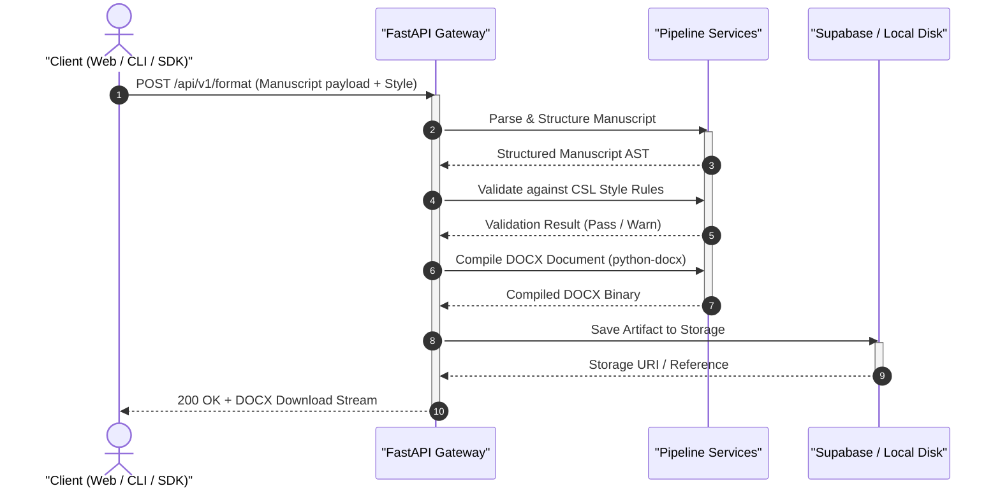
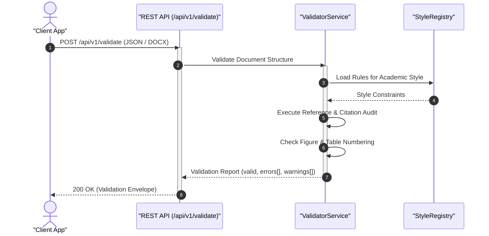
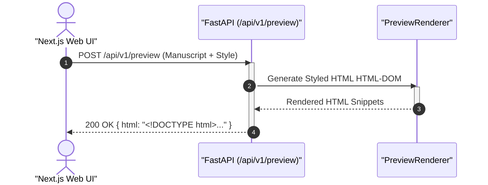

<!-- SPDX-License-Identifier: MIT -->
<!-- Copyright (c) 2026 ScholarForm AI -->

# Data Flow Architecture

## Table of Contents

- [Format Request Flow](#format-request-flow)
- [Validation Flow](#validation-flow)
- [Preview Flow](#preview-flow)
- [Real-Time SSE Event Stream](#real-time-sse-event-stream)

---

## Format Request Flow

The following sequence diagram illustrates the end-to-end lifecycle of a manuscript formatting request from any client (Web UI, CLI, or Python SDK) through the API Gateway to persistent storage.

> [!IMPORTANT]
> Large manuscripts (>25 MB) are automatically offloaded to Celery background workers. Clients receive a `task_id` and can monitor progress via SSE streaming or polling `/api/v1/documents/status/{task_id}`.

---

## Validation Flow

Before DOCX compilation, manuscripts pass through a rigorous multi-stage validation check to verify citation structure, figure numbering, and publisher rules.

---

## Preview Flow

To provide instant visual feedback without downloading `.docx` binaries, the Preview Renderer generates high-fidelity HTML representations.

---

## Real-Time SSE Event Stream

For long-running pipeline processing, the backend emits Server-Sent Events (SSE) to update the client in real time.

