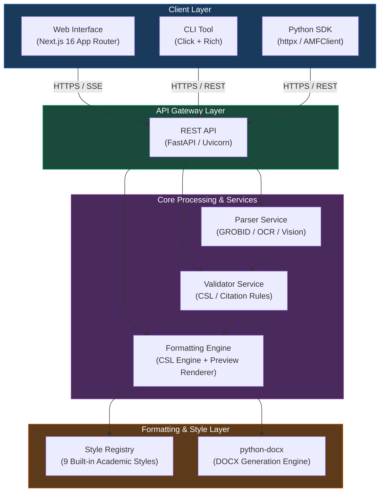

<!-- SPDX-License-Identifier: MIT -->
<!-- Copyright (c) 2026 ScholarForm AI -->

# Architecture Overview

## System Architecture

ScholarForm AI follows a modular, multi-tier system architecture designed for scalable academic manuscript formatting, AI-driven analysis, and high-fidelity DOCX generation.

> [!NOTE]
> All services communicate via validated Pydantic v2 schemas conforming to the standard `api_envelope` response structure.

---

## Architecture Components

### Backend (FastAPI)

The backend REST API is built with **FastAPI** on Python 3.12+, providing asynchronous request handling, OpenAPI documentation generation, and strict type safety via Pydantic v2.

- **Service Layer**: 48 modular service files under `backend/app/services/` handling business logic.
- **Routing**: 16 dedicated v1 route modules under `backend/app/routers/v1/`.

### Frontend (Next.js)

The frontend interface uses **Next.js 16 (App Router)** with React 19, TypeScript, and Tailwind CSS.

- **Real-Time Preview**: Implements SSE (Server-Sent Events) and WebSockets for live visual feedback during manuscript formatting.
- **State Management**: React Query combined with React Context for responsive client-side state.

### CLI (Click + Rich)

The terminal-based command-line tool `amf` enables automated batch processing, CI/CD integration, and scriptable manuscript formatting.

- Supports dual-mode execution (local direct processing or remote REST API communication).
- Integrated issue reporting (`amf issues`) and self-updating (`amf update`).

### Python SDK (`amf_sdk`)

The official Python client library provides both synchronous (`AMFClient`) and asynchronous (`AsyncAMFClient`) interfaces using `httpx` for seamless integration into custom Python workflows and Jupyter notebooks.

---

## Design Principles

1. **Stateless API Handlers**: All HTTP requests are authenticated via JWTs and processed without in-memory session coupling, allowing horizontal scaling across container instances.
2. **Tiered LLM Fallbacks**: AI classification and synthesis use a resilient fallback chain (`NVIDIA NIM -> Groq -> Ollama -> Rule-based`) to guarantee pipeline progression even during provider outages.
3. **Strict Validation**: Manuscripts are validated against Citation Style Language (CSL) rules and academic publisher guidelines before DOCX compilation.
