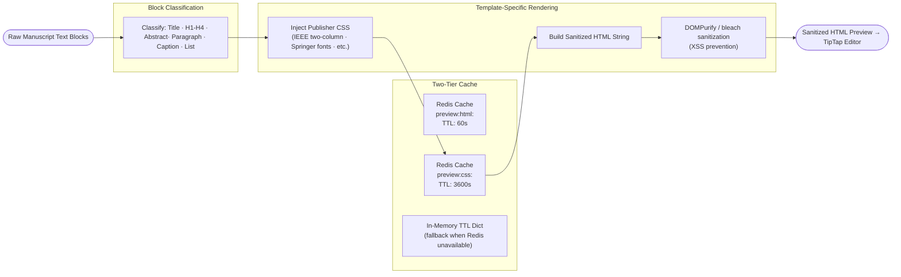

# ScholarForm AI — System Design & Subsystem Architecture

## Architectural Principles

ScholarForm AI is designed around four core software design principles to ensure scalability, maintainability, and enterprise reliability:

1. **Separation of Concerns**: Strict decoupling between API controllers (`routers/v1/`), service layer (`services/`), database repositories (`db/repositories/`), and document pipeline stages (`pipeline/`).
2. **Graceful Degradation & Resilience**: Every major external dependency (LLMs, GROBID, Redis, ChromaDB) includes fallback handlers, circuit breakers, or deterministic local substitutes to guarantee continuous service availability.
3. **API-First & Unified Enveloping**: All endpoints follow REST conventions and return responses wrapped in the standard `api_envelope` (`APIResponse`).
4. **Defensive Validation & Processing**: Uploaded documents undergo ClamAV virus scanning, MIME/magic-byte validation, and strict Pydantic v2 schema enforcement.

---

## API Design & Standardized Response Envelopes

All routes under `/api/v1/` enforce a unified response envelope format.

### Success Response Envelope
```json
{
  "data": {
    "job_id": "doc-9b8a7c6d-4e5f-1234",
    "status": "COMPLETED",
    "output_path": "/output/doc-9b8a7c6d-4e5f-1234/manuscript_formatted.docx",
    "quality_score": 94.5
  },
  "error": null,
  "request_id": "req-8f7e6d5c",
  "timestamp": "2026-07-29T19:00:00Z"
}
```

### Error Response Envelope
```json
{
  "data": null,
  "error": {
    "code": "VALIDATION_ERROR",
    "message": "Unsupported file extension or spoofed magic bytes",
    "details": {
      "file": "manuscript.exe",
      "detected_mime": "application/x-msdownload"
    }
  },
  "request_id": "req-8f7e6d5c",
  "timestamp": "2026-07-29T19:00:00Z"
}
```

---

## Generator & 4-Tier RAG LLM Fallback

The Generator and RAG subsystem powers AI-assisted academic document drafting, section synthesis, and interactive outline negotiation. To ensure zero downtime even during upstream AI outage events, ScholarForm AI uses a 4-tier model fallback chain wrapped in circuit breakers.

### Generator & 4-Tier LLM Fallback Flowchart

```mermaid
flowchart TD
    Start([User Request / Prompt Input]) --> CheckCache{Check Redis LLM Cache<br/>(llm:key_hash, TTL 24h)}
    CheckCache -- Cache Hit --> ReturnCache([Return Cached Completion])
    CheckCache -- Cache Miss --> QueryRAG["Query Session Vector Store<br/>ChromaDB / SessionVectorStore"]
    
    QueryRAG --> EmbedQuery["Embed Query Text<br/>sentence-transformers / BGE-M3"]
    EmbedQuery --> VectorSearch["Retrieve Top-K Context Chunks<br/>Publisher Guidelines & Session History"]
    VectorSearch --> BuildPrompt[Construct Prompt with In-Context RAG Guidelines]
    
    BuildPrompt --> Tier1{Tier 1: NVIDIA NIM API<br/>Llama 3.3 70B Instruct}
    Tier1 -- Success --> CacheResult[Cache Completion in Redis]
    Tier1 -- Rate Limit / Error / Timeout --> Tier2{Tier 2: Groq API<br/>llama-3.3-70b-versatile}
    
    Tier2 -- Success --> CacheResult
    Tier2 -- Rate Limit / Error / Timeout --> Tier3{Tier 3: OpenRouter API<br/>Unified Fallback Model}
    
    Tier3 -- Success --> CacheResult
    Tier3 -- Rate Limit / Error / Timeout --> Tier4{Tier 4: Ollama / DeepSeek<br/>Local / Self-Hosted R1 Engine}
    
    Tier4 -- Success --> CacheResult
    Tier4 -- All Tiers Failed --> RuleEngine[Execute Rule-Based Heuristic Engine]
    RuleEngine --> LogDegradation["Log System Degradation & Alert"]
    
    CacheResult --> End([Deliver Generated Output])
    LogDegradation --> End
```

### Detailed Deep Dives: Generator & Fallback Components

#### 1. ChromaDB Vector Retrieval
Vector retrieval operates via `SessionVectorStore` and `SemanticStore` instances:
- **Primary Collection (`guidelines_bge_m3`)**: Embedded with `BAAI/bge-m3` (1024 dimensions) to store publisher guidelines for IEEE, Springer, Nature, APA, and Elsevier.
- **Session Collection (`session_<session_id>`)**: Embedded with `multi-qa-MiniLM-L6-v2` (384 dimensions) for transient per-session conversational context.
- **Deterministic Embedding Fallback (`_DeterministicEmbeddingModel`)**: When transformer libraries are unavailable, a deterministic fallback generates 256-dimensional vector representations by performing BLAKE2b hashing on normalized token text followed by L2-norm normalization. Cosine similarity queries continue to execute seamlessly.
- **Session TTL Management**: Sessions persist vector data to `db/session_store/` with a 24-hour TTL key stored in Redis (`vector_session:<session_id>:ttl`). A background Celery task (`purge_expired_vector_sessions`) automatically cleans up expired collections.

#### 2. 4-Tier Model Fallback Logic (`llm_fallback_service.py`)
Requests pass sequentially through four tiers:
1. **Tier 1 (NVIDIA NIM)**: `nvidia_nim/meta/llama-3.3-70b-instruct` — Primary model offering ultra-low latency and instruction-following capability.
2. **Tier 2 (Groq)**: `groq/llama-3.3-70b-versatile` — High-speed fallback executed when NVIDIA NIM returns 429, 5xx, or times out.
3. **Tier 3 (OpenRouter)**: `openrouter/auto` — Multi-provider aggregator triggered if rate-limiting occurs on primary tiers.
4. **Tier 4 (Ollama / DeepSeek)**: `ollama/deepseek-r1` — Local offline fallback running on self-hosted infrastructure.

- **Circuit Breaker Mechanics**: Tracks failure counts per provider via `_call_with_provider_circuit`. If a provider experiences consecutive failures within a rolling window, the circuit opens for 30 seconds, automatically routing subsequent requests directly to the next tier.
- **Response Caching**: Successful generations are cached in Redis under a SHA-256 hash of the prompt, model, temperature, and tokens with a 24-hour TTL (`LLM_CACHE_TTL_SECONDS`).

---

## Citation Assembly & CSL Engine Architecture

ScholarForm AI automates bibliographic reference resolution, metadata fetching, and style formatting via `CitationAssemblyService` and `CSLEngine`.

### Citation Assembly & CSL Engine Flowchart

```mermaid
flowchart LR
    ContentInput["Raw Manuscript Content / Sections"] --> ExtractCitations["Extract Citations via Regex Engine<br/>Author-Year & Numeric Patterns"]
    ExtractCitations --> NormalizeKeys["Normalize & Deduplicate Citation Keys"]
    
    subgraph ExternalLookup ["External Metadata & CSL Lookup"]
        NormalizeKeys --> CrossRefAPI["CrossRef REST API<br/>validate_citation / DOI Lookup"]
        NormalizeKeys --> CSLFetcher["CSL Style Fetcher<br/>fetch_style XML"]
    end

    CrossRefAPI --> ReferenceModels["Construct Reference Models<br/>title, authors, journal, doi, year"]
    CSLFetcher --> ReferenceModels

    subgraph CSLEngine ["CSL Formatting Engine"]
        ReferenceModels --> LoadStyleXML["Load CSL Style XML<br/>IEEE, APA, Springer, Nature"]
        LoadStyleXML --> FormatBib["Format Reference List & Citations<br/>CSLEngine process"]
        FormatBib --> ReindexKeys["Re-Index Citation Keys<br/>e.g. 1, 2, 3..."]
    end

    ReindexKeys --> ReplaceInText["Replace In-Text Citations<br/>e.g. Smith et al. (2024) -> [1]"]
    ReplaceInText --> Output[Updated Sections + Formatted Bibliography]

```



### Detailed Deep Dives: Citation & CSL Components

#### 1. Citation Extraction Engine
`CitationAssemblyService` scans input manuscript content using three compiled regex patterns:
- `_AUTHOR_YEAR_PARENS`: Matches parenthetical author-year citations such as `(Smith et al., 2024)`.
- `_AUTHOR_YEAR_BRACKETS`: Matches bracketed author-year citations such as `[Jones & Taylor, 2023]`.
- `_NUMERIC_BRACKETS`: Matches numeric citation lists such as `[1, 2, 4]`.

Extracted keys are normalized (excess whitespace removed) and deduplicated while preserving first-appearance order.

#### 2. CrossRef Metadata Lookup (`crossref_client.py`)
For each extracted citation key or DOI:
- An asynchronous query is dispatched to the CrossRef REST API (`https://api.crossref.org/works`).
- Returned JSON responses are parsed into structured bibliographic metadata including title, author list, publication container, volume, issue, page numbers, publication year, and DOI.
- Failures or unresolvable citations gracefully fall back to raw text preservation without crashing the pipeline.

#### 3. CSL Citation Engine (`csl_engine.py`)
- **CSL Style Loading**: XML style definitions (e.g., `ieee.csl`, `apa.csl`, `springer-lecture-notes-in-computer-science.csl`) are loaded via `csl_fetcher.py`.
- **Reference Objects**: Bibliographic metadata is encapsulated into `Reference` model instances (`reference_id`, `citation_key`, `authors`, `title`, `doi`, `reference_type`).
- **In-Text Replacement**: Raw in-text citations are dynamically replaced with formatted citation tags (e.g., converting `(Smith, 2024)` to `[1]`), and a fully formatted bibliography is generated for inclusion at the end of the manuscript.

---

## Real-Time HTML/CSS Preview Renderer

The `PreviewRenderer` service (`preview_renderer.py`) generates real-time HTML/CSS previews of formatted manuscripts for the frontend TipTap editor workspace.



- **Block Classification**: Classifies raw text lines into Title, Headings (H1-H4), Abstract, Paragraphs, Captions, and Lists.
- **Template CSS Injection**: Injects publisher-specific preview stylesheets (e.g., IEEE two-column styles, Springer font specifications) stored in `app/templates/<template_name>/preview.css`.
- **Two-Tier Preview Caching**: HTML preview outputs are cached in Redis under `preview:html:<sha256>` (60s TTL) with fallback to an in-memory TTL dictionary. Template CSS styles are pre-compiled and cached under `preview:css:<template_name>` (3600s TTL).

---

## Security Model & Observability

### Security Infrastructure
- **Encryption at Rest**: User-provided LLM keys and custom provider credentials are encrypted using Fernet symmetric encryption (`encryption_service.py`).
- **Input Sanitization**: Previews rendered in the frontend pass through HTML sanitization to prevent Cross-Site Scripting (XSS).
- **Audit Logging**: Sensitive operations (document deletions, user role updates, API key creation) write structured audit events to `audit_log` via `audit_log_service.py`.

### Observability & Prometheus Metrics
- **Prometheus Metrics**: Exposed at `/metrics` via `prometheus_fastapi_instrumentator`.
- **Key Metrics Tracked**: Request count and latency by persona (`formatter`, `authoring`, `synthesis`), pipeline stage duration, upload ACK response time, and LLM model response latency.
- **Sentry Integration**: Active error logging via `sentry-sdk` for uncaught application exceptions.
