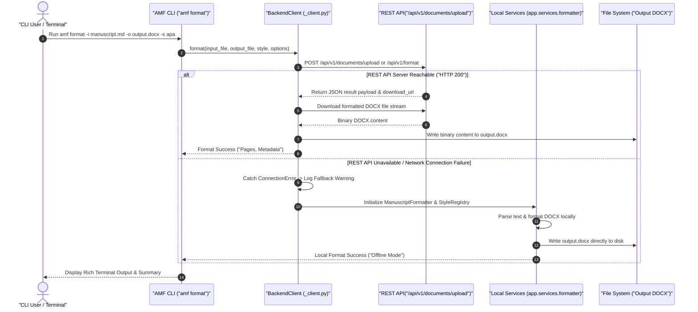
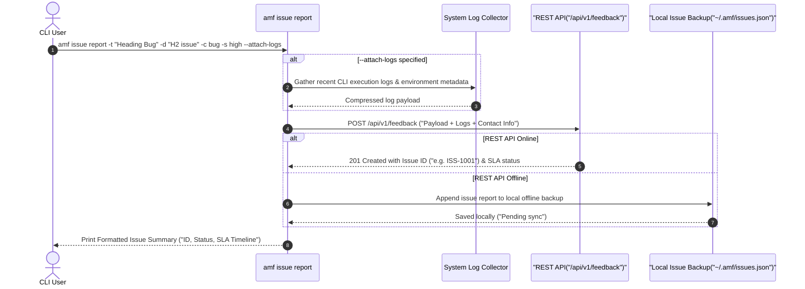

# ScholarForm AI — CLI Reference Guide

## Installation & Setup

```bash
# Standard CLI installation
pip install amf-cli

# Installation with local fallback dependencies (offline mode)
pip install amf-cli[local]
```

## Synopsis

```bash
amf [GLOBAL_OPTIONS] COMMAND [COMMAND_ARGS]...
```

### Global Options

| Option | Type | Description |
| --- | --- | --- |
| `--version` | Flag | Display CLI tool version (`amf 1.0.0`) and exit |
| `-v, --verbose` | Flag | Enable verbose debug logging output |
| `-c, --config PATH` | File Path | Specify path to custom JSON/TOML configuration file |
| `--help` | Flag | Display CLI command usage help |

---

## Command Execution Architecture & Sequence Diagrams

### 1. Dual-Mode Document Format Execution Sequence

The `amf` CLI automatically operates in **Dual-Mode**: it first attempts high-performance REST API execution via `BackendClient`. If the API server is unreachable, it seamlessly falls back to local Python service modules (`ManuscriptFormatter`, `ManuscriptParser`, `ManuscriptValidator`, `StyleRegistry`).



---

### 2. Issue Reporting Sequence

The `amf issue` command group allows users to report bugs, submit feedback, or request features directly from the terminal, with optional automatic system log attachment.



---

## Detailed Command Groups Reference (All 8 Click Command Groups)

### 1. `format` Command

Format a manuscript document into a styled publication-ready DOCX file.

```bash
amf format -i manuscript.md -o formatted.docx -s apa -O '{"include_toc": true}' -w
```

| Option | Flag | Description | Default |
| --- | --- | --- | --- |
| `-i` | `--input PATH` | Input manuscript file path (`.md`, `.docx`, `.pdf`, `.txt`) | **Required** |
| `-o` | `--output PATH` | Output formatted DOCX file path | `<input_stem>_formatted.docx` |
| `-s` | `--style TEXT` | Target formatting style ID (`apa`, `ieee`, `mla`, `chicago`, etc.) | `apa` |
| `-O` | `--options JSON` | JSON string of formatting overrides | `{}` |
| `-w` | `--watch` | Watch mode — automatically reformat on input file modification | `False` |

---

### 2. `validate` Command

Check manuscript structural compliance against journal or conference guidelines.

```bash
amf validate -i manuscript.md -s ieee -o validation_report.json
```

| Option | Flag | Description | Default |
| --- | --- | --- | --- |
| `-i` | `--input PATH` | Input manuscript file path | **Required** |
| `-s` | `--style TEXT` | Style rules to validate against | `apa` |
| `-o` | `--output PATH` | File path to write JSON validation report | Terminal output |

---

### 3. `preview` Command

Generate an interactive HTML rendering of the formatted manuscript.

```bash
amf preview -i manuscript.md -s apa -o preview.html --open
```

| Option | Flag | Description | Default |
| --- | --- | --- | --- |
| `-i` | `--input PATH` | Input manuscript file path | **Required** |
| `-s` | `--style TEXT` | Target formatting style ID | `apa` |
| `-o` | `--output PATH` | Output HTML file path | Terminal print |
| `--open` | `--open` | Automatically open HTML preview in default web browser | `False` |

---

### 4. `styles` Command Group

Inspect, query, and export built-in academic formatting styles.

```bash
# List all available styles
amf styles list

# Show detailed parameters for a specific style
amf styles show ieee

# Export style definition to a JSON file
amf styles export ieee ./styles/ieee-custom.json
```

| Subcommand | Arguments / Options | Description |
| --- | --- | --- |
| `list` | None | List all 17 registered builtin citation & formatting styles |
| `show` | `<name>` | Display font, margin, line spacing, and citation rules for style |
| `export` | `<name> <file>` | Save style parameters as a JSON file |

---

### 5. `init` Command

Initialize a new manuscript project workspace with template files and configuration.

```bash
amf init -n my-research-paper -s ieee -o ./papers
```

| Option | Flag | Description | Default |
| --- | --- | --- | --- |
| `-n` | `--name TEXT` | Project name | `my-manuscript` |
| `-s` | `--style TEXT` | Default project formatting style | `apa` |
| `-o` | `--output PATH` | Output target directory | `.` |

---

### 6. `config` Command

Display current active CLI configuration settings and file locations.

```bash
amf config
```

Outputs the contents of `~/.amf/config.json` merged with environment variable defaults.

---

### 7. `update` Command Group

Manage application update checks, binary downloads, installation, version rollbacks, and release channels.

```bash
# Check for available software updates
amf update check --channel stable

# Download a specific software version
amf update download --version 1.2.0

# Install downloaded update package
amf update install

# Rollback to a previous installed version
amf update rollback --version 1.1.0

# Display update history log
amf update history --limit 10

# View available release channels
amf update channels

# Update auto-update configuration settings
amf update settings --channel stable --auto-check

# View release notes for a version
amf update release-notes 1.2.0
```

| Subcommand | Arguments / Options | Description |
| --- | --- | --- |
| `check` | `--channel TEXT` | Check for available software updates on specified channel |
| `download` | `--version TEXT` | Download update binary package for version |
| `install` | None | Apply downloaded update binary |
| `rollback` | `--version TEXT` | Rollback to target version |
| `history` | `--limit INT` | View historical software updates log (default: 20 entries) |
| `channels` | None | List release channels (`stable`, `beta`, `nightly`) |
| `settings` | `--channel`, `--auto-check/--no-auto-check`, `--auto-download`, `--auto-install` | Update auto-updater preferences |
| `release-notes` | `<version>` | View release notes for a specific version |

---

### 8. `issue` Command Group (`issue` / `issues`)

Report, track, filter, comment on, and manage feedback and bug reports directly from the CLI.

```bash
# Submit a new issue report
amf issue report -t "Table formatting bug" -d "Borders missing in IEEE" -c bug -s high --attach-logs

# List open issues with filters
amf issue list --status new --category bug --limit 10

# Show issue details and discussion thread
amf issue show ISS-1001

# Add a comment to an issue
amf issue comment ISS-1001 -b "Fix verified in v1.1.2"

# Update issue status or severity
amf issue update ISS-1001 --status resolved

# Search issues across titles and descriptions
amf issue search "table border"

# Display issue statistics and SLA metrics
amf issue stats

# Display defined issue label taxonomy
amf issue labels

# Backup local issue dataset
amf issue backup
```

| Subcommand | Arguments & Options | Description |
| --- | --- | --- |
| `report` | `-t/--title`, `-d/--description`, `-c/--category`, `-s/--severity`, `-n/--name`, `-e/--email`, `--anonymous`, `--attach-logs` | Submit a new issue report to API or local store |
| `list` | `--status`, `--category`, `--severity`, `--label`, `--search`, `-l/--limit` | Query and filter open issues |
| `show` | `<issue_id>` | View complete issue details and comment thread |
| `comment` | `<issue_id>`, `-b/--body` | Append a comment to an existing issue |
| `update` | `<issue_id>`, `--status`, `--severity`, `--assign`, `--milestone` | Modify issue state, assignee, or milestone |
| `search` | `<query>`, `-l/--limit` | Perform text search across issue dataset |
| `stats` | None | View summary metrics, resolution rates, and SLA status |
| `labels` | None | Display configured issue label tags |
| `backup` | None | Create a JSON backup of issue data |

---

## Configuration File Format

File path: `~/.amf/config.json` (Linux/macOS) or `%APPDATA%\amf\config.json` (Windows).

```json
{
  "style": "apa",
  "api_endpoint": "http://localhost:8000",
  "output_dir": ".",
  "page_size": "A4",
  "font_family": "Times New Roman",
  "font_size": 12,
  "line_spacing": 2.0,
  "include_toc": false,
  "include_page_numbers": true,
  "include_running_header": true,
  "verbose": false
}
```

---

## Exit Codes Reference

| Exit Code | Classification | Meaning |
| --- | --- | --- |
| `0` | Success | Command executed successfully |
| `1` | General Error | Runtime error, missing file, or REST API failure without local fallback |
| `2` | Validation Failure | Manuscript failed validation rules or CLI configuration syntax error |
