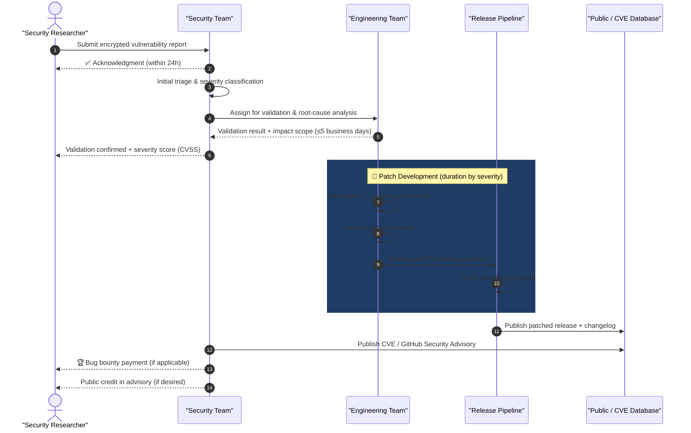

<!-- SPDX-License-Identifier: MIT -->
<!-- Copyright (c) 2026 ScholarForm AI -->

# Security Policy

## Table of Contents

- [Supported Versions](#supported-versions)
- [Reporting a Vulnerability](#reporting-a-vulnerability)
- [Coordinated Disclosure Process](#coordinated-disclosure-process)
- [Bug Bounty Program](#bug-bounty-program)
- [Application Security Architecture](#application-security-architecture)
- [Security Best Practices](#security-best-practices)

---

## Supported Versions

The following versions of ScholarForm AI currently receive active security support:

| Version | Supported          | End of Support       |
|---------|--------------------|----------------------|
| 1.x     | ✅ Active support  | TBD                  |
| 0.x     | ❌ End of life     | 2025-01-01           |

> [!WARNING]
> Version 0.x is no longer receiving security patches. Upgrade to 1.x immediately.

---

## Reporting a Vulnerability

> [!CAUTION]
> **Do NOT open a public GitHub issue** for security vulnerabilities. Public disclosure before a patch is available puts all users at risk.

We take the security of ScholarForm AI seriously. Use the private reporting channels below.

### Private Reporting Channels

1. **Email**: Send a detailed report to **security@scholarform.ai**
2. **Web Form**: Submit via our private vulnerability reporting form at **https://scholarform.ai/security/report**

### What to Include in Your Report

- **Type of issue** (e.g., XSS, SQL injection, remote code execution, privilege escalation)
- **Full paths** of source files related to the issue
- **Step-by-step reproduction** instructions
- **Proof-of-concept** or exploit code (if available and safe to share)
- **Impact assessment** — what an attacker could achieve
- **Affected versions** and environments

### Response SLA

| Step                         | Expected Timeframe     |
|------------------------------|------------------------|
| Acknowledgment               | Within 24 hours        |
| Initial triage               | Within 48 hours        |
| Validation & risk assessment | Within 5 business days |
| Fix development              | Based on severity      |
| Coordinated disclosure       | Within 90 days of fix  |

---

## Coordinated Disclosure Process

The diagram below maps the full vulnerability lifecycle from initial report through coordinated public disclosure.

---

## Bug Bounty Program

AMF participates in a private bug bounty program. Rewards are offered for qualifying vulnerabilities based on CVSS severity score:

| Severity | CVSS Score | Reward Range      |
|----------|------------|-------------------|
| Critical | 9.0–10.0   | $5,000 – $15,000 |
| High     | 7.0–8.9    | $1,000 – $5,000  |
| Medium   | 4.0–6.9    | $250 – $1,000    |
| Low      | 0.1–3.9    | $50 – $250       |

---

## Application Security Architecture

ScholarForm AI applies a **five-layer defense-in-depth** security model. Every incoming request must traverse all layers sequentially.

```mermaid
flowchart TD
    Internet(["🌐 Internet / External Client"])

    subgraph Layer1 ["Layer 1 — Network Perimeter"]
        TLS["TLS 1.3 Termination"]
        HSTS["HTTP Strict Transport Security (HSTS)"]
        CSP["Content Security Policy (CSP)"]
        CORS["Strict CORS Origin Validation"]
    end

    subgraph Layer2 ["Layer 2 — Upload & Gateway Security"]
        ClamAV["ClamAV Antivirus Scanner"]
        MagicByte["Magic-Byte Inspection (file type validation)"]
        RateLimit["Rate Limiter (per-minute & daily quotas)"]
        CSRF["CSRF Token Validation"]
    end

    subgraph Layer3 ["Layer 3 — Authentication"]
        JWKS["Supabase JWKS JWT Verification"]
        APIKey["Fernet AES-256 Encrypted API Keys"]
        TokenBL["Redis JWT Token Blocklist"]
    end

    subgraph Layer4 ["Layer 4 — Authorization (RBAC)"]
        FreeT["Free Tier: 5 docs/month, basic templates"]
        ProT["Pro Tier: Unlimited, all templates + AI"]
        AdminT["Admin Tier: Platform management"]
    end

    subgraph Layer5 ["Layer 5 — Data Isolation (RLS)"]
        RLS["PostgreSQL Row Level Security\n(auth.uid() = user_id)"]
        Audit["Audit Log (all sensitive ops)"]
        Encrypt["LLM Key Encryption at Rest"]
    end

    Service(["✅ Authorized Business Logic"])

    Internet --> Layer1
    Layer1 --> Layer2
    Layer2 --> Layer3
    Layer3 --> Layer4
    Layer4 --> Layer5
    Layer5 --> Service
```

---

## Security Best Practices

- **API Key Storage**: Encrypt all third-party LLM API keys at rest using Fernet symmetric encryption. Never commit plain-text keys to version control.
- **Dependency Audit**: Routinely run vulnerability scans via Dependabot and `pip audit` / `npm audit`.
- **Upload Validation**: Validate magic bytes and enforce ClamAV virus scanning on all user-submitted files.
- **Least Privilege**: Enforce Row Level Security (RLS) policies in Supabase PostgreSQL to isolate user data.

