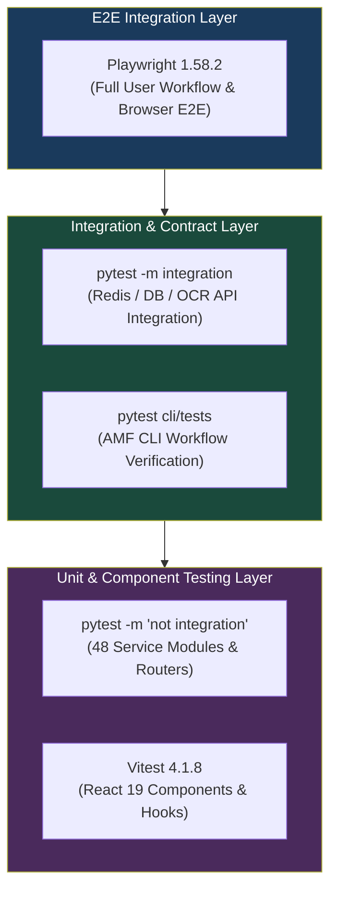

# ScholarForm AI — Testing & Quality Assurance Guide

ScholarForm AI employs a comprehensive test harness spanning backend Python service unit tests (`pytest`), frontend React component unit tests (`Vitest 4.1.8`), frontend end-to-end browser integration tests (`Playwright 1.58.2`), and CLI integration tests.

---

## Test Suites Overview Matrix

| Test Suite | Tooling | Target Location | Command | Expected Duration |
|---|---|---|---|---|
| **Backend Unit & Deep Tests** | `pytest` | `backend/tests/` | `pytest tests -m "not integration and not llm"` | ~45 seconds |
| **Backend Integration Tests** | `pytest` | `backend/tests/` | `pytest tests -m integration` | ~2 minutes |
| **Backend LLM Tests** | `pytest` | `backend/tests/` | `pytest tests -m llm` | ~3 minutes |
| **CLI Unit & E2E Tests** | `pytest` | `cli/tests/` | `pytest cli/tests/test_cli.py` | ~15 seconds |
| **Frontend Unit & Component** | `Vitest 4.1.8` | `frontend/src/` | `npm test` | ~15 seconds |
| **Frontend E2E Workflows** | `Playwright 1.58.2` | `frontend/e2e/` | `npm run test:e2e` | ~1.5 minutes |

---

## Enterprise Testing Pyramid



---

## 1. Backend Testing (`pytest`)

### Prerequisites

- Python 3.12 active virtual environment (`backend/.venv`)
- Test dependencies installed: `pip install -r requirements-dev.txt`

### Execution Commands

```bash
cd backend

# Fast Unit & Deep Mocking Tests (No external services required)
pytest tests -m "not integration and not llm and not contract" -x -q

# Run Unit Suite with Code Coverage Enforcement
pytest tests -m "not integration and not llm" --cov=app --cov-report=term-missing

# Run Single Specific Test Module
pytest tests/test_document_service_deep.py -v --tb=short

# Run Integration Suite (Requires Docker containers: DB, Redis, GROBID)
pytest tests -m integration

# Run Full Test Suite
pytest

# Static Type Checking & Linting Enforcement
ruff check app --config ruff.toml
mypy --config-file mypy.ini app
```

---

### Backend Pytest Markers

| Marker | Dependencies | Description |
|---|---|---|
| `unit` | None | Isolated unit tests executed against mocks |
| `integration` | Redis, Postgres, GROBID | Tests verifying real inter-service communication |
| `llm` | Live API Keys (NVIDIA / Groq) | End-to-end tests querying external LLM APIs |
| `service` | Full backend stack | Multi-service pipeline execution tests |
| `contract` | Running FastAPI instance | Contract verification against OpenAPI schemas |

---

### High-Coverage Deep Mocking Modules

Modules ending in `_deep.py` use intensive mocking to achieve >80% branch and line coverage:

| Module Under Test | Test File Location | Test Count | Target Line Coverage |
|---|---|---|---|
| `DocxParser` | `tests/test_docx_parser_deep.py` | 108 | ~90% |
| `Formatter` | `tests/test_formatter_deep.py` | 207 | ~88% |
| `PipelineOrchestrator` | `tests/test_pipeline_orchestrator_deep.py` | 49 | ~82% |
| `Classifier` | `tests/classifier/test_classifier_deep.py` | 92 | ~86% |
| `DocumentService` | `tests/test_document_service_deep.py` | 110 | 86% |
| `ReasoningEngine` | `tests/test_reasoning_engine_deep.py` | 87 | 80% |
| `AgentPipeline` | `tests/test_agent_deep.py` | 120 | ~84% |
| `PdfParser` | `tests/test_pdf_parser_deep.py` | 71 | 88% |
| `RagEngine` | `tests/test_rag_engine_deep.py` | 87 | 91% |

---

## 2. CLI Testing (`pytest`)

CLI tests verify argument parsing, command options, and fallback behavior in `cli/amf/_client.py`.

```bash
# Run CLI test suite
pytest cli/tests/test_cli.py -v

# Run with output capture disabled for terminal rendering inspection
pytest cli/tests/test_cli.py -s
```

### Critical CLI Scenarios Tested

- `amf format` dual-mode REST API call vs. local `ManuscriptFormatter` fallback logic.
- `amf validate` output report formatting.
- `amf preview` HTML generation and browser opening flags.
- `amf issue report` log attachment collection and API transmission.
- `amf update` channel checking and rollback handlers.

---

## 3. Frontend Unit & Component Testing (`Vitest 4.1.8`)

### Prerequisites

- Node.js >= 20 (LTS)
- `npm install` completed in `frontend/`

### Execution Commands

```bash
cd frontend

# Run Vitest unit tests in single-pass run mode
npm test
# or
npx vitest run

# Run Vitest in interactive watch mode
npm run test:watch

# Run Vitest with interactive UI dashboard
npx vitest --ui

# Run Vitest with v8 Coverage Report
npx vitest run --coverage
```

### Key Component Test Paths

- Document Upload Dropzone & File Validation (`src/components/upload/`)
- Interactive TipTap Visual Editor & Formatting Toolbar (`src/components/editor/`)
- Template Picker & CSL Customizer (`src/components/templates/`)
- Multi-Doc Synthesis Matrix View (`src/components/synthesis/`)

---

## 4. Frontend End-to-End Testing (`Playwright 1.58.2`)

Playwright tests run full browser journeys against the Next.js frontend and FastAPI backend.

```bash
cd frontend

# Run Playwright E2E tests headlessly
npm run test:e2e

# Run Playwright with interactive UI mode
npm run test:e2e:ui

# Run Playwright in headed mode (visible browser window)
npm run test:e2e:headed
```

### Critical E2E Journeys (`frontend/e2e/`)

| # | E2E Test Suite | File Path | Scope |
|---|---|---|---|
| 1 | Guest Upload Journey | `e2e/upload-journey.spec.js` | Upload manuscript -> Process -> Download DOCX |
| 2 | Authentication Flow | `e2e/auth-flow.spec.js` | Signup -> Login -> Dashboard redirect |
| 3 | Template Formatter | `e2e/formatter-upload.spec.js` | Select IEEE template -> Generate -> DOCX export |
| 4 | Live Preview SSE | `e2e/formatter-live-preview.spec.js` | WebSocket / SSE live document preview rendering |
| 5 | AI Generator Chat | `e2e/generator-outline-approve.spec.js` | Create session -> Generate outline -> Approve -> Draft |
| 6 | Multi-Doc Synthesis | `e2e/generator-synthesis.spec.js` | Upload 2 PDFs -> Synthesize review paper stream |

---

## 5. CI/CD Pipeline & Coverage Requirements

### Automated GitHub Actions Workflows

- `backend-ci.yml`: Runs `ruff` linting, `mypy` type check, and `pytest` fast suite on PRs and pushes to `main`.
- `frontend-ci.yml`: Runs `eslint`, `vitest run`, Next.js build, and `playwright test`.
- `security.yml`: Runs dependency vulnerability scans (`pip-audit`, `npm audit`, Trivy, CodeQL).

### Code Coverage Policy

- **Global Backend Coverage Minimum:** **70%** line coverage (enforced in CI).
- **Core Engine Modules Coverage Target:** **>80%** line coverage.
- **Frontend Component Coverage Target:** **>70%** line coverage.
