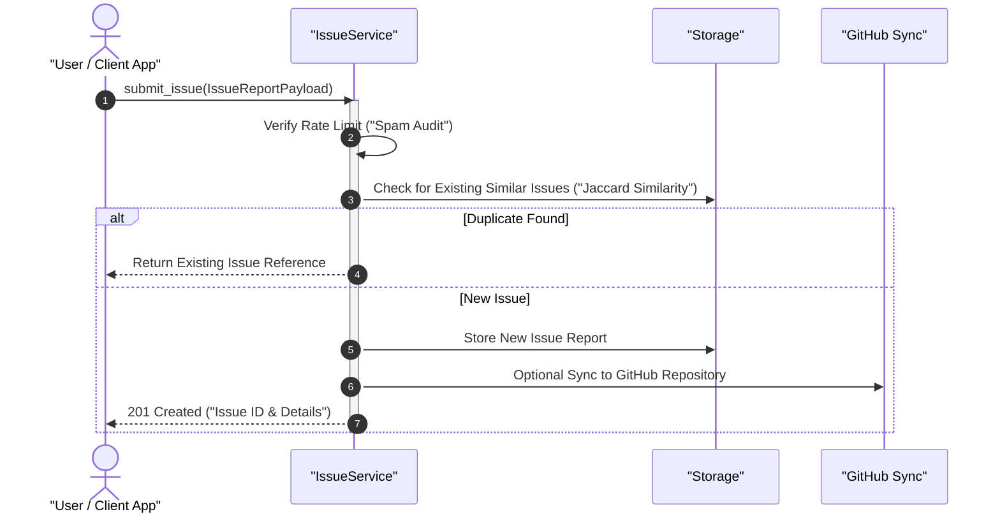

<!-- SPDX-License-Identifier: MIT -->
<!-- Copyright (c) 2026 ScholarForm AI -->

# Issue Reporting — Developer Guide

## Architecture Overview

The issue reporting ecosystem spans four modular layers: UI/CLI Entry Points, Backend REST API, Core `IssueService`, and Storage/Notification integrations.

```mermaid
flowchart TD
    subgraph Entry["Entry Points"]
        UI["Web UI Dashboard"]
        CLI["CLI Command ("amf issues")"]
        Dialog["Error Dialog & Crash Screen"]
        Widget["Feedback Floating Widget"]
    end

    subgraph API["Backend API Layer"]
        Routes["/api/v1/issues/*\n(19 Endpoints)"]
    end

    subgraph Service["Core Business Logic"]
        IssueSvc["IssueService\n(CRUD, Spam & Duplicate Detection)"]
        GitHub["GitHub Sync Service\n(Auto Issue Creation)"]
        AI["AI Categorization\n(Auto-Tagging & Severity)"]
        Notif["Notification Service\n(Discord / Slack / Webhooks)"]
    end

    subgraph Storage["Storage Layer"]
        Files["File-Based Storage\n~/.amf/issues/*.json"]
        DB[("Supabase PostgreSQL\n(Production Store)")]
    end

    UI --> Routes
    CLI --> Routes
    Dialog --> Routes
    Widget --> Routes

    Routes --> IssueSvc
    IssueSvc --> GitHub
    IssueSvc --> AI
    IssueSvc --> Notif

    IssueSvc --> Files
    IssueSvc --> DB

    style Entry fill:#1a3a5c,color:#fff
    style API fill:#1a4a3c,color:#fff
    style Service fill:#4a2a5c,color:#fff
    style Storage fill:#5c3a1a,color:#fff
```

> [!NOTE]
> Issue reports submitted from any entry point undergo automatic spam detection (rate limiting) and duplicate detection (Jaccard similarity on title + description) before persistence.

---

## Key Components

| Component | File | Purpose |
| ----------- | ------ | --------- |
| `IssueService` | `backend/app/services/issue_service.py` | Core business logic — CRUD, duplicate/spam detection, AI, GitHub sync, notifications |
| `IssueReport` | `backend/app/services/issue_service.py` | Data class for a single issue report with all fields |
| `issue_routes.py` | `backend/app/api/issue_routes.py` | 19 REST API endpoints |
| `issue_models.py` | `backend/app/api/issue_models.py` | Pydantic request/response models |
| `issues.py` (CLI) | `cli/amf/commands/issues.py` | 10 Click subcommands |
| `issue-api.ts` | `frontend/src/lib/issue-api.ts` | TypeScript API client (22 functions) |
| `issues/page.tsx` | `frontend/src/app/issues/page.tsx` | Issue dashboard page |
| `issues/admin/page.tsx` | `frontend/src/app/issues/admin/page.tsx` | Admin dashboard page |
| `FeedbackWidget.tsx` | `frontend/src/components/FeedbackWidget.tsx` | Floating feedback button |
| `CrashScreen.tsx` | `frontend/src/components/CrashScreen.tsx` | Full-screen error boundary |
| `ErrorDialog.tsx` | `frontend/src/components/ErrorDialog.tsx` | Reusable error dialog |

---

## Data Flow

### Issue Submission & Deduplication



---

## CLI Integration

The CLI provides full management of issues from the terminal:

```bash
# Report an issue interactively
amf issues report

# List all open issues
amf issues list --status open

# View details of a specific issue
amf issues view ISS-2026-001
```
