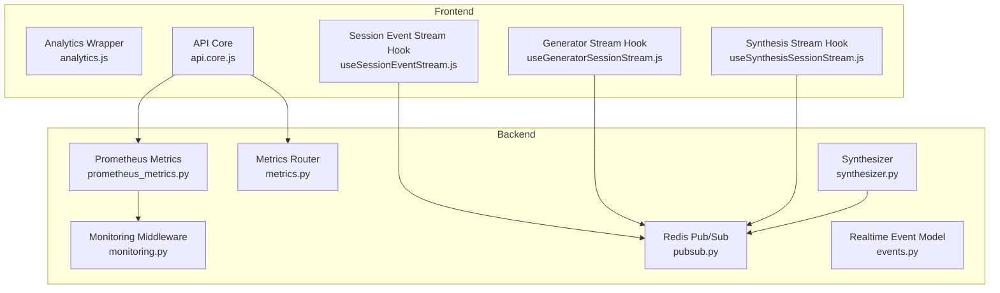
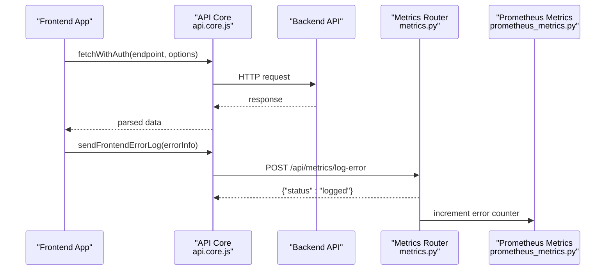
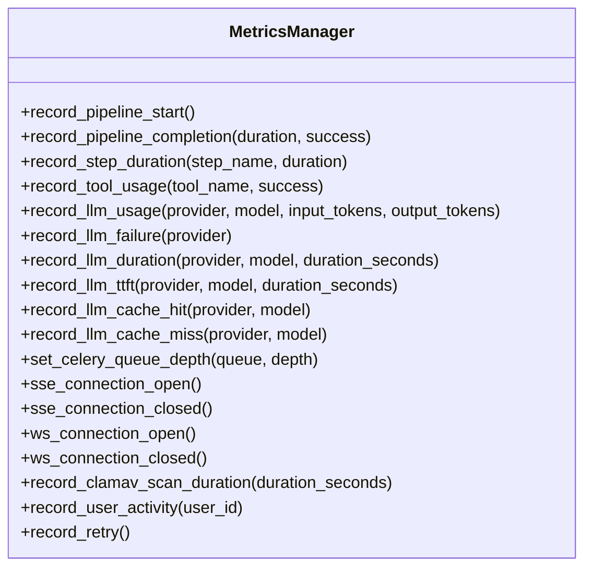
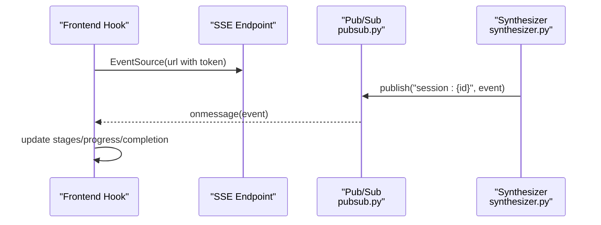
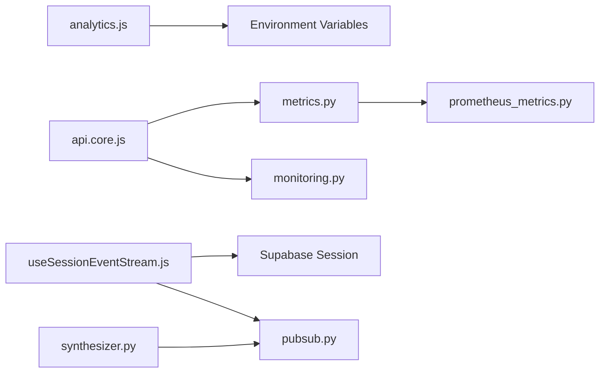

<!-- SPDX-License-Identifier: MIT -->
<!-- Copyright (c) 2026 ScholarForm AI -->

# Analytics & Performance Monitoring

<cite>
**Referenced Files in This Document**
- [analytics.js](../../../../../../frontend/src/lib/analytics.js)
- [analytics.test.js](../../../../../../frontend/src/lib/analytics.test.js)
- [api.core.js](../../../../../../frontend/src/services/api.core.js)
- [metrics.py](../../../../../../backend/app/pipeline/agents/metrics.py)
- [prometheus_metrics.py](../../../../../../backend/app/middleware/prometheus_metrics.py)
- [monitoring.py](../../../../../../backend/app/middleware/monitoring.py)
- [useSessionEventStream.js](../../../../../../frontend/src/hooks/useSessionEventStream.js)
- [useGeneratorSessionStream.js](../../../../../../frontend/src/hooks/useGeneratorSessionStream.js)
- [useSynthesisSessionStream.js](../../../../../../frontend/src/hooks/useSynthesisSessionStream.js)
- [pubsub.py](../../../../../../backend/app/realtime/pubsub.py)
- [events.py](../../../../../../backend/app/realtime/events.py)
- [synthesizer.py](../../../../../../backend/app/pipeline/synthesis/synthesizer.py)
- [002-redis-realtime-backbone.md](../../../../../adr/002-redis-realtime-backbone.md)
- [privacy page.jsx](file://frontend/app/(shared)/privacy/page.jsx)
</cite>

## Table of Contents

1. [Introduction](#introduction)
2. [Project Structure](#project-structure)
3. [Core Components](#core-components)
4. [Architecture Overview](#architecture-overview)
5. [Detailed Component Analysis](#detailed-component-analysis)
6. [Dependency Analysis](#dependency-analysis)
7. [Performance Considerations](#performance-considerations)
8. [Troubleshooting Guide](#troubleshooting-guide)
9. [Conclusion](#conclusion)
10. [Appendices](#appendices)

## Introduction

This document explains the analytics and performance monitoring systems in the platform. It covers:

- Analytics event collection, custom property tracking, and user identification patterns
- Performance monitoring with metrics collection and Prometheus metrics
- Real-time event streaming via Server-Sent Events (SSE) and Redis-backed pub/sub
- Guidelines for adding new analytics events, privacy considerations, and opt-out mechanisms
- Integration with session event streams and real-time user interaction tracking

## Project Structure

The analytics and monitoring systems span the frontend and backend:

- Frontend: Real-time session streams
- Backend: Prometheus metrics exposure, monitoring middleware, metrics endpoints, Redis-backed pub/sub, and event emission

**Diagram sources**

- [analytics.js:1-20](../../../../../../frontend/src/lib/analytics.js#L1-L20)
- [useSessionEventStream.js:1-101](../../../../../../frontend/src/hooks/useSessionEventStream.js#L1-L101)
- [useGeneratorSessionStream.js:1-11](../../../../../../frontend/src/hooks/useGeneratorSessionStream.js#L1-L11)
- [useSynthesisSessionStream.js:1-11](../../../../../../frontend/src/hooks/useSynthesisSessionStream.js#L1-L11)
- [api.core.js:1-368](../../../../../../frontend/src/services/api.core.js#L1-L368)
- [prometheus_metrics.py:1-235](../../../../../../backend/app/middleware/prometheus_metrics.py#L1-L235)
- [monitoring.py:1-51](../../../../../../backend/app/middleware/monitoring.py#L1-L51)
- [metrics.py:1-201](../../../../../../backend/app/pipeline/agents/metrics.py#L1-L201)
- [pubsub.py:1-120](../../../../../../backend/app/realtime/pubsub.py#L1-L120)
- [events.py:1-34](../../../../../../backend/app/realtime/events.py#L1-L34)
- [synthesizer.py:196-219](../../../../../../backend/app/pipeline/synthesis/synthesizer.py#L196-L219)

**Section sources**

- [analytics.js:1-20](../../../../../../frontend/src/lib/analytics.js#L1-L20)
- [api.core.js:1-368](../../../../../../frontend/src/services/api.core.js#L1-L368)
- [prometheus_metrics.py:1-235](../../../../../../backend/app/middleware/prometheus_metrics.py#L1-L235)
- [monitoring.py:1-51](../../../../../../backend/app/middleware/monitoring.py#L1-L51)
- [metrics.py:1-201](../../../../../../backend/app/pipeline/agents/metrics.py#L1-L201)
- [pubsub.py:1-120](../../../../../../backend/app/realtime/pubsub.py#L1-L120)
- [events.py:1-34](../../../../../../backend/app/realtime/events.py#L1-L34)
- [synthesizer.py:196-219](../../../../../../backend/app/pipeline/synthesis/synthesizer.py#L196-L219)

## Core Components

- Analytics wrapper:
  - Lazy initialization with environment-driven configuration
  - Queued event capture until client is ready
  - Non-blocking initialization to avoid impacting app boot
- Session event streaming:
  - React hooks for real-time synthesis and generator sessions via SSE
  - Automatic auth token inclusion and exponential backoff
- Backend metrics:
  - Prometheus metrics definitions and middleware
  - Metrics router exposing health, database, and dashboard metrics
  - Redis-backed pub/sub for scalable real-time event distribution

**Section sources**

- [analytics.js:7-19](../../../../../../frontend/src/lib/analytics.js#L7-L19)
- [useSessionEventStream.js:1-101](../../../../../../frontend/src/hooks/useSessionEventStream.js#L1-L101)
- [useGeneratorSessionStream.js:1-11](../../../../../../frontend/src/hooks/useGeneratorSessionStream.js#L1-L11)
- [useSynthesisSessionStream.js:1-11](../../../../../../frontend/src/hooks/useSynthesisSessionStream.js#L1-L11)
- [prometheus_metrics.py:144-235](../../../../../../backend/app/middleware/prometheus_metrics.py#L144-L235)
- [metrics.py:60-96](../../../../../../backend/app/pipeline/agents/metrics.py#L60-L96)
- [pubsub.py:18-120](../../../../../../backend/app/realtime/pubsub.py#L18-L120)

## Architecture Overview

The system integrates frontend analytics and error reporting with backend metrics and real-time streaming.

**Diagram sources**

- [api.core.js:289-362](../../../../../../frontend/src/services/api.core.js#L289-L362)
- [metrics.py:60-96](../../../../../../backend/app/pipeline/agents/metrics.py#L60-L96)
- [prometheus_metrics.py:144-235](../../../../../../backend/app/middleware/prometheus_metrics.py#L144-L235)

## Detailed Component Analysis

### Analytics Event Collection and Custom Properties

- Event naming and properties:
  - Use descriptive event names (e.g., feature usage, session lifecycle)
  - Attach custom properties such as identifiers, progress, and metadata
- Best practices:
  - Keep property keys consistent across events
  - Avoid sending sensitive data; sanitize payloads
  - Prefer numeric properties for histograms and counters

**Section sources**

- [analytics.js:7-19](../../../../../../frontend/src/lib/analytics.js#L7-L19)

### User Identification Patterns

- Identified profiles:
  - Profiles are set to "identified_only" to align with privacy defaults
- Authentication context:
  - Frontend APIs inject Authorization headers when available
  - Backend monitoring middleware attaches request IDs for correlation

**Section sources**

- [api.core.js:220-255](../../../../../../frontend/src/services/api.core.js#L220-L255)
- [monitoring.py:17-51](../../../../../../backend/app/middleware/monitoring.py#L17-L51)

### Performance Monitoring with Prometheus

- Metrics definitions:
  - Pipeline request totals and durations
  - Agent tool usage, LLM token consumption, retries
  - System-level metrics: active jobs, SSE/WS connections, ClamAV scan duration
- Metrics manager:
  - Centralized helpers to record durations, counts, and gauges
  - Active user tracking with sliding window
- Exposure:
  - Metrics endpoint returns latest metrics in Prometheus text format

**Diagram sources**

- [prometheus_metrics.py:144-235](../../../../../../backend/app/middleware/prometheus_metrics.py#L144-L235)

**Section sources**

- [prometheus_metrics.py:1-235](../../../../../../backend/app/middleware/prometheus_metrics.py#L1-L235)
- [monitoring.py:1-51](../../../../../../backend/app/middleware/monitoring.py#L1-L51)
- [metrics.py:1-201](../../../../../../backend/app/pipeline/agents/metrics.py#L1-L201)

### Real-Time Event Streaming and Session Tracking

- Session event streams:
  - Hooks establish SSE connections with token inclusion and exponential backoff
  - Parse incoming messages to update stages, progress, and completion/error states
- Backend pub/sub and event model:
  - Redis-backed publish/subscribe with in-memory fallback
  - Event factory constructs typed events with timestamps and request context
- Session event emission:
  - Synthesizer publishes structured events to session channels

**Diagram sources**

- [useSessionEventStream.js:20-97](../../../../../../frontend/src/hooks/useSessionEventStream.js#L20-L97)
- [pubsub.py:55-120](../../../../../../backend/app/realtime/pubsub.py#L55-L120)
- [events.py:21-34](../../../../../../backend/app/realtime/events.py#L21-L34)
- [synthesizer.py:196-219](../../../../../../backend/app/pipeline/synthesis/synthesizer.py#L196-L219)

**Section sources**

- [useSessionEventStream.js:1-101](../../../../../../frontend/src/hooks/useSessionEventStream.js#L1-L101)
- [useGeneratorSessionStream.js:1-11](../../../../../../frontend/src/hooks/useGeneratorSessionStream.js#L1-L11)
- [useSynthesisSessionStream.js:1-11](../../../../../../frontend/src/hooks/useSynthesisSessionStream.js#L1-L11)
- [pubsub.py:1-120](../../../../../../backend/app/realtime/pubsub.py#L1-L120)
- [events.py:1-34](../../../../../../backend/app/realtime/events.py#L1-L34)
- [synthesizer.py:196-219](../../../../../../backend/app/pipeline/synthesis/synthesizer.py#L196-L219)
- [002-redis-realtime-backbone.md:1-10](../../../../../adr/002-redis-realtime-backbone.md#L1-L10)

## Dependency Analysis

- Frontend analytics depends on environment configuration and browser globals
- Real-time streaming depends on Supabase session for auth token injection
- Backend metrics depend on Prometheus client and Redis availability
- Error forwarding depends on backend metrics router and Prometheus metrics manager

**Diagram sources**

- [analytics.js](../../../../../../frontend/src/lib/analytics.js#L5)
- [api.core.js:289-305](../../../../../../frontend/src/services/api.core.js#L289-L305)
- [metrics.py:60-96](../../../../../../backend/app/pipeline/agents/metrics.py#L60-L96)
- [monitoring.py:17-51](../../../../../../backend/app/middleware/monitoring.py#L17-L51)
- [prometheus_metrics.py:144-235](../../../../../../backend/app/middleware/prometheus_metrics.py#L144-L235)
- [useSessionEventStream.js:23-36](../../../../../../frontend/src/hooks/useSessionEventStream.js#L23-L36)
- [pubsub.py:18-120](../../../../../../backend/app/realtime/pubsub.py#L18-L120)
- [synthesizer.py:196-219](../../../../../../backend/app/pipeline/synthesis/synthesizer.py#L196-L219)

**Section sources**

- [analytics.js](../../../../../../frontend/src/lib/analytics.js#L5)
- [api.core.js:289-305](../../../../../../frontend/src/services/api.core.js#L289-L305)
- [metrics.py:60-96](../../../../../../backend/app/pipeline/agents/metrics.py#L60-L96)
- [monitoring.py:17-51](../../../../../../backend/app/middleware/monitoring.py#L17-L51)
- [prometheus_metrics.py:144-235](../../../../../../backend/app/middleware/prometheus_metrics.py#L144-L235)
- [useSessionEventStream.js:23-36](../../../../../../frontend/src/hooks/useSessionEventStream.js#L23-L36)
- [pubsub.py:18-120](../../../../../../backend/app/realtime/pubsub.py#L18-L120)
- [synthesizer.py:196-219](../../../../../../backend/app/pipeline/synthesis/synthesizer.py#L196-L219)

## Performance Considerations

- Retry and resilience:
  - SSE connections implement exponential backoff with capped retries
  - Frontend fetch helper retries safe methods automatically
- Metrics granularity:
  - Use histograms for latency and counters for throughput
  - Track active users with a sliding window to reduce memory footprint
- Redis fallback:
  - Pub/Sub gracefully falls back to in-memory queues when Redis is unavailable

[No sources needed since this section provides general guidance]

## Troubleshooting Guide

- Frontend errors not reaching backend:
  - Inspect network requests to the metrics endpoint
  - Verify error forwarding is not suppressed in API calls
- Real-time streams disconnecting:
  - Review SSE error handling and exponential backoff behavior
  - Validate auth token inclusion and session validity
- Metrics endpoint returns errors:
  - Check Prometheus client availability and metric registration
  - Verify backend health and database connectivity

**Section sources**

- [api.core.js:289-305](../../../../../../frontend/src/services/api.core.js#L289-L305)
- [useSessionEventStream.js:76-97](../../../../../../frontend/src/hooks/useSessionEventStream.js#L76-L97)
- [metrics.py:60-96](../../../../../../backend/app/pipeline/agents/metrics.py#L60-L96)
- [prometheus_metrics.py:144-235](../../../../../../backend/app/middleware/prometheus_metrics.py#L144-L235)

## Conclusion

The platform integrates robust analytics and monitoring across frontend and backend:

- Prometheus metrics expose operational insights with middleware and dedicated endpoints
- Real-time streaming leverages SSE and Redis-backed pub/sub for scalable session updates
These components work together to support data-driven decisions, performance optimization, and reliable user experiences.

[No sources needed since this section summarizes without analyzing specific files]

## Appendices

### Adding New Analytics Events

- Choose a descriptive event name and define custom properties
- Use the analytics wrapper to capture events
- Avoid sending sensitive data; sanitize payloads before capture
- Test event capture with unit tests mirroring the existing patterns

**Section sources**

- [analytics.js:7-19](../../../../../../frontend/src/lib/analytics.js#L7-L19)
- [analytics.test.js:21-55](../../../../../../frontend/src/lib/analytics.test.js#L21-L55)

### Privacy and Opt-Out Mechanisms

- Environment variable controls whether analytics are enabled
- Cookies and analytics:
  - Essential cookies for authentication; optional analytics for usage insights
- Data retention and rights:
  - Users can access, correct, delete personal data and export document history
- Privacy policy references:
  - Details on cookies, analytics, and data retention are available in the privacy page

**Section sources**

- [privacy page.jsx](file://frontend/app/(shared)/privacy/page.jsx#L24-L41)
