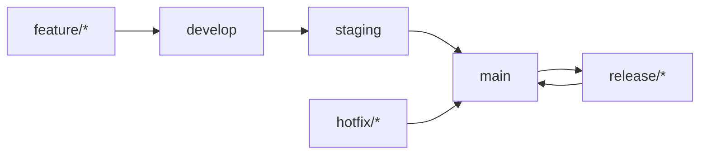
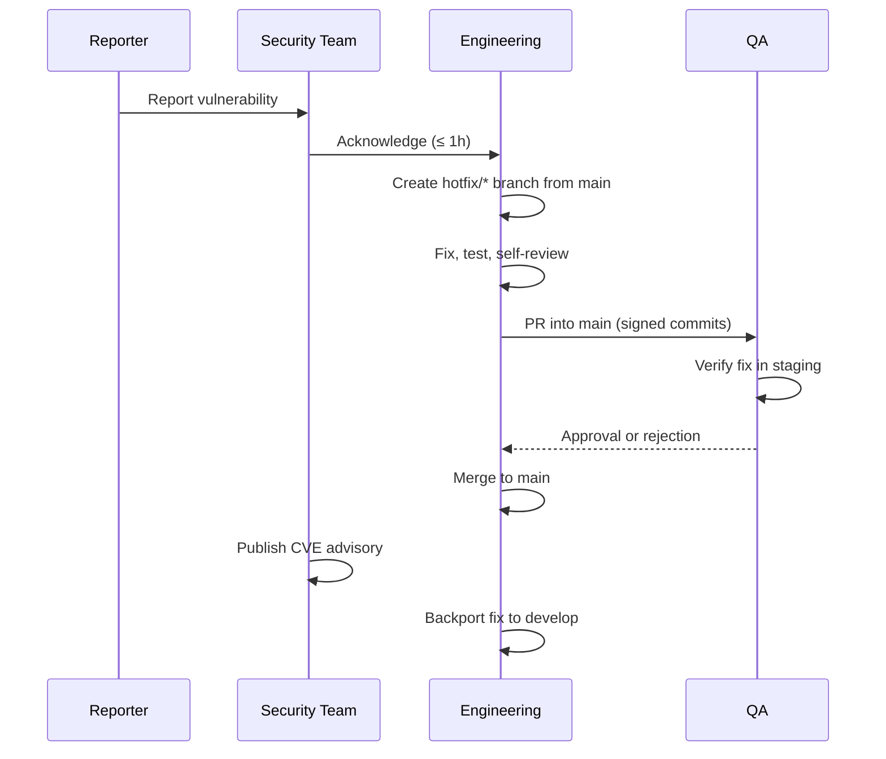

<!-- SPDX-License-Identifier: MIT -->
<!-- Copyright (c) 2026 ScholarForm AI -->

---
title: ScholarForm AI — Maintenance Handbook
description: Branch strategy, hotfix process, patch releases, and operational maintenance tasks
sidebar_position: 50
version: "1.0"
status: ✅ Complete
owner: DevOps Team
review_cadence: quarterly
---

# Maintenance Handbook

This handbook covers the operational procedures for maintaining ScholarForm AI in production. It is intended for maintainers, DevOps engineers, and security responders.

---

## Branch Strategy



### Branches

| Branch | Purpose | Protection |
|--------|---------|------------|
| `main` | Production — deployable at all times, reflects latest release | Requires PR + status checks + signed commits; direct push blocked |
| `develop` | Integration branch for features awaiting release | Requires PR + CI passes |
| `staging` | Pre-production mirror for final validation | Deployed to staging environment; fast-forward from `develop` |
| `feature/*` | New features, non-urgent changes | Branch from `develop`; merge via `develop` → `staging` → `main` |
| `hotfix/*` | Urgent security or critical bug fixes | Branch from `main`; merge directly to `main` and backport to `develop` |
| `release/*` | Release preparation (version bumps, changelog) | Branch from `develop`; merged to `main` and back to `develop` |

### Rules

- **`main`** — PR required, signed commits required, 1 approving review, status checks must pass (backend-ci, frontend-ci, security, commitlint, dependency-review)
- **`develop`** — PR required, status checks must pass
- **`feature/*`**, **`hotfix/*`** — no direct protection (inherit from target)
- **Stale branch cleanup**: branches merged or inactive > 30 days are auto-flagged; inactive > 60 days are deleted

For full branch protection configuration, see [`BRANCH_PROTECTION.md`](../BRANCH_PROTECTION.md).

---

## Hotfix Process

Use for **critical** security vulnerabilities (CVSS ≥ 7.0) or production outages affecting all users.



### Steps

1. **Create hotfix branch** from `main`:
   ```bash
   git checkout main
   git checkout -b hotfix/CVE-YYYY-NNNN
   ```

2. **Fix the vulnerability** with minimal diff. Include regression tests.

3. **Open a PR** against `main` with:
   - `[HOTFIX]` prefix in title
   - Link to the security advisory or issue
   - Signed commits
   - CC the Security Team

4. **CI must pass**: backend-ci, frontend-ci, security scans (CodeQL, Trivy, dependency-review).

5. **Merge** to `main` after one approving review.

6. **Tag and release** immediately:
   ```bash
   git checkout main
   git pull
   git tag -a v1.0.1 -m "v1.0.1 — security fix"
   git push origin v1.0.1
   ```

7. **Backport** the fix to `develop`:
   ```bash
   git checkout develop
   git cherry-pick <commit-hash>
   git push origin develop
   ```

### SLA for hotfixes

| Severity | Acknowledgment | Fix Deployed | CVE Published |
|----------|---------------|--------------|---------------|
| Critical | 1 hour | 7 days | 60 days |
| High | 2 hours | 14 days | 60 days |
| Medium | 24 hours | 30 days | 90 days |
| Low | 48 hours | 90 days | 120 days |

---

## Patch Release Process

Use for **non-urgent** bug fixes, dependency updates, and minor improvements.

1. **Branch**: Create `release/v1.x.y` from `develop`.
2. **Version bump**: Update `VERSION` file, `package.json`, `pyproject.toml`, and `CITATION.cff`.
3. **Changelog**: Add entry to `CHANGELOG.md` under a new `[1.x.y]` heading.
4. **PR**: Open PR from `release/v1.x.y` into `main`.
5. **CI validation**: All 25 workflows must pass.
6. **Review**: One maintainer approval required.
7. **Merge** into `main`.
8. **Tag**:
   ```bash
   git checkout main
   git tag -a v1.x.y -m "v1.x.y"
   git push origin v1.x.y
   ```
9. **Release notes**: The Release Drafter auto-generates release notes from conventional commits. Review and publish on GitHub Releases.
10. **Backport** the merge commit to `develop`:
    ```bash
    git checkout develop
    git merge main
    git push origin develop
    ```

---

## Regular Maintenance Tasks

### Daily (Automated)

| Task | Tool/Workflow | Purpose |
|------|--------------|---------|
| Dependency scanning | Dependabot (pip + npm) | Identify vulnerable dependencies |
| Secret scanning | GitHub secret scanning | Prevent credential leaks |
| Container scanning | Trivy in CI | Detect CVEs in Docker images |
| Code scanning | CodeQL (Python + JS) | Static analysis on every push |
| Scorecard evaluation | OpenSSF Scorecard (weekly cron) | Supply chain health monitoring |

### Weekly

| Task | Owner | Details |
|------|-------|---------|
| Review Dependabot PRs | DevOps | Merge grouped patch/minor updates |
| Check Grafana dashboards | DevOps | Review error budgets, latency, throughput |
| Rotate logs (if not automated) | DevOps | Archive and prune old log files |
| Review stale issues/PRs | Maintainers | Close or re-triage stale items |

### Monthly

| Task | Owner | Details |
|------|-------|---------|
| Dependency audit report | Security | Review `pip-audit` and `npm audit` results |
| Certificate expiry check | DevOps | Check TLS certs (Let's Encrypt / cloud provider) |
| Database maintenance | DevOps | Run `VACUUM ANALYZE`, check table bloat, review slow queries |
| Performance review | Engineering | Review p50/p95/p99 latency, RPS, error rates |
| Budget check | DevOps | Review cloud spend (Render, Vercel, Supabase, Redis) |

### Quarterly

| Task | Owner | Details |
|------|-------|---------|
| Security review | Security | Formal review of SECURITY.md, RBAC, audit logs |
| Dependency major upgrades | Engineering | Plan and test major version bumps |
| Secrets rotation | DevOps | Rotate API keys, database passwords, JWT secrets |
| Disaster recovery drill | DevOps | Test backup restoration, failover procedure |
| Documentation freshness | Engineering | Verify docs match current behaviour |

### Annually

| Task | Owner | Details |
|------|-------|---------|
| Full penetration test | Security | Third-party pentest of production environment |
| SOC 2 / ISO 27001 audit | Compliance | If applicable — assess control effectiveness |
| Business continuity review | Leadership | Review BCP, update risk register |
| License audit | Legal | Verify all dependencies comply with project license (MIT) |

---

## Security Patching

### Response Workflow

1. **Alert triggers** — Dependabot, CodeQL, Trivy, or external report
2. **Triage** (≤ 4 hours for critical/high) — determine CVSS v3.1 severity, affected versions, exploitability
3. **Fix** — create hotfix branch; patch dependency or code
4. **Test** — CI suite + manual regression for critical paths
5. **Deploy** — merge to `main` → container build → staging validation → production rollout
6. **Advisory** — publish GitHub Security Advisory + CVE

### Dependency Pinning

- Backend: `requirements.txt` with exact versions (no ranges)
- Frontend: `package-lock.json` committed
- CI enforces `pip-audit` and `npm audit` — builds fail on known CRITICAL/HIGH CVEs
- Dependabot grouped updates: patch/minor auto-merged, major requires manual review

### Container Image Updates

Base images are rebuilt weekly via scheduled workflow:
```bash
docker build --pull --no-cache -t scholarform/backend:latest .
docker build --pull --no-cache -t scholarform/frontend:latest .
```

---

## Performance Monitoring

### Dashboards (Grafana)

Three dedicated Grafana dashboards:

| Dashboard | Metrics | Alert Thresholds |
|-----------|---------|-----------------|
| **Application Performance** | p50/p95/p99 API latency, RPS, error rate, request volume per endpoint | p95 > 2s, error rate > 1% |
| **Infrastructure** | CPU, memory, disk, network I/O per service | CPU > 80% sustained, memory > 85% |
| **Database** | Connection pool, query latency, table bloat, slow queries | Connection count > 80% max, slow queries > 5/min |

### Prometheus Alerting Rules

| Alert | Condition | Severity | Response |
|-------|-----------|----------|----------|
| HighErrorRate | error_rate > 0.05 (5%) over 5m | Critical | Pager |
| HighLatency | p95_latency > 5000ms over 5m | Warning | Slack |
| HighCPU | cpu_usage > 0.85 over 10m | Warning | Slack |
| LowDisk | disk_free < 10% | Warning | Slack |
| DownInstance | up == 0 over 1m | Critical | Pager |

---

## Database Maintenance

### Alembic Migrations

```bash
# Create a new migration
cd backend
alembic revision --autogenerate -m "description"

# Apply pending migrations
alembic upgrade head

# Rollback one step
alembic downgrade -1

# View history
alembic history
```

### Scheduled Maintenance

| Frequency | Task | Command |
|-----------|------|---------|
| Weekly | Vacuum + analyze | `VACUUM ANALYZE;` |
| Weekly | Review table bloat | `SELECT schemaname, tablename, n_dead_tup FROM pg_stat_user_tables;` |
| Monthly | Index maintenance | `REINDEX INDEX <name>;` on high-write tables |
| Monthly | Slow query review | Review pg_stat_statements for top elapsed-time queries |

### Backup & Recovery

- **Database**: Supabase automated PITR (point-in-time recovery). Retention: 7 days.
- **File storage**: Supabase buckets with daily snapshots. Retention: 30 days.
- **Configuration**: `.env` never committed; stored in encrypted vault (1Password / Bitwarden).
- **DR drill**: Full restore test every quarter.

---

## Log Rotation

### Application Logs (Docker)

Logs are handled by Docker's json-file driver with rotation:
```json
{
  "log-driver": "json-file",
  "log-opts": {
    "max-size": "10m",
    "max-file": "3"
  }
}
```

### Celery Worker Logs

```bash
# Rotate Celery logs daily at midnight
0 0 * * * logrotate /etc/logrotate.d/celery --state /tmp/logrotate.state
```

Logrotate configuration (`/etc/logrotate.d/celery`):
```
/var/log/celery/*.log {
    daily
    rotate 7
    compress
    delaycompress
    missingok
    notifempty
    copytruncate
}
```

### Nginx / Reverse Proxy Logs

```bash
0 0 * * * logrotate /etc/logrotate.d/nginx
```

### Audit Logs

Audit logs are retained for 90 days minimum. Archive to cold storage (S3/GCS) after 90 days. Deletion after 1 year unless legal hold applies.

---

## Certificate Renewal

### TLS Certificates

| Environment | Provider | Renewal Method | Schedule |
|-------------|----------|---------------|----------|
| Production (cloud) | Cloud provider (Render) | Automatic | Managed by Render |
| Production (self-hosted) | Let's Encrypt | Certbot / acme.sh | Every 60 days (cron) |
| Staging | Cloud provider (Render) | Automatic | Managed by Render |
| Development | Self-signed | Manual generation | As needed |

### Self-Hosted Renewal (Let's Encrypt)

```bash
# Install certbot
apt install certbot

# Obtain certificate
certbot certonly --webroot -w /var/www/html -d scholarform.ai -d api.scholarform.ai

# Auto-renew (cron: twice daily)
0 0,12 * * * certbot renew --quiet --post-hook "systemctl reload nginx"
```

Add monitoring: check certificate expiry via Prometheus Blackbox Exporter or external monitoring (e.g., Checkly, UptimeRobot) — alert when expiry < 14 days.

---

## Dependency Updates

### Automated Updates

| Channel | Tool | Cadence | Action |
|---------|------|---------|--------|
| pip (direct) | Dependabot | Weekly | Auto-PR for patch/minor updates |
| npm (direct) | Dependabot | Weekly | Auto-PR for patch/minor updates |
| pip (indirect) | `pip-audit` in CI | Every push | Fails build on CRITICAL/HIGH CVEs |
| npm (indirect) | `npm audit` in CI | Every push | Fails build on CRITICAL/HIGH CVEs |
| Docker base images | Scheduled workflow | Weekly | Rebuild with `--pull --no-cache` |
| GitHub Actions | Dependabot | Weekly | Auto-PR for patch/minor updates |

### Manual Review

| Cadence | Review |
|---------|--------|
| Weekly | Review and merge Dependabot PRs (fast-track patch/minor) |
| Monthly | Audit full dependency tree for deprecated or orphaned packages |
| Quarterly | Plan major version upgrades (breaking changes, requires full CI + E2E pass) |

### Grouped Update Configuration

Dependabot groups in `.github/dependabot.yml`:
- **pip-development**: dev dependencies (pytest, mypy, ruff, pre-commit) — auto-merge
- **pip-production**: production dependencies — require manual merge
- **npm-development**: dev dependencies (vitest, eslint, typescript) — auto-merge
- **npm-production**: production dependencies — require manual merge
- **docker**: Docker base images — require manual merge

Only applies to non-major updates. Major bumps always require manual review, CI validation, and a changelog entry.

---

## Related Documents

| Document | Location |
|----------|----------|
| Branch Protection | [`docs/BRANCH_PROTECTION.md`](../BRANCH_PROTECTION.md) |
| Release Process | [`RELEASE_PROCESS.md`](../../RELEASE_PROCESS.md) |
| Deployment Guide | [`docs/Deployment.md`](../Deployment.md) |
| Security Policy | [`SECURITY.md`](../../SECURITY.md) |
| CI/CD Workflows | [`.github/workflows/`](../../.github/workflows/) |
| Monitoring Setup | [`docs/MONITORING.md`](../MONITORING.md) |
| Disaster Recovery | [`docs/DISASTER_RECOVERY.md`](../DISASTER_RECOVERY.md) |
