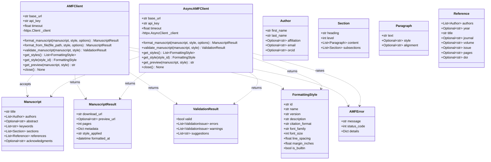
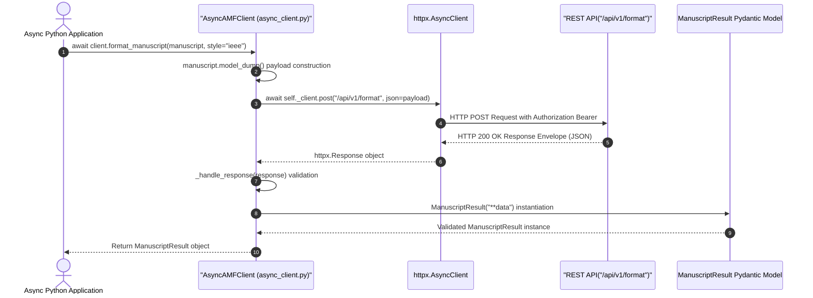
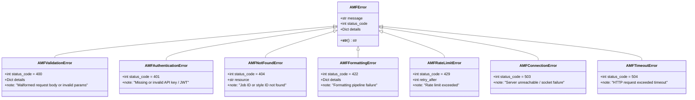

# ScholarForm AI — Python SDK Reference Guide

The `amf-sdk` package provides official Python bindings for accessing ScholarForm AI API endpoints both synchronously (`AMFClient`) and asynchronously (`AsyncAMFClient`).

---

## Installation

```bash
pip install amf-sdk
```

---

## Architecture & Diagrams

### 1. SDK Class Diagram



---

### 2. Async SDK Execution Sequence Diagram



---

## Code Examples & Context Managers

### 1. Synchronous Usage (`AMFClient`)

```python
from amf_sdk import AMFClient, Manuscript, Author, Section, Paragraph

# Context manager handles HTTP client setup and clean teardown
with AMFClient(base_url="http://localhost:8000", api_key="amf_secret_123") as client:
    # 1. Fetch available styles
    styles = client.get_styles()
    print(f"Available styles: {[s.id for s in styles]}")

    # 2. Build structured manuscript object
    manuscript = Manuscript(
        title="Deep Learning in Academic Formatting",
        authors=[
            Author(
                first_name="Alan",
                last_name="Turing",
                affiliation="Bletchley Park",
                email="turing@example.org",
            )
        ],
        abstract="This paper introduces automated styling algorithms.",
        sections=[
            Section(
                heading="Introduction",
                level=1,
                content=[Paragraph(text="Formatting research papers is time consuming.")],
            )
        ],
    )

    # 3. Validate manuscript structure
    val_result = client.validate_manuscript(manuscript, style="apa")
    if val_result.valid:
        # 4. Format manuscript and receive result
        result = client.format_manuscript(manuscript, style="apa")
        print(f"Formatted Output Download: {result.download_url}")
        print(f"Total Pages: {result.pages}")
```

---

### 2. Asynchronous Usage (`AsyncAMFClient`)

```python
import asyncio
from amf_sdk.async_client import AsyncAMFClient
from amf_sdk import Manuscript, Author, Section, Paragraph

async def process_manuscripts_batch():
    async with AsyncAMFClient(base_url="http://localhost:8000", timeout=45.0) as client:
        # Fetch styles asynchronously
        styles = await client.get_styles()
        print(f"Fetched {len(styles)} styles asynchronously.")

        # Construct manuscript
        manuscript = Manuscript(
            title="Async Multi-Agent Architecture",
            authors=[Author(first_name="Ada", last_name="Lovelace")],
            sections=[
                Section(
                    heading="Methodology",
                    level=1,
                    content=[Paragraph(text="Concurrent request pipelines improve throughput.")],
                )
            ],
        )

        # Format manuscript
        result = await client.format_manuscript(manuscript, style="ieee")
        print(f"Async Download URL: {result.download_url}")

asyncio.run(process_manuscripts_batch())
```

---

## 10 Pydantic v2 Models Reference (`amf_sdk.models`)

All data objects in the SDK are Pydantic v2 `BaseModel` subclasses:

| Model Class | Fields & Types | Description |
|---|---|---|
| **`Author`** | `first_name: str`<br>`last_name: str`<br>`affiliation: Optional[str]`<br>`email: Optional[str]`<br>`orcid: Optional[str]` | Represents a author attribution entry |
| **`Paragraph`** | `text: str`<br>`style: Optional[str]`<br>`alignment: Optional[str]` | Paragraph text node with optional inline styling |
| **`Section`** | `heading: str`<br>`level: int = 1`<br>`content: List[Paragraph]`<br>`subsections: List[Section]` | Hierarchical section containing paragraphs and subsections |
| **`Reference`** | `authors: List[Author]`<br>`year: Optional[str]`<br>`title: str`<br>`journal: Optional[str]`<br>`volume: Optional[str]`<br>`issue: Optional[str]`<br>`pages: Optional[str]`<br>`doi: Optional[str]` | Bibliography item citation details |
| **`Manuscript`** | `title: str`<br>`authors: List[Author]`<br>`abstract: Optional[str]`<br>`keywords: List[str]`<br>`sections: List[Section]`<br>`references: List[Reference]`<br>`acknowledgments: Optional[str]` | Complete manuscript domain model |
| **`FormattingOptions`** | `output_format: str = "docx"`<br>`page_size: str = "A4"`<br>`font_family: Optional[str]`<br>`font_size: Optional[float]`<br>`line_spacing: Optional[float]`<br>`include_toc: bool`<br>`include_page_numbers: bool`<br>`include_running_header: bool` | Custom formatting layout options |
| **`FormattingStyle`** | `id: str`<br>`name: str`<br>`version: str`<br>`description: str`<br>`citation_format: str`<br>`font_family: str`<br>`font_size: int`<br>`line_spacing: float`<br>`margin_inches: float`<br>`is_builtin: bool` | Style rule specification parameters |
| **`ManuscriptResult`** | `download_url: str`<br>`preview_url: Optional[str]`<br>`pages: int`<br>`metadata: Dict[str, Any]`<br>`style_applied: str`<br>`formatted_at: datetime` | Formatting execution result payload |
| **`ValidationIssue`** | `code: str`<br>`message: str`<br>`location: Optional[str]`<br>`severity: str` | Individual error or warning item in validation report |
| **`ValidationResult`** | `valid: bool`<br>`errors: List[ValidationIssue]`<br>`warnings: List[ValidationIssue]`<br>`suggestions: List[str]` | Document structural validation summary report |

---

## Exception Taxonomy (`amf_sdk.exceptions`)

All SDK exceptions inherit from `AMFError`, providing consistent attributes (`message`, `status_code`, `details`). The class hierarchy is shown below:



### Exception Details & HTTP Mapping

| Exception Class | Status Code | Cause / Trigger | Extra Attributes |
|---|---|---|---|
| `AMFError` | 500 | Base exception class for all SDK errors | `message`, `status_code`, `details` |
| `AMFValidationError` | 400 | Malformed request body or invalid parameters | `details` dict with field errors |
| `AMFAuthenticationError` | 401 | Missing or invalid API key / bearer token | None |
| `AMFNotFoundError` | 404 | Target manuscript job or style ID not found | `resource` name |
| `AMFFormattingError` | 422 | Formatting pipeline failure or invalid structure | `details` dict with parser errors |
| `AMFRateLimitError` | 429 | Rate limit exceeded | `details["retry_after"]` in seconds |
| `AMFConnectionError` | 503 | Server unreachable or network socket failure | Default: `"Failed to connect to AMF API"` |
| `AMFTimeoutError` | 504 | HTTP request exceeded configured timeout | Default: `"Request timed out"` |

```python
from amf_sdk import AMFClient
from amf_sdk.exceptions import AMFValidationError, AMFRateLimitError, AMFError

client = AMFClient(api_key="your-key")
try:
    result = client.format_manuscript(manuscript, style="apa")
except AMFValidationError as e:
    print(f"Validation failed ({e.status_code}): {e.message}")
    print(f"Details: {e.details}")
except AMFRateLimitError as e:
    retry_after = e.details.get("retry_after", 60)
    print(f"Rate limited. Retrying after {retry_after} seconds.")
except AMFError as e:
    print(f"SDK Error: {e}")
```
