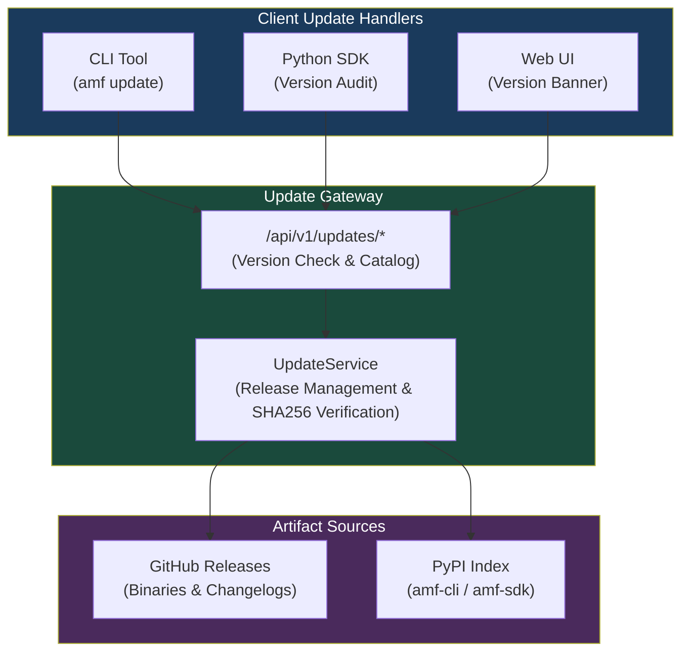
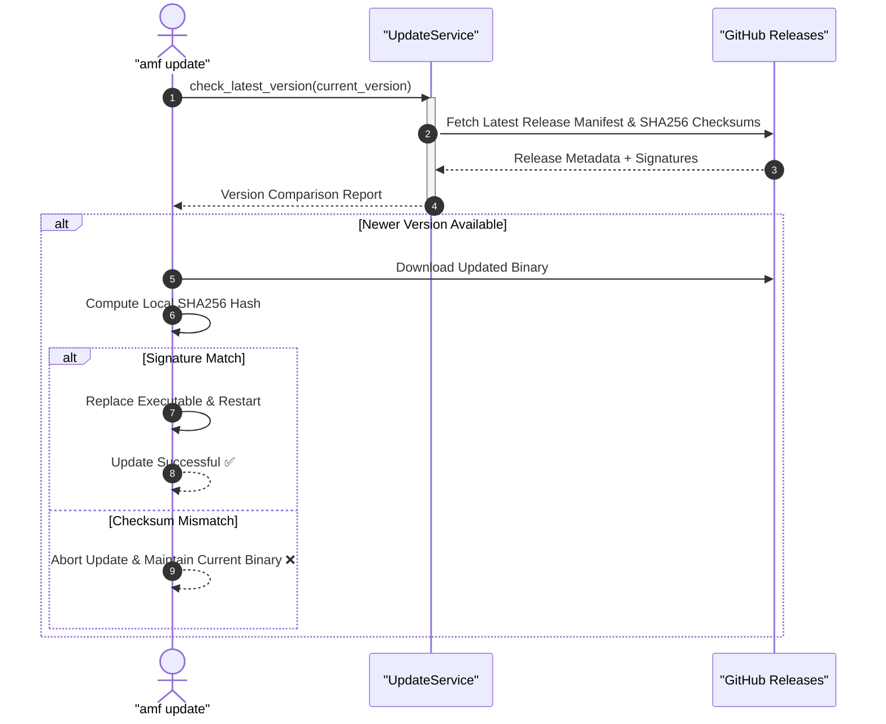

<!-- SPDX-License-Identifier: MIT -->
<!-- Copyright (c) 2026 ScholarForm AI -->

# Self-Update & Release System — Developer Guide

## Architecture Overview

The update system provides automated version detection, cryptographic artifact verification, and zero-downtime updates across CLI, SDK, and Web UI environments.



> [!IMPORTANT]
> All binary downloads are verified against SHA-256 checksum manifests before installation to prevent tampering and incomplete artifact downloads.

---

## Key Components

| Component | File | Purpose |
| ----------- | ------ | --------- |
| `UpdateService` | `backend/app/services/update_service.py` | Version discovery, release caching, and cryptographic verification |
| `update_routes.py` | `backend/app/api/update_routes.py` | REST endpoints for version checking and artifact metadata |
| `update.py` (CLI) | `cli/amf/commands/update.py` | `amf update` command implementation with automatic rollback |
| `UpdateBanner.tsx` | `frontend/src/components/UpdateBanner.tsx` | Real-time notification banner when a newer release is published |

---

## Update Verification Sequence



---

## CLI Commands

```bash
# Check if a new version is available
amf update check

# Perform self-update to the latest version
amf update --yes

# Rollback to the previous version
amf update rollback
```
