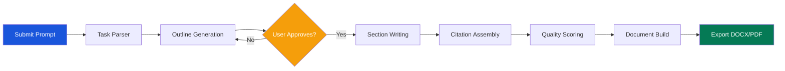

<!-- SPDX-License-Identifier: MIT -->
<!-- Copyright (c) 2026 ScholarForm AI -->


---
title: Tutorial — Generate a Document with AI
description: Step-by-step tutorial to generate an academic manuscript using AI agent prompts
sidebar_position: 3
version: "1.0"
status: ✅ Complete
owner: Docs Team
review_cadence: quarterly
last_updated: July 2026
---

# Tutorial: Generate a Document with AI

This tutorial walks through generating a complete academic manuscript from a natural language prompt using ScholarForm AI's agent pipeline.

## Prerequisites

| Requirement | Details |
|-------------|---------|
| Running backend | Follow the [Quickstart](../quickstart.md) to get ScholarForm running locally |
| LLM provider key | At least one of: NVIDIA NIM, Groq, or Ollama — see [API Key Setup](../API_KEY_QUICK_START.md) |
| Python 3.12+ | For running code examples |
| `curl` or `requests` | For API examples |
| Sample prompt | A research topic description (see Step 1) |

## AI Generation Workflow



## Step 1: Submit a Manuscript Prompt

Start with a research topic. ScholarForm AI generates the outline, sections, and citations automatically.

### Via API (curl)

```bash
curl -X POST http://localhost:8000/api/v1/generator/sessions \
  -H "Content-Type: application/json" \
  -H "Authorization: Bearer YOUR_JWT_TOKEN" \
  -d '{
    "prompt": "Write a survey paper on federated learning for healthcare applications. Include sections on privacy-preserving techniques, communication efficiency, and real-world deployments. Target 8-10 pages, IEEE format.",
    "template": "ieee",
    "tone": "academic",
    "max_sections": 6
  }'
```

**Response:**
```json
{
  "data": {
    "session_id": "sess_abc123",
    "status": "generating_outline",
    "created_at": "2026-07-17T10:00:00Z"
  }
}
```

### Via API (Python)

```python
import requests

BASE_URL = "http://localhost:8000"
JWT = "YOUR_JWT_TOKEN"

resp = requests.post(
    f"{BASE_URL}/api/v1/generator/sessions",
    headers={
        "Authorization": f"Bearer {JWT}",
        "Content-Type": "application/json"
    },
    json={
        "prompt": "Write a survey paper on federated learning for healthcare...",
        "template": "ieee",
        "tone": "academic",
        "max_sections": 6
    }
)
session = resp.json()["data"]
session_id = session["session_id"]
print(f"Session created: {session_id}")
```

### Via UI

1. Navigate to **http://localhost:3000/agent**
2. Enter your research topic in the prompt textarea
3. Select **IEEE** from the template dropdown
4. Choose **Academic** tone
5. Click **Generate Outline**

## Step 2: Configure AI Generation Options

### Model Selection

Choose which LLM powers the generation:

| Parameter | Values | Default | Description |
|-----------|--------|---------|-------------|
| `model` | `nvidia`, `groq`, `ollama`, `auto` | `auto` | Specific provider or auto-fallback |
| `tone` | `academic`, `technical`, `general`, `creative` | `academic` | Writing style for generated content |
| `temperature` | `0.0` – `1.0` | `0.7` | Creativity level (lower = more deterministic) |
| `max_sections` | `1` – `15` | `8` | Maximum number of sections to generate |
| `include_abstract` | `true`/`false` | `true` | Generate an abstract section |
| `include_references` | `true`/`false` | `true` | Generate references section |
| `citation_style` | CSL ID string | template default | Override citation format |

### Provider Comparison

| Provider | Strengths | Weaknesses | Cost | Best For |
|----------|-----------|------------|------|----------|
| **NVIDIA NIM** | High quality, fast inference, 128K context | Requires API key, rate limited on free tier | Pay-per-use | Production, long documents |
| **Groq** | Very fast inference, generous free tier | Smaller context window (32K), fewer model choices | Free tier available | Rapid prototyping |
| **Ollama** | Local, no API key needed, privacy-preserving | Slower, requires GPU for good performance | Free | Development, sensitive data |

### Via API (curl)

```bash
curl -X PUT http://localhost:8000/api/v1/generator/sessions/sess_abc123/config \
  -H "Content-Type: application/json" \
  -H "Authorization: Bearer YOUR_JWT_TOKEN" \
  -d '{
    "model": "nvidia",
    "tone": "academic",
    "temperature": 0.7,
    "max_sections": 6,
    "include_abstract": true,
    "include_references": true,
    "citation_style": "ieee"
  }'
```

### Via API (Python)

```python
requests.put(
    f"{BASE_URL}/api/v1/generator/sessions/{session_id}/config",
    headers={"Authorization": f"Bearer {JWT}", "Content-Type": "application/json"},
    json={
        "model": "nvidia",
        "tone": "academic",
        "temperature": 0.7,
        "max_sections": 6,
    }
)
```

## Step 3: Choose a Provider

ScholarForm supports 10 built-in LLM providers. The system uses a **4-tier fallback chain**:

```
NVIDIA NIM → Groq → OpenRouter → Ollama (local)
```

If your preferred provider is unavailable, the next in the chain is tried automatically. You can also bypass the fallback and lock to a specific provider:

```bash
# Lock to Groq (no fallback)
curl -X POST http://localhost:8000/api/v1/generator/sessions \
  -H "Content-Type: application/json" \
  -H "Authorization: Bearer YOUR_JWT_TOKEN" \
  -d '{
    "prompt": "Write about quantum computing...",
    "model": "groq"
  }'
```

To list available providers:

```bash
curl http://localhost:8000/api/v1/providers \
  -H "Authorization: Bearer YOUR_JWT_TOKEN"
```

**Response:**
```json
{
  "data": {
    "providers": [
      {"id": "nvidia", "name": "NVIDIA NIM", "available": true},
      {"id": "groq", "name": "Groq", "available": true},
      {"id": "ollama", "name": "Ollama", "available": true},
      {"id": "openai", "name": "OpenAI", "available": false},
      {"id": "anthropic", "name": "Anthropic", "available": false}
    ]
  }
}
```

## Step 4: Monitor Generation Progress

ScholarForm streams generation progress via **Server-Sent Events (SSE)**. Subscribe to the session's event stream to see real-time updates.

### Via API (curl)

```bash
curl -N http://localhost:8000/api/v1/generator/sessions/sess_abc123/events \
  -H "Authorization: Bearer YOUR_JWT_TOKEN"
```

**Event stream:**
```
event: stage_update
data: {"stage": "generating_outline", "progress": 10, "message": "Analyzing prompt..."}

event: stage_update
data: {"stage": "generating_outline", "progress": 30, "message": "Identifying key sections"}

event: outline_ready
data: {"session_id": "sess_abc123", "outline": {"sections": [...]}}

event: stage_update
data: {"stage": "writing_sections", "progress": 50, "message": "Writing Introduction..."}

event: stage_update
data: {"stage": "writing_sections", "progress": 70, "message": "Writing Methods..."}

event: stage_update
data: {"stage": "writing_sections", "progress": 90, "message": "Assembling references"}

event: complete
data: {"session_id": "sess_abc123", "download_url": "/api/v1/generator/sessions/sess_abc123/download"}
```

### Via Python (SSE client)

```python
import json
import requests
from sseclient import SSEClient

response = requests.get(
    f"{BASE_URL}/api/v1/generator/sessions/{session_id}/events",
    headers={"Authorization": f"Bearer {JWT}"},
    stream=True
)

client = SSEClient(response)
for event in client.events():
    data = json.loads(event.data)
    stage = data.get("stage", "")
    progress = data.get("progress", 0)
    message = data.get("message", "")

    if event.event == "outline_ready":
        print(f"\n📋 Outline ready with {len(data['outline']['sections'])} sections")
    elif event.event == "complete":
        print(f"\n✅ Generation complete! Download at: {data['download_url']}")
        break
    else:
        print(f"[{progress}%] {stage}: {message}")
```

### Via JavaScript

```javascript
const eventSource = new EventSource(
  `http://localhost:8000/api/v1/generator/sessions/${sessionId}/events`,
  { headers: { Authorization: `Bearer ${jwt}` } }
);

eventSource.addEventListener('outline_ready', (e) => {
  const data = JSON.parse(e.data);
  console.log('Outline:', data.outline);
});

eventSource.addEventListener('complete', (e) => {
  const data = JSON.parse(e.data);
  console.log('Download:', data.download_url);
  eventSource.close();
});

eventSource.addEventListener('stage_update', (e) => {
  const data = JSON.parse(e.data);
  document.getElementById('progress').textContent = `${data.progress}%`;
});
```

### Via UI

The agent page displays a real-time progress bar and token-by-token streaming output. Watch sections appear as they are generated.

## Step 5: Review AI Suggestions and Approve/Reject

After the outline is generated, review and approve before section writing begins.

### Fetch the Generated Outline

```bash
curl http://localhost:8000/api/v1/generator/sessions/sess_abc123/outline \
  -H "Authorization: Bearer YOUR_JWT_TOKEN"
```

**Response:**
```json
{
  "data": {
    "session_id": "sess_abc123",
    "outline": {
      "sections": [
        {"title": "Introduction", "description": "Background on federated learning in healthcare", "order": 1},
        {"title": "Privacy-Preserving Techniques", "description": "Differential privacy, secure aggregation", "order": 2},
        {"title": "Communication Efficiency", "description": "Model compression, asynchronous updates", "order": 3},
        {"title": "Real-World Deployments", "description": "Hospital networks, cross-institution studies", "order": 4},
        {"title": "Challenges and Future Directions", "description": "Data heterogeneity, regulatory compliance", "order": 5},
        {"title": "Conclusion", "description": "Summary of findings", "order": 6}
      ]
    }
  }
}
```

### Approve Outline

```bash
curl -X POST http://localhost:8000/api/v1/generator/sessions/sess_abc123/approve \
  -H "Content-Type: application/json" \
  -H "Authorization: Bearer YOUR_JWT_TOKEN" \
  -d '{
    "approved": true,
    "modified_sections": [
      {"title": "Introduction", "order": 1},
      {"title": "Privacy-Preserving Techniques", "order": 2},
      {"title": "Communication Efficiency", "order": 3},
      {"title": "Real-World Deployments", "order": 4},
      {"title": "Future Research Directions", "order": 5},
      {"title": "Conclusion", "order": 6}
    ]
  }'
```

### Reject and Regenerate

```bash
curl -X POST http://localhost:8000/api/v1/generator/sessions/sess_abc123/approve \
  -H "Content-Type: application/json" \
  -H "Authorization: Bearer YOUR_JWT_TOKEN" \
  -d '{
    "approved": false,
    "feedback": "Add a section on regulatory compliance (HIPAA, GDPR)"
  }'
```

### Python Example

```python
# Fetch outline
resp = requests.get(
    f"{BASE_URL}/api/v1/generator/sessions/{session_id}/outline",
    headers={"Authorization": f"Bearer {JWT}"}
)
outline = resp.json()["data"]["outline"]
for s in outline["sections"]:
    print(f"  {s['order']}. {s['title']}")

# Approve with modifications
resp = requests.post(
    f"{BASE_URL}/api/v1/generator/sessions/{session_id}/approve",
    headers={"Authorization": f"Bearer {JWT}", "Content-Type": "application/json"},
    json={"approved": True, "modified_sections": outline["sections"]}
)
print(f"Section writing started: {resp.json()['data']['status']}")
```

## Step 6: Export Formatted Document

Once the generation completes, download the formatted manuscript.

### Via curl

```bash
# DOCX format
curl -o generated-paper.docx \
  http://localhost:8000/api/v1/generator/sessions/sess_abc123/download?format=docx \
  -H "Authorization: Bearer YOUR_JWT_TOKEN"

# PDF format
curl -o generated-paper.pdf \
  http://localhost:8000/api/v1/generator/sessions/sess_abc123/download?format=pdf \
  -H "Authorization: Bearer YOUR_JWT_TOKEN"
```

### Via Python

```python
# Download DOCX
resp = requests.get(
    f"{BASE_URL}/api/v1/generator/sessions/{session_id}/download",
    params={"format": "docx"},
    headers={"Authorization": f"Bearer {JWT}"}
)
with open("generated-paper.docx", "wb") as f:
    f.write(resp.content)

# Download PDF
resp = requests.get(
    f"{BASE_URL}/api/v1/generator/sessions/{session_id}/download",
    params={"format": "pdf"},
    headers={"Authorization": f"Bearer {JWT}"}
)
with open("generated-paper.pdf", "wb") as f:
    f.write(resp.content)

print("✅ Generated paper downloaded")
```

### Via UI

1. Navigate to the session results page
2. Click **Download DOCX** or **Download PDF**
3. The formatted document opens in your browser or saves to disk

## Full End-to-End Python Script

```python
#!/usr/bin/env python3
"""Complete example: generate a document with AI from prompt to download."""

import json
import sys
import time
import requests
from sseclient import SSEClient

BASE_URL = "http://localhost:8000"
JWT = "YOUR_JWT_TOKEN"

def generate_document(prompt, template="ieee", tone="academic"):
    # Step 1: Create session
    resp = requests.post(
        f"{BASE_URL}/api/v1/generator/sessions",
        headers={"Authorization": f"Bearer {JWT}", "Content-Type": "application/json"},
        json={"prompt": prompt, "template": template, "tone": tone}
    )
    session_id = resp.json()["data"]["session_id"]
    print(f"Session created: {session_id}")

    # Step 2: Stream events until outline is ready
    print("Generating outline...")
    resp = requests.get(
        f"{BASE_URL}/api/v1/generator/sessions/{session_id}/events",
        headers={"Authorization": f"Bearer {JWT}"},
        stream=True
    )
    client = SSEClient(resp)
    for event in client.events():
        data = json.loads(event.data)
        if event.event == "outline_ready":
            sections = data["outline"]["sections"]
            print(f"\nOutline ready: {len(sections)} sections")
            for s in sections:
                print(f"  {s['order']}. {s['title']}")
            break

    # Step 3: Approve outline
    resp = requests.post(
        f"{BASE_URL}/api/v1/generator/sessions/{session_id}/approve",
        headers={"Authorization": f"Bearer {JWT}", "Content-Type": "application/json"},
        json={"approved": True, "modified_sections": sections}
    )
    print("Outline approved. Writing sections...")

    # Step 4: Wait for completion
    resp = requests.get(
        f"{BASE_URL}/api/v1/generator/sessions/{session_id}/events",
        headers={"Authorization": f"Bearer {JWT}"},
        stream=True
    )
    client = SSEClient(resp)
    for event in client.events():
        data = json.loads(event.data)
        if event.event == "complete":
            print(f"\nGeneration complete!")
            break
        elif event.event == "stage_update":
            print(f"  [{data['progress']}%] {data['message']}")

    # Step 5: Download
    resp = requests.get(
        f"{BASE_URL}/api/v1/generator/sessions/{session_id}/download",
        params={"format": "docx"},
        headers={"Authorization": f"Bearer {JWT}"}
    )
    filename = f"generated-{template}.docx"
    with open(filename, "wb") as f:
        f.write(resp.content)
    print(f"Downloaded: {filename}")

if __name__ == "__main__":
    generate_document(
        prompt="Write a survey paper on edge AI for IoT devices. "
               "Cover model compression, on-device training, and deployment frameworks.",
        template="ieee",
        tone="academic"
    )
```

## Troubleshooting

### Common AI Generation Issues

| Error | Cause | Solution |
|-------|-------|----------|
| `OUTLINE_GENERATION_FAILED` | LLM returned invalid JSON | Retry — transient model issue. Set `model: "groq"` as fallback |
| `SECTION_WRITE_TIMEOUT` | Section took >120s to generate | Reduce `max_sections` or switch to a faster provider (Groq) |
| `NO_PROVIDER_AVAILABLE` | All providers unreachable | Check your API keys and provider status at `/api/v1/providers` |
| `CITATION_FETCH_FAILED` | CrossRef API unreachable | Generation continues without live citations. Add them manually. |
| `CONTENT_TOO_LONG` | Generated content exceeds model context | Increase `temperature` or reduce section count |
| `QUALITY_SCORE_LOW` (< 0.6) | Generated content doesn't meet quality bar | Regenerate with more specific prompt or adjust `tone` |

### Provider Not Available?

```bash
# Check provider status
curl http://localhost:8000/api/v1/providers \
  -H "Authorization: Bearer YOUR_JWT_TOKEN"

# Test NVIDIA NIM directly
curl -H "Authorization: Bearer $NVIDIA_API_KEY" \
  https://integrate.api.nvidia.com/v1/models

# Test Ollama
curl http://localhost:11434/api/tags
```

### Generation Quality Issues

If the AI output lacks depth or accuracy:

1. **Be more specific in your prompt** — include expected section count, word count, and specific topics
2. **Lower temperature** (`0.3`–`0.5`) for more focused, deterministic output
3. **Use NVIDIA NIM** for the best quality (Groq is faster but sometimes less thorough)
4. **Modify the outline** before approving — add section descriptions for guidance
5. **Regenerate individual sections** by creating a new session with more specific prompts

### Session Not Found?

```bash
# List your sessions
curl http://localhost:8000/api/v1/generator/sessions \
  -H "Authorization: Bearer YOUR_JWT_TOKEN"

# Response: {"data": {"sessions": [{"session_id": "sess_abc123", "status": "complete", ...}]}}
```

## What You Learned

- How to submit a manuscript prompt to the AI agent
- How to configure generation options (model, tone, provider)
- The difference between NVIDIA NIM, Groq, and Ollama providers
- How to monitor generation progress via SSE events
- How to review, approve, or reject AI-generated outlines
- How to export the completed document in DOCX or PDF format

## Next Steps

| Topic | Resource |
|-------|----------|
| Multi-doc synthesis | [Multi-Doc Synthesis Tutorial](multi-doc-synthesis.md) |
| Format an existing paper | [Format Your First Paper](format-your-first-paper.md) |
| Custom templates | [Custom Template Guide](../guides/creating-a-custom-template.md) |
| Agent documentation | [Agent Overview](../Agent.md) |
| All tutorials | [Tutorials Index](README.md) |
