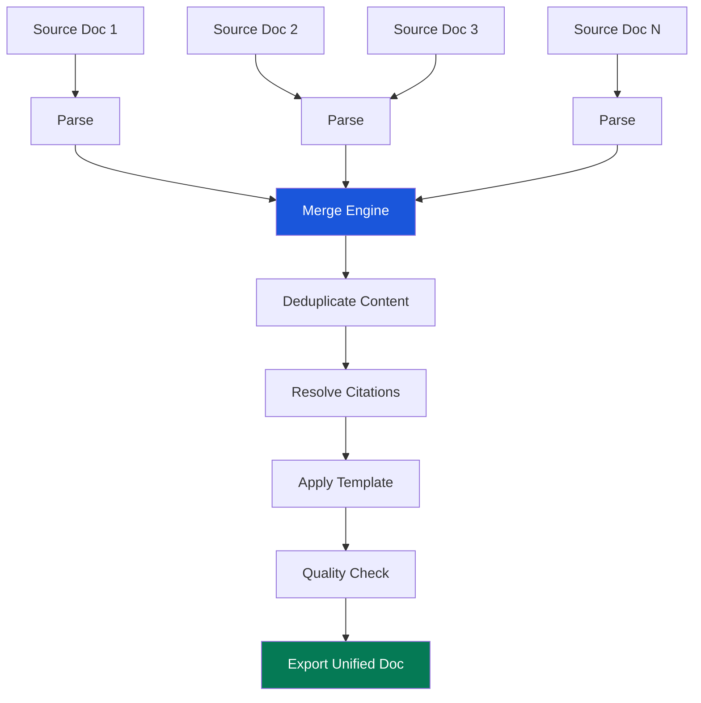

<!-- SPDX-License-Identifier: MIT -->
<!-- Copyright (c) 2026 ScholarForm AI -->

---

title: Tutorial — Multi-Document Synthesis
description: Step-by-step tutorial to synthesize multiple source documents into a unified manuscript
sidebar_position: 4
version: "1.0"
status: ✅ Complete
owner: Docs Team
review_cadence: quarterly
last_updated: July 2026
---

# Tutorial: Multi-Document Synthesis

This tutorial walks through synthesizing 2–6 source documents into a single unified, formatted manuscript using ScholarForm AI's synthesis pipeline.

## What Is Multi-Doc Synthesis?

Multi-document synthesis combines content from multiple academic papers into one coherent, formatted manuscript. Use it when you need to:

- **Merge related papers** into a unified survey or review article
- **Combine chapters** from different authors into a single document
- **Synthesize literature** for a systematic review with consistent formatting
- **Create a meta-analysis** from multiple study reports

The synthesis pipeline:

1. Parses each source document independently
2. Detects overlapping and complementary content
3. Applies your chosen merge strategy (sequential, thematic, or priority-based)
4. Resolves citation conflicts and deduplicates references
5. Outputs a single formatted DOCX with unified citations and consistent style



## Prerequisites

| Requirement | Details |
| ------------- | --------- |
| Running backend | Follow the [Quickstart](../docs/getting-started/quickstart.md) |
| LLM provider key | Required for synthesis — see [API Key Setup](../api/API_KEY_QUICK_START.md) |
| Source documents | 2–6 academic papers in DOCX, PDF, TEX, HTML, or MD format |
| Python 3.12+ | For running code examples |

## Step 1: Upload Multiple Source Documents

Upload your source documents individually, referencing them by their document IDs.

### Via API (curl)

```bash
# Upload document 1
curl -X POST http://localhost:8000/api/v1/documents/upload \
  -H "Authorization: Bearer YOUR_JWT_TOKEN" \
  -F "file=@paper1.docx"

# Response: {"data": {"id": "doc_111", "status": "completed"}}

# Upload document 2
curl -X POST http://localhost:8000/api/v1/documents/upload \
  -H "Authorization: Bearer YOUR_JWT_TOKEN" \
  -F "file=@paper2.pdf"

# Response: {"data": {"id": "doc_222", "status": "completed"}}

# Upload document 3
curl -X POST http://localhost:8000/api/v1/documents/upload \
  -H "Authorization: Bearer YOUR_JWT_TOKEN" \
  -F "file=@paper3.docx"

# Response: {"data": {"id": "doc_333", "status": "completed"}}
```

### Via API (Python)

```python
import requests

BASE_URL = "http://localhost:8000"
JWT = "YOUR_JWT_TOKEN"

files = ["paper1.docx", "paper2.pdf", "paper3.docx"]
doc_ids = []

for fname in files:
    with open(fname, "rb") as f:
        resp = requests.post(
            f"{BASE_URL}/api/v1/documents/upload",
            headers={"Authorization": f"Bearer {JWT}"},
            files={"file": f}
        )
        doc_id = resp.json()["data"]["id"]
        doc_ids.append(doc_id)
        print(f"Uploaded {fname} → {doc_id}")

print(f"Ready to synthesize: {doc_ids}")
```

### Via UI

1. Navigate to **<http://localhost:3000/multi-upload>**
2. Click **Add Files** and select 2–6 source documents
3. Wait for each document to finish processing (status will show "Completed")
4. Click **Proceed to Synthesis**

## Step 2: Configure Synthesis Parameters

Configure how the documents are merged.

### Merge Strategies

| Strategy | Description | Best For |
| ---------- | ------------- | ---------- |
| `sequential` | Append documents in order, preserving each doc's structure | Combining chapters from different authors |
| `thematic` | Group content by topic across documents, deduplicating | Literature reviews, surveys |
| `priority` | Use the first document as the primary structure, fill gaps from others | Extending an existing paper |
| `intelligent` | AI determines the best structure based on content analysis (default) | Most use cases |

### Citation Handling

| Option | Values | Default | Description |
|--------|--------|---------|-------------|
| `citation_mode` | `merge`, `preserve`, `deduplicate` | `deduplicate` | How to handle references across documents |
| `citation_style` | CSL style ID | template default | Unified citation format |

### Via API (curl)

```bash
curl -X POST http://localhost:8000/api/v1/synthesis/sessions \
  -H "Content-Type: application/json" \
  -H "Authorization: Bearer YOUR_JWT_TOKEN" \
  -d '{
    "source_document_ids": ["doc_111", "doc_222", "doc_333"],
    "template": "ieee",
    "strategy": "thematic",
    "citation_mode": "deduplicate",
    "title": "A Unified Survey of Federated Learning in Healthcare",
    "include_abstract": true,
    "max_sections": 8
  }'
```

**Response:**

```json
{
  "data": {
    "session_id": "syn_abc456",
    "status": "initializing",
    "source_count": 3,
    "created_at": "2026-07-17T11:00:00Z"
  }
}
```

### Via API (Python)

```python
resp = requests.post(
    f"{BASE_URL}/api/v1/synthesis/sessions",
    headers={"Authorization": f"Bearer {JWT}", "Content-Type": "application/json"},
    json={
        "source_document_ids": doc_ids,
        "template": "ieee",
        "strategy": "thematic",
        "citation_mode": "deduplicate",
        "title": "A Unified Survey of Federated Learning in Healthcare",
        "include_abstract": True,
        "max_sections": 8,
    }
)
session_id = resp.json()["data"]["session_id"]
print(f"Synthesis session: {session_id}")
```

### Via UI

On the synthesis configuration page:

1. Verify the source documents are listed
2. Select **Merge Strategy**: "Thematic"
3. Select **Citation Mode**: "Deduplicate"
4. Enter a **Title** for the unified manuscript
5. Choose a **Template** (e.g., IEEE)
6. Click **Start Synthesis**

## Step 3: Run Synthesis Pipeline

The synthesis pipeline runs asynchronously. Monitor progress via SSE events.

### Via API (curl)

```bash
curl -N http://localhost:8000/api/v1/synthesis/sessions/syn_abc456/events \
  -H "Authorization: Bearer YOUR_JWT_TOKEN"
```

**Event stream:**

```
event: stage_update
data: {"stage": "parsing", "progress": 10, "message": "Parsing 3 source documents"}

event: stage_update
data: {"stage": "analyzing", "progress": 30, "message": "Analyzing content overlap"}

event: stage_update
data: {"stage": "merging", "progress": 50, "message": "Merging 12 overlapping sections"}

event: stage_update
data: {"stage": "deduplicating", "progress": 60, "message": "Removing duplicate content"}

event: stage_update
data: {"stage": "resolving_citations", "progress": 75, "message": "Deduplicating 47 references"}

event: stage_update
data: {"stage": "formatting", "progress": 90, "message": "Applying IEEE template"}

event: complete
data: {"session_id": "syn_abc456", "download_url": "/api/v1/synthesis/sessions/syn_abc456/download"}
```

### Via Python (full monitor)

```python
import json
import requests
from sseclient import SSEClient

resp = requests.get(
    f"{BASE_URL}/api/v1/synthesis/sessions/{session_id}/events",
    headers={"Authorization": f"Bearer {JWT}"},
    stream=True
)

client = SSEClient(resp)
for event in client.events():
    data = json.loads(event.data)
    progress = data.get("progress", 0)
    stage = data.get("stage", "")
    message = data.get("message", "")

    # Draw a progress bar
    bar = "█" * (progress // 5) + "░" * (20 - progress // 5)
    print(f"\r[{bar}] {progress:3d}% — {message}", end="")

    if event.event == "complete":
        print(f"\n\n✅ Synthesis complete!")
        print(f"Download: {data['download_url']}")
        break
```

## Step 4: Review and Refine Synthesized Output

After synthesis completes, review the output before downloading.

### Fetch Synthesis Result

```bash
curl http://localhost:8000/api/v1/synthesis/sessions/syn_abc456 \
  -H "Authorization: Bearer YOUR_JWT_TOKEN"
```

**Response:**

```json
{
  "data": {
    "session_id": "syn_abc456",
    "status": "complete",
    "sections": [
      {"title": "Introduction", "word_count": 1250, "source": "merged"},
      {"title": "Background", "word_count": 2100, "source": "merged"},
      {"title": "Privacy-Preserving Techniques", "word_count": 1800, "source": "paper1"},
      {"title": "Communication Efficiency", "word_count": 1650, "source": "paper2"},
      {"title": "Real-World Deployments", "word_count": 1400, "source": "paper3"},
      {"title": "Discussion", "word_count": 950, "source": "merged"},
      {"title": "Conclusion", "word_count": 600, "source": "merged"}
    ],
    "total_word_count": 9750,
    "references_deduplicated": 22,
    "references_total": 47,
    "quality_score": 0.84
  }
}
```

### Quality Score Interpretation

| Score | Meaning | Action |
| ------- | --------- | -------- |
| 0.9 – 1.0 | Excellent | Ready for download |
| 0.7 – 0.9 | Good | Review for minor issues |
| 0.5 – 0.7 | Fair | May need manual editing |
| < 0.5 | Poor | Consider different strategy or source docs |

### Python Review Example

```python
# Fetch result
resp = requests.get(
    f"{BASE_URL}/api/v1/synthesis/sessions/{session_id}",
    headers={"Authorization": f"Bearer {JWT}"}
)
result = resp.json()["data"]

print(f"Status: {result['status']}")
print(f"Total words: {result['total_word_count']}")
print(f"Quality score: {result['quality_score']:.2f}")
print(f"References: {result['references_total']} ({result['references_deduplicated']} deduplicated)")
print("\nSections:")
for s in result["sections"]:
    source_label = {"merged": "✨ Merged", s["source"]: "📄 Source"}.get(
        s["source"], "📄 Source"
    )
    print(f"  {source_label}: {s['title']} ({s['word_count']} words)")
```

### Regenerate with Different Strategy

If the quality score is low, try a different merge strategy:

```bash
curl -X PUT http://localhost:8000/api/v1/synthesis/sessions/syn_abc456 \
  -H "Content-Type: application/json" \
  -H "Authorization: Bearer YOUR_JWT_TOKEN" \
  -d '{
    "strategy": "sequential",
    "citation_mode": "deduplicate"
  }'
```

This restarts the pipeline with the new configuration without re-uploading documents.

## Step 5: Export as Unified Manuscript

### Via curl

```bash
curl -o unified-manuscript.docx \
  http://localhost:8000/api/v1/synthesis/sessions/syn_abc456/download?format=docx \
  -H "Authorization: Bearer YOUR_JWT_TOKEN"

# PDF
curl -o unified-manuscript.pdf \
  http://localhost:8000/api/v1/synthesis/sessions/syn_abc456/download?format=pdf \
  -H "Authorization: Bearer YOUR_JWT_TOKEN"
```

### Via Python

```python
import requests

JWT = "YOUR_JWT_TOKEN"
BASE_URL = "http://localhost:8000"
session_id = "syn_abc456"

for fmt in ["docx", "pdf"]:
    resp = requests.get(
        f"{BASE_URL}/api/v1/synthesis/sessions/{session_id}/download",
        params={"format": fmt},
        headers={"Authorization": f"Bearer {JWT}"}
    )
    filename = f"unified-manuscript.{fmt}"
    with open(filename, "wb") as f:
        f.write(resp.content)
    print(f"Downloaded: {filename} ({len(resp.content)} bytes)")
```

### Via UI

1. Navigate to the synthesis results page
2. Review the quality score and section breakdown
3. Click **Download DOCX** or **Download PDF**
4. Optionally click **Refine** to adjust strategy and regenerate

## Best Practices for Source Document Preparation

### Document Selection

- **Use 2–6 documents** — fewer produces thin output, more degrades coherence
- **Choose related topics** — documents should share a common theme or field
- **Prefer well-structured papers** — documents with clear section headings merge better
- **Avoid scanned PDFs** — they lack machine-readable text; use DOCX or native PDFs

### Pre-processing Tips

| Preparation | Benefit |
| ------------- | --------- |
| Remove duplicate sections | Reduces deduplication work |
| Standardize heading levels | Improves structural merging |
| Check reference completeness | Ensures citations resolve correctly |
| Strip personal notes/comments | Prevents annotation leakage |
| Convert to DOCX format | Best compatibility for parsing |

### Optimal Strategy Selection

| Scenario | Recommended Strategy | Why |
| ---------- | --------------------- | ----- |
| Writing a survey paper | `thematic` | Groups related content across sources |
| Combining dissertation chapters | `sequential` | Preserves each chapter's structure |
| Extending an existing draft | `priority` | Uses your draft as backbone |
| Unknown best approach | `intelligent` | AI determines optimal structure |

## Full End-to-End Python Script

```python
#!/usr/bin/env python3
"""Complete example: synthesize multiple documents into one unified manuscript."""

import json
import sys
import requests
from sseclient import SSEClient

BASE_URL = "http://localhost:8000"
JWT = "YOUR_JWT_TOKEN"

def synthesize_documents(file_paths, template="ieee", strategy="thematic", title=None):
    """Upload and synthesize multiple documents."""
    # Step 1: Upload all documents
    doc_ids = []
    for fpath in file_paths:
        with open(fpath, "rb") as f:
            resp = requests.post(
                f"{BASE_URL}/api/v1/documents/upload",
                headers={"Authorization": f"Bearer {JWT}"},
                files={"file": f}
            )
            doc_id = resp.json()["data"]["id"]
            doc_ids.append(doc_id)
            print(f"Uploaded {fpath} → {doc_id}")

    # Step 2: Create synthesis session
    resp = requests.post(
        f"{BASE_URL}/api/v1/synthesis/sessions",
        headers={"Authorization": f"Bearer {JWT}", "Content-Type": "application/json"},
        json={
            "source_document_ids": doc_ids,
            "template": template,
            "strategy": strategy,
            "title": title or f"Synthesis of {len(file_paths)} documents",
        }
    )
    session_id = resp.json()["data"]["session_id"]
    print(f"Synthesis session: {session_id}")

    # Step 3: Monitor progress
    resp = requests.get(
        f"{BASE_URL}/api/v1/synthesis/sessions/{session_id}/events",
        headers={"Authorization": f"Bearer {JWT}"},
        stream=True
    )
    client = SSEClient(resp)
    for event in client.events():
        data = json.loads(event.data)
        progress = data.get("progress", 0)
        message = data.get("message", "")
        bar = "█" * (progress // 5) + "░" * (20 - progress // 5)
        print(f"\r[{bar}] {progress:3d}% — {message}", end="")
        if event.event == "complete":
            print(f"\n✅ Synthesis complete!")
            break

    # Step 4: Fetch result
    resp = requests.get(
        f"{BASE_URL}/api/v1/synthesis/sessions/{session_id}",
        headers={"Authorization": f"Bearer {JWT}"}
    )
    result = resp.json()["data"]
    print(f"Quality score: {result['quality_score']:.2f}")
    print(f"Total words: {result['total_word_count']}")

    # Step 5: Download
    for fmt in ["docx", "pdf"]:
        resp = requests.get(
            f"{BASE_URL}/api/v1/synthesis/sessions/{session_id}/download",
            params={"format": fmt},
            headers={"Authorization": f"Bearer {JWT}"}
        )
        filename = f"synthesis-output.{fmt}"
        with open(filename, "wb") as f:
            f.write(resp.content)
        print(f"Downloaded: {filename}")

    return session_id, result

if __name__ == "__main__":
    synthesize_documents(
        file_paths=["survey-part1.docx", "survey-part2.pdf", "related-work.docx"],
        template="ieee",
        strategy="thematic",
        title="A Comprehensive Survey of Federated Learning for Healthcare"
    )
```

## Troubleshooting

| Error | Cause | Solution |
| ------- | ------- | ---------- |
| `MINIMUM_DOCUMENTS_REQUIRED` | Fewer than 2 source documents | Upload at least 2 documents for synthesis |
| `MAXIMUM_DOCUMENTS_EXCEEDED` | More than 6 documents | Select up to 6 documents per session |
| `DOCUMENT_NOT_PARSED` | Source document still processing | Wait for each document to reach "completed" status |
| `LOW_QUALITY_SCORE` | Poor merge quality | Try a different strategy or pre-process documents |
| `CITATION_CONFLICT` | Conflicting citation styles across sources | Set `citation_mode: "deduplicate"` explicitly |
| `SESSION_EXPIRED` | Session idle for >24 hours | Create a new synthesis session |

## What You Learned

- How multi-doc synthesis works and when to use it
- How to upload and prepare source documents
- How to choose between merge strategies (sequential, thematic, priority, intelligent)
- How to configure citation handling
- How to monitor the synthesis pipeline in real-time
- How to review quality scores and refine output
- How to export the unified manuscript

## Next Steps

| Topic | Resource |
| ------- | ---------- |
| AI agent generation | [Generate Document with AI](generate-document-with-ai.md) |
| Format an existing paper | [Format Your First Paper](format-your-first-paper.md) |
| Custom templates | [Custom Template Guide](../guides/creating-a-custom-template.md) |
| Synthesis API reference | [API Reference](../API.md#synthesis) |
| All tutorials | [Tutorials Index](README.md) |
